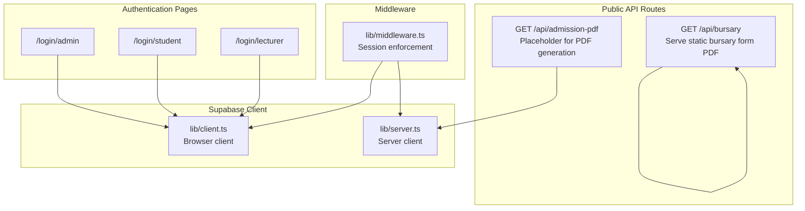
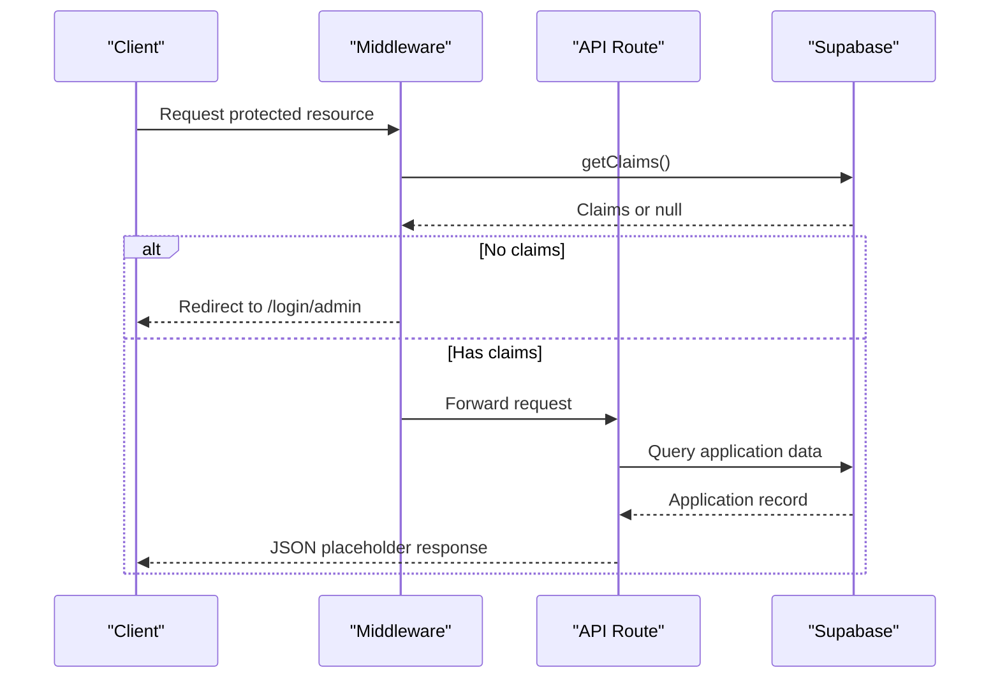
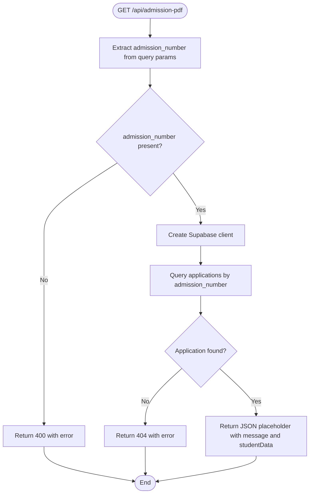
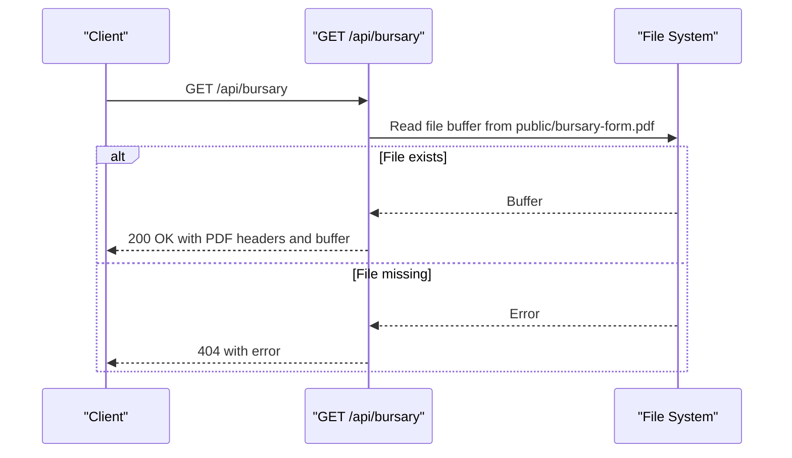
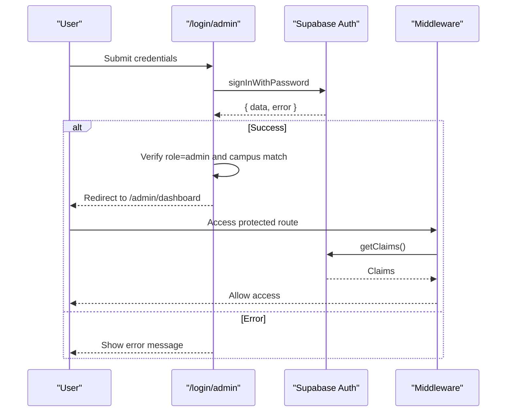
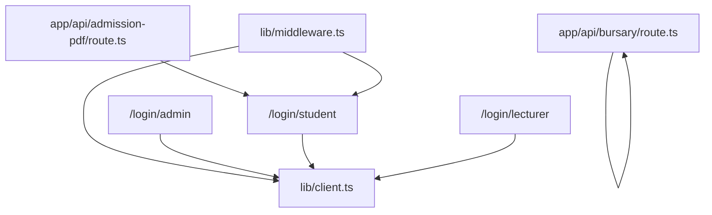

# API Reference

<cite>
**Referenced Files in This Document**
- [route.ts](file://app/api/admission-pdf/route.ts)
- [route.ts](file://app/api/bursary/route.ts)
- [middleware.ts](file://lib/middleware.ts)
- [client.ts](file://lib/client.ts)
- [server.ts](file://lib/server.ts)
- [AdmissionLetter.tsx](file://components/AdmissionLetter.tsx)
- [PaymentReceipt.tsx](file://components/PaymentReceipt.tsx)
- [page.tsx](file://app/login/admin/page.tsx)
- [page.tsx](file://app/login/student/page.tsx)
- [page.tsx](file://app/login/lecturer/page.tsx)
- [package.json](file://package.json)
</cite>

## Table of Contents
1. [Introduction](#introduction)
2. [Project Structure](#project-structure)
3. [Core Components](#core-components)
4. [Architecture Overview](#architecture-overview)
5. [Detailed Component Analysis](#detailed-component-analysis)
6. [Dependency Analysis](#dependency-analysis)
7. [Performance Considerations](#performance-considerations)
8. [Troubleshooting Guide](#troubleshooting-guide)
9. [Conclusion](#conclusion)
10. [Appendices](#appendices)

## Introduction
This document provides a comprehensive API reference for the EAVI College Management System. It covers public REST endpoints, authentication flows, request/response schemas, error handling, and practical usage examples. It also documents the admission PDF generation endpoint (placeholder), the bursary application processing API (static PDF delivery), authentication endpoints, validation rules, rate limiting, security considerations, API versioning strategies, and performance monitoring approaches.

## Project Structure
The API surface is primarily implemented as Next.js App Router API routes under app/api. Authentication and session management are handled via Supabase with a shared middleware and client utilities.

**Diagram sources**
- [route.ts:1-38](file://app/api/admission-pdf/route.ts#L1-L38)
- [route.ts:1-27](file://app/api/bursary/route.ts#L1-L27)
- [middleware.ts:1-75](file://lib/middleware.ts#L1-L75)
- [client.ts:1-42](file://lib/client.ts#L1-L42)
- [server.ts:1-34](file://lib/server.ts#L1-L34)

**Section sources**
- [route.ts:1-38](file://app/api/admission-pdf/route.ts#L1-L38)
- [route.ts:1-27](file://app/api/bursary/route.ts#L1-L27)
- [middleware.ts:1-75](file://lib/middleware.ts#L1-L75)
- [client.ts:1-42](file://lib/client.ts#L1-L42)
- [server.ts:1-34](file://lib/server.ts#L1-L34)

## Core Components
- Admission PDF Generation Endpoint: GET /api/admission-pdf
  - Purpose: Placeholder for generating an admission letter PDF for a given admission number.
  - Current behavior: Returns a JSON placeholder response indicating implementation pending.
  - Future behavior: Will fetch application data and generate a PDF using a PDF library.
- Bursary Application Processing Endpoint: GET /api/bursary
  - Purpose: Serve the bursary application form as a PDF.
  - Behavior: Reads a static PDF from the public directory and returns it with appropriate headers.

Authentication and Session Management:
- Middleware enforces session presence for protected routes and redirects unauthenticated users to the admin login page.
- Supabase client utilities provide browser and server-side clients for authentication and database operations.

**Section sources**
- [route.ts:1-38](file://app/api/admission-pdf/route.ts#L1-L38)
- [route.ts:1-27](file://app/api/bursary/route.ts#L1-L27)
- [middleware.ts:1-75](file://lib/middleware.ts#L1-L75)
- [client.ts:1-42](file://lib/client.ts#L1-L42)
- [server.ts:1-34](file://lib/server.ts#L1-L34)

## Architecture Overview
The system uses Next.js App Router API routes for backend endpoints, Supabase for authentication and session management, and a shared middleware to enforce access control. PDF generation for admission letters is implemented client-side using a PDF library and Supabase queries.

**Diagram sources**
- [middleware.ts:44-58](file://lib/middleware.ts#L44-L58)
- [route.ts:13-31](file://app/api/admission-pdf/route.ts#L13-L31)

**Section sources**
- [middleware.ts:1-75](file://lib/middleware.ts#L1-L75)
- [route.ts:1-38](file://app/api/admission-pdf/route.ts#L1-L38)

## Detailed Component Analysis

### Admission PDF Generation Endpoint
- Method: GET
- URL: /api/admission-pdf
- Query Parameters:
  - admission_number (required): String. Identifies the enrolled student whose admission letter is to be generated.
- Request Validation:
  - admission_number must be present; otherwise returns 400 with an error message.
- Processing Logic:
  - Creates a Supabase client.
  - Queries the applications table for the given admission number.
  - On success, returns a JSON placeholder response indicating implementation pending along with the retrieved application data.
  - On missing application or query errors, returns 404 with an error message.
  - On unexpected exceptions, returns 500 with an internal server error message.
- Response Formats:
  - Successful placeholder response: JSON object containing a message and studentData.
  - Error responses: JSON object with an error field and appropriate HTTP status code.
- Authentication:
  - Enforced by middleware for protected routes; unauthenticated requests are redirected to the admin login page.

**Diagram sources**
- [route.ts:4-37](file://app/api/admission-pdf/route.ts#L4-L37)

**Section sources**
- [route.ts:1-38](file://app/api/admission-pdf/route.ts#L1-L38)

### Bursary Application Processing API
- Method: GET
- URL: /api/bursary
- Purpose: Serve the bursary application form as a downloadable PDF.
- File Serving:
  - Reads a static PDF file from the public directory.
  - Sets Content-Type to application/pdf, inline disposition, Content-Length, and cache headers.
- Response:
  - 200 OK with the PDF buffer and appropriate headers.
  - 404 Not Found if the file is missing, with an error message.

**Diagram sources**
- [route.ts:5-26](file://app/api/bursary/route.ts#L5-L26)

**Section sources**
- [route.ts:1-27](file://app/api/bursary/route.ts#L1-L27)

### Authentication Endpoints and Flows
- Admin Login: /login/admin
  - Supports login and password reset modes.
  - Validates credentials against Supabase Auth.
  - Enforces admin role and campus assignment.
  - On success, stores campus preference and redirects to admin dashboard.
- Student Login: /login/student
  - Supports login, registration, and password reset modes.
  - Registration validates admission number against the applications table and creates a user with metadata.
  - On success, redirects to student dashboard.
- Lecturer Login: /login/lecturer
  - Supports login, registration, and password reset modes.
  - Registration validates lecturer number against the lecturers table and creates a user with metadata.
  - On success, redirects to lecturer dashboard.
- Supabase Client Utilities:
  - Browser client: Used in login pages to interact with Supabase Auth and manage cookies.
  - Server client: Used in API routes to query Supabase tables.

**Diagram sources**
- [page.tsx:27-91](file://app/login/admin/page.tsx#L27-L91)
- [middleware.ts:44-58](file://lib/middleware.ts#L44-L58)

**Section sources**
- [page.tsx:1-329](file://app/login/admin/page.tsx#L1-L329)
- [page.tsx:1-404](file://app/login/student/page.tsx#L1-L404)
- [page.tsx:1-365](file://app/login/lecturer/page.tsx#L1-L365)
- [client.ts:1-42](file://lib/client.ts#L1-L42)
- [server.ts:1-34](file://lib/server.ts#L1-L34)

### Data Validation and Error Handling
- Admission PDF Endpoint:
  - Required parameter validation for admission_number.
  - Application lookup validation; returns 404 if not found.
  - General exception handling returning 500.
- Bursary Endpoint:
  - File existence validation; returns 404 if missing.
- Authentication Pages:
  - Role and campus checks for admin login.
  - Admission number and lecturer number validations during registration.
  - Comprehensive error messaging for invalid credentials, unconfirmed emails, and reset email issues.

**Section sources**
- [route.ts:9-36](file://app/api/admission-pdf/route.ts#L9-L36)
- [route.ts:7-25](file://app/api/bursary/route.ts#L7-L25)
- [page.tsx:66-82](file://app/login/admin/page.tsx#L66-L82)
- [page.tsx:92-103](file://app/login/student/page.tsx#L92-L103)
- [page.tsx:78-93](file://app/login/lecturer/page.tsx#L78-L93)

### Practical Usage Examples

- Generate Admission PDF (Placeholder)
  - curl command:
    - curl "https://your-domain.com/api/admission-pdf?admission_number=EAVI/2024/001"
  - Expected response:
    - 200 OK with a JSON message indicating implementation pending and studentData payload.
  - Error responses:
    - 400 Bad Request if admission_number is missing.
    - 404 Not Found if the application does not exist.
    - 500 Internal Server Error on unexpected failures.

- Download Bursary Form (PDF)
  - curl command:
    - curl -OJ "https://your-domain.com/api/bursary"
  - Expected response:
    - 200 OK with Content-Type: application/pdf and inline disposition.

- Admin Login
  - curl command (example using Supabase Auth):
    - curl -X POST "https://your-supabase-project.supabase.co/auth/v1/token" \
      -H "apikey: YOUR_SUPABASE_ANON_KEY" \
      -H "Content-Type: application/json" \
      -d '{"email":"admin@eavi.ac.ke","password":"your_password","provider":"email"}'
  - Notes:
    - Use the Supabase Auth API for programmatic login; the frontend login pages demonstrate UI flows and validation.

**Section sources**
- [route.ts:4-37](file://app/api/admission-pdf/route.ts#L4-L37)
- [route.ts:5-26](file://app/api/bursary/route.ts#L5-L26)
- [page.tsx:34-64](file://app/login/admin/page.tsx#L34-L64)

### Security Considerations
- Authentication:
  - Supabase Auth handles secure authentication and session management.
  - Middleware enforces session presence for protected routes and redirects unauthorized users to the admin login page.
- Cookies and CSRF:
  - Supabase client utilities manage cookies securely in both browser and server environments.
- Rate Limiting:
  - No explicit rate limiting is implemented in the provided code. Consider platform-level rate limiting and API gateway controls in production.
- Transport Security:
  - Use HTTPS in production to protect credentials and tokens.
- Input Sanitization:
  - Validate and sanitize all inputs, especially query parameters and form submissions.

**Section sources**
- [middleware.ts:44-58](file://lib/middleware.ts#L44-L58)
- [client.ts:1-42](file://lib/client.ts#L1-L42)
- [server.ts:1-34](file://lib/server.ts#L1-L34)

### API Versioning Strategies
- The current implementation does not define explicit API versioning.
- Recommendation:
  - Use URL path versioning (e.g., /api/v1/admission-pdf) or header-based versioning to maintain backward compatibility as the API evolves.

**Section sources**
- [route.ts:1-38](file://app/api/admission-pdf/route.ts#L1-L38)
- [route.ts:1-27](file://app/api/bursary/route.ts#L1-L27)

### Performance Characteristics and Monitoring
- Performance:
  - Admission PDF endpoint performs a single database query per request; optimize by adding indexes on admission_number if needed.
  - Bursary endpoint serves a static file; ensure caching headers are effective.
- Monitoring:
  - Track request latency and error rates for API routes.
  - Monitor Supabase Auth and database query performance.
  - Implement structured logging for error handling paths.

**Section sources**
- [route.ts:16-24](file://app/api/admission-pdf/route.ts#L16-L24)
- [route.ts:11-19](file://app/api/bursary/route.ts#L11-L19)

## Dependency Analysis
The API routes depend on Supabase for authentication and data retrieval. The middleware depends on Supabase for session claims. Client utilities provide consistent Supabase client instantiation across the application.

**Diagram sources**
- [route.ts:1-38](file://app/api/admission-pdf/route.ts#L1-L38)
- [route.ts:1-27](file://app/api/bursary/route.ts#L1-L27)
- [middleware.ts:1-75](file://lib/middleware.ts#L1-L75)
- [client.ts:1-42](file://lib/client.ts#L1-L42)
- [server.ts:1-34](file://lib/server.ts#L1-L34)

**Section sources**
- [route.ts:1-38](file://app/api/admission-pdf/route.ts#L1-L38)
- [route.ts:1-27](file://app/api/bursary/route.ts#L1-L27)
- [middleware.ts:1-75](file://lib/middleware.ts#L1-L75)
- [client.ts:1-42](file://lib/client.ts#L1-L42)
- [server.ts:1-34](file://lib/server.ts#L1-L34)

## Performance Considerations
- Database Queries:
  - Add indexes on frequently queried columns (e.g., applications.admission_number).
- Caching:
  - Enable CDN caching for static assets and consider cache-control headers for PDF endpoints.
- Asynchronous Processing:
  - Offload heavy PDF generation to background jobs if future implementation becomes CPU-intensive.
- Observability:
  - Instrument API routes with metrics and structured logs.

[No sources needed since this section provides general guidance]

## Troubleshooting Guide
- Admission PDF Endpoint Issues:
  - 400: Ensure admission_number is provided.
  - 404: Verify the admission number exists in the applications table.
  - 500: Check server logs for exceptions during query execution.
- Bursary PDF Issues:
  - 404: Confirm the file exists at public/bursary-form.pdf.
- Authentication Issues:
  - Admin login: Verify admin role and campus match; check email confirmation status.
  - Student/Lecturer registration: Confirm numbers exist in respective tables; ensure metadata is correctly set.
- Middleware Redirect Loop:
  - Ensure cookies are properly set and synced between browser and server.

**Section sources**
- [route.ts:9-36](file://app/api/admission-pdf/route.ts#L9-L36)
- [route.ts:7-25](file://app/api/bursary/route.ts#L7-L25)
- [page.tsx:66-82](file://app/login/admin/page.tsx#L66-L82)
- [page.tsx:92-103](file://app/login/student/page.tsx#L92-L103)
- [page.tsx:78-93](file://app/login/lecturer/page.tsx#L78-L93)
- [middleware.ts:44-58](file://lib/middleware.ts#L44-L58)

## Conclusion
The EAVI College Management System exposes two primary public endpoints: a placeholder admission PDF generator and a static bursary form downloader. Authentication is managed via Supabase with enforced session checks through middleware. The system provides clear validation and error handling patterns. Future enhancements should include full PDF generation for admissions, robust rate limiting, and API versioning.

[No sources needed since this section summarizes without analyzing specific files]

## Appendices

### API Endpoints Summary
- GET /api/admission-pdf
  - Query: admission_number (required)
  - Responses: 200 (placeholder JSON), 400 (missing param), 404 (not found), 500 (server error)
- GET /api/bursary
  - Responses: 200 (PDF), 404 (file not found)

**Section sources**
- [route.ts:4-37](file://app/api/admission-pdf/route.ts#L4-L37)
- [route.ts:5-26](file://app/api/bursary/route.ts#L5-L26)

### Authentication Pages Summary
- /login/admin: Login and reset password flows with role/campus checks
- /login/student: Login, registration, and reset password flows with admission number validation
- /login/lecturer: Login, registration, and reset password flows with lecturer number validation

**Section sources**
- [page.tsx:1-329](file://app/login/admin/page.tsx#L1-L329)
- [page.tsx:1-404](file://app/login/student/page.tsx#L1-L404)
- [page.tsx:1-365](file://app/login/lecturer/page.tsx#L1-L365)

### Client Libraries and Dependencies
- Supabase client libraries are used for authentication and database operations.
- PDF generation for admission letters is implemented client-side using a PDF library.

**Section sources**
- [package.json:11-27](file://package.json#L11-L27)
- [AdmissionLetter.tsx:1-500](file://components/AdmissionLetter.tsx#L1-L500)