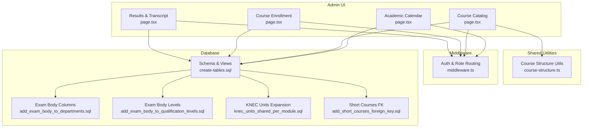
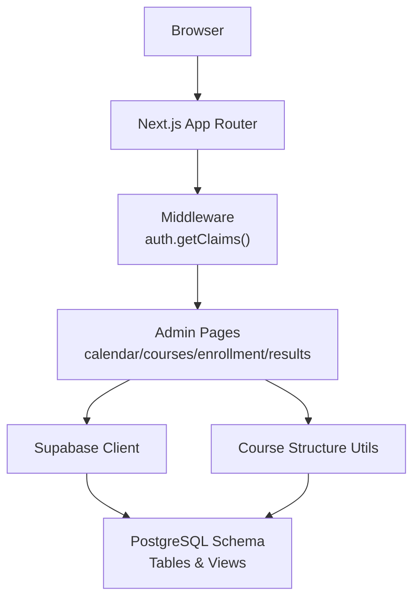
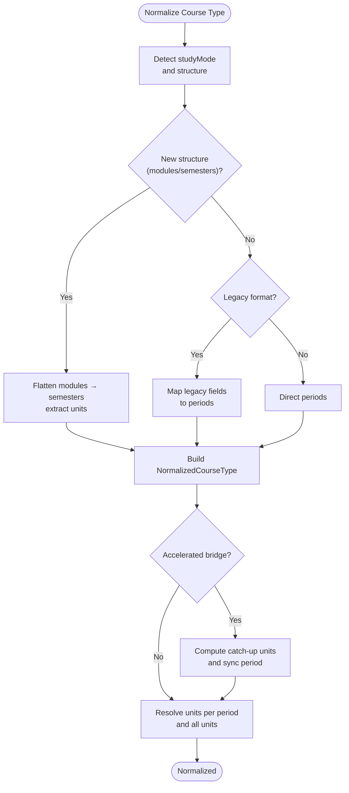
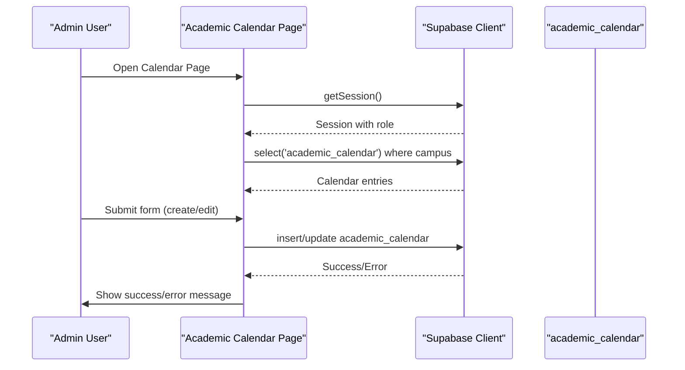
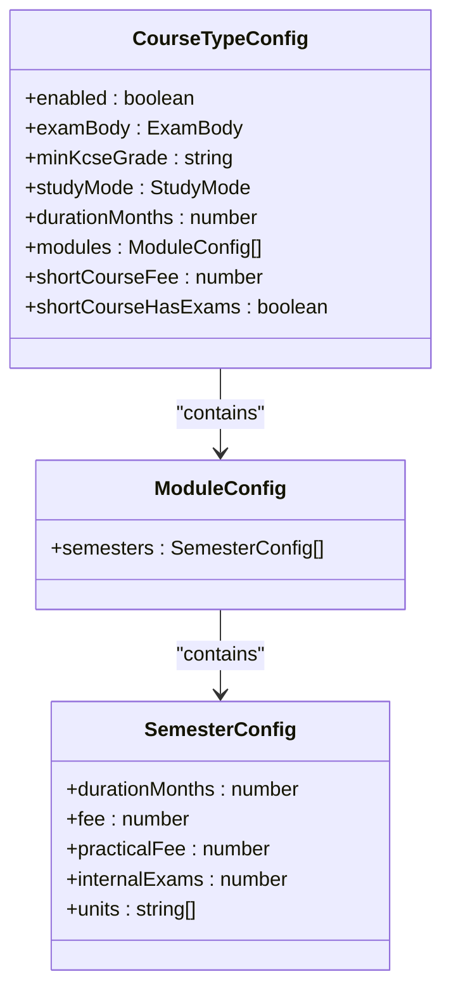
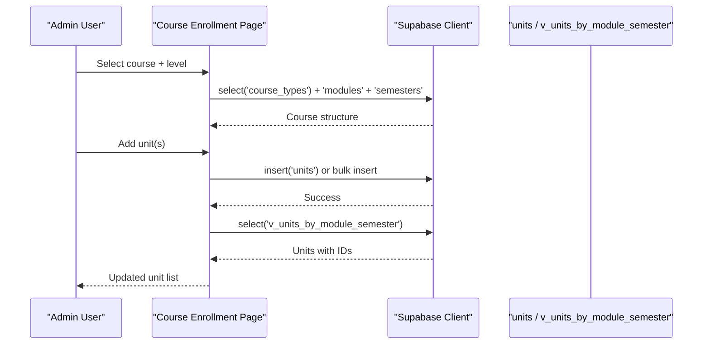
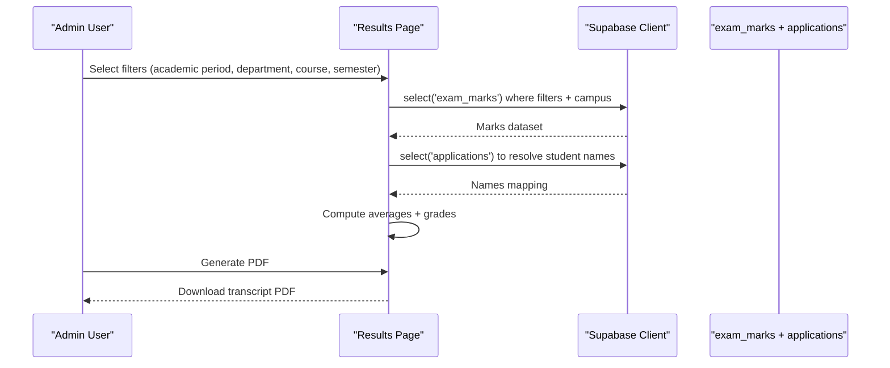
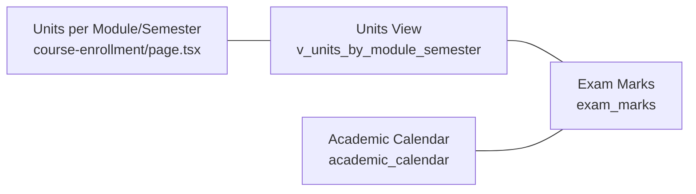
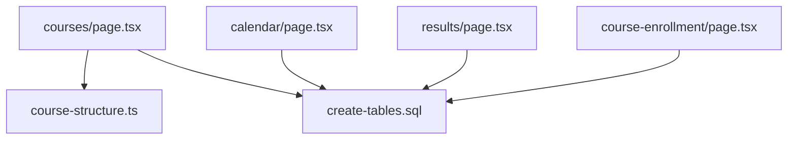

# Academic Management

<cite>
**Referenced Files in This Document**
- [README.md](file://README.md)
- [lib/course-structure.ts](file://lib/course-structure.ts)
- [app/admin/calendar/page.tsx](file://app/admin/calendar/page.tsx)
- [app/admin/courses/page.tsx](file://app/admin/courses/page.tsx)
- [app/admin/course-enrollment/page.tsx](file://app/admin/course-enrollment/page.tsx)
- [app/admin/results/page.tsx](file://app/admin/results/page.tsx)
- [lib/middleware.ts](file://lib/middleware.ts)
- [create-tables.sql](file://create-tables.sql)
- [database.sql](file://database.sql)
- [migrations/add_exam_body_to_departments.sql](file://migrations/add_exam_body_to_departments.sql)
- [migrations/add_exam_body_to_qualification_levels.sql](file://migrations/add_exam_body_to_qualification_levels.sql)
- [migrations/knec_units_shared_per_module.sql](file://migrations/knec_units_shared_per_module.sql)
- [migrations/add_short_courses_foreign_key.sql](file://migrations/add_short_courses_foreign_key.sql)
</cite>

## Table of Contents
1. [Introduction](#introduction)
2. [Project Structure](#project-structure)
3. [Core Components](#core-components)
4. [Architecture Overview](#architecture-overview)
5. [Detailed Component Analysis](#detailed-component-analysis)
6. [Dependency Analysis](#dependency-analysis)
7. [Performance Considerations](#performance-considerations)
8. [Troubleshooting Guide](#troubleshooting-guide)
9. [Conclusion](#conclusion)
10. [Appendices](#appendices)

## Introduction
This document describes the Academic Management system covering course structure, academic calendar, and grade management. It explains how the system supports multiple qualification levels and exam bodies, manages academic terms and exams, records student results, and integrates course enrollment with academic events and grading. Practical workflows for course registration, exam scheduling, and transcript generation are included, along with troubleshooting guidance for common data inconsistencies and scheduling conflicts.

## Project Structure
The system is a Next.js application with a Supabase backend. Key areas:
- Admin pages for calendar, course catalog, enrollment, and results
- Shared utilities for course structure normalization
- Database schema and migrations defining academic entities and relationships
- Middleware enforcing authentication and role-based routing

**Diagram sources**
- [app/admin/calendar/page.tsx:30-534](file://app/admin/calendar/page.tsx#L30-L534)
- [app/admin/courses/page.tsx:109-959](file://app/admin/courses/page.tsx#L109-L959)
- [app/admin/course-enrollment/page.tsx:23-959](file://app/admin/course-enrollment/page.tsx#L23-L959)
- [app/admin/results/page.tsx:14-581](file://app/admin/results/page.tsx#L14-L581)
- [lib/course-structure.ts:1-322](file://lib/course-structure.ts#L1-L322)
- [lib/middleware.ts:10-75](file://lib/middleware.ts#L10-L75)
- [create-tables.sql:132-152](file://create-tables.sql#L132-L152)
- [migrations/add_exam_body_to_departments.sql:1-22](file://migrations/add_exam_body_to_departments.sql#L1-L22)
- [migrations/add_exam_body_to_qualification_levels.sql:1-35](file://migrations/add_exam_body_to_qualification_levels.sql#L1-L35)
- [migrations/knec_units_shared_per_module.sql:1-50](file://migrations/knec_units_shared_per_module.sql#L1-L50)
- [migrations/add_short_courses_foreign_key.sql:1-28](file://migrations/add_short_courses_foreign_key.sql#L1-L28)

**Section sources**
- [README.md:1-2](file://README.md#L1-L2)
- [lib/middleware.ts:10-75](file://lib/middleware.ts#L10-L75)

## Core Components
- Course structure engine: Normalizes course configurations across exam bodies and study modes, computes accelerated curricula for bridge students, and extracts units per period.
- Academic calendar: Manages academic years, terms, semesters, intake windows, and exam dates per campus.
- Course catalog: Supports multiple exam bodies (KNEC, CDACC, JP, internal), qualification levels, and modular/short-course structures.
- Course enrollment: Assigns units to modules/semesters, with special handling for KNEC shared units.
- Grade management: Records CAT and end-term exam marks, calculates grades, and generates transcripts.

**Section sources**
- [lib/course-structure.ts:1-322](file://lib/course-structure.ts#L1-L322)
- [app/admin/calendar/page.tsx:11-534](file://app/admin/calendar/page.tsx#L11-L534)
- [app/admin/courses/page.tsx:11-959](file://app/admin/courses/page.tsx#L11-L959)
- [app/admin/course-enrollment/page.tsx:23-959](file://app/admin/course-enrollment/page.tsx#L23-L959)
- [app/admin/results/page.tsx:14-581](file://app/admin/results/page.tsx#L14-L581)

## Architecture Overview
The system separates presentation (Next.js pages), business logic (utilities), persistence (PostgreSQL), and access control (middleware). Admin pages query and mutate data through Supabase, while database views and triggers support specialized behaviors (e.g., KNEC unit expansion).

**Diagram sources**
- [lib/middleware.ts:10-75](file://lib/middleware.ts#L10-L75)
- [app/admin/calendar/page.tsx:30-534](file://app/admin/calendar/page.tsx#L30-L534)
- [app/admin/courses/page.tsx:109-959](file://app/admin/courses/page.tsx#L109-L959)
- [app/admin/course-enrollment/page.tsx:23-959](file://app/admin/course-enrollment/page.tsx#L23-L959)
- [app/admin/results/page.tsx:14-581](file://app/admin/results/page.tsx#L14-L581)
- [lib/course-structure.ts:1-322](file://lib/course-structure.ts#L1-L322)
- [create-tables.sql:132-152](file://create-tables.sql#L132-L152)

## Detailed Component Analysis

### Course Structure Engine
The course structure engine normalizes course configurations from diverse formats, supports multiple study modes, and computes accelerated curricula for bridge students. It also resolves units per period and aggregates all units for a course.

**Diagram sources**
- [lib/course-structure.ts:58-210](file://lib/course-structure.ts#L58-L210)
- [lib/course-structure.ts:262-321](file://lib/course-structure.ts#L262-L321)

**Section sources**
- [lib/course-structure.ts:1-322](file://lib/course-structure.ts#L1-L322)

### Academic Calendar Implementation
The academic calendar tracks academic year, term, semester, intake windows, and exam dates per campus. Admins can create, edit, and delete calendar entries, and the UI displays formatted dates and highlights upcoming/past periods.

**Diagram sources**
- [app/admin/calendar/page.tsx:30-147](file://app/admin/calendar/page.tsx#L30-L147)
- [create-tables.sql:132-152](file://create-tables.sql#L132-L152)

**Section sources**
- [app/admin/calendar/page.tsx:11-534](file://app/admin/calendar/page.tsx#L11-L534)
- [create-tables.sql:132-152](file://create-tables.sql#L132-L152)

### Course Catalog and Exam Bodies
The course catalog supports multiple exam bodies (KNEC, CDACC, JP, internal) and qualification levels. It provides wizard-driven creation of modular and short-course structures, with exam-body-specific defaults and validations.

**Diagram sources**
- [app/admin/courses/page.tsx:24-74](file://app/admin/courses/page.tsx#L24-L74)

**Section sources**
- [app/admin/courses/page.tsx:11-959](file://app/admin/courses/page.tsx#L11-L959)
- [migrations/add_exam_body_to_departments.sql:1-22](file://migrations/add_exam_body_to_departments.sql#L1-L22)
- [migrations/add_exam_body_to_qualification_levels.sql:1-35](file://migrations/add_exam_body_to_qualification_levels.sql#L1-L35)

### Course Enrollment and Unit Assignment
Course enrollment assigns units to modules/semesters, with special handling for KNEC courses where units are shared across semesters. The UI supports single and bulk unit entry.

**Diagram sources**
- [app/admin/course-enrollment/page.tsx:143-208](file://app/admin/course-enrollment/page.tsx#L143-L208)
- [app/admin/course-enrollment/page.tsx:306-406](file://app/admin/course-enrollment/page.tsx#L306-L406)
- [migrations/knec_units_shared_per_module.sql:7-29](file://migrations/knec_units_shared_per_module.sql#L7-L29)

**Section sources**
- [app/admin/course-enrollment/page.tsx:23-959](file://app/admin/course-enrollment/page.tsx#L23-L959)
- [migrations/knec_units_shared_per_module.sql:1-50](file://migrations/knec_units_shared_per_module.sql#L1-L50)

### Grade Management and Transcript Generation
Grade management captures CAT and end-term marks, computes averages and letter grades, and generates PDF transcripts filtered by academic period, department, course, and semester.

**Diagram sources**
- [app/admin/results/page.tsx:89-108](file://app/admin/results/page.tsx#L89-L108)
- [app/admin/results/page.tsx:177-351](file://app/admin/results/page.tsx#L177-L351)

**Section sources**
- [app/admin/results/page.tsx:14-581](file://app/admin/results/page.tsx#L14-L581)

### Integration Between Enrollment, Calendar, and Grades
- Course enrollment defines units tied to modules/semesters and campuses.
- Academic calendar defines term/semester boundaries and exam windows.
- Grade management records marks against units and semesters, linking to academic periods.

**Diagram sources**
- [app/admin/course-enrollment/page.tsx:196-202](file://app/admin/course-enrollment/page.tsx#L196-L202)
- [migrations/knec_units_shared_per_module.sql:7-29](file://migrations/knec_units_shared_per_module.sql#L7-L29)
- [create-tables.sql:245-261](file://create-tables.sql#L245-L261)
- [app/admin/results/page.tsx:89-108](file://app/admin/results/page.tsx#L89-L108)

**Section sources**
- [app/admin/course-enrollment/page.tsx:168-208](file://app/admin/course-enrollment/page.tsx#L168-L208)
- [app/admin/results/page.tsx:89-108](file://app/admin/results/page.tsx#L89-L108)
- [create-tables.sql:245-261](file://create-tables.sql#L245-L261)

## Dependency Analysis
- Course catalog depends on course structure utilities for normalization and on database views for unit resolution.
- Course enrollment depends on database views to expand KNEC units and on course structure to determine short-course vs modular layouts.
- Academic calendar is independent but informs grade filtering and enrollment timing.
- Results depend on academic calendar for grading periods and on applications for student identity.

**Diagram sources**
- [lib/course-structure.ts:1-322](file://lib/course-structure.ts#L1-L322)
- [app/admin/courses/page.tsx:11-959](file://app/admin/courses/page.tsx#L11-L959)
- [app/admin/course-enrollment/page.tsx:23-959](file://app/admin/course-enrollment/page.tsx#L23-L959)
- [app/admin/calendar/page.tsx:30-534](file://app/admin/calendar/page.tsx#L30-L534)
- [app/admin/results/page.tsx:14-581](file://app/admin/results/page.tsx#L14-L581)
- [create-tables.sql:132-152](file://create-tables.sql#L132-L152)

**Section sources**
- [lib/course-structure.ts:1-322](file://lib/course-structure.ts#L1-L322)
- [app/admin/courses/page.tsx:11-959](file://app/admin/courses/page.tsx#L11-L959)
- [app/admin/course-enrollment/page.tsx:23-959](file://app/admin/course-enrollment/page.tsx#L23-L959)
- [app/admin/calendar/page.tsx:30-534](file://app/admin/calendar/page.tsx#L30-L534)
- [app/admin/results/page.tsx:14-581](file://app/admin/results/page.tsx#L14-L581)
- [create-tables.sql:132-152](file://create-tables.sql#L132-L152)

## Performance Considerations
- Prefer indexed lookups for campus-scoped queries (e.g., academic calendar and applications).
- Use views (e.g., unit expansion) to avoid repeated joins and to simplify UI rendering.
- Batch operations for unit bulk inserts to reduce round trips.
- Cache frequently accessed course structures and units per course to minimize database load.

## Troubleshooting Guide
- Authentication redirects: If users are redirected to login, ensure middleware is applied and claims are present.
  - Section sources
    - [lib/middleware.ts:10-75](file://lib/middleware.ts#L10-L75)
- Academic calendar conflicts: Validate unique constraints on academic year, term, and campus.
  - Section sources
    - [create-tables.sql:151-152](file://create-tables.sql#L151-L152)
- KNEC unit duplication: The unit view expands KNEC units per semester; deduplicate by unit_code when loading.
  - Section sources
    - [migrations/knec_units_shared_per_module.sql:7-29](file://migrations/knec_units_shared_per_module.sql#L7-L29)
- Short course foreign key: Ensure short_courses has course_id and proper FK to courses.
  - Section sources
    - [migrations/add_short_courses_foreign_key.sql:1-28](file://migrations/add_short_courses_foreign_key.sql#L1-L28)
- Exam body tagging: Verify departments and qualification levels include exam_body for filtering.
  - Section sources
    - [migrations/add_exam_body_to_departments.sql:1-22](file://migrations/add_exam_body_to_departments.sql#L1-L22)
    - [migrations/add_exam_body_to_qualification_levels.sql:1-35](file://migrations/add_exam_body_to_qualification_levels.sql#L1-L35)

## Conclusion
The Academic Management system integrates course structure, academic calendar, and grade management around a unified schema and admin UI. It supports multiple exam bodies and qualification levels, enforces campus scoping, and provides robust workflows for enrollment and transcript generation. Adhering to the recommended patterns and troubleshooting steps ensures reliable operation.

## Appendices

### Practical Academic Workflows

- Course Registration
  - Select campus and exam body, choose course and level, and assign units per module/semester.
  - For KNEC, units are shared across semesters; for others, assign per-semester.
  - Section sources
    - [app/admin/course-enrollment/page.tsx:23-959](file://app/admin/course-enrollment/page.tsx#L23-L959)
    - [migrations/knec_units_shared_per_module.sql:1-50](file://migrations/knec_units_shared_per_module.sql#L1-L50)

- Exam Scheduling
  - Define academic year, term, and semester windows; set intake, CAT, and exam dates.
  - Use campus scoping to manage multiple locations.
  - Section sources
    - [app/admin/calendar/page.tsx:30-534](file://app/admin/calendar/page.tsx#L30-L534)
    - [create-tables.sql:132-152](file://create-tables.sql#L132-L152)

- Transcript Creation
  - Filter by academic period, department, course, and semester; generate PDF with computed averages and grades.
  - Section sources
    - [app/admin/results/page.tsx:14-581](file://app/admin/results/page.tsx#L14-L581)

### Data Model Highlights
- Academic calendar: academic_year, term, semester, intake windows, and exam dates.
- Course catalog: courses, course_types, modules, semesters, units, and short_courses.
- Examinations: exam_marks linked to applications and units.
- Access control: middleware enforces role-based routing.

**Section sources**
- [create-tables.sql:132-152](file://create-tables.sql#L132-L152)
- [create-tables.sql:54-129](file://create-tables.sql#L54-L129)
- [create-tables.sql:245-261](file://create-tables.sql#L245-L261)
- [lib/middleware.ts:10-75](file://lib/middleware.ts#L10-L75)