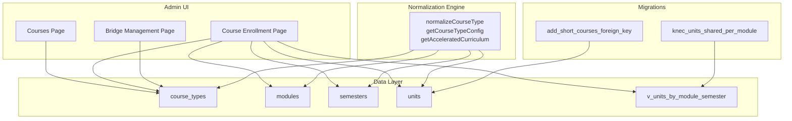
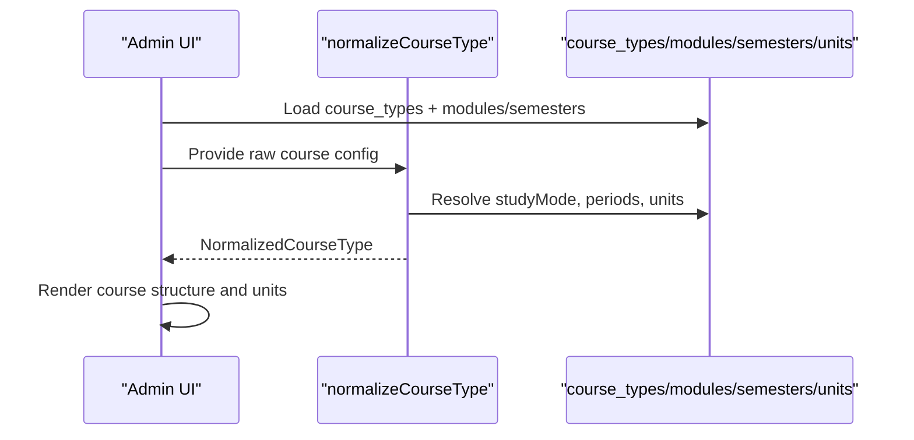
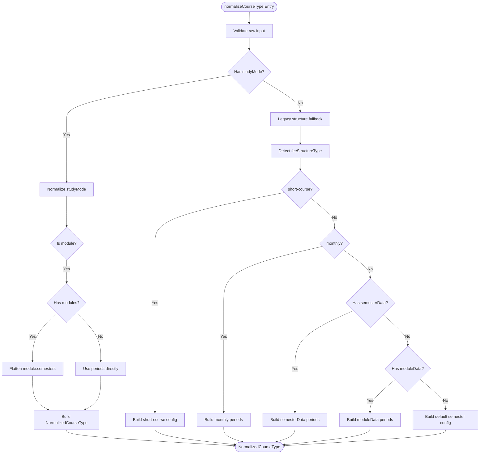
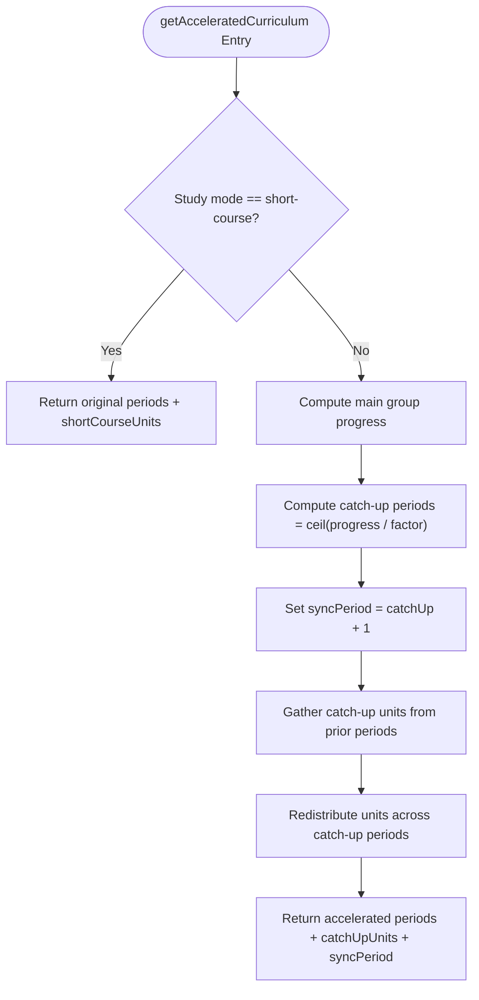
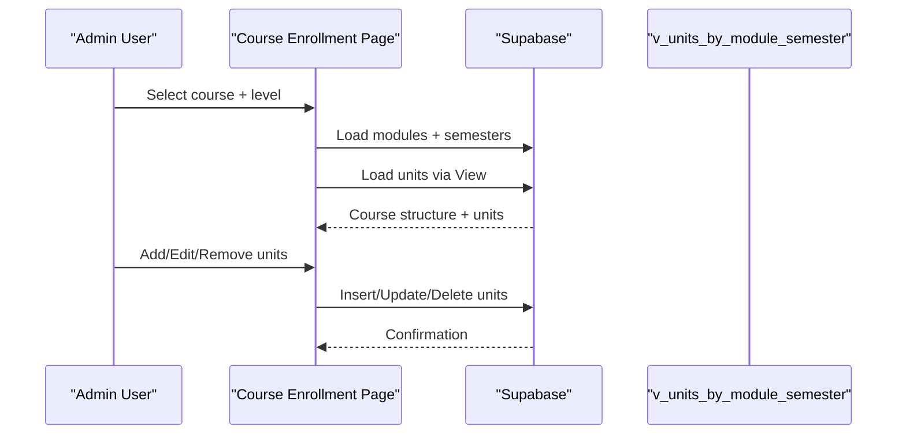
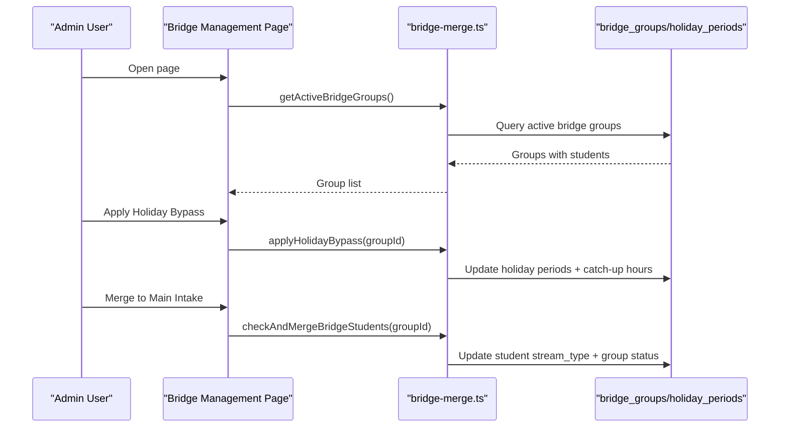
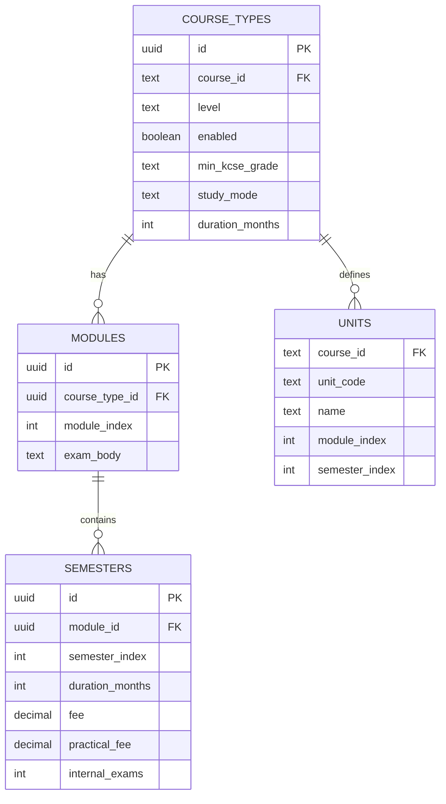
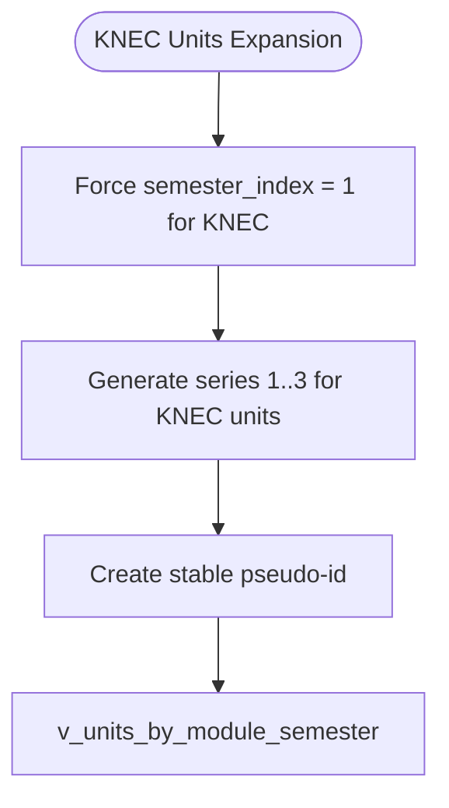
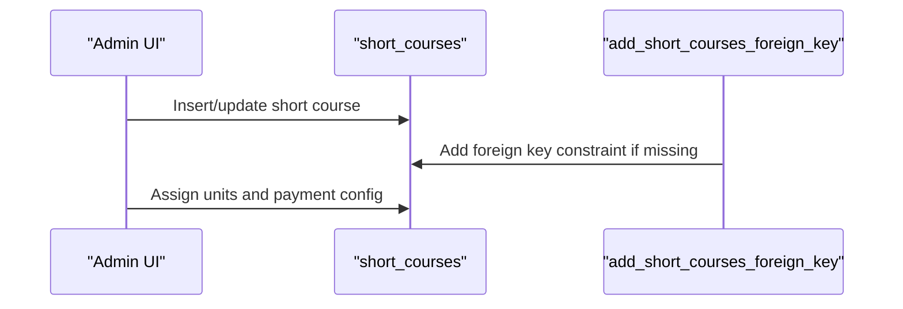
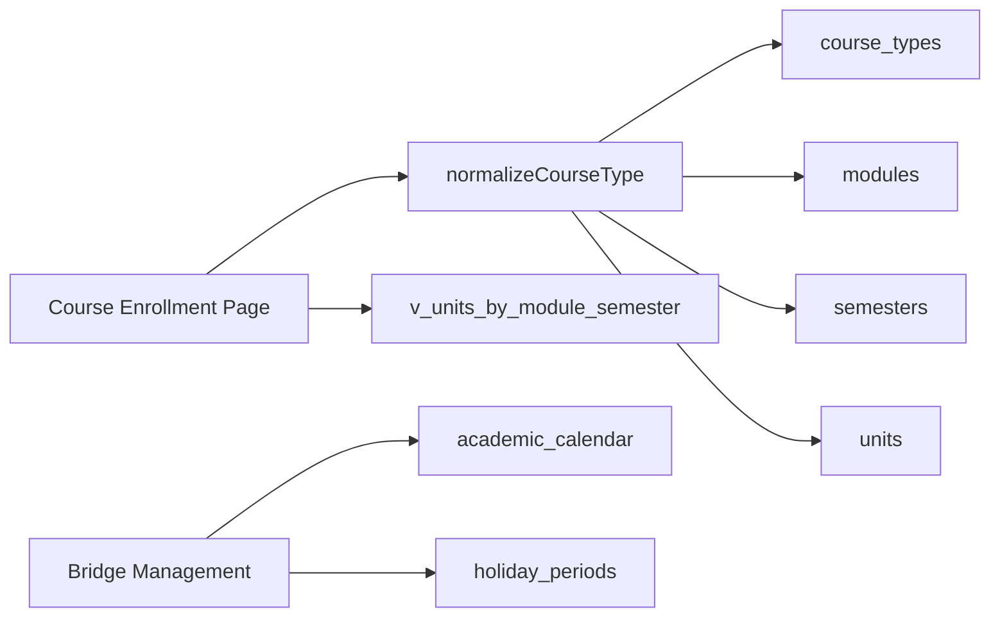

# Course Structure System

<cite>
**Referenced Files in This Document**
- [course-structure.ts](file://lib/course-structure.ts)
- [bridge-merge.ts](file://lib/bridge-merge.ts)
- [create-tables.sql](file://create-tables.sql)
- [kne-courses.sql](file://kne-courses.sql)
- [jp-courses.sql](file://jp-courses.sql)
- [short-courses.sql](file://short-courses.sql)
- [knec_units_shared_per_module.sql](file://migrations/knec_units_shared_per_module.sql)
- [add_short_courses_foreign_key.sql](file://migrations/add_short_courses_foreign_key.sql)
- [courses/page.tsx](file://app/admin/courses/page.tsx)
- [course-enrollment/page.tsx](file://app/admin/course-enrollment/page.tsx)
- [bridge-management/page.tsx](file://app/admin/bridge-management/page.tsx)
</cite>

## Table of Contents
1. [Introduction](#introduction)
2. [Project Structure](#project-structure)
3. [Core Components](#core-components)
4. [Architecture Overview](#architecture-overview)
5. [Detailed Component Analysis](#detailed-component-analysis)
6. [Dependency Analysis](#dependency-analysis)
7. [Performance Considerations](#performance-considerations)
8. [Troubleshooting Guide](#troubleshooting-guide)
9. [Conclusion](#conclusion)

## Introduction
This document describes the Course Structure System that manages comprehensive course catalogs across multiple exam bodies and qualification levels. It covers the course type normalization engine, course structure configuration, duration and fee calculations, unit mapping, and KNEC-specific unit sharing per module. It also documents bridge student acceleration algorithms, course enrollment workflows, data models, validation rules, and migration strategies.

## Project Structure
The system comprises:
- Data model definitions and views in SQL
- Migration scripts for evolving schema and KNEC unit behavior
- Utility libraries for course structure normalization and bridge operations
- Admin UI pages for course creation, enrollment, and bridge management

**Diagram sources**
- [create-tables.sql:70-129](file://create-tables.sql#L70-L129)
- [course-structure.ts:58-237](file://lib/course-structure.ts#L58-L237)
- [course-enrollment/page.tsx:143-208](file://app/admin/course-enrollment/page.tsx#L143-L208)
- [knec_units_shared_per_module.sql:7-29](file://migrations/knec_units_shared_per_module.sql#L7-L29)
- [add_short_courses_foreign_key.sql:1-28](file://migrations/add_short_courses_foreign_key.sql#L1-L28)

**Section sources**
- [create-tables.sql:70-129](file://create-tables.sql#L70-L129)
- [course-structure.ts:58-237](file://lib/course-structure.ts#L58-L237)
- [course-enrollment/page.tsx:143-208](file://app/admin/course-enrollment/page.tsx#L143-L208)
- [knec_units_shared_per_module.sql:7-29](file://migrations/knec_units_shared_per_module.sql#L7-L29)
- [add_short_courses_foreign_key.sql:1-28](file://migrations/add_short_courses_foreign_key.sql#L1-L28)

## Core Components
- Course type normalization engine: Converts raw course configurations into a canonical normalized structure supporting multiple exam bodies and study modes.
- Acceleration engine: Computes accelerated curricula for bridge students to synchronize with the main intake.
- Enrollment UI: Loads course structure and manages unit assignments per module/semester.
- Data models: Relational schema with views for unified access to units.

Key capabilities:
- Normalize legacy and modern course structures
- Compute accelerated curriculum with catch-up and sync phases
- Support KNEC unit sharing across semesters
- Manage short-course and modular course types

**Section sources**
- [course-structure.ts:58-237](file://lib/course-structure.ts#L58-L237)
- [course-structure.ts:262-321](file://lib/course-structure.ts#L262-L321)
- [course-enrollment/page.tsx:143-208](file://app/admin/course-enrollment/page.tsx#L143-L208)

## Architecture Overview
The system normalizes course configurations centrally and exposes them to admin interfaces and downstream services. The normalization engine supports:
- Multiple qualification levels: diploma, certificate, artisan, level6, level5, level4
- Study modes: semester, module, short-course
- Period-based fee structures with internal exam counts and unit lists
- KNEC-specific unit expansion per module

**Diagram sources**
- [course-structure.ts:58-237](file://lib/course-structure.ts#L58-L237)
- [create-tables.sql:70-129](file://create-tables.sql#L70-L129)

## Detailed Component Analysis

### Course Type Normalization Engine
Responsibilities:
- Accept raw course configurations from multiple sources (legacy and modern)
- Normalize study mode, periods, durations, fees, and units
- Support exam-body-specific defaults and behaviors
- Provide utilities to compute period labels, unit sets, and accelerated curricula

Core functions:
- normalizeCourseType: Transforms raw inputs into NormalizedCourseType
- getCourseTypeConfig: Selects a level-specific configuration
- getPeriodLabel: Human-friendly labels for study modes
- getUnitsForPeriod and getAllUnits: Unit extraction helpers
- getAcceleratedCurriculum: Bridge acceleration computation

**Diagram sources**
- [course-structure.ts:58-210](file://lib/course-structure.ts#L58-L210)

**Section sources**
- [course-structure.ts:58-237](file://lib/course-structure.ts#L58-L237)
- [course-structure.ts:262-321](file://lib/course-structure.ts#L262-L321)

### Acceleration Engine for Bridge Students
Purpose:
- Compress earlier periods for bridge students while maintaining content integrity
- Compute catch-up units and synchronization period

Algorithm highlights:
- Calculate catch-up periods using acceleration factor
- Aggregate units from catch-up periods
- Distribute units across compressed periods proportionally
- Preserve normal-phase periods unchanged

**Diagram sources**
- [course-structure.ts:262-321](file://lib/course-structure.ts#L262-L321)

**Section sources**
- [course-structure.ts:262-321](file://lib/course-structure.ts#L262-L321)

### Course Enrollment Workflow
The enrollment page:
- Loads courses and filters by exam body
- Selects a course and level, then loads course structure
- Displays modules/semesters and units
- Supports adding/removing/updating units
- Handles KNEC unit sharing across semesters

**Diagram sources**
- [course-enrollment/page.tsx:143-208](file://app/admin/course-enrollment/page.tsx#L143-L208)
- [create-tables.sql:354-370](file://create-tables.sql#L354-L370)

**Section sources**
- [course-enrollment/page.tsx:143-208](file://app/admin/course-enrollment/page.tsx#L143-L208)
- [create-tables.sql:354-370](file://create-tables.sql#L354-L370)

### Bridge Management Integration
The bridge management page:
- Lists active bridge groups
- Calculates time to sync and catch-up hours
- Applies holiday bypass to enable bridge classes during holidays
- Merges bridge students into main intake when ready

**Diagram sources**
- [bridge-management/page.tsx:52-79](file://app/admin/bridge-management/page.tsx#L52-L79)
- [bridge-merge.ts:21-140](file://lib/bridge-merge.ts#L21-L140)
- [bridge-merge.ts:207-326](file://lib/bridge-merge.ts#L207-L326)

**Section sources**
- [bridge-management/page.tsx:52-79](file://app/admin/bridge-management/page.tsx#L52-L79)
- [bridge-merge.ts:21-140](file://lib/bridge-merge.ts#L21-L140)
- [bridge-merge.ts:207-326](file://lib/bridge-merge.ts#L207-L326)

### Data Models and Views
Core relational schema:
- course_types: Per-course qualification-level configurations with study mode and durations
- modules: Course-type modules with exam body and ordering
- semesters: Per-module semesters with fees, durations, and internal exam counts
- units: Course units with module/semester indices and optional codes
- v_units_by_module_semester: Unified view for unit access across modules/semesters

**Diagram sources**
- [create-tables.sql:70-129](file://create-tables.sql#L70-L129)
- [create-tables.sql:354-370](file://create-tables.sql#L354-L370)

**Section sources**
- [create-tables.sql:70-129](file://create-tables.sql#L70-L129)
- [create-tables.sql:354-370](file://create-tables.sql#L354-L370)

### KNEC Units Sharing Per Module
KNEC courses share units across semesters within a module. The migration enforces this behavior:
- Forces KNEC units to semester_index = 1
- Expands units per module into three semesters for display
- Provides a stable pseudo-id for UI keys

**Diagram sources**
- [knec_units_shared_per_module.sql:7-29](file://migrations/knec_units_shared_per_module.sql#L7-L29)

**Section sources**
- [knec_units_shared_per_module.sql:1-50](file://migrations/knec_units_shared_per_module.sql#L1-L50)

### Short Courses Integration
Short courses are stored separately and linked to courses:
- Migration ensures foreign key relationship to courses
- Admin UI supports short-course creation and unit assignment

**Diagram sources**
- [add_short_courses_foreign_key.sql:1-28](file://migrations/add_short_courses_foreign_key.sql#L1-L28)
- [short-courses.sql:1-212](file://short-courses.sql#L1-L212)

**Section sources**
- [add_short_courses_foreign_key.sql:1-28](file://migrations/add_short_courses_foreign_key.sql#L1-L28)
- [short-courses.sql:1-212](file://short-courses.sql#L1-L212)

## Dependency Analysis
- The normalization engine depends on course_types, modules, semesters, and units
- The enrollment UI depends on normalized course structures and the units view
- Bridge management integrates with academic calendar and holiday periods
- Migrations evolve schema and enforce KNEC unit behavior

**Diagram sources**
- [course-structure.ts:58-237](file://lib/course-structure.ts#L58-L237)
- [create-tables.sql:354-370](file://create-tables.sql#L354-L370)
- [create-tables.sql:132-173](file://create-tables.sql#L132-L173)

**Section sources**
- [course-structure.ts:58-237](file://lib/course-structure.ts#L58-L237)
- [create-tables.sql:354-370](file://create-tables.sql#L354-L370)

## Performance Considerations
- Prefer normalized course structures to avoid repeated parsing
- Use views (e.g., v_units_by_module_semester) for efficient unit retrieval
- Batch unit operations in enrollment to minimize round trips
- Cache frequently accessed course structures at the application layer

## Troubleshooting Guide
Common configuration scenarios and resolutions:
- Missing course type for a level: Ensure course_types has an enabled record for the desired level
- Incorrect study mode: Verify study_mode values and that modules/semesters align with chosen mode
- KNEC unit visibility: Confirm migration applied and units are forced to semester_index = 1
- Short course linkage: Ensure foreign key constraint exists and course_id references courses
- Acceleration factor issues: Validate acceleration factor ≥ 1.0 and adjust catch-up/sync periods accordingly
- Unit duplication: Use unique constraints on units and verify normalized unit lists

Validation rules and constraints:
- course_types.level must be one of the supported qualification levels
- modules.module_index ≥ 1
- semesters.semester_index within 1..6
- units primary key (course_id, unit_code)
- bridge_groups.acceleration_factor ≥ 1.0

**Section sources**
- [create-tables.sql:74-81](file://create-tables.sql#L74-L81)
- [create-tables.sql:87-91](file://create-tables.sql#L87-L91)
- [create-tables.sql:97-104](file://create-tables.sql#L97-L104)
- [create-tables.sql:107-116](file://create-tables.sql#L107-L116)
- [create-tables.sql:163-163](file://create-tables.sql#L163-L163)
- [knec_units_shared_per_module.sql:31-47](file://migrations/knec_units_shared_per_module.sql#L31-L47)

## Conclusion
The Course Structure System provides a robust, normalized foundation for managing diverse course configurations across multiple exam bodies and qualification levels. Its normalization engine, acceleration algorithms, and integrated admin interfaces support efficient course setup, enrollment, and bridge student progression. Adhering to the defined data models, validation rules, and migration strategies ensures consistent behavior and scalability.