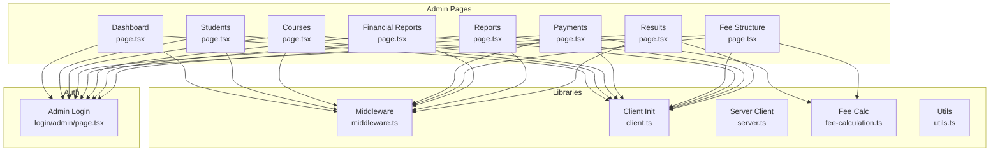
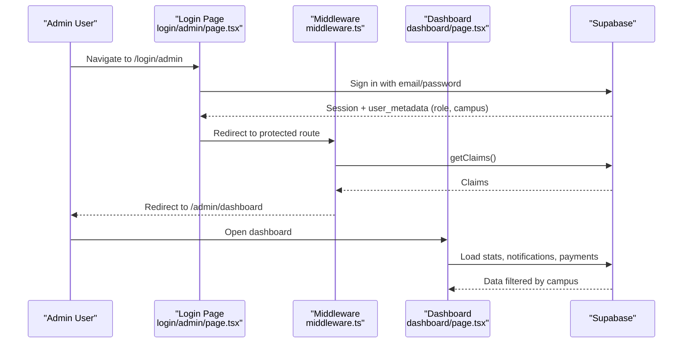
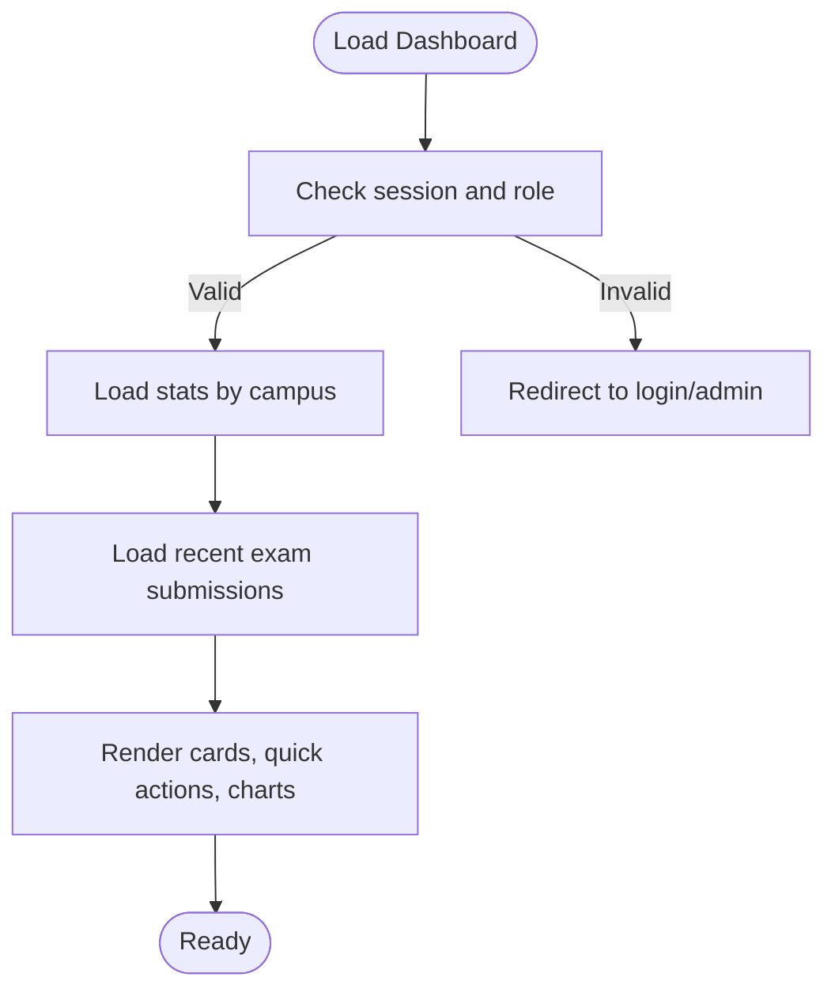
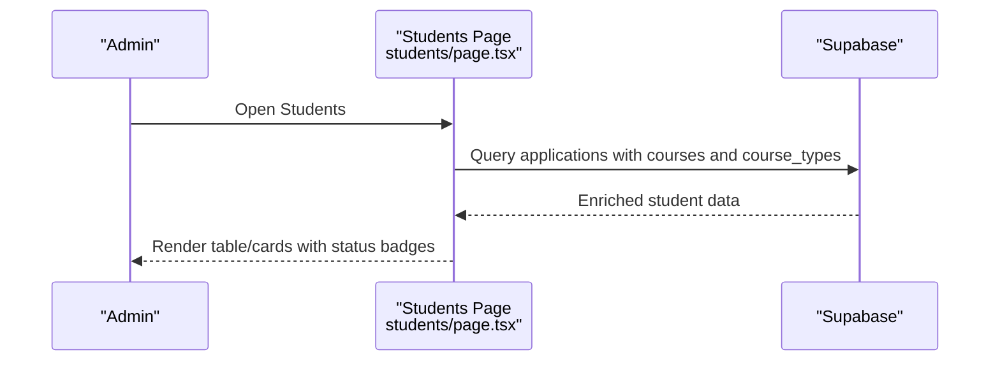
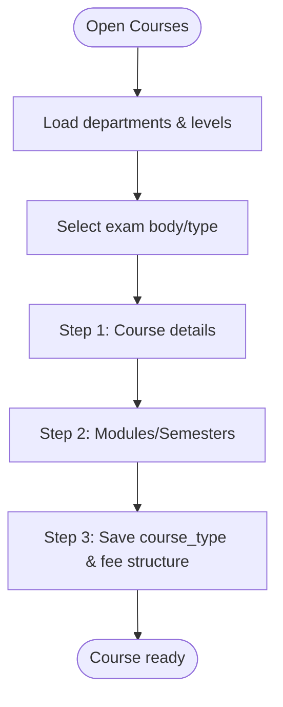
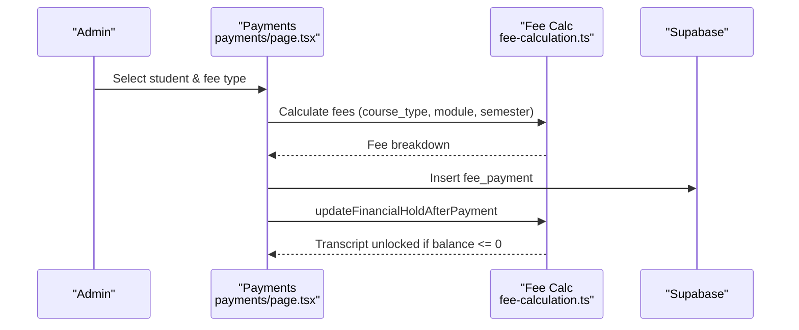
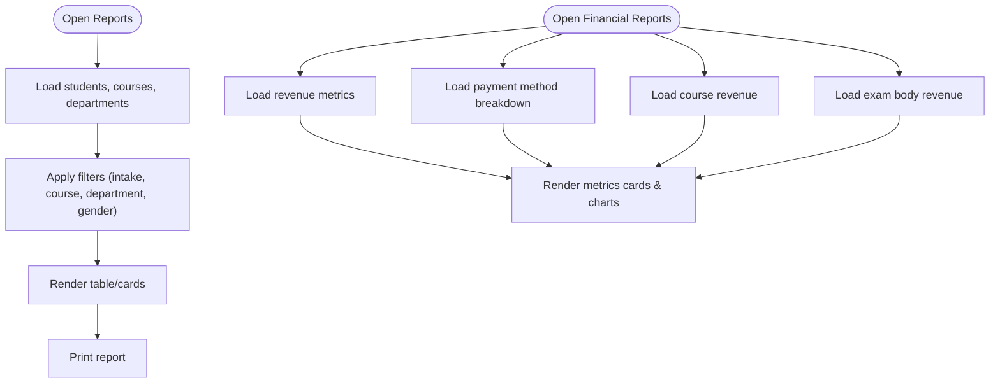
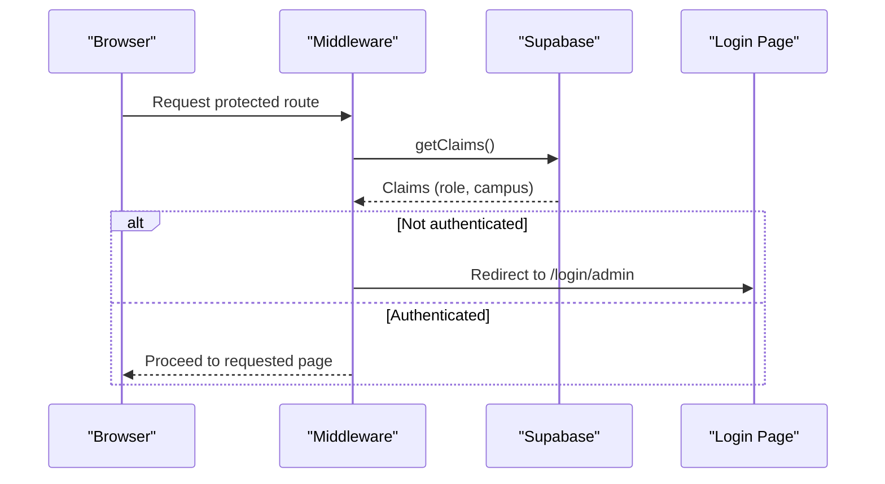
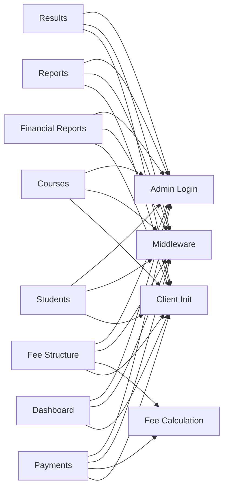

# Admin Dashboard

<cite>
**Referenced Files in This Document**
- [app/admin/dashboard/page.tsx](file://app/admin/dashboard/page.tsx)
- [lib/middleware.ts](file://lib/middleware.ts)
- [lib/client.ts](file://lib/client.ts)
- [lib/server.ts](file://lib/server.ts)
- [app/admin/students/page.tsx](file://app/admin/students/page.tsx)
- [app/admin/courses/page.tsx](file://app/admin/courses/page.tsx)
- [app/admin/reports/page.tsx](file://app/admin/reports/page.tsx)
- [app/admin/financial-reports/page.tsx](file://app/admin/financial-reports/page.tsx)
- [app/admin/payments/page.tsx](file://app/admin/payments/page.tsx)
- [app/admin/fee-structure/page.tsx](file://app/admin/fee-structure/page.tsx)
- [app/admin/results/page.tsx](file://app/admin/results/page.tsx)
- [app/login/admin/page.tsx](file://app/login/admin/page.tsx)
- [lib/fee-calculation.ts](file://lib/fee-calculation.ts)
- [lib/utils.ts](file://lib/utils.ts)
</cite>

## Table of Contents
1. [Introduction](#introduction)
2. [Project Structure](#project-structure)
3. [Core Components](#core-components)
4. [Architecture Overview](#architecture-overview)
5. [Detailed Component Analysis](#detailed-component-analysis)
6. [Dependency Analysis](#dependency-analysis)
7. [Performance Considerations](#performance-considerations)
8. [Troubleshooting Guide](#troubleshooting-guide)
9. [Conclusion](#conclusion)

## Introduction
This document describes the Admin Dashboard system, a comprehensive administrative interface for overseeing student admissions, course administration, financial operations, and system configuration. It covers real-time dashboards, reporting capabilities, administrative workflows, and integrations with the Supabase authentication and database layer. The system supports campus-specific views, financial oversight, and automated fee calculations.

## Project Structure
The Admin Dashboard is built with Next.js App Router under the `/app/admin` namespace, complemented by shared libraries for authentication, client initialization, and financial calculations. Key areas include:
- Dashboard overview and navigation
- Student management
- Course administration and fee structure
- Financial operations and reporting
- Results management and PDF generation
- Authentication and access control

**Diagram sources**
- [app/admin/dashboard/page.tsx:11-655](file://app/admin/dashboard/page.tsx#L11-L655)
- [lib/middleware.ts:10-75](file://lib/middleware.ts#L10-L75)
- [lib/client.ts:5-42](file://lib/client.ts#L5-L42)
- [lib/server.ts:8-34](file://lib/server.ts#L8-L34)
- [app/admin/payments/page.tsx:1-604](file://app/admin/payments/page.tsx#L1-L604)
- [app/admin/fee-structure/page.tsx:1-510](file://app/admin/fee-structure/page.tsx#L1-L510)
- [app/admin/financial-reports/page.tsx:1-459](file://app/admin/financial-reports/page.tsx#L1-L459)
- [app/admin/reports/page.tsx:1-378](file://app/admin/reports/page.tsx#L1-L378)
- [app/admin/students/page.tsx:1-290](file://app/admin/students/page.tsx#L1-L290)
- [app/admin/courses/page.tsx:1-800](file://app/admin/courses/page.tsx#L1-L800)
- [app/admin/results/page.tsx:1-581](file://app/admin/results/page.tsx#L1-L581)
- [app/login/admin/page.tsx:1-329](file://app/login/admin/page.tsx#L1-L329)
- [lib/fee-calculation.ts:1-584](file://lib/fee-calculation.ts#L1-L584)
- [lib/utils.ts:1-7](file://lib/utils.ts#L1-L7)

**Section sources**
- [app/admin/dashboard/page.tsx:11-655](file://app/admin/dashboard/page.tsx#L11-L655)
- [lib/middleware.ts:10-75](file://lib/middleware.ts#L10-L75)
- [lib/client.ts:5-42](file://lib/client.ts#L5-L42)
- [lib/server.ts:8-34](file://lib/server.ts#L8-L34)
- [app/admin/students/page.tsx:1-290](file://app/admin/students/page.tsx#L1-L290)
- [app/admin/courses/page.tsx:1-800](file://app/admin/courses/page.tsx#L1-L800)
- [app/admin/reports/page.tsx:1-378](file://app/admin/reports/page.tsx#L1-L378)
- [app/admin/financial-reports/page.tsx:1-459](file://app/admin/financial-reports/page.tsx#L1-L459)
- [app/admin/payments/page.tsx:1-604](file://app/admin/payments/page.tsx#L1-L604)
- [app/admin/fee-structure/page.tsx:1-510](file://app/admin/fee-structure/page.tsx#L1-L510)
- [app/admin/results/page.tsx:1-581](file://app/admin/results/page.tsx#L1-L581)
- [app/login/admin/page.tsx:1-329](file://app/login/admin/page.tsx#L1-L329)
- [lib/fee-calculation.ts:1-584](file://lib/fee-calculation.ts#L1-L584)
- [lib/utils.ts:1-7](file://lib/utils.ts#L1-L7)

## Core Components
- Admin Dashboard: Real-time statistics, quick actions, recent payments, and payment method distribution. Integrates with Supabase for authentication and data queries.
- Student Management: Enrolled student listing with campus filtering, status badges, and responsive layouts.
- Course Administration: Modular course configuration, wizard-driven creation, department and qualification level management, and course-type mapping.
- Financial Operations: Fee payments recording, automatic financial hold updates, and installment plan creation.
- Reporting: Student list reports with filters, financial reports with metrics and charts, and results matrix with PDF export.
- Access Control: Role-based routing, campus-aware authentication, and middleware enforcement.

**Section sources**
- [app/admin/dashboard/page.tsx:35-114](file://app/admin/dashboard/page.tsx#L35-L114)
- [app/admin/students/page.tsx:74-115](file://app/admin/students/page.tsx#L74-L115)
- [app/admin/courses/page.tsx:109-279](file://app/admin/courses/page.tsx#L109-L279)
- [app/admin/payments/page.tsx:106-149](file://app/admin/payments/page.tsx#L106-L149)
- [app/admin/reports/page.tsx:64-107](file://app/admin/reports/page.tsx#L64-L107)
- [app/admin/financial-reports/page.tsx:79-84](file://app/admin/financial-reports/page.tsx#L79-L84)
- [app/admin/results/page.tsx:89-108](file://app/admin/results/page.tsx#L89-L108)
- [lib/middleware.ts:10-75](file://lib/middleware.ts#L10-L75)
- [app/login/admin/page.tsx:34-91](file://app/login/admin/page.tsx#L34-L91)

## Architecture Overview
The Admin Dashboard relies on Supabase for authentication and database operations. Middleware enforces session checks and redirects unauthorized users. Client initialization encapsulates cookie handling for browser environments, while server-side helpers support SSR contexts. Financial calculations are centralized in a dedicated module.

**Diagram sources**
- [app/login/admin/page.tsx:34-91](file://app/login/admin/page.tsx#L34-L91)
- [lib/middleware.ts:44-58](file://lib/middleware.ts#L44-L58)
- [app/admin/dashboard/page.tsx:161-201](file://app/admin/dashboard/page.tsx#L161-L201)
- [lib/client.ts:5-42](file://lib/client.ts#L5-L42)

**Section sources**
- [lib/middleware.ts:10-75](file://lib/middleware.ts#L10-L75)
- [lib/client.ts:5-42](file://lib/client.ts#L5-L42)
- [lib/server.ts:8-34](file://lib/server.ts#L8-L34)
- [app/login/admin/page.tsx:34-91](file://app/login/admin/page.tsx#L34-L91)
- [app/admin/dashboard/page.tsx:161-201](file://app/admin/dashboard/page.tsx#L161-L201)

## Detailed Component Analysis

### Admin Dashboard
The dashboard aggregates administrative KPIs, recent activity, and quick-access links. It loads:
- Application counts (total, pending, approved)
- Student and lecturer counts filtered by campus
- Monthly revenue and payment method breakdown
- Recent payments and exam submission notifications

**Diagram sources**
- [app/admin/dashboard/page.tsx:35-114](file://app/admin/dashboard/page.tsx#L35-L114)
- [app/admin/dashboard/page.tsx:116-159](file://app/admin/dashboard/page.tsx#L116-L159)
- [app/admin/dashboard/page.tsx:161-201](file://app/admin/dashboard/page.tsx#L161-L201)

**Section sources**
- [app/admin/dashboard/page.tsx:35-114](file://app/admin/dashboard/page.tsx#L35-L114)
- [app/admin/dashboard/page.tsx:116-159](file://app/admin/dashboard/page.tsx#L116-L159)
- [app/admin/dashboard/page.tsx:161-201](file://app/admin/dashboard/page.tsx#L161-L201)

### Student Management
The Students page lists enrolled students, applies campus filters, and presents a responsive table/mobile card layout. It enriches application data with course and course-type details.

**Diagram sources**
- [app/admin/students/page.tsx:74-115](file://app/admin/students/page.tsx#L74-L115)

**Section sources**
- [app/admin/students/page.tsx:74-115](file://app/admin/students/page.tsx#L74-L115)

### Course Administration
The Courses page implements a multi-step wizard for course creation, supporting multiple exam bodies (KNEC, CDACC, JP, INSTALL). It manages departments, qualification levels, modules, semesters, and fee structures.

**Diagram sources**
- [app/admin/courses/page.tsx:272-294](file://app/admin/courses/page.tsx#L272-L294)
- [app/admin/courses/page.tsx:389-520](file://app/admin/courses/page.tsx#L389-L520)
- [app/admin/courses/page.tsx:522-761](file://app/admin/courses/page.tsx#L522-L761)

**Section sources**
- [app/admin/courses/page.tsx:272-294](file://app/admin/courses/page.tsx#L272-L294)
- [app/admin/courses/page.tsx:389-520](file://app/admin/courses/page.tsx#L389-L520)
- [app/admin/courses/page.tsx:522-761](file://app/admin/courses/page.tsx#L522-L761)

### Financial Operations
The Payments page enables recording fee payments, auto-filling fee types based on course data, and updating financial holds. The Fee Structure page manages per-course, per-semester, per-module fee configurations.

**Diagram sources**
- [app/admin/payments/page.tsx:151-238](file://app/admin/payments/page.tsx#L151-L238)
- [app/admin/payments/page.tsx:247-267](file://app/admin/payments/page.tsx#L247-L267)
- [lib/fee-calculation.ts:539-555](file://lib/fee-calculation.ts#L539-L555)

**Section sources**
- [app/admin/payments/page.tsx:151-238](file://app/admin/payments/page.tsx#L151-L238)
- [app/admin/payments/page.tsx:247-267](file://app/admin/payments/page.tsx#L247-L267)
- [app/admin/fee-structure/page.tsx:92-126](file://app/admin/fee-structure/page.tsx#L92-L126)
- [lib/fee-calculation.ts:539-555](file://lib/fee-calculation.ts#L539-L555)

### Reporting System
The Reports page provides student list filtering and printing. The Financial Reports page aggregates revenue metrics, payment method breakdowns, and course/exam-body revenue. Results page offers a matrix view and PDF generation.

**Diagram sources**
- [app/admin/reports/page.tsx:64-107](file://app/admin/reports/page.tsx#L64-L107)
- [app/admin/financial-reports/page.tsx:79-162](file://app/admin/financial-reports/page.tsx#L79-L162)
- [app/admin/financial-reports/page.tsx:164-284](file://app/admin/financial-reports/page.tsx#L164-L284)

**Section sources**
- [app/admin/reports/page.tsx:64-107](file://app/admin/reports/page.tsx#L64-L107)
- [app/admin/financial-reports/page.tsx:79-162](file://app/admin/financial-reports/page.tsx#L79-L162)
- [app/admin/financial-reports/page.tsx:164-284](file://app/admin/financial-reports/page.tsx#L164-L284)
- [app/admin/results/page.tsx:177-351](file://app/admin/results/page.tsx#L177-L351)

### Access Control and Authentication
Authentication is enforced via middleware and login pages. Sessions are validated, roles checked, and campus-specific access ensured. Cookies are managed consistently across browser and server contexts.

**Diagram sources**
- [lib/middleware.ts:44-58](file://lib/middleware.ts#L44-L58)
- [app/login/admin/page.tsx:34-91](file://app/login/admin/page.tsx#L34-L91)
- [lib/client.ts:5-42](file://lib/client.ts#L5-L42)
- [lib/server.ts:8-34](file://lib/server.ts#L8-L34)

**Section sources**
- [lib/middleware.ts:10-75](file://lib/middleware.ts#L10-L75)
- [app/login/admin/page.tsx:34-91](file://app/login/admin/page.tsx#L34-L91)
- [lib/client.ts:5-42](file://lib/client.ts#L5-L42)
- [lib/server.ts:8-34](file://lib/server.ts#L8-L34)

## Dependency Analysis
Administrative components depend on Supabase for data and auth, with centralized utilities for styling and calculations.

**Diagram sources**
- [app/admin/dashboard/page.tsx:3-7](file://app/admin/dashboard/page.tsx#L3-L7)
- [app/admin/students/page.tsx:3-7](file://app/admin/students/page.tsx#L3-L7)
- [app/admin/courses/page.tsx:3-7](file://app/admin/courses/page.tsx#L3-L7)
- [app/admin/payments/page.tsx:3-6](file://app/admin/payments/page.tsx#L3-L6)
- [app/admin/fee-structure/page.tsx:3-6](file://app/admin/fee-structure/page.tsx#L3-L6)
- [app/admin/financial-reports/page.tsx:3-6](file://app/admin/financial-reports/page.tsx#L3-L6)
- [app/admin/reports/page.tsx:3-7](file://app/admin/reports/page.tsx#L3-L7)
- [app/admin/results/page.tsx:3-10](file://app/admin/results/page.tsx#L3-L10)
- [lib/middleware.ts:1-2](file://lib/middleware.ts#L1-L2)
- [app/login/admin/page.tsx:1-10](file://app/login/admin/page.tsx#L1-L10)
- [lib/fee-calculation.ts](file://lib/fee-calculation.ts#L1)
- [lib/client.ts](file://lib/client.ts#L1)
- [lib/server.ts](file://lib/server.ts#L1)

**Section sources**
- [app/admin/dashboard/page.tsx:3-7](file://app/admin/dashboard/page.tsx#L3-L7)
- [app/admin/students/page.tsx:3-7](file://app/admin/students/page.tsx#L3-L7)
- [app/admin/courses/page.tsx:3-7](file://app/admin/courses/page.tsx#L3-L7)
- [app/admin/payments/page.tsx:3-6](file://app/admin/payments/page.tsx#L3-L6)
- [app/admin/fee-structure/page.tsx:3-6](file://app/admin/fee-structure/page.tsx#L3-L6)
- [app/admin/financial-reports/page.tsx:3-6](file://app/admin/financial-reports/page.tsx#L3-L6)
- [app/admin/reports/page.tsx:3-7](file://app/admin/reports/page.tsx#L3-L7)
- [app/admin/results/page.tsx:3-10](file://app/admin/results/page.tsx#L3-L10)
- [lib/middleware.ts:1-2](file://lib/middleware.ts#L1-L2)
- [app/login/admin/page.tsx:1-10](file://app/login/admin/page.tsx#L1-L10)
- [lib/fee-calculation.ts](file://lib/fee-calculation.ts#L1)
- [lib/client.ts](file://lib/client.ts#L1)
- [lib/server.ts](file://lib/server.ts#L1)

## Performance Considerations
- Use Supabase `eq`, `in`, and `gte/lte` filters to limit dataset sizes per campus and date ranges.
- Prefer server-side rendering helpers for SSR contexts to avoid global client instances.
- Debounce or throttle filters in reporting pages to reduce repeated queries.
- Cache frequently accessed static data (e.g., departments, qualification levels) in component state.
- Minimize DOM updates by virtualizing large tables and deferring heavy computations to background threads where possible.

## Troubleshooting Guide
Common issues and resolutions:
- Authentication failures: Verify session validity and role metadata; ensure campus matches the selected login campus.
- Authorization errors: Middleware redirects unauthenticated users to the admin login; confirm claims retrieval.
- Data not loading: Check Supabase query filters and table relationships; ensure campus-aware filtering is applied.
- Payment recording errors: Validate fee type amounts derived from course data; confirm financial hold updates after payment insertion.
- Report generation: Ensure filtered data exists before generating PDFs; handle missing images gracefully.

**Section sources**
- [app/login/admin/page.tsx:34-91](file://app/login/admin/page.tsx#L34-L91)
- [lib/middleware.ts:44-58](file://lib/middleware.ts#L44-L58)
- [app/admin/payments/page.tsx:247-267](file://app/admin/payments/page.tsx#L247-L267)
- [app/admin/results/page.tsx:177-351](file://app/admin/results/page.tsx#L177-L351)

## Conclusion
The Admin Dashboard provides a robust, campus-aware administrative platform integrating real-time dashboards, student and course management, financial oversight, and comprehensive reporting. Its modular design, centralized authentication, and reusable calculation utilities enable scalable administration and reliable operational insights.