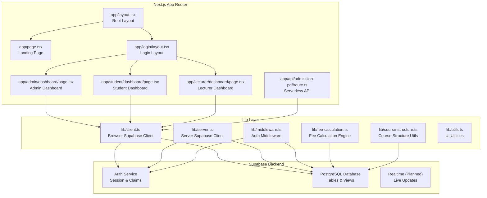
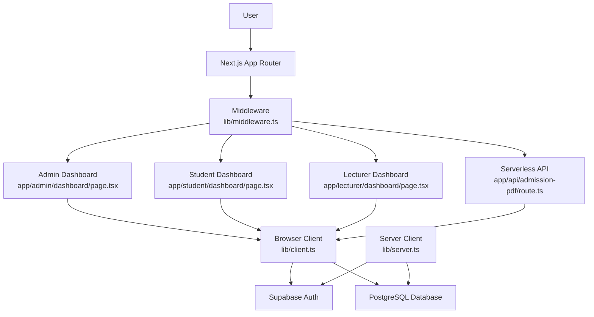
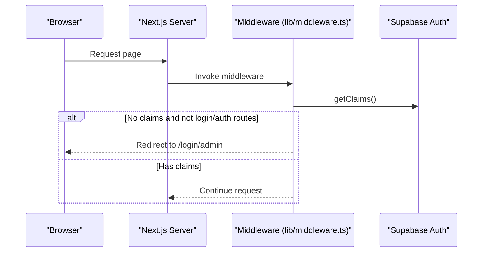
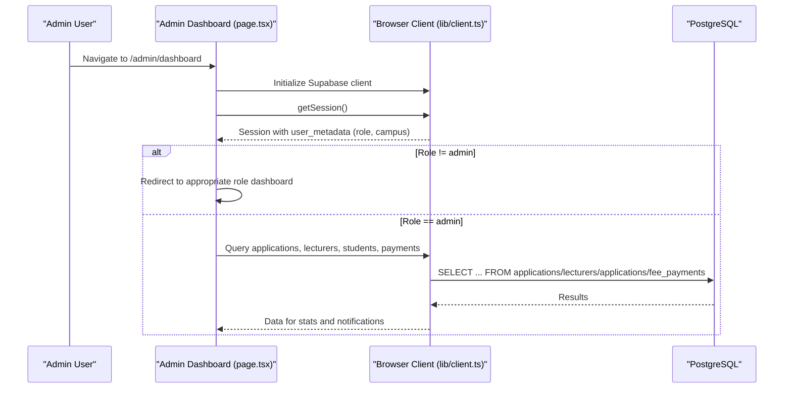
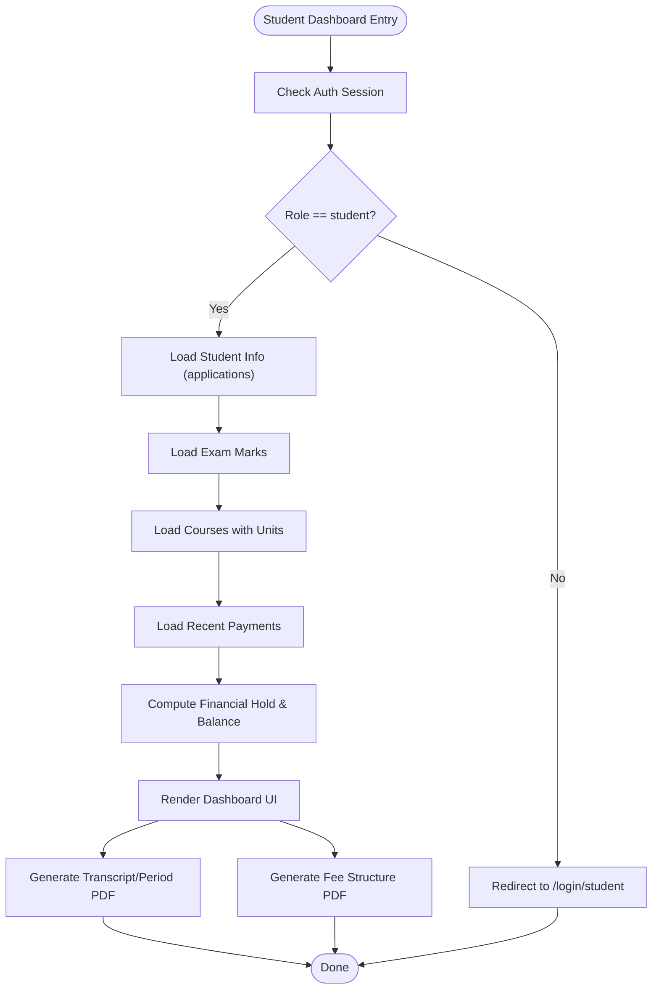
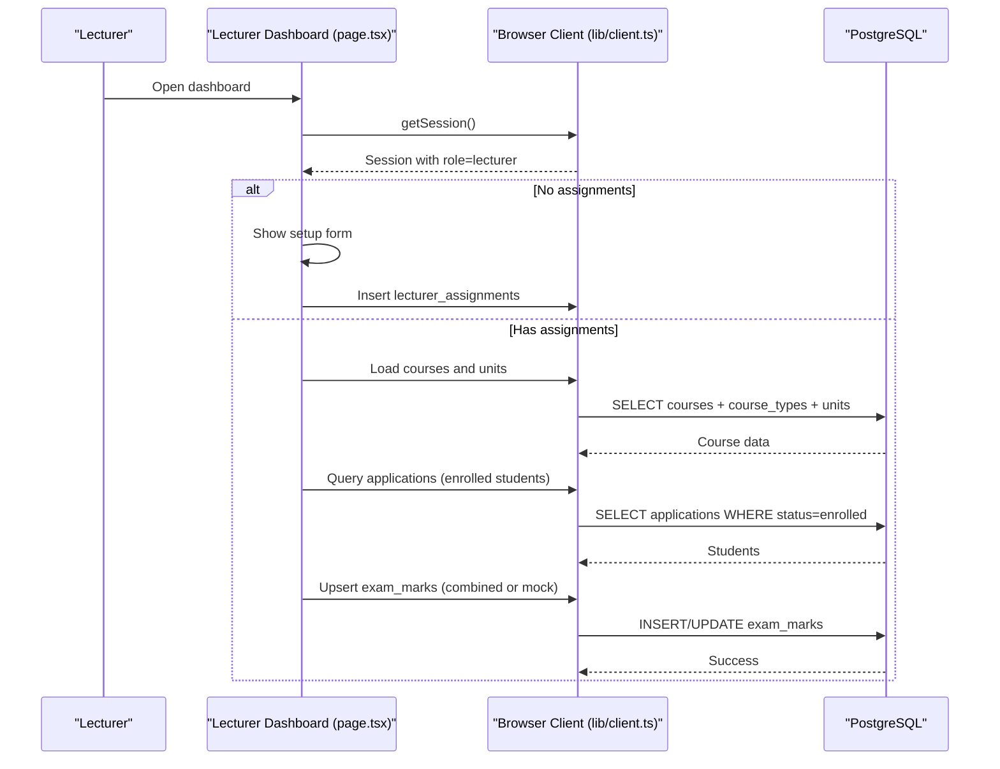
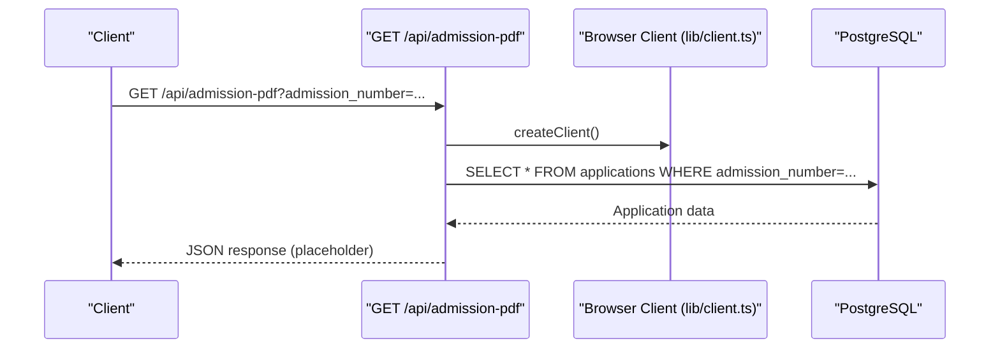
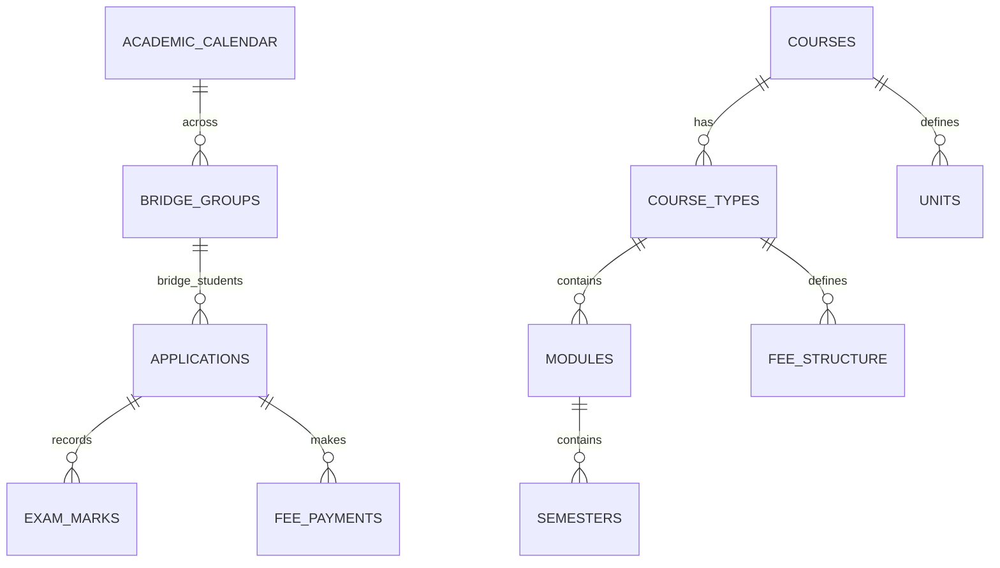
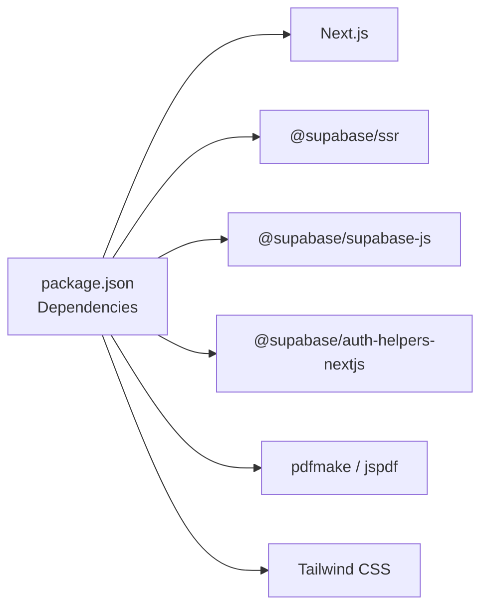

# Architecture Overview

<cite>
**Referenced Files in This Document**
- [package.json](file://package.json)
- [lib/middleware.ts](file://lib/middleware.ts)
- [lib/client.ts](file://lib/client.ts)
- [lib/server.ts](file://lib/server.ts)
- [app/layout.tsx](file://app/layout.tsx)
- [app/page.tsx](file://app/page.tsx)
- [app/login/layout.tsx](file://app/login/layout.tsx)
- [app/admin/dashboard/page.tsx](file://app/admin/dashboard/page.tsx)
- [app/student/dashboard/page.tsx](file://app/student/dashboard/page.tsx)
- [app/lecturer/dashboard/page.tsx](file://app/lecturer/dashboard/page.tsx)
- [app/api/admission-pdf/route.ts](file://app/api/admission-pdf/route.ts)
- [lib/fee-calculation.ts](file://lib/fee-calculation.ts)
- [lib/course-structure.ts](file://lib/course-structure.ts)
- [lib/utils.ts](file://lib/utils.ts)
- [database.sql](file://database.sql)
- [create-tables.sql](file://create-tables.sql)
</cite>

## Table of Contents
1. [Introduction](#introduction)
2. [Project Structure](#project-structure)
3. [Core Components](#core-components)
4. [Architecture Overview](#architecture-overview)
5. [Detailed Component Analysis](#detailed-component-analysis)
6. [Dependency Analysis](#dependency-analysis)
7. [Performance Considerations](#performance-considerations)
8. [Troubleshooting Guide](#troubleshooting-guide)
9. [Conclusion](#conclusion)
10. [Appendices](#appendices)

## Introduction
This document presents the architecture of the EAVI College Management System built with Next.js App Router. The system follows a layered design separating presentation, business logic, and data access, while integrating Supabase for authentication, real-time capabilities, and database operations. It covers user roles (admin, lecturer, student), session management, role-based access control, and operational flows such as fee calculations and result generation.

## Project Structure
The project is organized around Next.js App Router conventions:
- app/: Route handlers, pages, and layouts
- lib/: Shared utilities, Supabase clients, and business logic helpers
- components/: Reusable UI components
- migrations/: Database migration scripts
- public/: Static assets

**Diagram sources**
- [app/layout.tsx:1-38](file://app/layout.tsx#L1-L38)
- [app/page.tsx:1-214](file://app/page.tsx#L1-L214)
- [app/login/layout.tsx:1-12](file://app/login/layout.tsx#L1-L12)
- [app/admin/dashboard/page.tsx:1-655](file://app/admin/dashboard/page.tsx#L1-L655)
- [app/student/dashboard/page.tsx:1-800](file://app/student/dashboard/page.tsx#L1-L800)
- [app/lecturer/dashboard/page.tsx:1-800](file://app/lecturer/dashboard/page.tsx#L1-L800)
- [app/api/admission-pdf/route.ts:1-38](file://app/api/admission-pdf/route.ts#L1-L38)
- [lib/client.ts:1-42](file://lib/client.ts#L1-L42)
- [lib/server.ts:1-34](file://lib/server.ts#L1-L34)
- [lib/middleware.ts:1-75](file://lib/middleware.ts#L1-L75)
- [lib/fee-calculation.ts:1-584](file://lib/fee-calculation.ts#L1-L584)
- [lib/course-structure.ts:1-322](file://lib/course-structure.ts#L1-L322)
- [lib/utils.ts:1-7](file://lib/utils.ts#L1-L7)

**Section sources**
- [package.json:1-41](file://package.json#L1-L41)
- [app/layout.tsx:1-38](file://app/layout.tsx#L1-L38)
- [lib/middleware.ts:1-75](file://lib/middleware.ts#L1-L75)

## Core Components
- Presentation Layer
  - Root layout and theme configuration
  - Role-specific dashboards (admin, student, lecturer)
  - Public landing page and login pages
- Business Logic Layer
  - Fee calculation engine for standard and bridge students
  - Course structure normalization and utilities
  - Session and role checks
- Data Access Layer
  - Supabase browser and server clients
  - Authentication middleware enforcing session and claims
  - Database schema supporting applications, courses, exam marks, and payments

**Section sources**
- [app/admin/dashboard/page.tsx:1-655](file://app/admin/dashboard/page.tsx#L1-L655)
- [app/student/dashboard/page.tsx:1-800](file://app/student/dashboard/page.tsx#L1-L800)
- [app/lecturer/dashboard/page.tsx:1-800](file://app/lecturer/dashboard/page.tsx#L1-L800)
- [lib/fee-calculation.ts:1-584](file://lib/fee-calculation.ts#L1-L584)
- [lib/course-structure.ts:1-322](file://lib/course-structure.ts#L1-L322)
- [lib/client.ts:1-42](file://lib/client.ts#L1-L42)
- [lib/server.ts:1-34](file://lib/server.ts#L1-L34)
- [lib/middleware.ts:1-75](file://lib/middleware.ts#L1-L75)

## Architecture Overview
The system employs a client-server split with Next.js Server Components and Server Actions where appropriate, complemented by Supabase for identity, realtime, and persistence. Authentication is enforced centrally via middleware, while role-based access control is enforced in route handlers.

**Diagram sources**
- [lib/middleware.ts:1-75](file://lib/middleware.ts#L1-L75)
- [app/admin/dashboard/page.tsx:1-655](file://app/admin/dashboard/page.tsx#L1-L655)
- [app/student/dashboard/page.tsx:1-800](file://app/student/dashboard/page.tsx#L1-L800)
- [app/lecturer/dashboard/page.tsx:1-800](file://app/lecturer/dashboard/page.tsx#L1-L800)
- [app/api/admission-pdf/route.ts:1-38](file://app/api/admission-pdf/route.ts#L1-L38)
- [lib/client.ts:1-42](file://lib/client.ts#L1-L42)
- [lib/server.ts:1-34](file://lib/server.ts#L1-L34)

## Detailed Component Analysis

### Authentication and Session Management
Centralized authentication enforcement occurs in middleware, which:
- Creates a per-request Supabase client
- Reads and writes cookies consistently
- Validates user claims and redirects unauthenticated users to the admin login path
- Emphasizes correctness around cookie synchronization to prevent premature session termination

**Diagram sources**
- [lib/middleware.ts:10-74](file://lib/middleware.ts#L10-L74)

**Section sources**
- [lib/middleware.ts:1-75](file://lib/middleware.ts#L1-L75)

### Admin Dashboard Interaction
The admin dashboard orchestrates:
- Client initialization via lib/client.ts
- Supabase queries for applications, lecturers, students, fee payments, and exam marks
- Role verification and campus-scoped filtering
- Real-time-like updates through periodic checks and local state

**Diagram sources**
- [app/admin/dashboard/page.tsx:116-201](file://app/admin/dashboard/page.tsx#L116-L201)
- [lib/client.ts:1-42](file://lib/client.ts#L1-L42)

**Section sources**
- [app/admin/dashboard/page.tsx:1-655](file://app/admin/dashboard/page.tsx#L1-L655)
- [lib/client.ts:1-42](file://lib/client.ts#L1-L42)

### Student Dashboard Workflows
Student dashboard integrates:
- Session validation and role enforcement
- Course structure retrieval and unit mapping
- Financial hold and balance computation
- Result generation and fee structure printing

**Diagram sources**
- [app/student/dashboard/page.tsx:70-192](file://app/student/dashboard/page.tsx#L70-L192)
- [lib/fee-calculation.ts:482-534](file://lib/fee-calculation.ts#L482-L534)

**Section sources**
- [app/student/dashboard/page.tsx:1-800](file://app/student/dashboard/page.tsx#L1-L800)
- [lib/fee-calculation.ts:1-584](file://lib/fee-calculation.ts#L1-L584)

### Lecturer Dashboard and Marks Entry
Lecturer workflows include:
- Assignment setup and unit selection
- Student enrollment retrieval and marks input
- Exam limit validation per course type and period
- Persisting combined CAT and end-term marks

**Diagram sources**
- [app/lecturer/dashboard/page.tsx:162-465](file://app/lecturer/dashboard/page.tsx#L162-L465)
- [lib/course-structure.ts:212-237](file://lib/course-structure.ts#L212-L237)

**Section sources**
- [app/lecturer/dashboard/page.tsx:1-800](file://app/lecturer/dashboard/page.tsx#L1-L800)
- [lib/course-structure.ts:1-322](file://lib/course-structure.ts#L1-L322)

### Serverless API Endpoint
The admission PDF endpoint demonstrates server-side Supabase usage:
- Validates query parameters
- Retrieves application data
- Placeholder for PDF generation

**Diagram sources**
- [app/api/admission-pdf/route.ts:1-38](file://app/api/admission-pdf/route.ts#L1-L38)
- [lib/client.ts:1-42](file://lib/client.ts#L1-42)

**Section sources**
- [app/api/admission-pdf/route.ts:1-38](file://app/api/admission-pdf/route.ts#L1-L38)
- [lib/client.ts:1-42](file://lib/client.ts#L1-L42)

### Database Schema Context
The schema supports:
- Academic calendar and reporting dates
- Applications with course, campus, and financial hold
- Course types, modules, semesters, and units
- Exam marks with CAT/end-term combinations
- Fee payments and structure
- Bridge groups and accelerated streams

**Diagram sources**
- [database.sql:4-200](file://database.sql#L4-L200)
- [create-tables.sql:132-200](file://create-tables.sql#L132-L200)

**Section sources**
- [database.sql:1-200](file://database.sql#L1-L200)
- [create-tables.sql:1-200](file://create-tables.sql#L1-L200)

## Dependency Analysis
Key runtime dependencies and integrations:
- Next.js 16.2.4 with App Router
- Supabase SDKs for SSR and browser environments
- PDF generation libraries for transcripts and fee structures
- Tailwind CSS for styling

**Diagram sources**
- [package.json:11-28](file://package.json#L11-L28)

**Section sources**
- [package.json:1-41](file://package.json#L1-L41)

## Performance Considerations
- Client initialization
  - Use lib/client.ts only in browser contexts to avoid SSR issues
  - Reuse a single client instance per browser session
- Middleware
  - Create Supabase client per request to avoid global state pitfalls
  - Ensure cookie synchronization to prevent session desync
- Queries
  - Apply filters (campus, status) early to reduce payload sizes
  - Use selective column projections and counts where possible
- Real-time
  - Consider enabling Supabase Realtime for live updates where appropriate
- Rendering
  - Defer heavy computations to server actions or API routes
  - Optimize PDF generation by minimizing DOM and asset loads

[No sources needed since this section provides general guidance]

## Troubleshooting Guide
- Authentication loops or unexpected redirects
  - Verify middleware matcher and cookie handling
  - Confirm getClaims() is invoked before any session-dependent logic
- Session desynchronization
  - Ensure setAll() is applied to both response and request cookies
- Role mismatches
  - Validate user_metadata.role and campus filters in route handlers
- PDF generation failures
  - Confirm client initialization and image/assets availability
  - Check browser compatibility and polyfills for PDF libraries

**Section sources**
- [lib/middleware.ts:10-74](file://lib/middleware.ts#L10-L74)
- [lib/client.ts:1-42](file://lib/client.ts#L1-L42)
- [app/student/dashboard/page.tsx:402-546](file://app/student/dashboard/page.tsx#L402-L546)

## Conclusion
The EAVI College Management System leverages Next.js App Router with a clean separation of concerns, robust Supabase integration for authentication and data, and TypeScript-driven reliability. The architecture supports scalable enhancements such as Supabase Realtime, improved caching strategies, and modularized business logic for fee and academic workflows.

[No sources needed since this section summarizes without analyzing specific files]

## Appendices

### Technology Stack Integration Points
- Next.js App Router for routing and SSR/SSG
- Supabase Auth for session management and claims
- Supabase DB for relational data and future Realtime
- PDF generation libraries for student transcripts and fee structures
- Tailwind CSS for responsive UI

**Section sources**
- [package.json:11-28](file://package.json#L11-L28)
- [lib/middleware.ts:1-75](file://lib/middleware.ts#L1-L75)
- [lib/client.ts:1-42](file://lib/client.ts#L1-L42)