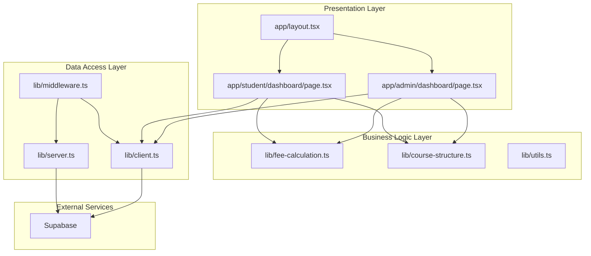
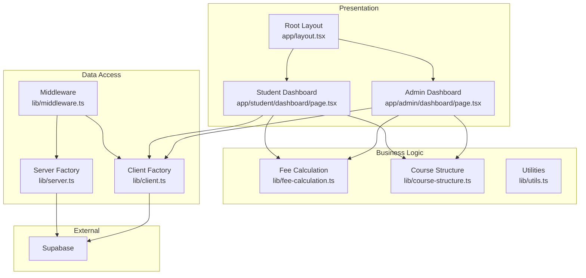
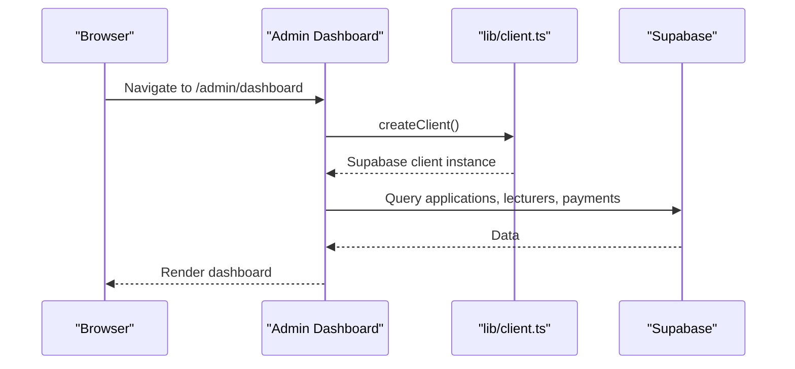
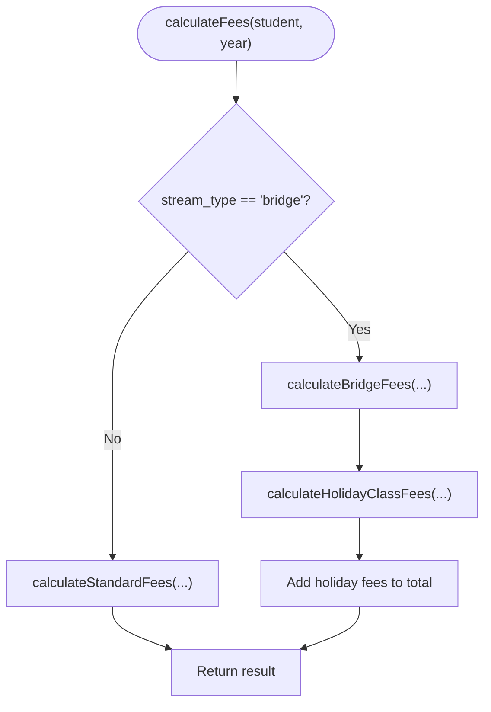
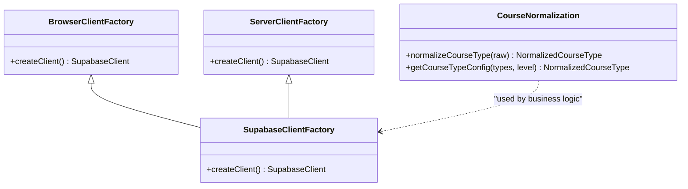
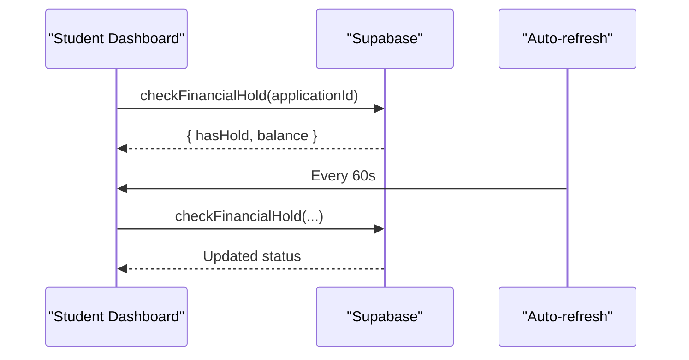
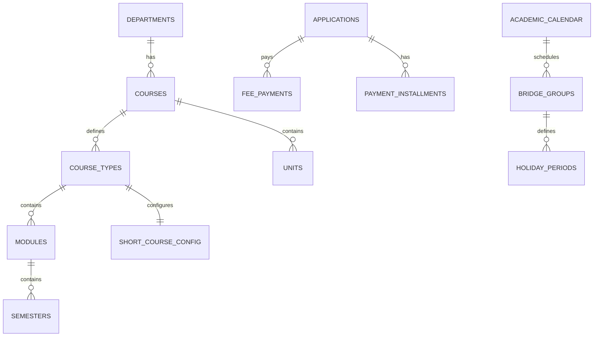
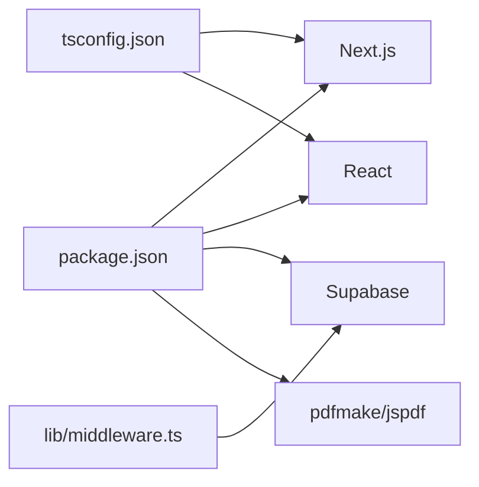

# System Design Patterns

<cite>
**Referenced Files in This Document**
- [README.md](file://README.md)
- [package.json](file://package.json)
- [next.config.ts](file://next.config.ts)
- [tsconfig.json](file://tsconfig.json)
- [lib/middleware.ts](file://lib/middleware.ts)
- [lib/client.ts](file://lib/client.ts)
- [lib/server.ts](file://lib/server.ts)
- [lib/fee-calculation.ts](file://lib/fee-calculation.ts)
- [lib/course-structure.ts](file://lib/course-structure.ts)
- [lib/utils.ts](file://lib/utils.ts)
- [app/layout.tsx](file://app/layout.tsx)
- [app/admin/dashboard/page.tsx](file://app/admin/dashboard/page.tsx)
- [app/student/dashboard/page.tsx](file://app/student/dashboard/page.tsx)
- [create-tables.sql](file://create-tables.sql)
- [COURSE_SCHEMA_DOCUMENTATION.md](file://COURSE_SCHEMA_DOCUMENTATION.md)
</cite>

## Table of Contents
1. [Introduction](#introduction)
2. [Project Structure](#project-structure)
3. [Core Components](#core-components)
4. [Architecture Overview](#architecture-overview)
5. [Detailed Component Analysis](#detailed-component-analysis)
6. [Dependency Analysis](#dependency-analysis)
7. [Performance Considerations](#performance-considerations)
8. [Troubleshooting Guide](#troubleshooting-guide)
9. [Conclusion](#conclusion)
10. [Appendices](#appendices)

## Introduction
This document explains the system design patterns implemented in the EAVI College Management System. It focuses on a layered architecture (presentation, business logic, and data access), and demonstrates how patterns such as repository abstraction, factory-style configuration, strategy-like fee calculation, and observer-style real-time updates via Supabase are used to achieve maintainability and scalability. It also documents architectural decisions, including the adoption of Next.js App Router, TypeScript, and Supabase.

## Project Structure
The application follows Next.js App Router conventions with a clear separation of concerns:
- Presentation layer: Route handlers under app/ (pages and layouts)
- Business logic layer: Utility libraries under lib/
- Data access layer: Supabase client factories and database schema

**Diagram sources**
- [app/layout.tsx:1-38](file://app/layout.tsx#L1-L38)
- [app/admin/dashboard/page.tsx:1-655](file://app/admin/dashboard/page.tsx#L1-L655)
- [app/student/dashboard/page.tsx:1-800](file://app/student/dashboard/page.tsx#L1-L800)
- [lib/fee-calculation.ts:1-584](file://lib/fee-calculation.ts#L1-L584)
- [lib/course-structure.ts:1-322](file://lib/course-structure.ts#L1-L322)
- [lib/middleware.ts:1-75](file://lib/middleware.ts#L1-L75)
- [lib/client.ts:1-42](file://lib/client.ts#L1-L42)
- [lib/server.ts:1-34](file://lib/server.ts#L1-L34)

**Section sources**
- [app/layout.tsx:1-38](file://app/layout.tsx#L1-L38)
- [app/admin/dashboard/page.tsx:1-655](file://app/admin/dashboard/page.tsx#L1-L655)
- [app/student/dashboard/page.tsx:1-800](file://app/student/dashboard/page.tsx#L1-L800)
- [lib/fee-calculation.ts:1-584](file://lib/fee-calculation.ts#L1-L584)
- [lib/course-structure.ts:1-322](file://lib/course-structure.ts#L1-L322)
- [lib/middleware.ts:1-75](file://lib/middleware.ts#L1-L75)
- [lib/client.ts:1-42](file://lib/client.ts#L1-L42)
- [lib/server.ts:1-34](file://lib/server.ts#L1-L34)

## Core Components
- Supabase client factories: Encapsulate client creation and cookie handling for browser and server environments.
- Middleware: Centralized authentication guard and claims extraction.
- Fee calculation utilities: Business logic for fee computation, installment plans, and financial holds.
- Course structure utilities: Normalize and derive course configurations for UI and calculations.
- Presentation pages: Admin and student dashboards orchestrate data fetching and UI composition.

Key responsibilities:
- Presentation: Render dashboards, forms, and reports; coordinate with business logic and Supabase.
- Business logic: Encapsulate domain rules (fees, course structures, balances).
- Data access: Abstract Supabase client instantiation and authentication state.

**Section sources**
- [lib/client.ts:1-42](file://lib/client.ts#L1-L42)
- [lib/server.ts:1-34](file://lib/server.ts#L1-L34)
- [lib/middleware.ts:1-75](file://lib/middleware.ts#L1-L75)
- [lib/fee-calculation.ts:1-584](file://lib/fee-calculation.ts#L1-L584)
- [lib/course-structure.ts:1-322](file://lib/course-structure.ts#L1-L322)
- [app/admin/dashboard/page.tsx:1-655](file://app/admin/dashboard/page.tsx#L1-L655)
- [app/student/dashboard/page.tsx:1-800](file://app/student/dashboard/page.tsx#L1-L800)

## Architecture Overview
The system employs a layered architecture:
- Presentation: Next.js App Router routes and React components.
- Business logic: Pure functions and utilities under lib/.
- Data access: Supabase client factories and middleware.

**Diagram sources**
- [app/admin/dashboard/page.tsx:1-655](file://app/admin/dashboard/page.tsx#L1-L655)
- [app/student/dashboard/page.tsx:1-800](file://app/student/dashboard/page.tsx#L1-L800)
- [app/layout.tsx:1-38](file://app/layout.tsx#L1-L38)
- [lib/fee-calculation.ts:1-584](file://lib/fee-calculation.ts#L1-L584)
- [lib/course-structure.ts:1-322](file://lib/course-structure.ts#L1-L322)
- [lib/middleware.ts:1-75](file://lib/middleware.ts#L1-L75)
- [lib/client.ts:1-42](file://lib/client.ts#L1-L42)
- [lib/server.ts:1-34](file://lib/server.ts#L1-L34)

## Detailed Component Analysis

### Layered Architecture and Repository Pattern Abstraction
- Presentation layer: Route handlers and pages orchestrate UI and data fetching.
- Business logic layer: Utilities encapsulate domain rules and computations.
- Data access layer: Supabase client factories abstract database interactions.

Repository pattern implementation:
- Supabase client creation is centralized in lib/client.ts and lib/server.ts, acting as repository abstractions over the database.
- Middleware ensures consistent authentication state across requests, decoupling auth from business logic.

**Diagram sources**
- [app/admin/dashboard/page.tsx:1-655](file://app/admin/dashboard/page.tsx#L1-L655)
- [lib/client.ts:1-42](file://lib/client.ts#L1-L42)

**Section sources**
- [lib/client.ts:1-42](file://lib/client.ts#L1-L42)
- [lib/server.ts:1-34](file://lib/server.ts#L1-L34)
- [lib/middleware.ts:1-75](file://lib/middleware.ts#L1-L75)
- [app/admin/dashboard/page.tsx:1-655](file://app/admin/dashboard/page.tsx#L1-L655)

### Strategy Pattern: Fee Calculation Strategies
The fee calculation module implements a strategy-like approach:
- calculateFees selects between standard and bridge strategies based on student attributes.
- Additional strategies include late fees, holiday class fees, and installment plan creation.
- Each strategy encapsulates domain-specific rules and database queries.

**Diagram sources**
- [lib/fee-calculation.ts:379-397](file://lib/fee-calculation.ts#L379-L397)
- [lib/fee-calculation.ts:216-285](file://lib/fee-calculation.ts#L216-L285)
- [lib/fee-calculation.ts:42-211](file://lib/fee-calculation.ts#L42-L211)

**Section sources**
- [lib/fee-calculation.ts:1-584](file://lib/fee-calculation.ts#L1-L584)

### Factory Pattern: Dynamic Component Creation
- Supabase client factories: createClient (browser) and createClient (server) encapsulate client initialization and cookie handling.
- Course structure normalization: normalizeCourseType and related helpers act as factories that transform raw course data into a normalized configuration suitable for UI and calculations.

**Diagram sources**
- [lib/client.ts:1-42](file://lib/client.ts#L1-L42)
- [lib/server.ts:1-34](file://lib/server.ts#L1-L34)
- [lib/course-structure.ts:58-237](file://lib/course-structure.ts#L58-L237)

**Section sources**
- [lib/client.ts:1-42](file://lib/client.ts#L1-L42)
- [lib/server.ts:1-34](file://lib/server.ts#L1-L34)
- [lib/course-structure.ts:1-322](file://lib/course-structure.ts#L1-L322)

### Observer Pattern: Supabase Realtime Features
- Real-time dashboard updates: The student dashboard periodically checks financial hold and balance, reflecting live backend changes.
- Middleware authentication: Ensures consistent session state across requests, enabling reliable real-time event handling.

**Diagram sources**
- [app/student/dashboard/page.tsx:102-114](file://app/student/dashboard/page.tsx#L102-L114)
- [lib/fee-calculation.ts:559-583](file://lib/fee-calculation.ts#L559-L583)

**Section sources**
- [app/student/dashboard/page.tsx:1-800](file://app/student/dashboard/page.tsx#L1-L800)
- [lib/fee-calculation.ts:1-584](file://lib/fee-calculation.ts#L1-L584)
- [lib/middleware.ts:1-75](file://lib/middleware.ts#L1-L75)

### Data Model Overview
The database schema supports the course and fee systems with normalized relations and views.

**Diagram sources**
- [create-tables.sql:43-397](file://create-tables.sql#L43-L397)

**Section sources**
- [create-tables.sql:1-200](file://create-tables.sql#L1-L200)
- [create-tables.sql:354-371](file://create-tables.sql#L354-L371)

## Dependency Analysis
- Runtime dependencies: Next.js, React, Supabase client libraries, pdfmake, jspdf, Tailwind utilities.
- TypeScript configuration enforces strict typing across the codebase.
- Middleware coordinates authentication and session state.

**Diagram sources**
- [package.json:11-28](file://package.json#L11-L28)
- [tsconfig.json:2-24](file://tsconfig.json#L2-L24)
- [lib/middleware.ts:1-75](file://lib/middleware.ts#L1-L75)

**Section sources**
- [package.json:1-41](file://package.json#L1-L41)
- [tsconfig.json:1-35](file://tsconfig.json#L1-L35)
- [lib/middleware.ts:1-75](file://lib/middleware.ts#L1-L75)

## Performance Considerations
- Client factories: Reuse a single client instance in the browser to minimize overhead.
- Batch queries: Combine related queries in dashboards to reduce round-trips.
- Periodic refresh: Use intervals judiciously; consider debouncing and cleanup in effects.
- Lazy loading: Defer heavy assets (PDF generation) until needed.

## Troubleshooting Guide
- Authentication redirects: Middleware redirects unauthenticated users to login; verify cookie handling and claims retrieval.
- Supabase client initialization: Ensure environment variables are present and cookies are readable.
- Financial hold updates: Confirm periodic checks are running and backend updates are reflected.

**Section sources**
- [lib/middleware.ts:10-74](file://lib/middleware.ts#L10-L74)
- [lib/client.ts:5-41](file://lib/client.ts#L5-L41)
- [app/student/dashboard/page.tsx:102-114](file://app/student/dashboard/page.tsx#L102-L114)

## Conclusion
The EAVI College Management System applies layered architecture with clear separation between presentation, business logic, and data access. Supabase client factories abstract database interactions, while utilities encapsulate domain logic. Strategy-like fee calculation, factory-style course normalization, and middleware-driven authentication collectively improve maintainability and scalability. The chosen technologies (Next.js App Router, TypeScript, Supabase) reinforce developer productivity and runtime reliability.

## Appendices

### Architectural Decision Records
- Next.js App Router: Provides file-system routing, server actions, and improved data fetching primitives for scalable UI development.
- TypeScript: Enforces type safety across components and utilities, reducing runtime errors and improving long-term maintainability.
- Supabase: Offers integrated authentication, real-time subscriptions, and a Postgres-backed data model, simplifying backend services and enabling rapid iteration.

**Section sources**
- [next.config.ts:1-8](file://next.config.ts#L1-L8)
- [tsconfig.json:1-35](file://tsconfig.json#L1-L35)
- [package.json:11-28](file://package.json#L11-L28)