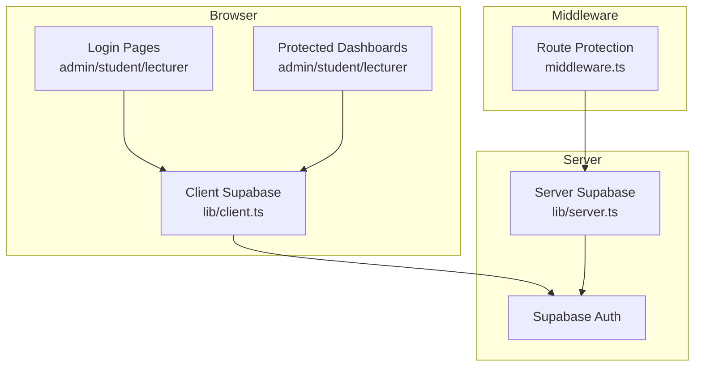
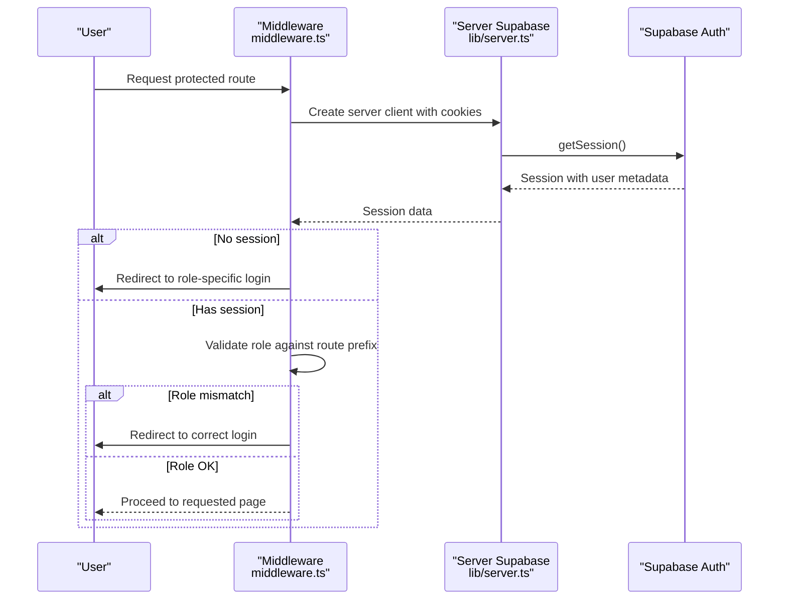
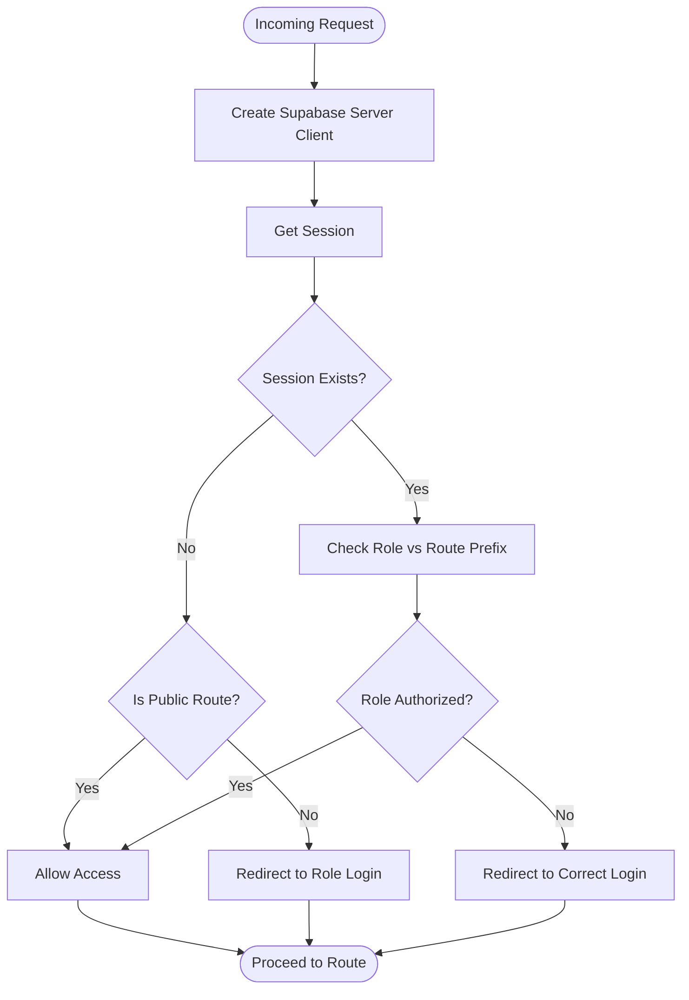
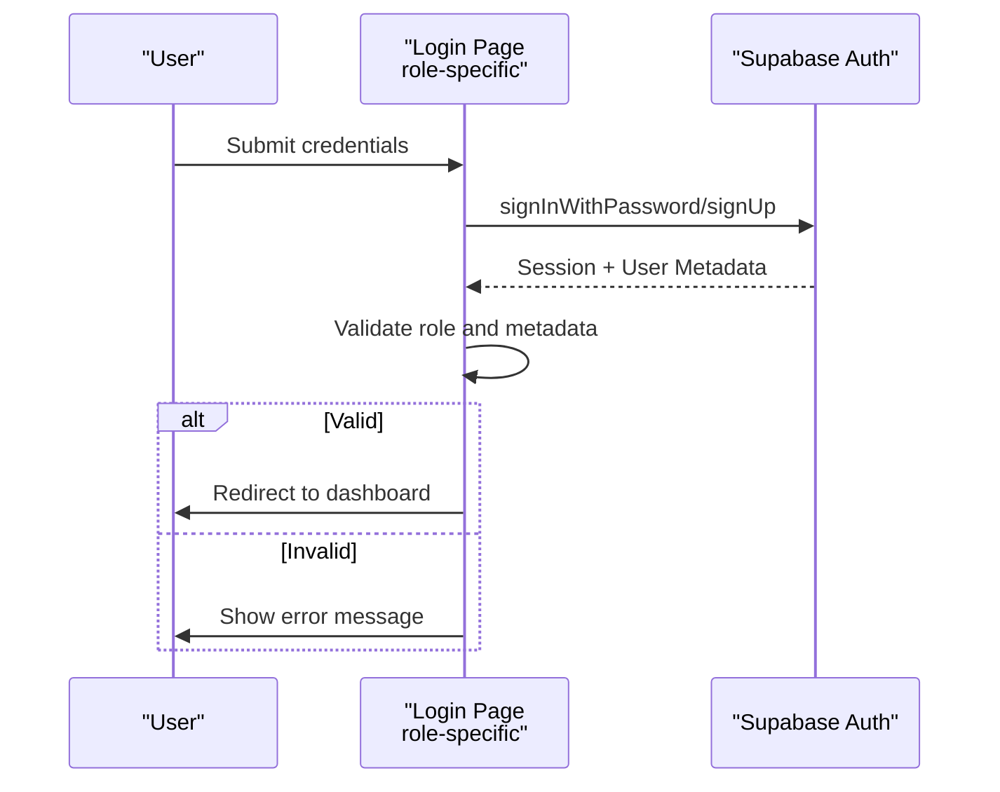
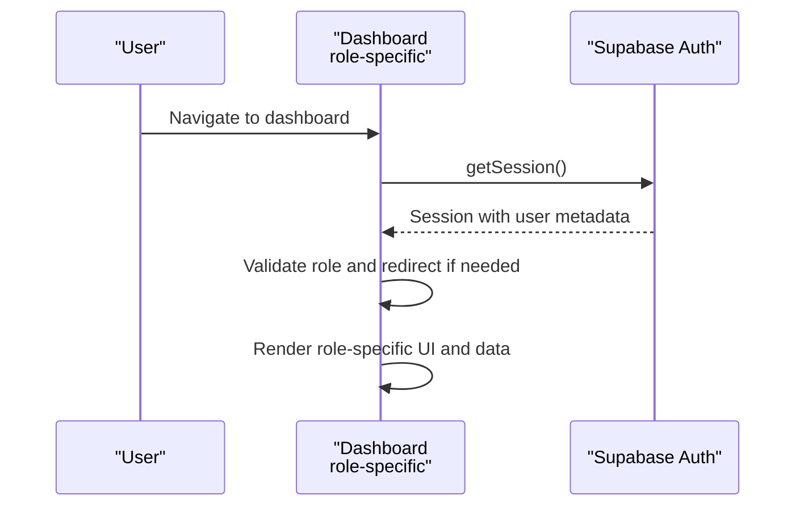
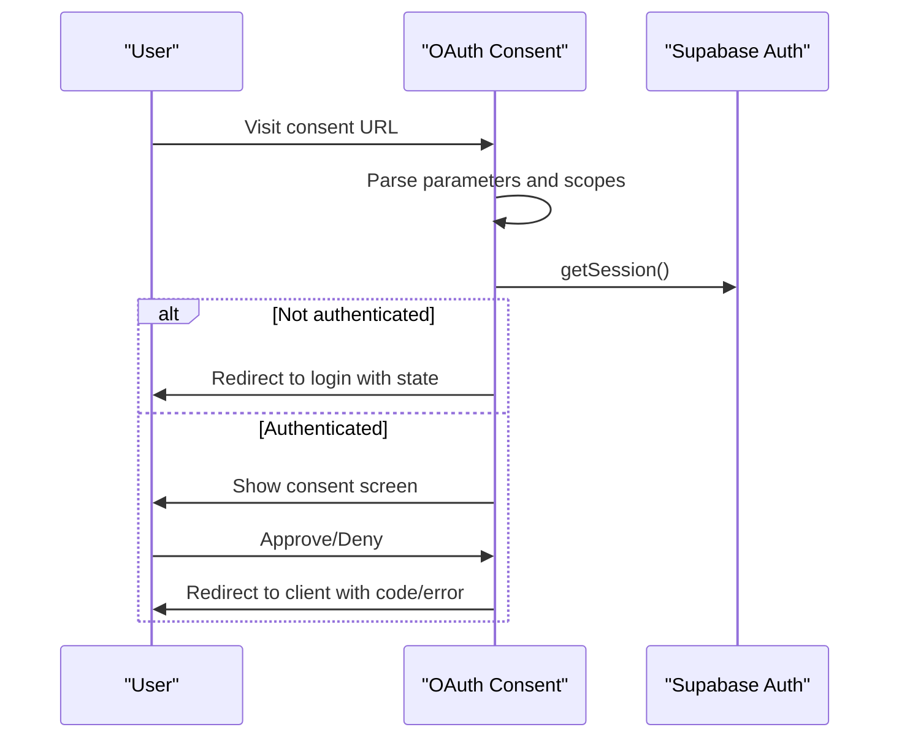
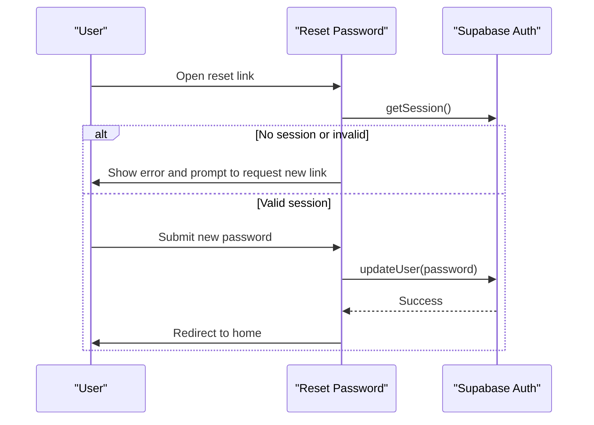
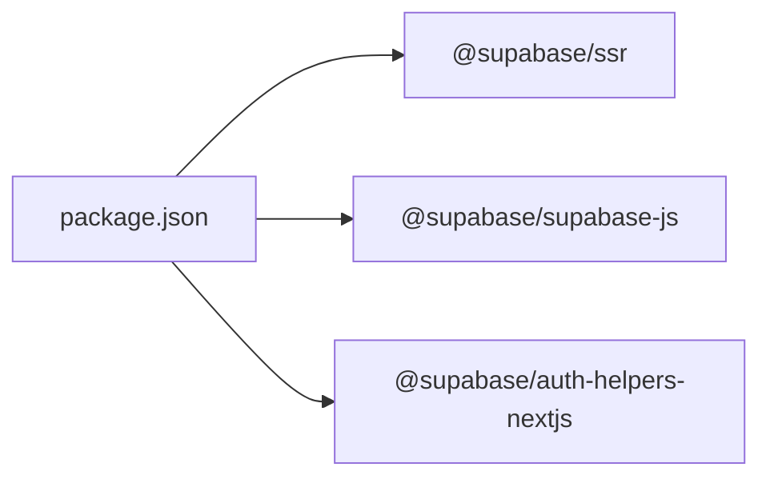

# Authentication & Authorization

<cite>
**Referenced Files in This Document**
- [middleware.ts](file://middleware.ts)
- [lib/middleware.ts](file://lib/middleware.ts)
- [lib/client.ts](file://lib/client.ts)
- [lib/server.ts](file://lib/server.ts)
- [app/login/admin/page.tsx](file://app/login/admin/page.tsx)
- [app/login/student/page.tsx](file://app/login/student/page.tsx)
- [app/login/lecturer/page.tsx](file://app/login/lecturer/page.tsx)
- [app/oauth/consent/page.tsx](file://app/oauth/consent/page.tsx)
- [app/reset-password/page.tsx](file://app/reset-password/page.tsx)
- [app/admin/dashboard/page.tsx](file://app/admin/dashboard/page.tsx)
- [app/student/dashboard/page.tsx](file://app/student/dashboard/page.tsx)
- [app/lecturer/dashboard/page.tsx](file://app/lecturer/dashboard/page.tsx)
- [update-all-roles.sql](file://update-all-roles.sql)
- [update-admin-metadata.sql](file://update-admin-metadata.sql)
- [package.json](file://package.json)
</cite>

## Table of Contents
1. [Introduction](#introduction)
2. [Project Structure](#project-structure)
3. [Core Components](#core-components)
4. [Architecture Overview](#architecture-overview)
5. [Detailed Component Analysis](#detailed-component-analysis)
6. [Dependency Analysis](#dependency-analysis)
7. [Performance Considerations](#performance-considerations)
8. [Troubleshooting Guide](#troubleshooting-guide)
9. [Conclusion](#conclusion)

## Introduction
This document explains the EAVI system's authentication and authorization implementation built on Supabase Auth. It covers role-based access control (RBAC) for admin, student, and lecturer users, the centralized middleware that protects routes, session management, token handling, OAuth consent flow, password reset functionality, and practical examples of protected route implementation and role-based UI rendering. Security best practices, session timeout handling, and troubleshooting guidance are also included.

## Project Structure
The authentication and authorization system spans several layers:
- Middleware: Centralized route protection and role enforcement
- Client SDK: Browser-side Supabase client with cookie handling
- Server SDK: Server-side Supabase client with cookie store integration
- Login pages: Role-specific login flows with credential verification
- Protected dashboards: Role-based UI rendering and route checks
- OAuth consent: External OAuth integration flow
- Password reset: Secure password reset workflow

**Diagram sources**
- [middleware.ts:1-100](file://middleware.ts#L1-L100)
- [lib/client.ts:1-42](file://lib/client.ts#L1-L42)
- [lib/server.ts:1-34](file://lib/server.ts#L1-L34)

**Section sources**
- [middleware.ts:1-100](file://middleware.ts#L1-L100)
- [lib/client.ts:1-42](file://lib/client.ts#L1-L42)
- [lib/server.ts:1-34](file://lib/server.ts#L1-L34)

## Core Components
- Centralized Middleware: Validates session existence and enforces role-based access control for all routes except public paths.
- Role-Based Login Pages: Each role has a dedicated login page that verifies credentials and user metadata (role and campus for admin).
- Protected Dashboards: Each role's dashboard performs additional client-side checks and renders role-appropriate UI.
- OAuth Consent Page: Handles external OAuth authorization requests and redirects.
- Password Reset: Provides secure password reset via Supabase with validation and redirection.
- Supabase Clients: Browser and server clients manage cookies and session synchronization.

**Section sources**
- [middleware.ts:1-100](file://middleware.ts#L1-L100)
- [app/login/admin/page.tsx:1-329](file://app/login/admin/page.tsx#L1-L329)
- [app/login/student/page.tsx:1-404](file://app/login/student/page.tsx#L1-L404)
- [app/login/lecturer/page.tsx:1-365](file://app/login/lecturer/page.tsx#L1-L365)
- [app/oauth/consent/page.tsx:1-232](file://app/oauth/consent/page.tsx#L1-L232)
- [app/reset-password/page.tsx:1-218](file://app/reset-password/page.tsx#L1-L218)
- [lib/client.ts:1-42](file://lib/client.ts#L1-L42)
- [lib/server.ts:1-34](file://lib/server.ts#L1-L34)

## Architecture Overview
The system uses Supabase Auth for identity and session management. The middleware ensures that unauthenticated users are redirected appropriately and that authenticated users have the correct role for protected routes. The browser client handles cookie synchronization for seamless session persistence, while the server client integrates with Next.js server-side rendering and edge functions.

**Diagram sources**
- [middleware.ts:1-100](file://middleware.ts#L1-L100)
- [lib/server.ts:1-34](file://lib/server.ts#L1-L34)

**Section sources**
- [middleware.ts:1-100](file://middleware.ts#L1-L100)
- [lib/server.ts:1-34](file://lib/server.ts#L1-L34)

## Detailed Component Analysis

### Centralized Middleware
The middleware enforces:
- Session validation using Supabase server client
- Automatic redirects to role-specific login pages when unauthenticated
- Role-based access control based on URL prefixes
- Cookie synchronization between browser and server

Key behaviors:
- Uses Supabase server client with cookie store integration
- Retrieves session and extracts user role from metadata
- Redirects to `/login/admin`, `/login/student`, or `/login/lecturer` based on route prefix
- Returns the Supabase response to maintain cookie consistency

**Diagram sources**
- [middleware.ts:1-100](file://middleware.ts#L1-L100)

**Section sources**
- [middleware.ts:1-100](file://middleware.ts#L1-L100)

### Supabase Clients
- Browser client (`lib/client.ts`): Creates a Supabase browser client with cookie handling for client-side operations.
- Server client (`lib/server.ts`): Creates a Supabase server client with cookie store integration for SSR and middleware.

Both clients ensure cookies are synchronized across requests to prevent session desynchronization.

**Section sources**
- [lib/client.ts:1-42](file://lib/client.ts#L1-L42)
- [lib/server.ts:1-34](file://lib/server.ts#L1-L34)

### Role-Based Login Pages
Each login page performs:
- Credential submission via Supabase Auth
- Role verification from user metadata
- Additional validations (e.g., campus for admin)
- Redirect to role-specific dashboard upon success

Admin login additionally:
- Verifies role equals "admin"
- Confirms campus matches selection
- Stores campus preference in local storage

Student and lecturer logins:
- Verify role equals "student" or "lecturer" respectively
- Redirect to respective dashboards

**Diagram sources**
- [app/login/admin/page.tsx:1-329](file://app/login/admin/page.tsx#L1-L329)
- [app/login/student/page.tsx:1-404](file://app/login/student/page.tsx#L1-L404)
- [app/login/lecturer/page.tsx:1-365](file://app/login/lecturer/page.tsx#L1-L365)

**Section sources**
- [app/login/admin/page.tsx:1-329](file://app/login/admin/page.tsx#L1-L329)
- [app/login/student/page.tsx:1-404](file://app/login/student/page.tsx#L1-L404)
- [app/login/lecturer/page.tsx:1-365](file://app/login/lecturer/page.tsx#L1-L365)

### Protected Dashboards and Role-Based UI
Each dashboard:
- Validates session on mount
- Ensures user role matches expected role
- Redirects to correct login if mismatch
- Renders role-specific UI and navigation

Admin dashboard:
- Loads stats and notifications filtered by campus
- Supports campus-aware data queries

Student dashboard:
- Displays academic records, payments, and course enrollment
- Implements financial hold checks and PDF generation controls

Lecturer dashboard:
- Manages teaching assignments and exam marking workflows
- Validates exam sitting limits per course type

**Diagram sources**
- [app/admin/dashboard/page.tsx:1-655](file://app/admin/dashboard/page.tsx#L1-L655)
- [app/student/dashboard/page.tsx:1-800](file://app/student/dashboard/page.tsx#L1-L800)
- [app/lecturer/dashboard/page.tsx:1-800](file://app/lecturer/dashboard/page.tsx#L1-L800)

**Section sources**
- [app/admin/dashboard/page.tsx:1-655](file://app/admin/dashboard/page.tsx#L1-L655)
- [app/student/dashboard/page.tsx:1-800](file://app/student/dashboard/page.tsx#L1-L800)
- [app/lecturer/dashboard/page.tsx:1-800](file://app/lecturer/dashboard/page.tsx#L1-L800)

### OAuth Consent Flow
The OAuth consent page:
- Parses OAuth parameters from URL
- Displays requested scopes and client information
- Requires an authenticated session
- Simulates authorization code issuance and redirects back to client

**Diagram sources**
- [app/oauth/consent/page.tsx:1-232](file://app/oauth/consent/page.tsx#L1-L232)

**Section sources**
- [app/oauth/consent/page.tsx:1-232](file://app/oauth/consent/page.tsx#L1-L232)

### Password Reset Workflow
The password reset flow:
- Validates session presence and handles expired links
- Enforces password constraints
- Updates user password via Supabase
- Redirects to home after success

**Diagram sources**
- [app/reset-password/page.tsx:1-218](file://app/reset-password/page.tsx#L1-L218)

**Section sources**
- [app/reset-password/page.tsx:1-218](file://app/reset-password/page.tsx#L1-L218)

### User Roles and Metadata
Roles are stored in Supabase user metadata:
- Admin: role = "admin", campus, full_name
- Lecturer: role = "lecturer", lecturer_number, full_name, phone_number
- Student: role = "student", admission_number, full_name, campus

Database scripts update existing users to ensure proper role metadata.

**Section sources**
- [update-all-roles.sql:1-49](file://update-all-roles.sql#L1-L49)
- [update-admin-metadata.sql:1-32](file://update-admin-metadata.sql#L1-L32)

## Dependency Analysis
External dependencies relevant to authentication:
- @supabase/ssr: Server and browser client creation with cookie handling
- @supabase/supabase-js: Core Supabase JavaScript SDK
- @supabase/auth-helpers-nextjs: Next.js helpers for Supabase Auth

These libraries enable seamless session management, cookie synchronization, and SSR compatibility.

**Diagram sources**
- [package.json:1-41](file://package.json#L1-L41)

**Section sources**
- [package.json:1-41](file://package.json#L1-L41)

## Performance Considerations
- Middleware executes on every request; keep logic minimal and efficient
- Use server client per-request pattern to avoid global state issues
- Leverage Supabase's built-in caching and cookie synchronization to reduce redundant auth calls
- Avoid heavy computations in middleware; delegate to server components when possible

## Troubleshooting Guide
Common issues and resolutions:
- Users redirected to wrong login page:
  - Ensure URL prefix matches expected role (admin/student/lecturer)
  - Verify user metadata role is correctly set
- Session desynchronization:
  - Confirm cookie handling in both browser and server clients
  - Ensure Supabase response cookies are applied consistently
- Role mismatch after login:
  - Check user metadata role and campus for admin
  - Verify login page role validation logic
- OAuth consent failures:
  - Validate required parameters (client_id, scope, redirect_uri, response_type)
  - Ensure user is authenticated before consent
- Password reset errors:
  - Confirm session validity and password constraints
  - Verify redirect URI correctness

**Section sources**
- [middleware.ts:1-100](file://middleware.ts#L1-L100)
- [lib/client.ts:1-42](file://lib/client.ts#L1-L42)
- [lib/server.ts:1-34](file://lib/server.ts#L1-L34)
- [app/login/admin/page.tsx:1-329](file://app/login/admin/page.tsx#L1-L329)
- [app/oauth/consent/page.tsx:1-232](file://app/oauth/consent/page.tsx#L1-L232)
- [app/reset-password/page.tsx:1-218](file://app/reset-password/page.tsx#L1-L218)

## Conclusion
The EAVI system implements robust authentication and authorization using Supabase Auth with a centralized middleware enforcing role-based access control. The browser and server Supabase clients ensure consistent session handling across the application. Role-specific login pages, protected dashboards, OAuth consent flow, and password reset functionality provide a complete authentication experience. Following the documented best practices and troubleshooting steps will help maintain a secure and reliable system.