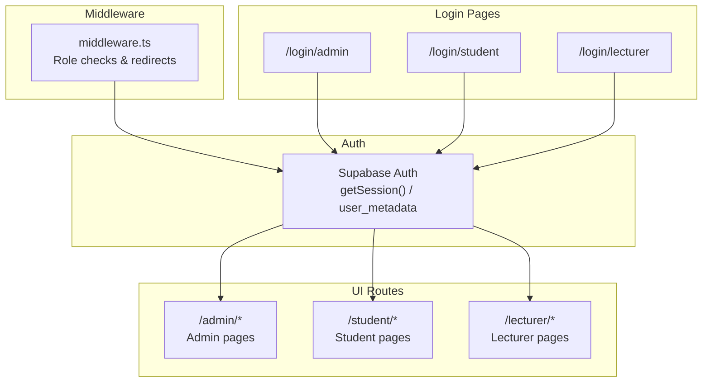
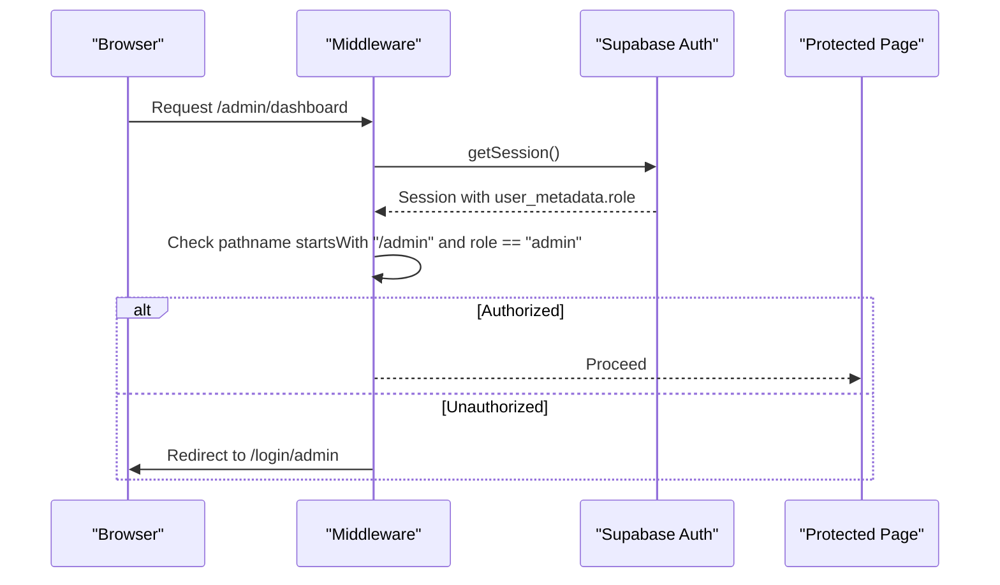
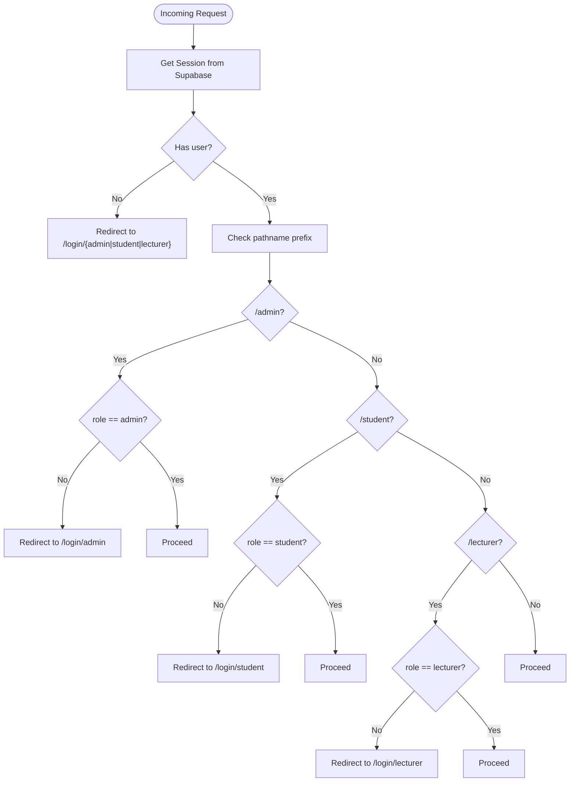
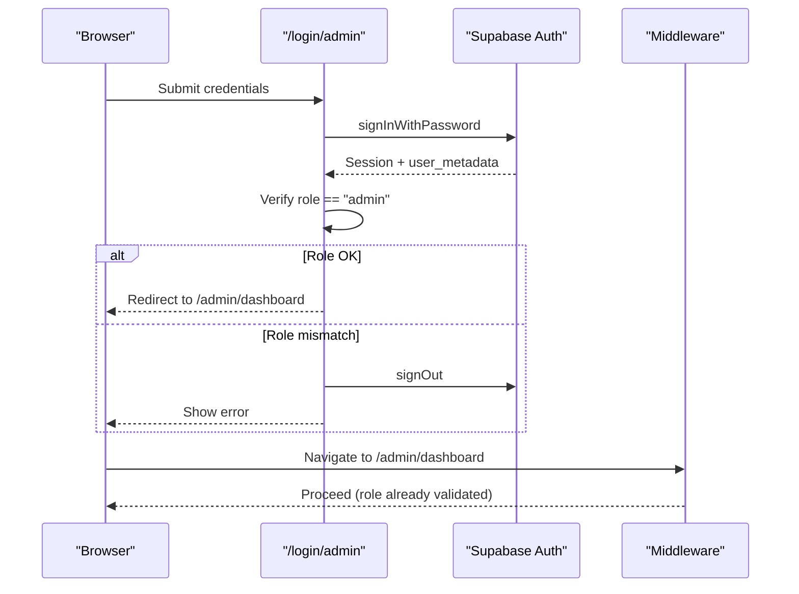
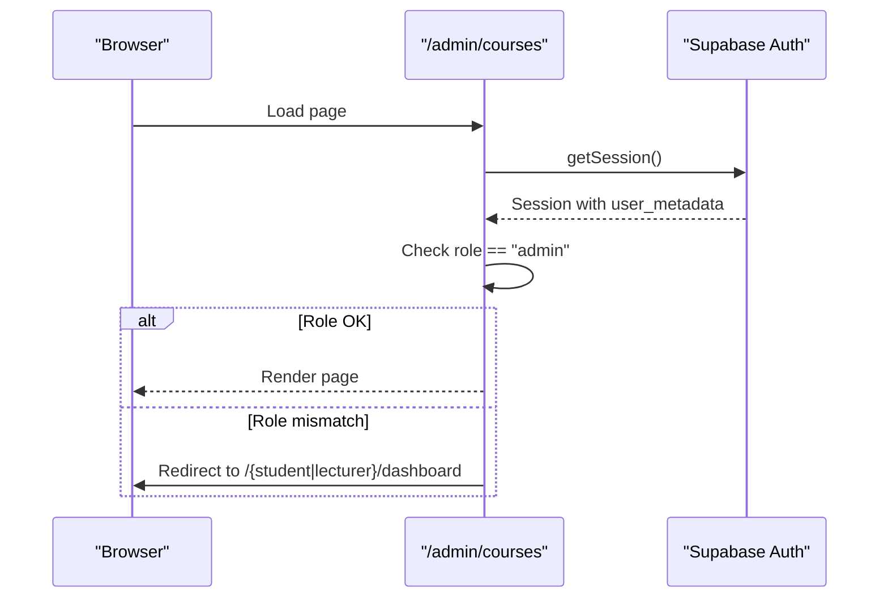
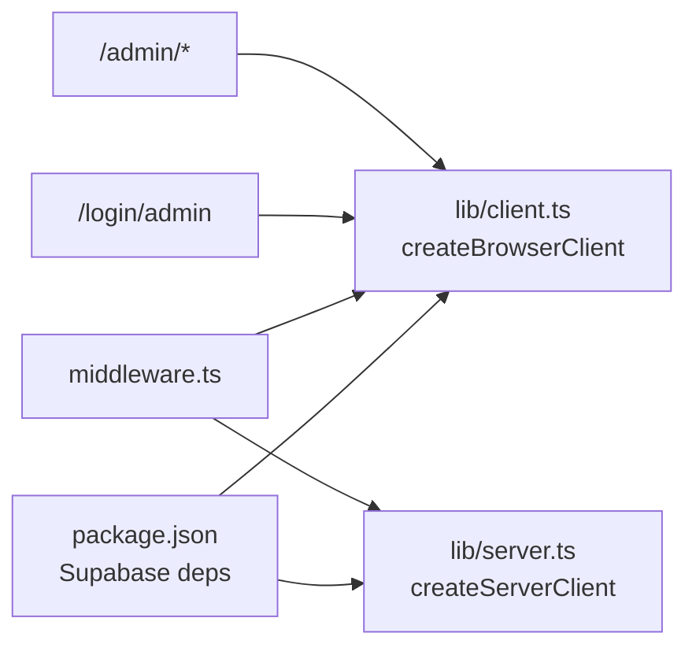

# User Roles & Permissions

<cite>
**Referenced Files in This Document**
- [middleware.ts](file://middleware.ts)
- [lib/middleware.ts](file://lib/middleware.ts)
- [lib/client.ts](file://lib/client.ts)
- [lib/server.ts](file://lib/server.ts)
- [app/login/admin/page.tsx](file://app/login/admin/page.tsx)
- [app/login/student/page.tsx](file://app/login/student/page.tsx)
- [app/login/lecturer/page.tsx](file://app/login/lecturer/page.tsx)
- [app/admin/dashboard/page.tsx](file://app/admin/dashboard/page.tsx)
- [app/admin/courses/page.tsx](file://app/admin/courses/page.tsx)
- [app/admin/reports/page.tsx](file://app/admin/reports/page.tsx)
- [app/admin/fee-structures/page.tsx](file://app/admin/fee-structures/page.tsx)
- [app/admin/course-enrollment/page.tsx](file://app/admin/course-enrollment/page.tsx)
- [app/admin/bridge-management/page.tsx](file://app/admin/bridge-management/page.tsx)
- [app/lecturer/calendar/page.tsx](file://app/lecturer/calendar/page.tsx)
- [app/student/calendar/page.tsx](file://app/student/calendar/page.tsx)
- [app/student/payments/page.tsx](file://app/student/payments/page.tsx)
- [update-all-roles.sql](file://update-all-roles.sql)
- [update-admin-metadata.sql](file://update-admin-metadata.sql)
- [create-tables.sql](file://create-tables.sql)
- [database.sql](file://database.sql)
- [package.json](file://package.json)
</cite>

## Table of Contents
1. [Introduction](#introduction)
2. [Project Structure](#project-structure)
3. [Core Components](#core-components)
4. [Architecture Overview](#architecture-overview)
5. [Detailed Component Analysis](#detailed-component-analysis)
6. [Dependency Analysis](#dependency-analysis)
7. [Performance Considerations](#performance-considerations)
8. [Troubleshooting Guide](#troubleshooting-guide)
9. [Conclusion](#conclusion)
10. [Appendices](#appendices)

## Introduction
This document explains the user role-based access control (RBAC) system in the EAVI application. It covers the three primary roles—admin, student, and lecturer—detailing their permissions, access levels, and enforcement mechanisms. It also documents how user metadata is stored and managed, the permission matrix, role-based UI rendering, database schema changes for role management, and practical examples for extending the system with new roles and permissions.

## Project Structure
The RBAC system spans middleware, authentication flows, role-aware UI pages, and database metadata updates. Key areas:
- Middleware enforces role-based routing and redirects unauthorized users.
- Login pages validate role metadata and enforce campus constraints for admins.
- Admin pages check roles and redirect non-admins to their respective dashboards.
- Role metadata is persisted in Supabase auth user metadata.
- Database schema supports student, lecturer, and administrative entities.

**Diagram sources**
- [middleware.ts:1-100](file://middleware.ts#L1-L100)
- [app/login/admin/page.tsx:1-329](file://app/login/admin/page.tsx#L1-L329)
- [app/login/student/page.tsx:1-404](file://app/login/student/page.tsx#L1-L404)
- [app/login/lecturer/page.tsx:1-365](file://app/login/lecturer/page.tsx#L1-L365)

**Section sources**
- [middleware.ts:1-100](file://middleware.ts#L1-L100)
- [lib/middleware.ts:1-75](file://lib/middleware.ts#L1-L75)

## Core Components
- Role metadata storage: Supabase auth users store a JSON field containing role and related attributes (e.g., campus, admission number, lecturer number).
- Middleware enforcement: The middleware reads the session and user metadata to enforce route-level access control.
- Login-time validation: Login pages verify role and, for admin, enforce campus selection against metadata.
- Admin UI guards: Admin pages re-check role and redirect if mismatched.
- Database schema: Supports students, lecturers, and administrative entities; role metadata is separate from these tables.

Key implementation references:
- Session retrieval and role extraction: [middleware.ts:36-38](file://middleware.ts#L36-L38)
- Route-level role checks: [middleware.ts:62-83](file://middleware.ts#L62-L83)
- Admin login role verification: [app/login/admin/page.tsx:66-73](file://app/login/admin/page.tsx#L66-L73)
- Admin campus enforcement: [app/login/admin/page.tsx:75-82](file://app/login/admin/page.tsx#L75-L82)
- Admin page role guard: [app/admin/dashboard/page.tsx:172-184](file://app/admin/dashboard/page.tsx#L172-L184)

**Section sources**
- [middleware.ts:36-83](file://middleware.ts#L36-L83)
- [app/login/admin/page.tsx:66-82](file://app/login/admin/page.tsx#L66-L82)
- [app/admin/dashboard/page.tsx:172-184](file://app/admin/dashboard/page.tsx#L172-L184)

## Architecture Overview
The RBAC architecture combines Supabase authentication with Next.js middleware and route-level guards.

**Diagram sources**
- [middleware.ts:4-83](file://middleware.ts#L4-L83)
- [app/admin/dashboard/page.tsx:172-184](file://app/admin/dashboard/page.tsx#L172-L184)

## Detailed Component Analysis

### Role Model and Metadata
- Roles: admin, student, lecturer.
- Metadata fields:
  - Admin: role, campus, full_name.
  - Student: role, admission_number, full_name, campus.
  - Lecturer: role, lecturer_number, full_name, phone_number.
- Storage: Supabase auth.users.raw_user_meta_data JSON.

Evidence:
- Admin metadata update script sets role and campus: [update-admin-metadata.sql:6-10](file://update-admin-metadata.sql#L6-L10)
- Bulk role update script sets role and related fields: [update-all-roles.sql:7-11](file://update-all-roles.sql#L7-L11), [update-all-roles.sql:17-22](file://update-all-roles.sql#L17-L22), [update-all-roles.sql:29-34](file://update-all-roles.sql#L29-L34)
- Login pages pass role metadata during sign-up/sign-in: [app/login/student/page.tsx:109-117](file://app/login/student/page.tsx#L109-L117), [app/login/lecturer/page.tsx:96-107](file://app/login/lecturer/page.tsx#L96-L107)

**Section sources**
- [update-admin-metadata.sql:6-20](file://update-admin-metadata.sql#L6-L20)
- [update-all-roles.sql:7-36](file://update-all-roles.sql#L7-L36)
- [app/login/student/page.tsx:109-117](file://app/login/student/page.tsx#L109-L117)
- [app/login/lecturer/page.tsx:96-107](file://app/login/lecturer/page.tsx#L96-L107)

### Middleware Enforcement
- Reads session and extracts user_metadata.role.
- Enforces:
  - /admin requires role=admin.
  - /student requires role=student.
  - /lecturer requires role=lecturer.
- Redirects unauthenticated or unauthorized requests to appropriate login pages.

**Diagram sources**
- [middleware.ts:41-83](file://middleware.ts#L41-L83)

**Section sources**
- [middleware.ts:36-83](file://middleware.ts#L36-L83)

### Login-Time Role Validation
- Admin login validates role and campus before allowing dashboard access.
- Student and Lecturer login flows validate credentials and redirect appropriately.

**Diagram sources**
- [app/login/admin/page.tsx:66-82](file://app/login/admin/page.tsx#L66-L82)
- [middleware.ts:62-83](file://middleware.ts#L62-L83)

**Section sources**
- [app/login/admin/page.tsx:66-82](file://app/login/admin/page.tsx#L66-L82)

### Admin UI Guards
- Admin pages re-check role and redirect non-admins to their own dashboards.
- Admin pages also enforce campus context via metadata or local storage.

**Diagram sources**
- [app/admin/courses/page.tsx:1196-1211](file://app/admin/courses/page.tsx#L1196-L1211)
- [app/admin/dashboard/page.tsx:172-184](file://app/admin/dashboard/page.tsx#L172-L184)

**Section sources**
- [app/admin/courses/page.tsx:1196-1211](file://app/admin/courses/page.tsx#L1196-L1211)
- [app/admin/dashboard/page.tsx:172-184](file://app/admin/dashboard/page.tsx#L172-L184)

### Role Assignment Mechanism
- During sign-up, metadata is embedded in the auth options to set role and related fields.
- Existing users can be bulk-assigned roles via SQL scripts that update raw_user_meta_data.

Examples:
- Student sign-up embeds role and admission_number: [app/login/student/page.tsx:109-117](file://app/login/student/page.tsx#L109-L117)
- Lecturer sign-up embeds role and lecturer_number: [app/login/lecturer/page.tsx:96-107](file://app/login/lecturer/page.tsx#L96-L107)
- Bulk role assignment: [update-all-roles.sql:6-12](file://update-all-roles.sql#L6-L12), [update-all-roles.sql:16-24](file://update-all-roles.sql#L16-L24), [update-all-roles.sql:28-36](file://update-all-roles.sql#L28-L36)

**Section sources**
- [app/login/student/page.tsx:109-117](file://app/login/student/page.tsx#L109-L117)
- [app/login/lecturer/page.tsx:96-107](file://app/login/lecturer/page.tsx#L96-L107)
- [update-all-roles.sql:6-12](file://update-all-roles.sql#L6-L12)
- [update-all-roles.sql:16-24](file://update-all-roles.sql#L16-L24)
- [update-all-roles.sql:28-36](file://update-all-roles.sql#L28-L36)

### Permission Matrix
The following matrix summarizes which routes each role can access. Access is enforced by middleware and login guards.

- Admin (role=admin)
  - /admin/dashboard
  - /admin/courses
  - /admin/reports
  - /admin/fee-structures
  - /admin/course-enrollment
  - /admin/bridge-management
  - /admin/*
  - Notes: Admin login also enforces campus selection against metadata.

- Student (role=student)
  - /student/dashboard
  - /student/calendar
  - /student/payments
  - /student/*

- Lecturer (role=lecturer)
  - /lecturer/calendar
  - /lecturer/dashboard
  - /lecturer/*

Enforcement references:
- Middleware route checks: [middleware.ts:62-83](file://middleware.ts#L62-L83)
- Admin login role check: [app/login/admin/page.tsx:66-73](file://app/login/admin/page.tsx#L66-L73)
- Admin page role guard: [app/admin/dashboard/page.tsx:172-184](file://app/admin/dashboard/page.tsx#L172-L184)

**Section sources**
- [middleware.ts:62-83](file://middleware.ts#L62-L83)
- [app/login/admin/page.tsx:66-73](file://app/login/admin/page.tsx#L66-L73)
- [app/admin/dashboard/page.tsx:172-184](file://app/admin/dashboard/page.tsx#L172-L184)

### Role-Based UI Rendering and Conditional Components
- Admin pages conditionally render content based on campus from metadata or local storage.
- Example: Admin dashboard displays campus name derived from metadata and local storage.
- Students and lecturers navigate to their respective dashboards after login.

References:
- Campus display logic: [app/admin/dashboard/page.tsx:209-218](file://app/admin/dashboard/page.tsx#L209-L218)
- Admin page guard and campus handling: [app/admin/dashboard/page.tsx:186-188](file://app/admin/dashboard/page.tsx#L186-L188)

**Section sources**
- [app/admin/dashboard/page.tsx:186-188](file://app/admin/dashboard/page.tsx#L186-L188)
- [app/admin/dashboard/page.tsx:209-218](file://app/admin/dashboard/page.tsx#L209-L218)

### Database Schema Modifications for Role Management
- Role metadata is stored in Supabase auth.users.raw_user_meta_data (JSONB).
- No schema changes are required in the application’s relational tables because roles are resolved from auth metadata.
- The schema supports:
  - Students via applications (admission_number, campus).
  - Lecturers via lecturers (lecturer_number, phone_number).
  - Departments, courses, and related entities for admin views.

Relevant schema references:
- Applications table (student enrollment): [create-tables.sql:175-205](file://create-tables.sql#L175-L205), [database.sql:25-58](file://database.sql#L25-L58)
- Lecturers table: [create-tables.sql:211-222](file://create-tables.sql#L211-L222), [database.sql:225-235](file://database.sql#L225-L235)
- Admin metadata update script: [update-admin-metadata.sql:6-20](file://update-admin-metadata.sql#L6-L20)
- Bulk role update script: [update-all-roles.sql:6-36](file://update-all-roles.sql#L6-L36)

**Section sources**
- [create-tables.sql:175-222](file://create-tables.sql#L175-L222)
- [database.sql:25-58](file://database.sql#L25-L58)
- [database.sql:225-235](file://database.sql#L225-L235)
- [update-admin-metadata.sql:6-20](file://update-admin-metadata.sql#L6-L20)
- [update-all-roles.sql:6-36](file://update-all-roles.sql#L6-L36)

### Practical Examples

#### Adding a New Role (e.g., auditor)
Steps:
1. Define the new role in Supabase auth metadata (e.g., role=auditor).
2. Add a new login route under /auditor with similar guards to /lecturer and /student.
3. Update middleware to recognize /auditor and enforce role=auditor.
4. Create an /auditor dashboard and protected pages.
5. Optionally add metadata fields (e.g., auditor_id) during sign-up.

References for implementation patterns:
- Middleware route checks: [middleware.ts:62-83](file://middleware.ts#L62-L83)
- Login page patterns: [app/login/lecturer/page.tsx:49-153](file://app/login/lecturer/page.tsx#L49-L153), [app/login/student/page.tsx:51-164](file://app/login/student/page.tsx#L51-L164)

#### Modifying Existing Permissions (e.g., allow lecturers to view reports)
Current enforcement:
- Reports page restricts to admin only: [app/admin/reports/page.tsx:41-51](file://app/admin/reports/page.tsx#L41-L51)

Change proposal:
- Modify the guard to allow both admin and lecturer.
- Update middleware to permit /admin/reports for role=lecturer if needed.

References:
- Admin report guard: [app/admin/reports/page.tsx:41-51](file://app/admin/reports/page.tsx#L41-L51)
- Middleware checks: [middleware.ts:62-83](file://middleware.ts#L62-L83)

#### Role Inheritance Patterns
- The current system does not implement role inheritance. Each route explicitly checks the role.
- To support inheritance, define a hierarchy (e.g., lecturer -> viewer) and centralize checks in middleware or a shared guard.

[No sources needed since this section proposes a pattern without implementing it]

#### Security Implications of Role Assignments
- Role checks occur in two layers: middleware and page-level guards. This reduces risk of bypass.
- Admin login additionally verifies campus alignment to prevent cross-campus access.
- Metadata tampering: Since role is part of user_metadata, ensure backend validations and least-privilege principles are applied consistently.

References:
- Admin campus enforcement: [app/login/admin/page.tsx:75-82](file://app/login/admin/page.tsx#L75-L82)
- Dual-layer enforcement: [middleware.ts:62-83](file://middleware.ts#L62-L83), [app/admin/dashboard/page.tsx:172-184](file://app/admin/dashboard/page.tsx#L172-L184)

**Section sources**
- [app/login/admin/page.tsx:75-82](file://app/login/admin/page.tsx#L75-L82)
- [middleware.ts:62-83](file://middleware.ts#L62-L83)
- [app/admin/dashboard/page.tsx:172-184](file://app/admin/dashboard/page.tsx#L172-L184)

## Dependency Analysis
- Runtime dependencies include @supabase/ssr and @supabase/auth-helpers-nextjs for secure client/server auth clients.
- Middleware depends on Supabase client to retrieve session and claims.
- Frontend pages depend on Supabase auth for session state and metadata.

**Diagram sources**
- [package.json:11-27](file://package.json#L11-L27)
- [lib/client.ts:1-42](file://lib/client.ts#L1-L42)
- [lib/server.ts:1-34](file://lib/server.ts#L1-L34)
- [middleware.ts:1-100](file://middleware.ts#L1-L100)
- [app/login/admin/page.tsx:1-329](file://app/login/admin/page.tsx#L1-L329)

**Section sources**
- [package.json:11-27](file://package.json#L11-L27)
- [lib/client.ts:1-42](file://lib/client.ts#L1-L42)
- [lib/server.ts:1-34](file://lib/server.ts#L1-L34)
- [middleware.ts:1-100](file://middleware.ts#L1-L100)

## Performance Considerations
- Middleware executes per request; keep logic lightweight (session retrieval and simple checks).
- Avoid heavy database queries in middleware; rely on session and metadata.
- Use local storage sparingly (e.g., adminCampus) and validate on the server side.

[No sources needed since this section provides general guidance]

## Troubleshooting Guide
Common issues and resolutions:
- Users redirected to wrong login page:
  - Verify pathname prefixes and middleware checks: [middleware.ts:62-83](file://middleware.ts#L62-L83)
- Admin login fails due to role mismatch:
  - Confirm role in user_metadata and campus alignment: [app/login/admin/page.tsx:66-82](file://app/login/admin/page.tsx#L66-L82)
- Non-admins landing on admin pages:
  - Ensure page-level guards are present: [app/admin/dashboard/page.tsx:172-184](file://app/admin/dashboard/page.tsx#L172-L184)
- Bulk role assignment did not take effect:
  - Run update scripts and verify metadata: [update-all-roles.sql:39-48](file://update-all-roles.sql#L39-L48), [update-admin-metadata.sql:23-31](file://update-admin-metadata.sql#L23-L31)

**Section sources**
- [middleware.ts:62-83](file://middleware.ts#L62-L83)
- [app/login/admin/page.tsx:66-82](file://app/login/admin/page.tsx#L66-L82)
- [app/admin/dashboard/page.tsx:172-184](file://app/admin/dashboard/page.tsx#L172-L184)
- [update-all-roles.sql:39-48](file://update-all-roles.sql#L39-L48)
- [update-admin-metadata.sql:23-31](file://update-admin-metadata.sql#L23-L31)

## Conclusion
The EAVI RBAC system leverages Supabase auth metadata and Next.js middleware to enforce role-based access across admin, student, and lecturer portals. Roles are assigned at sign-up or via SQL scripts, and enforced both at middleware and page levels. The permission matrix aligns with the three roles, and UI rendering respects role and campus context. Extending the system with new roles or permissions follows established patterns in middleware and login pages.

[No sources needed since this section summarizes without analyzing specific files]

## Appendices

### Appendix A: Role Metadata Fields
- Admin: role, campus, full_name
- Student: role, admission_number, full_name, campus
- Lecturer: role, lecturer_number, full_name, phone_number

References:
- [update-admin-metadata.sql:6-20](file://update-admin-metadata.sql#L6-L20)
- [update-all-roles.sql:7-11](file://update-all-roles.sql#L7-L11)
- [update-all-roles.sql:17-22](file://update-all-roles.sql#L17-L22)
- [update-all-roles.sql:29-34](file://update-all-roles.sql#L29-L34)

**Section sources**
- [update-admin-metadata.sql:6-20](file://update-admin-metadata.sql#L6-L20)
- [update-all-roles.sql:7-11](file://update-all-roles.sql#L7-L11)
- [update-all-roles.sql:17-22](file://update-all-roles.sql#L17-L22)
- [update-all-roles.sql:29-34](file://update-all-roles.sql#L29-L34)