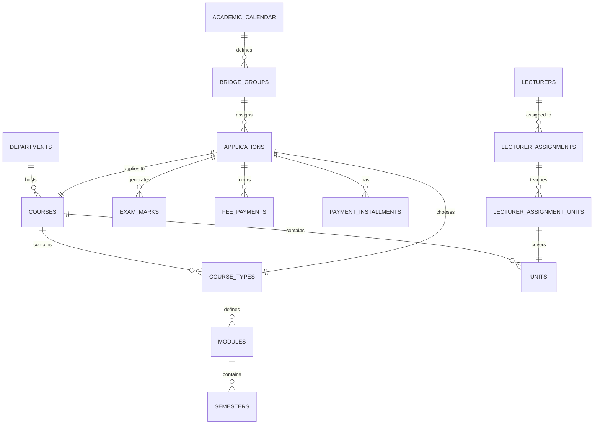
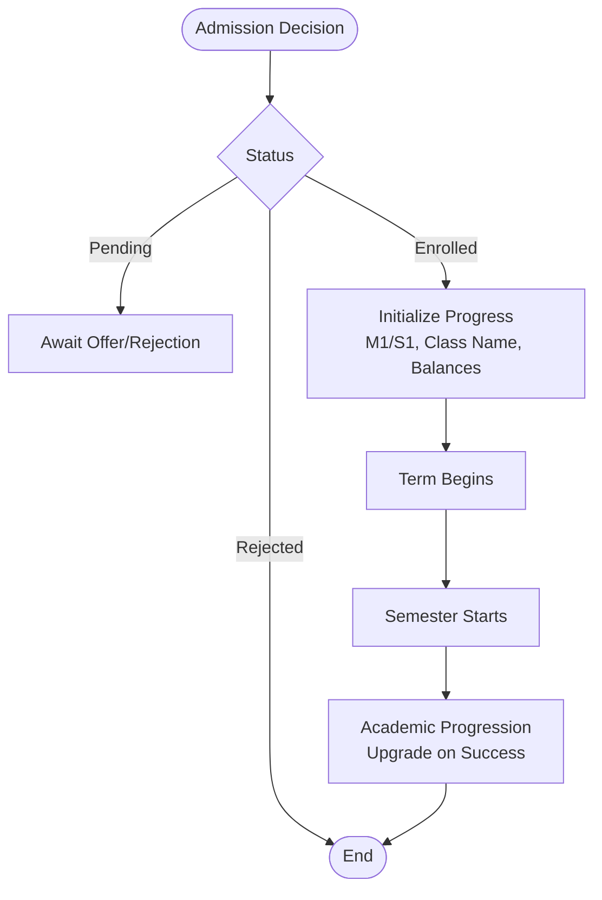
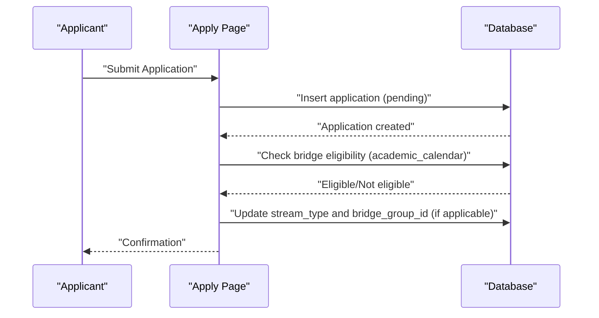
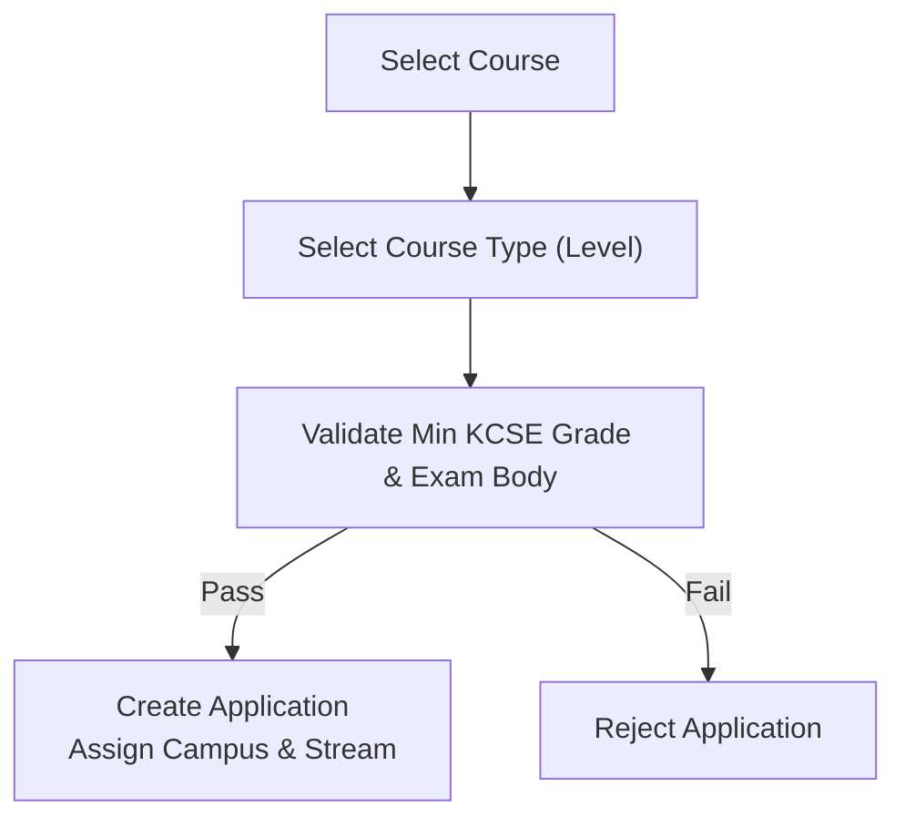
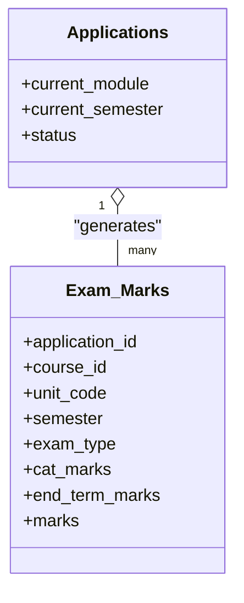
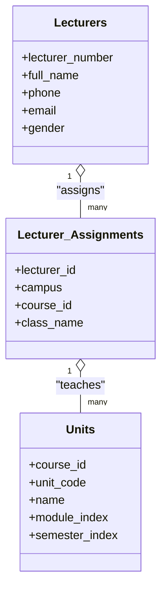
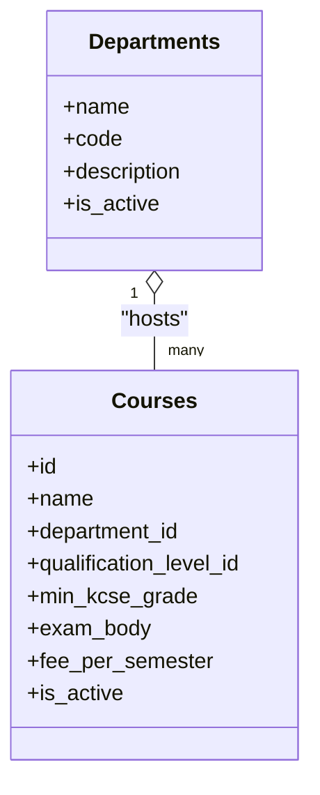
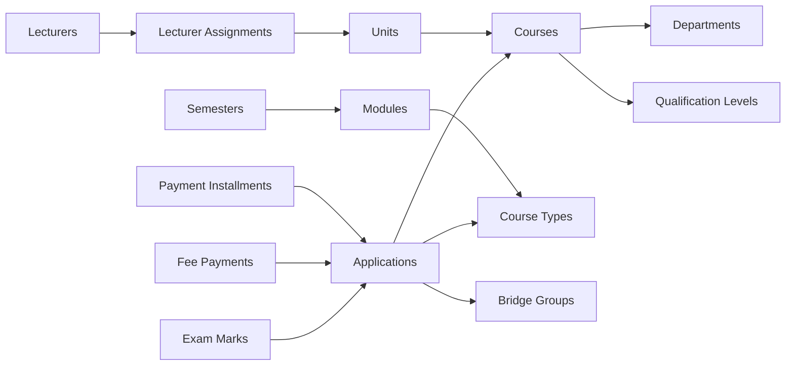

# Core Entities

<cite>
**Referenced Files in This Document**
- [database.sql](file://database.sql)
- [create-tables.sql](file://create-tables.sql)
- [fix_applications_campus_constraint.sql](file://migrations/fix_applications_campus_constraint.sql)
- [add_campus_to_lecturers.sql](file://migrations/add_campus_to_lecturers.sql)
- [add_exam_body_to_departments.sql](file://migrations/add_exam_body_to_departments.sql)
- [kne-courses.sql](file://kne-courses.sql)
- [cdacc-courses.sql](file://cdacc-courses.sql)
- [jp-courses.sql](file://jp-courses.sql)
- [short-courses.sql](file://short-courses.sql)
- [COURSE_SCHEMA_DOCUMENTATION.md](file://COURSE_SCHEMA_DOCUMENTATION.md)
- [page.tsx](file://app/apply/page.tsx)
- [page.tsx](file://app/admin/applications/page.tsx)
- [page.tsx](file://app/lecturer/calendar/page.tsx)
- [page.tsx](file://app/student/calendar/page.tsx)
</cite>

## Table of Contents
1. [Introduction](#introduction)
2. [Project Structure](#project-structure)
3. [Core Components](#core-components)
4. [Architecture Overview](#architecture-overview)
5. [Detailed Component Analysis](#detailed-component-analysis)
6. [Dependency Analysis](#dependency-analysis)
7. [Performance Considerations](#performance-considerations)
8. [Troubleshooting Guide](#troubleshooting-guide)
9. [Conclusion](#conclusion)
10. [Appendices](#appendices)

## Introduction
This document provides comprehensive data model documentation for the core entities in the EAVI College Management System. It focuses on the fundamental tables: applications, courses, students, lecturers, and departments. It explains field definitions, data types, primary keys, foreign key relationships, business rules enforced via constraints, and operational workflows such as the student application process from pending to enrolled, course enrollment mechanisms, and academic progression tracking. Entity relationship diagrams illustrate how applications connect to courses, students, and the academic calendar. Sample data examples and common query patterns are included to help administrators and developers work effectively with the system.

## Project Structure
The schema is defined primarily in SQL files that create and manage the database structure. Course-specific datasets are provided in separate SQL files per exam body and short courses. Application pages demonstrate how the frontend interacts with the database to support admissions and academic workflows.

```mermaid
graph TB
subgraph "Schema Definition"
CT["create-tables.sql"]
DB["database.sql"]
end
subgraph "Course Data"
KNEC["kne-courses.sql"]
CDACC["cdacc-courses.sql"]
JP["jp-courses.sql"]
SHORT["short-courses.sql"]
end
subgraph "Migrations"
FIX_CAMPUS_APP["fix_applications_campus_constraint.sql"]
ADD_CAMPUS_LCTS["add_campus_to_lecturers.sql"]
ADD_EXAM_BODY_DEPTS["add_exam_body_to_departments.sql"]
end
subgraph "Frontend Workflows"
APPLY["app/apply/page.tsx"]
ADM_APPS["app/admin/applications/page.tsx"]
LEC_CAL["app/lecturer/calendar/page.tsx"]
STD_CAL["app/student/calendar/page.tsx"]
end
CT --> DB
KNEC --> DB
CDACC --> DB
JP --> DB
SHORT --> DB
FIX_CAMPUS_APP --> DB
ADD_CAMPUS_LCTS --> DB
ADD_EXAM_BODY_DEPTS --> DB
APPLY --> DB
ADM_APPS --> DB
LEC_CAL --> DB
STD_CAL --> DB
```

**Diagram sources**
- [create-tables.sql:1-397](file://create-tables.sql#L1-L397)
- [database.sql:1-341](file://database.sql#L1-L341)
- [kne-courses.sql:1-137](file://kne-courses.sql#L1-L137)
- [cdacc-courses.sql:1-106](file://cdacc-courses.sql#L1-L106)
- [jp-courses.sql:1-92](file://jp-courses.sql#L1-L92)
- [short-courses.sql:1-212](file://short-courses.sql#L1-L212)
- [fix_applications_campus_constraint.sql:1-28](file://migrations/fix_applications_campus_constraint.sql#L1-L28)
- [add_campus_to_lecturers.sql:1-13](file://migrations/add_campus_to_lecturers.sql#L1-L13)
- [add_exam_body_to_departments.sql:1-22](file://migrations/add_exam_body_to_departments.sql#L1-L22)
- [page.tsx:1-200](file://app/apply/page.tsx#L1-L200)
- [page.tsx:162-753](file://app/admin/applications/page.tsx#L162-L753)
- [page.tsx:155-174](file://app/lecturer/calendar/page.tsx#L155-L174)
- [page.tsx:155-174](file://app/student/calendar/page.tsx#L155-L174)

**Section sources**
- [create-tables.sql:1-397](file://create-tables.sql#L1-L397)
- [database.sql:1-341](file://database.sql#L1-L341)

## Core Components
This section documents the core entities and their attributes, constraints, and relationships.

- Academic Calendar
  - Purpose: Defines academic terms, semesters, intake windows, and exam schedules per campus.
  - Key fields: academic_year, term, semester, term_name, term_start_date, term_end_date, intake_start_date, intake_end_date, bridge_trigger_day, cat_opening_date, cat_closing_date, end_term_exam_date, mock_exam_available, mock_exam_date, campus.
  - Constraints: term ∈ {1,2,3}; semester ∈ [1..6]; campus ∈ {'main','west'}; unique(academic_year, term, campus).
  - Primary key: id.

- Applications
  - Purpose: Tracks prospective and enrolled students, their course choices, stream type, bridge group linkage, and academic progression.
  - Key fields: full_name, phone, email, gender, kcse_grade, exam_body, intake, course_id, course_type_id, campus, admission_number, application_date, status, stream_type, bridge_group_id, bridge_start_date, sync_target_date, acceleration_factor, current_module, current_semester, class_name, financial_hold, total_balance, last_payment_date, transcript_unlocked.
  - Constraints: gender ∈ {'male','female','other'}; exam_body ∈ {'internal','JP','CDACC','KNEC'}; campus ∈ {'main','west'}; status ∈ {'pending','enrolled','rejected'}; stream_type ∈ {'main','bridge'}; acceleration_factor ≥ 1.0; current_module ≥ 1; 1 ≤ current_semester ≤ 6.
  - Primary key: id; Foreign keys: course_id → courses(id); course_type_id → course_types(id); bridge_group_id → bridge_groups(id).

- Bridge Groups
  - Purpose: Manages bridge streams with accelerated schedules and milestones.
  - Key fields: group_name, intake, academic_calendar_id, campus, start_date, sync_target_date, acceleration_factor, milestone_module, milestone_semester, holiday_bypass_enabled, catch_up_hours_needed, catch_up_hours_completed, status, merged_date.
  - Constraints: campus ∈ {'main','west'}; acceleration_factor ≥ 1.0; milestone_module ≥ 1; status ∈ {'active','merged','cancelled'}.
  - Primary key: id; Foreign key: academic_calendar_id → academic_calendar(id).

- Course Types
  - Purpose: Describes course levels (diploma, certificate, artisan, level6, level5, level4, level3) and study modes (module, short-course).
  - Key fields: course_id, level, enabled, study_mode, duration_months, exam_fee.
  - Constraints: level ∈ {'diploma','certificate','artisan','level6','level5','level4','level3'}; study_mode ∈ {'module','short-course'}.
  - Primary key: id; Foreign key: course_id → courses(id).

- Courses
  - Purpose: Holds course identifiers, names, departments, qualification levels, minimum KCSE grades, exam bodies, and fees.
  - Key fields: id, name, department_id, qualification_level_id, min_kcse_grade, exam_body, fee_per_semester, is_active.
  - Constraints: exam_body ∈ {'internal','JP','CDACC','KNEC'}; is_active default true.
  - Primary key: id; Foreign keys: department_id → departments(id); qualification_level_id → qualification_levels(id).

- Departments
  - Purpose: Organizes academic units.
  - Key fields: id, name, code, description, is_active.
  - Constraints: name unique; code unique; is_active default true.
  - Primary key: id.

- Lecturers
  - Purpose: Stores staff profiles and assignments.
  - Key fields: id, lecturer_number, full_name, phone, email, gender, created_at, updated_at.
  - Constraints: gender ∈ {'male','female','other'}; lecturer_number unique; email unique.
  - Primary key: id.

- Modules and Semesters
  - Purpose: Define modular and semester-based structures for course delivery.
  - Key fields: modules.module_index, semesters.semester_index, duration_months, fee, practical_fee, internal_exams.
  - Constraints: module_index ≥ 1; 1 ≤ semester_index ≤ 6.
  - Primary keys: modules.id, semesters.id; Foreign keys: modules.course_type_id → course_types(id); semesters.module_id → modules(id).

- Units
  - Purpose: Represents course units with module and semester mapping.
  - Key fields: course_id, unit_code, name, module_index, semester_index, unit_type.
  - Constraints: unit_type ∈ {'Core','Common','Basic','Elective'}.
  - Primary key: (course_id, unit_code); Foreign key: course_id → courses(id).

- Exam Marks
  - Purpose: Records student performance per unit and exam type.
  - Key fields: application_id, campus, course_id, unit_code, semester, exam_type, cat_marks, end_term_marks, marks.
  - Constraints: campus ∈ {'main','west'}; semester ≥ 1; exam_type ∈ {'cat','end_term','mock','combined'}; cat_marks ∈ [0..30]; end_term_marks ∈ [0..70]; marks ∈ [0..100].
  - Primary key: id; Foreign keys: application_id → applications(id); (course_id, unit_code) → units(course_id, unit_code).

- Fee Payments and Installments
  - Purpose: Track tuition, practical, exam, and other payments with statuses and receipts.
  - Key fields: payment_type ∈ {'tuition','practical','exam','registration','library','lab','other'}, payment_method ∈ {'cash','bank_transfer','card','mpesa'}, status ∈ {'pending','completed','failed','refunded'}.
  - Primary key: id; Foreign key: application_id → applications(id).

- Short Courses
  - Purpose: Manage short-term courses with simplified structures.
  - Key fields: course_id, department_id, qualification_level_id, name, short_code, duration_months, payment_mode ∈ {'Once','Monthly','Per Semester'}, first_installment, subsequent_installment, has_exams, practical_fee, is_active.
  - Primary key: id; Foreign keys: course_id → courses(id); department_id → departments(id); qualification_level_id → qualification_levels(id).

**Section sources**
- [database.sql:4-341](file://database.sql#L4-L341)
- [create-tables.sql:132-342](file://create-tables.sql#L132-L342)

## Architecture Overview
The system’s data model centers around academic calendars and course structures, with applications bridging students to courses and academic progression. The following diagram maps core entities and their relationships.

**Diagram sources**
- [database.sql:4-341](file://database.sql#L4-L341)
- [create-tables.sql:132-342](file://create-tables.sql#L132-L342)

## Detailed Component Analysis

### Academic Calendar and Progression Tracking
- Academic calendar defines term and semester windows, intake periods, and exam dates. It ensures consistent scheduling across campuses and supports bridge stream triggers.
- Progression tracking is embedded in applications via current_module and current_semester, enabling upgrades and milestone checks.

**Section sources**
- [database.sql:4-24](file://database.sql#L4-L24)
- [database.sql:25-58](file://database.sql#L25-L58)
- [page.tsx:346-376](file://app/admin/applications/page.tsx#L346-L376)

### Applications and Student Lifecycle
- The application table captures personal info, academic credentials, course preferences, and campus assignment. It enforces gender, exam body, campus, status, and progression constraints.
- The frontend determines bridge eligibility based on academic calendar and intake date, setting stream_type and linking bridge groups accordingly.

**Diagram sources**
- [page.tsx:135-170](file://app/apply/page.tsx#L135-L170)
- [page.tsx:325-340](file://app/apply/page.tsx#L325-L340)
- [database.sql:25-58](file://database.sql#L25-L58)

**Section sources**
- [database.sql:25-58](file://database.sql#L25-L58)
- [page.tsx:135-170](file://app/apply/page.tsx#L135-L170)
- [page.tsx:325-340](file://app/apply/page.tsx#L325-L340)

### Course Enrollment Mechanisms
- Students select a course and a course type (level). The system validates minimum KCSE grades and exam body compatibility.
- Course data is organized by exam body and includes modular/semester structures, enabling accurate fee and schedule mapping.

**Section sources**
- [page.tsx:189-200](file://app/apply/page.tsx#L189-L200)
- [page.tsx:308-340](file://app/apply/page.tsx#L308-L340)
- [kne-courses.sql:39-51](file://kne-courses.sql#L39-L51)
- [cdacc-courses.sql:39-81](file://cdacc-courses.sql#L39-L81)
- [jp-courses.sql:40-67](file://jp-courses.sql#L40-L67)

### Academic Progression and Exams
- Progression is tracked via current_module and current_semester in applications.
- Exam marks are recorded per unit and exam type, constrained by allowed ranges and supported exam types.

**Diagram sources**
- [database.sql:25-58](file://database.sql#L25-L58)
- [database.sql:131-150](file://database.sql#L131-L150)

**Section sources**
- [database.sql:131-150](file://database.sql#L131-L150)
- [page.tsx:684-692](file://app/admin/applications/page.tsx#L684-L692)

### Lecturer Assignments and Units
- Lecturers are assigned to courses and classes, with optional multiple campuses. Units are mapped to specific courses and semesters.

**Diagram sources**
- [database.sql:225-241](file://database.sql#L225-L241)

**Section sources**
- [database.sql:225-241](file://database.sql#L225-L241)
- [add_campus_to_lecturers.sql:1-13](file://migrations/add_campus_to_lecturers.sql#L1-L13)

### Departments and Course Organization
- Departments organize courses and can be filtered by exam body. Unique constraints ensure consistent identification.

**Diagram sources**
- [database.sql:121-130](file://database.sql#L121-L130)
- [database.sql:106-120](file://database.sql#L106-L120)
- [add_exam_body_to_departments.sql:1-22](file://migrations/add_exam_body_to_departments.sql#L1-L22)

**Section sources**
- [database.sql:121-130](file://database.sql#L121-L130)
- [database.sql:106-120](file://database.sql#L106-L120)
- [add_exam_body_to_departments.sql:1-22](file://migrations/add_exam_body_to_departments.sql#L1-L22)

## Dependency Analysis
This section highlights key dependencies and constraints ensuring referential integrity and data consistency.

**Diagram sources**
- [database.sql:4-341](file://database.sql#L4-L341)

**Section sources**
- [database.sql:4-341](file://database.sql#L4-L341)

## Performance Considerations
- Indexes on frequently filtered columns (e.g., department_id, course name) improve query performance for course listings and department-based reporting.
- Views such as v_semester_map consolidate course structure for efficient reporting and scheduling.
- Unique constraints on identifiers (e.g., admission_number, lecturer_number, email) prevent duplicates and simplify joins.

[No sources needed since this section provides general guidance]

## Troubleshooting Guide
- Campus constraint mismatch: The applications campus column was migrated to accept full campus names. Ensure data normalization and constraint alignment.
  - Action: Run the campus constraint fix migration and verify updates.
  - Reference: [fix_applications_campus_constraint.sql:1-28](file://migrations/fix_applications_campus_constraint.sql#L1-L28)

- Multiple campuses for lecturers: The lecturers table now supports an array of campuses. Normalize existing text values to arrays.
  - Action: Execute the campus migration for lecturers.
  - Reference: [add_campus_to_lecturers.sql:1-13](file://migrations/add_campus_to_lecturers.sql#L1-L13)

- Department filtering by exam body: Newly added exam_body column enables filtering. Create indexes and verify defaults.
  - Action: Apply migration and confirm column metadata.
  - Reference: [add_exam_body_to_departments.sql:1-22](file://migrations/add_exam_body_to_departments.sql#L1-L22)

- Enrollment status transitions: Admin actions update application status to enrolled or rejected. Validate balances and class names during enrollment.
  - Reference: [page.tsx:346-376](file://app/admin/applications/page.tsx#L346-L376)

**Section sources**
- [fix_applications_campus_constraint.sql:1-28](file://migrations/fix_applications_campus_constraint.sql#L1-L28)
- [add_campus_to_lecturers.sql:1-13](file://migrations/add_campus_to_lecturers.sql#L1-L13)
- [add_exam_body_to_departments.sql:1-22](file://migrations/add_exam_body_to_departments.sql#L1-L22)
- [page.tsx:346-376](file://app/admin/applications/page.tsx#L346-L376)

## Conclusion
The EAVI College Management System’s data model integrates academic calendars, course structures, and student lifecycle tracking through robust constraints and relationships. Applications serve as the central hub connecting students to courses, streams, and progression metrics. Migrations ensure schema evolution while maintaining referential integrity. The documented constraints, workflows, and diagrams provide a foundation for reliable operations and future enhancements.

[No sources needed since this section summarizes without analyzing specific files]

## Appendices

### Sample Data Examples
- Academic Calendar
  - Fields: academic_year, term, semester, term_name, term_start_date, term_end_date, intake_start_date, intake_end_date, bridge_trigger_day, cat_opening_date, cat_closing_date, end_term_exam_date, mock_exam_available, mock_exam_date, campus.
  - Example: A term spanning a specific date range with a defined campus and intake window.

- Applications
  - Fields: full_name, phone, email, gender, kcse_grade, exam_body, intake, course_id, course_type_id, campus, admission_number, application_date, status, stream_type, bridge_group_id, bridge_start_date, sync_target_date, acceleration_factor, current_module, current_semester, class_name, financial_hold, total_balance, last_payment_date, transcript_unlocked.
  - Example: A pending application with a chosen course and campus, later updated to enrolled with class_name and balances.

- Courses
  - Fields: id, name, department_id, qualification_level_id, min_kcse_grade, exam_body, fee_per_semester, is_active.
  - Example: A course with associated qualification level and department.

- Departments
  - Fields: id, name, code, description, is_active.
  - Example: A department with unique code and name.

- Lecturers
  - Fields: id, lecturer_number, full_name, phone, email, gender.
  - Example: A lecturer profile with unique identifiers.

- Units
  - Fields: course_id, unit_code, name, module_index, semester_index, unit_type.
  - Example: A unit mapped to a course and semester.

- Exam Marks
  - Fields: application_id, campus, course_id, unit_code, semester, exam_type, cat_marks, end_term_marks, marks.
  - Example: A record of CAT and end-term scores for a unit.

- Fee Payments and Installments
  - Fields: application_id, payment_type, amount, payment_method, transaction_id, payment_date, semester, module, status, receipt_number, notes.
  - Example: A completed tuition payment with receipt number.

**Section sources**
- [database.sql:4-341](file://database.sql#L4-L341)

### Common Query Patterns
- Retrieve student records by campus and status
  - Pattern: Filter applications by campus and status to list enrolled students per location.
  - Reference: [page.tsx:162-185](file://app/admin/applications/page.tsx#L162-L185)

- Course enrollments by department
  - Pattern: Join courses with departments to list offerings by department.
  - Reference: [kne-courses.sql:119-137](file://kne-courses.sql#L119-L137)

- Academic progress tracking
  - Pattern: Query applications for current_module and current_semester to monitor progression.
  - Reference: [page.tsx:651-661](file://app/admin/applications/page.tsx#L651-L661)

- Exam results per unit
  - Pattern: Join exam_marks with units to retrieve unit-wise results.
  - Reference: [database.sql:131-150](file://database.sql#L131-L150)

**Section sources**
- [page.tsx:162-185](file://app/admin/applications/page.tsx#L162-L185)
- [kne-courses.sql:119-137](file://kne-courses.sql#L119-L137)
- [page.tsx:651-661](file://app/admin/applications/page.tsx#L651-L661)
- [database.sql:131-150](file://database.sql#L131-L150)