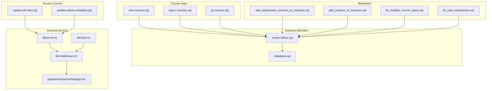
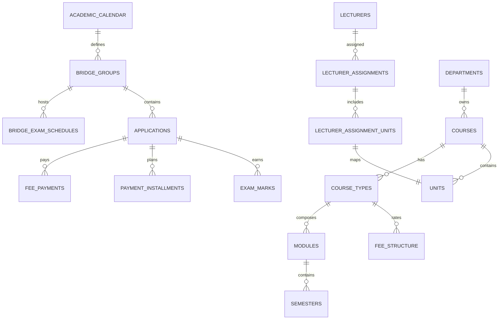
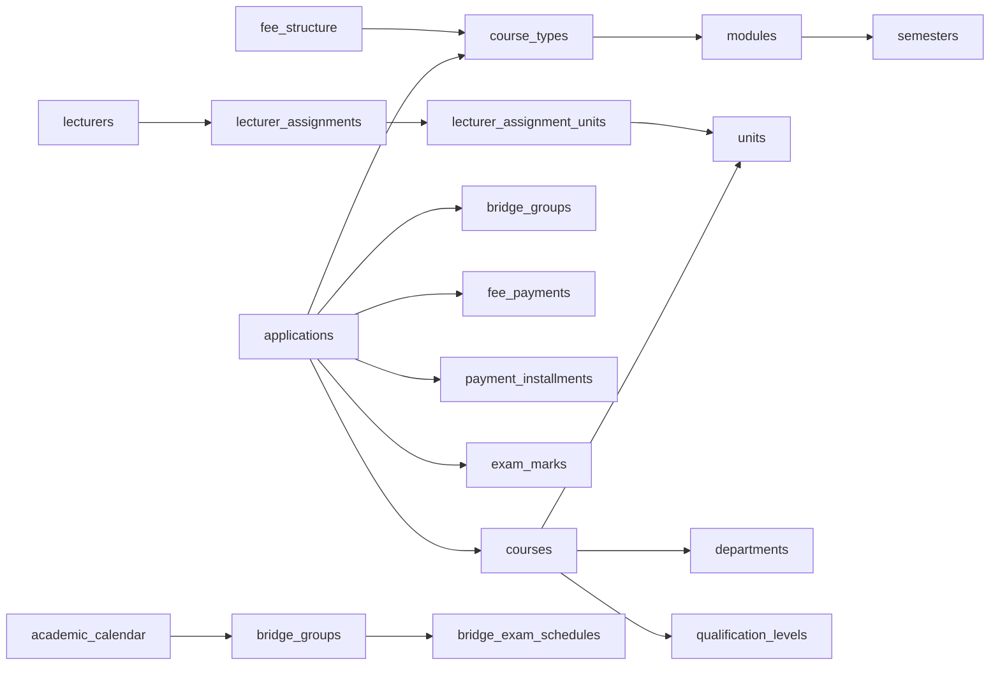
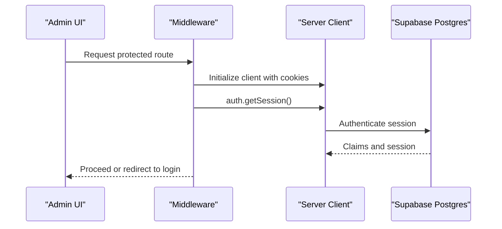
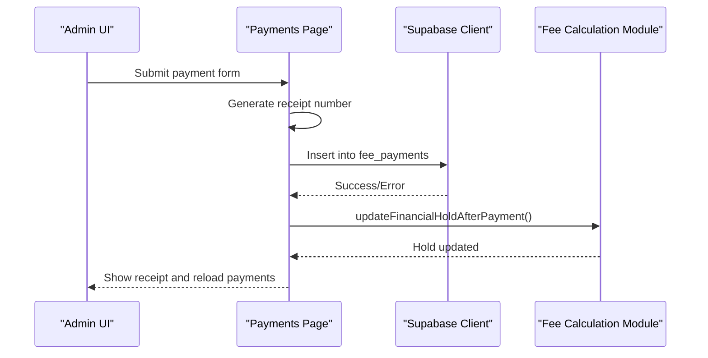

# Database Schema

<cite>
**Referenced Files in This Document**
- [create-tables.sql](file://create-tables.sql)
- [database.sql](file://database.sql)
- [update-all-roles.sql](file://update-all-roles.sql)
- [update-admin-metadata.sql](file://update-admin-metadata.sql)
- [migrations\add_attachment_columns_to_modules.sql](file://migrations/add_attachment_columns_to_modules.sql)
- [migrations\add_campus_to_lecturers.sql](file://migrations/add_campus_to_lecturers.sql)
- [migrations\fix_multiple_course_types.sql](file://migrations/fix_multiple_course_types.sql)
- [migrations\fix_uuid_mismatches.sql](file://migrations/fix_uuid_mismatches.sql)
- [kne-courses.sql](file://kne-courses.sql)
- [cdacc-courses.sql](file://cdacc-courses.sql)
- [jp-courses.sql](file://jp-courses.sql)
- [lib\server.ts](file://lib/server.ts)
- [lib\client.ts](file://lib/client.ts)
- [lib\middleware.ts](file://lib/middleware.ts)
- [app\admin\payments\page.tsx](file://app/admin/payments/page.tsx)
</cite>

## Table of Contents
1. [Introduction](#introduction)
2. [Project Structure](#project-structure)
3. [Core Components](#core-components)
4. [Architecture Overview](#architecture-overview)
5. [Detailed Component Analysis](#detailed-component-analysis)
6. [Dependency Analysis](#dependency-analysis)
7. [Performance Considerations](#performance-considerations)
8. [Troubleshooting Guide](#troubleshooting-guide)
9. [Conclusion](#conclusion)
10. [Appendices](#appendices)

## Introduction
This document describes the EAVI College Management System database schema and related data access patterns. It focuses on the core entities and relationships among applications, courses, students, lecturers, fees, and academic records. It also documents the academic calendar structure, fee calculation tables, enrollment management schema, database constraints, validation rules, and operational aspects such as indexing, migrations, and access control via Supabase.

## Project Structure
The schema is defined primarily in two SQL scripts:
- A clean schema creation script that defines tables, constraints, triggers, and views.
- A legacy schema snapshot script that documents constraints and relationships for reference.

Additional supporting assets include:
- Migration scripts to evolve the schema over time.
- Course data seed files for different exam bodies.
- Supabase client initialization and middleware for secure data access.

**Diagram sources**
- [create-tables.sql:1-397](file://create-tables.sql#L1-L397)
- [database.sql:1-341](file://database.sql#L1-L341)
- [kne-courses.sql:1-137](file://kne-courses.sql#L1-L137)
- [cdacc-courses.sql:1-106](file://cdacc-courses.sql#L1-L106)
- [jp-courses.sql:1-92](file://jp-courses.sql#L1-L92)
- [migrations\add_attachment_columns_to_modules.sql:1-42](file://migrations/add_attachment_columns_to_modules.sql#L1-L42)
- [migrations\add_campus_to_lecturers.sql:1-13](file://migrations/add_campus_to_lecturers.sql#L1-L13)
- [migrations\fix_multiple_course_types.sql:1-45](file://migrations/fix_multiple_course_types.sql#L1-L45)
- [migrations\fix_uuid_mismatches.sql:1-285](file://migrations/fix_uuid_mismatches.sql#L1-L285)
- [update-all-roles.sql:1-49](file://update-all-roles.sql#L1-L49)
- [update-admin-metadata.sql:1-32](file://update-admin-metadata.sql#L1-L32)
- [lib\server.ts:1-33](file://lib/server.ts#L1-L33)
- [lib\client.ts:1-41](file://lib/client.ts#L1-L41)
- [lib\middleware.ts:1-75](file://lib/middleware.ts#L1-L75)
- [app\admin\payments\page.tsx:247-275](file://app/admin/payments/page.tsx#L247-L275)

**Section sources**
- [create-tables.sql:1-397](file://create-tables.sql#L1-L397)
- [database.sql:1-341](file://database.sql#L1-L341)

## Core Components
This section outlines the principal entities and their responsibilities within the college management domain.

- Academic Calendar: Defines academic years, terms, semesters, intake windows, and exam dates.
- Applications: Manages student admissions, streams (main/bridge), progress tracking, and financial status.
- Bridge Groups and Exam Schedules: Supports bridging cohorts, milestones, and scheduling.
- Courses and Course Types: Course catalog and modular/short-course configurations.
- Modules and Semesters: Academic progression structure with fees and durations.
- Units: Course learning outcomes mapped to modules and semesters.
- Lecturers and Assignments: Staff allocation and unit assignments.
- Exam Marks: Student assessment records.
- Fee Structure and Payments: Tuition, practical, exam, and registration fee definitions and payment records.
- Payment Installments: Installment plans with statuses and due dates.
- Reporting Dates: Monthly reporting deadlines.
- Holiday Periods: Academic breaks impacting instruction and bridge programs.

**Section sources**
- [create-tables.sql:132-352](file://create-tables.sql#L132-L352)
- [database.sql:4-341](file://database.sql#L4-L341)

## Architecture Overview
The database architecture centers on normalized relational tables with explicit foreign keys and constraints. Triggers maintain audit timestamps. Views consolidate derived data for reporting. Supabase integrates authentication and row-level security policies at the application layer.

**Diagram sources**
- [create-tables.sql:132-352](file://create-tables.sql#L132-L352)
- [database.sql:4-341](file://database.sql#L4-L341)

## Detailed Component Analysis

### Academic Calendar
- Purpose: Define academic year, term, semester, intake windows, and key dates (CAT, end-term, mock exams).
- Constraints:
  - Term restricted to predefined values.
  - Semester constrained to 1–6.
  - Campus restricted to main/west.
  - Unique academic year+term+campus.
- Business rules:
  - CAT opening/closing dates bound term dates.
  - Mock exam availability toggled per calendar.
  - Bridge trigger day influences bridge program timing.

**Section sources**
- [create-tables.sql:132-152](file://create-tables.sql#L132-L152)
- [database.sql:4-24](file://database.sql#L4-L24)

### Applications
- Purpose: Track student applications, admission status, streams, progress, and financial health.
- Keys and relationships:
  - course_id references courses.
  - course_type_id references course_types.
  - bridge_group_id references bridge_groups.
- Validation:
  - Gender, exam_body, campus, status, stream_type, acceleration_factor, current_module, current_semester.
  - Admission number uniqueness.
- Financial fields:
  - total_balance, last_payment_date, financial_hold, transcript_unlocked.

**Section sources**
- [create-tables.sql:175-210](file://create-tables.sql#L175-L210)
- [database.sql:25-58](file://database.sql#L25-L58)

### Bridge Groups and Exam Schedules
- Bridge Groups:
  - Grouping of students for bridging.
  - Acceleration factor, milestone tracking, holiday bypass, catch-up hours.
  - Status lifecycle: active, merged, cancelled.
- Bridge Exam Schedules:
  - Scheduled exams per group (CAT, end-term, mock, milestone).
  - Units affected and status tracking.

**Section sources**
- [create-tables.sql:154-173](file://create-tables.sql#L154-L173)
- [create-tables.sql:276-288](file://create-tables.sql#L276-L288)
- [database.sql:73-93](file://database.sql#L73-L93)
- [database.sql:59-72](file://database.sql#L59-L72)

### Courses and Course Types
- Courses:
  - Catalog with department and qualification level linkage.
  - Min KCSE grade and exam body defaults.
- Course Types:
  - Per-level configurations (diploma, certificate, artisan, level6–level3).
  - Study mode (module/short-course), duration, enabled flag.
  - Unique constraint on (course_id, level).

**Section sources**
- [create-tables.sql:54-81](file://create-tables.sql#L54-L81)
- [create-tables.sql:70-91](file://create-tables.sql#L70-L91)
- [database.sql:106-120](file://database.sql#L106-L120)
- [database.sql:94-105](file://database.sql#L94-L105)

### Modules, Semesters, and Units
- Modules:
  - Indexed by course_type_id.
  - Optional attachment stage flags and durations.
- Semesters:
  - Linked to modules, indexed by semester_index.
  - Fees and practical fees per semester.
- Units:
  - Composite primary key (course_id, unit_code).
  - Links to courses and maps to modules/semesters.

**Section sources**
- [create-tables.sql:83-104](file://create-tables.sql#L83-L104)
- [create-tables.sql:106-116](file://create-tables.sql#L106-L116)
- [database.sql:236-252](file://database.sql#L236-L252)
- [database.sql:291-302](file://database.sql#L291-L302)
- [database.sql:330-341](file://database.sql#L330-L341)

### Lecturers and Assignments
- Lecturers:
  - Unique identifiers and contact details.
  - Optional campus array support.
- Assignments:
  - Link lecturers to courses and optional class names.
  - Assignment-units junction table maps to units.

**Section sources**
- [create-tables.sql:211-243](file://create-tables.sql#L211-L243)
- [migrations\add_campus_to_lecturers.sql:1-13](file://migrations/add_campus_to_lecturers.sql#L1-L13)
- [database.sql:225-235](file://database.sql#L225-L235)
- [database.sql:201-224](file://database.sql#L201-L224)

### Exam Marks
- Records student marks per unit, semester, and exam type.
- Enforces bounds for CAT, end-term, and overall marks.
- Unique per application+unit+semester+exam_type.

**Section sources**
- [create-tables.sql:245-261](file://create-tables.sql#L245-L261)
- [database.sql:131-150](file://database.sql#L131-L150)

### Fee Structure and Payments
- Fee Structure:
  - Rates per course_type, exam_body, semester/module, campus, academic_year.
  - Includes tuition, practical, exam, registration, library, and lab fees.
- Fee Payments:
  - Payment records with type, method, transaction_id, date, semester/module, status, receipt_number.
- Payment Installments:
  - Installment plans with due dates, amounts, statuses, late fees, and waivers.

**Section sources**
- [create-tables.sql:290-342](file://create-tables.sql#L290-L342)
- [database.sql:169-187](file://database.sql#L169-L187)
- [database.sql:151-168](file://database.sql#L151-L168)
- [database.sql:253-267](file://database.sql#L253-L267)

### Reporting Dates and Holiday Periods
- Reporting Dates:
  - Monthly reporting deadlines keyed by month/year.
- Holiday Periods:
  - Academic breaks linked to calendar and campus.
  - Optional instructional status for bridge groups.

**Section sources**
- [create-tables.sql:344-352](file://create-tables.sql#L344-L352)
- [create-tables.sql:263-274](file://create-tables.sql#L263-L274)
- [database.sql:188-200](file://database.sql#L188-L200)

### Course Data and Prospects (Exam Body-specific)
- KNEC, CDACC, and JP course data are seeded via dedicated scripts.
- These scripts define departments, qualification levels, and unit mappings, and expose prospectus-style views.

**Section sources**
- [kne-courses.sql:1-137](file://kne-courses.sql#L1-L137)
- [cdacc-courses.sql:1-106](file://cdacc-courses.sql#L1-L106)
- [jp-courses.sql:1-92](file://jp-courses.sql#L1-L92)

### Data Validation Rules and Business Constraints
- Enumerated domains enforced via CHECK constraints for gender, campus, status, stream_type, exam_type, payment_type, payment_method, and unit_type.
- Numeric ranges for module/semester indices and fee fields standardized to numeric(10,2).
- Unique constraints on composite keys and business-critical fields (e.g., admission_number, receipt_number, course_type+level).
- Foreign keys enforce referential integrity across entities.

**Section sources**
- [create-tables.sql:74-81](file://create-tables.sql#L74-L81)
- [create-tables.sql:135-151](file://create-tables.sql#L135-L151)
- [create-tables.sql:181-210](file://create-tables.sql#L181-L210)
- [create-tables.sql:253-261](file://create-tables.sql#L253-L261)
- [create-tables.sql:294-308](file://create-tables.sql#L294-L308)
- [create-tables.sql:314-326](file://create-tables.sql#L314-L326)
- [create-tables.sql:335-342](file://create-tables.sql#L335-L342)

### Sample Data Examples
- Course data entries are populated via scripts that insert departments, qualification levels, and unit mappings, then build prospectus views. These demonstrate realistic structures for modular and competency-based education.

**Section sources**
- [kne-courses.sql:89-103](file://kne-courses.sql#L89-L103)
- [cdacc-courses.sql:38-81](file://cdacc-courses.sql#L38-L81)
- [jp-courses.sql:39-67](file://jp-courses.sql#L39-L67)

### Common Query Patterns
- Application enrollment and progress:
  - Join applications with courses, course_types, and bridge_groups to filter by campus, stream, and status.
- Academic calendar alignment:
  - Use academic_calendar to derive term/semester boundaries and intake windows.
- Fee planning:
  - Join fee_structure with course_types and applications to compute installments and balances.
- Lecturer allocations:
  - Join lecturer_assignments with lecturer_assignment_units and units to map teaching loads.

[No sources needed since this section provides general guidance]

## Dependency Analysis
This section maps direct dependencies among tables and highlights migration-driven changes.

**Diagram sources**
- [create-tables.sql:175-210](file://create-tables.sql#L175-L210)
- [create-tables.sql:70-91](file://create-tables.sql#L70-L91)
- [create-tables.sql:83-104](file://create-tables.sql#L83-L104)
- [create-tables.sql:290-308](file://create-tables.sql#L290-L308)
- [create-tables.sql:211-243](file://create-tables.sql#L211-L243)
- [create-tables.sql:132-173](file://create-tables.sql#L132-L173)

**Section sources**
- [create-tables.sql:175-352](file://create-tables.sql#L175-L352)

## Performance Considerations
- Indexes:
  - Primary keys are implicitly indexed; consider explicit indexes on frequently filtered columns (e.g., applications.course_id, applications.kcse_grade, lecturer_assignments.course_id, lecturer_assignment_units.course_id).
- Data types:
  - Standardized numeric(10,2) for monetary fields improves precision and storage efficiency.
- Triggers:
  - Updated-at triggers reduce duplication and ensure audit timestamps consistently.
- Partitioning and materialization:
  - Consider summary tables or materialized views for heavy reporting queries (e.g., course totals, prospectus views).

**Section sources**
- [migrations\fix_uuid_mismatches.sql:237-251](file://migrations/fix_uuid_mismatches.sql#L237-L251)
- [kne-courses.sql:110-116](file://kne-courses.sql#L110-L116)
- [create-tables.sql:34-40](file://create-tables.sql#L34-L40)

## Troubleshooting Guide
- Role-based access control:
  - Use migration scripts to update user metadata and roles in auth.users for admin, lecturer, and student accounts.
- UUID mismatches:
  - Migration scripts convert text IDs to UUIDs, add foreign keys, and standardize fee columns.
- Multiple enabled course types:
  - Investigate and resolve courses with multiple enabled levels to maintain data integrity.
- Campus arrays:
  - Ensure lecturers.campus is normalized to array format for multi-campus support.

**Section sources**
- [update-all-roles.sql:1-49](file://update-all-roles.sql#L1-L49)
- [update-admin-metadata.sql:1-32](file://update-admin-metadata.sql#L1-L32)
- [migrations\fix_uuid_mismatches.sql:1-285](file://migrations/fix_uuid_mismatches.sql#L1-L285)
- [migrations\fix_multiple_course_types.sql:1-45](file://migrations/fix_multiple_course_types.sql#L1-L45)
- [migrations\add_campus_to_lecturers.sql:1-13](file://migrations/add_campus_to_lecturers.sql#L1-L13)

## Conclusion
The EAVI College Management System schema provides a robust foundation for managing academic calendars, enrollments, bridging programs, course structures, and financial transactions. Constraints and migrations ensure data integrity, while Supabase integration enables secure, role-aware access. The documented relationships, constraints, and access patterns support efficient development and maintenance of the platform.

## Appendices

### Data Access Patterns Through Supabase
- Server-side client initialization:
  - Create a server client using environment variables and cookie handling for SSR.
- Browser-side client initialization:
  - Create a browser client with cookie persistence for client components.
- Middleware:
  - Enforce session checks and propagate cookies to maintain synchronization.

**Diagram sources**
- [lib\middleware.ts:10-75](file://lib/middleware.ts#L10-L75)
- [lib\server.ts:8-33](file://lib/server.ts#L8-L33)
- [lib\client.ts:5-41](file://lib/client.ts#L5-L41)

**Section sources**
- [lib\server.ts:1-33](file://lib/server.ts#L1-L33)
- [lib\client.ts:1-41](file://lib/client.ts#L1-L41)
- [lib\middleware.ts:1-75](file://lib/middleware.ts#L1-L75)

### Payment Recording Flow

**Diagram sources**
- [app\admin\payments\page.tsx:247-275](file://app/admin/payments/page.tsx#L247-L275)

**Section sources**
- [app\admin\payments\page.tsx:247-275](file://app/admin/payments/page.tsx#L247-L275)