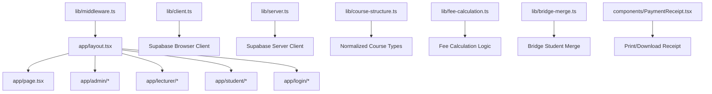
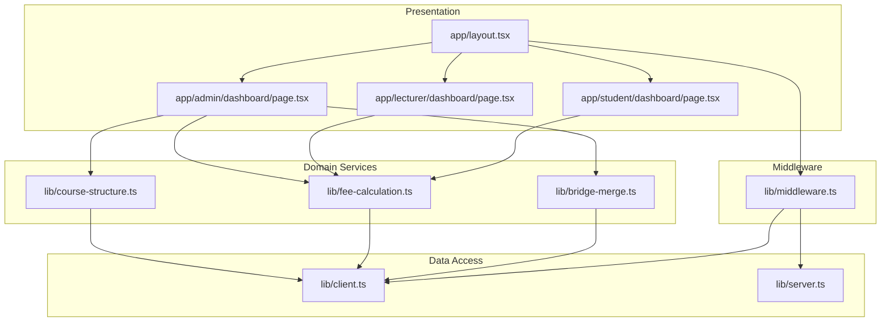
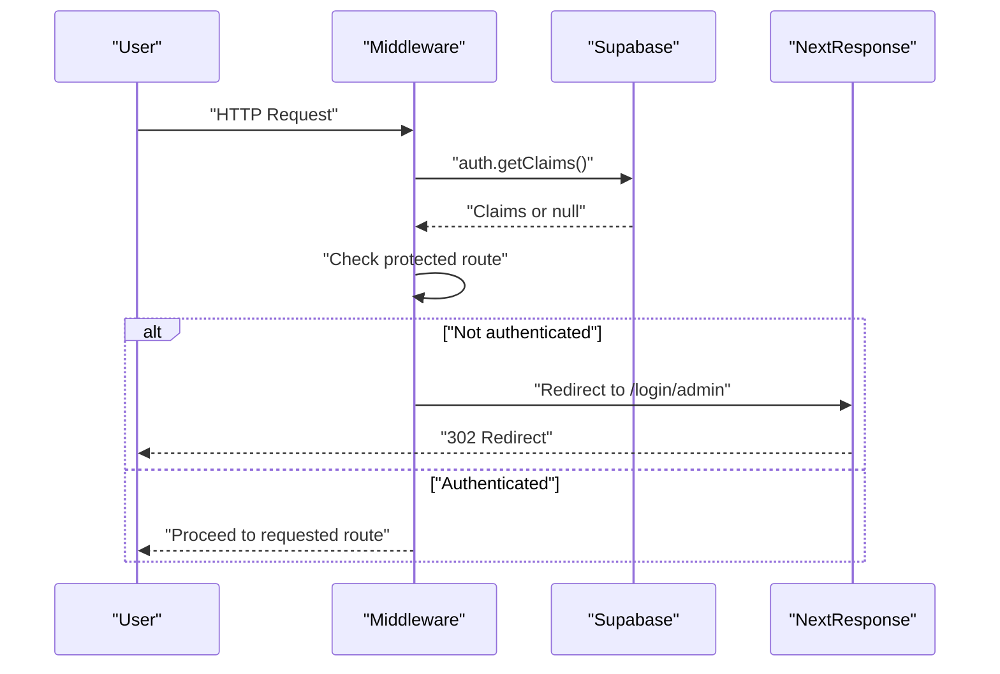
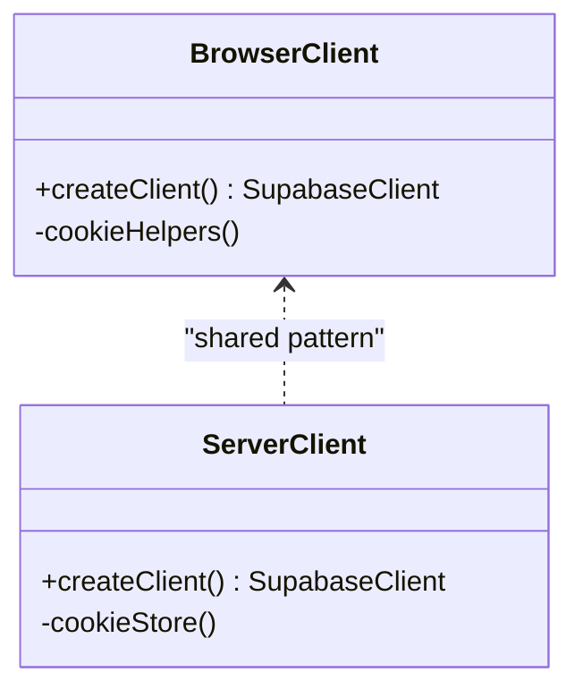
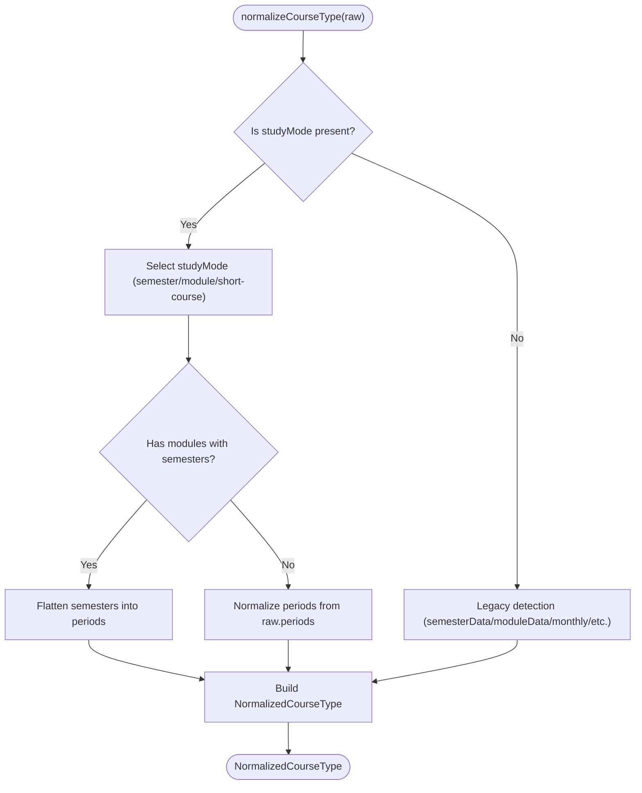
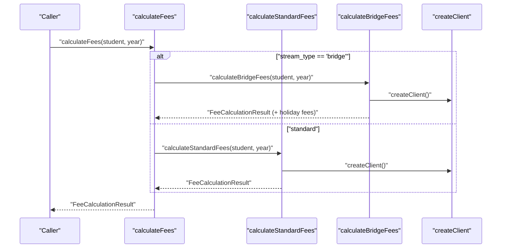
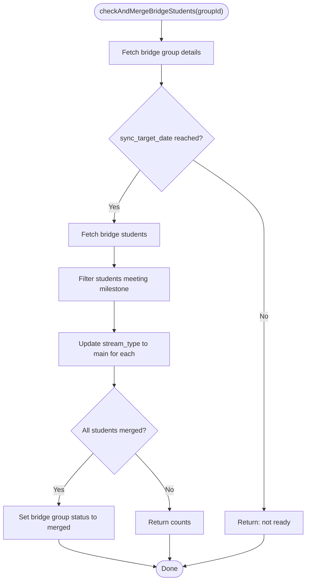
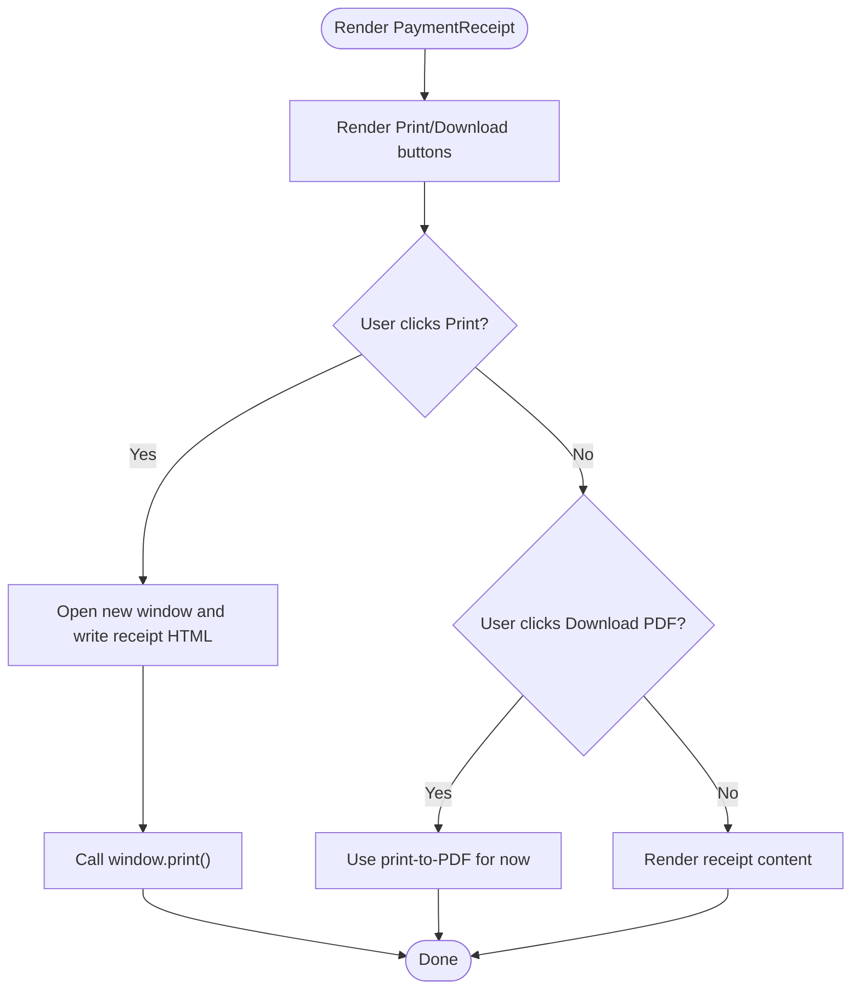
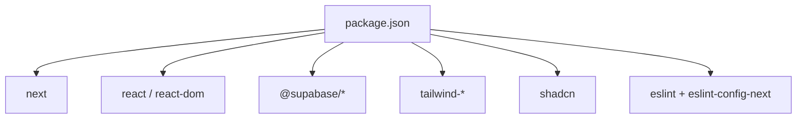

# Development Guidelines

<cite>
**Referenced Files in This Document**
- [package.json](file://package.json)
- [README.md](file://README.md)
- [eslint.config.mjs](file://eslint.config.mjs)
- [tsconfig.json](file://tsconfig.json)
- [next.config.ts](file://next.config.ts)
- [components.json](file://components.json)
- [app/layout.tsx](file://app/layout.tsx)
- [app/page.tsx](file://app/page.tsx)
- [lib/middleware.ts](file://lib/middleware.ts)
- [lib/client.ts](file://lib/client.ts)
- [lib/server.ts](file://lib/server.ts)
- [lib/utils.ts](file://lib/utils.ts)
- [lib/course-structure.ts](file://lib/course-structure.ts)
- [lib/fee-calculation.ts](file://lib/fee-calculation.ts)
- [lib/bridge-merge.ts](file://lib/bridge-merge.ts)
- [components/PaymentReceipt.tsx](file://components/PaymentReceipt.tsx)
</cite>

## Table of Contents
1. [Introduction](#introduction)
2. [Project Structure](#project-structure)
3. [Core Components](#core-components)
4. [Architecture Overview](#architecture-overview)
5. [Detailed Component Analysis](#detailed-component-analysis)
6. [Dependency Analysis](#dependency-analysis)
7. [Performance Considerations](#performance-considerations)
8. [Testing Strategies](#testing-strategies)
9. [Linting and Formatting](#linting-and-formatting)
10. [Development Workflow](#development-workflow)
11. [Contribution Guidelines](#contribution-guidelines)
12. [Debugging and Local Setup](#debugging-and-local-setup)
13. [Security Considerations](#security-considerations)
14. [Accessibility Compliance](#accessibility-compliance)
15. [Release Procedures and Versioning](#release-procedures-and-versioning)
16. [Deployment Workflows](#deployment-workflows)
17. [Coding Philosophy and Principles](#coding-philosophy-and-principles)
18. [Troubleshooting Guide](#troubleshooting-guide)
19. [Conclusion](#conclusion)

## Introduction
This document provides comprehensive development guidelines for contributing to the EAVI College Management System. It covers code standards, React component patterns, architectural best practices, development workflow, testing strategies, quality assurance, debugging techniques, performance optimization, security, accessibility, release procedures, and the project’s coding philosophy.

## Project Structure
The project is a Next.js application with a clear separation of concerns:
- Pages under app/ define routes and UI surfaces for roles (admin, lecturer, student).
- Shared UI utilities live under lib/.
- Global styles and fonts are configured in app/layout.tsx.
- Authentication and routing are enforced via middleware.ts.
- Supabase clients are encapsulated in lib/client.ts (browser) and lib/server.ts (server).
- Domain-specific libraries (course structure, fee calculation, bridge merge) reside under lib/.

**Diagram sources**
- [app/layout.tsx:1-38](file://app/layout.tsx#L1-L38)
- [app/page.tsx:1-214](file://app/page.tsx#L1-L214)
- [lib/middleware.ts:1-75](file://lib/middleware.ts#L1-L75)
- [lib/client.ts:1-42](file://lib/client.ts#L1-L42)
- [lib/server.ts:1-34](file://lib/server.ts#L1-L34)
- [lib/course-structure.ts:1-322](file://lib/course-structure.ts#L1-L322)
- [lib/fee-calculation.ts:1-584](file://lib/fee-calculation.ts#L1-L584)
- [lib/bridge-merge.ts:1-403](file://lib/bridge-merge.ts#L1-L403)
- [components/PaymentReceipt.tsx:1-224](file://components/PaymentReceipt.tsx#L1-L224)

**Section sources**
- [app/layout.tsx:1-38](file://app/layout.tsx#L1-L38)
- [app/page.tsx:1-214](file://app/page.tsx#L1-L214)
- [lib/middleware.ts:1-75](file://lib/middleware.ts#L1-L75)
- [lib/client.ts:1-42](file://lib/client.ts#L1-L42)
- [lib/server.ts:1-34](file://lib/server.ts#L1-L34)
- [lib/course-structure.ts:1-322](file://lib/course-structure.ts#L1-L322)
- [lib/fee-calculation.ts:1-584](file://lib/fee-calculation.ts#L1-L584)
- [lib/bridge-merge.ts:1-403](file://lib/bridge-merge.ts#L1-L403)
- [components/PaymentReceipt.tsx:1-224](file://components/PaymentReceipt.tsx#L1-L224)

## Core Components
- Authentication and routing enforcement via middleware.ts ensures protected routes and redirects unauthenticated users to the admin login by default.
- Supabase clients are isolated per environment (browser vs server) to prevent cross-boundary leakage and cookie desynchronization.
- Utility functions in lib/utils.ts provide Tailwind class merging helpers.
- Course structure normalization in lib/course-structure.ts supports multiple modes (semester, module, short-course) and legacy formats.
- Fee calculation logic in lib/fee-calculation.ts handles standard and bridge students, pro-rating, late fees, and installment plans.
- Bridge merge utilities in lib/bridge-merge.ts coordinate holiday bypass, exam scheduling, and student merging.
- Reusable UI components such as PaymentReceipt.tsx encapsulate printing and PDF generation flows.

**Section sources**
- [lib/middleware.ts:1-75](file://lib/middleware.ts#L1-L75)
- [lib/client.ts:1-42](file://lib/client.ts#L1-L42)
- [lib/server.ts:1-34](file://lib/server.ts#L1-L34)
- [lib/utils.ts:1-7](file://lib/utils.ts#L1-L7)
- [lib/course-structure.ts:1-322](file://lib/course-structure.ts#L1-L322)
- [lib/fee-calculation.ts:1-584](file://lib/fee-calculation.ts#L1-L584)
- [lib/bridge-merge.ts:1-403](file://lib/bridge-merge.ts#L1-L403)
- [components/PaymentReceipt.tsx:1-224](file://components/PaymentReceipt.tsx#L1-L224)

## Architecture Overview
The system follows a layered architecture:
- Presentation Layer: Next.js app directory with role-specific pages and shared layouts.
- Domain Services: Libraries under lib/ encapsulate business logic (course structure, fees, bridges).
- Data Access: Supabase client abstractions isolate SSR and CSR usage.
- Middleware: Centralized authentication and redirection logic.

**Diagram sources**
- [app/layout.tsx:1-38](file://app/layout.tsx#L1-L38)
- [lib/middleware.ts:1-75](file://lib/middleware.ts#L1-L75)
- [lib/client.ts:1-42](file://lib/client.ts#L1-L42)
- [lib/server.ts:1-34](file://lib/server.ts#L1-L34)
- [lib/course-structure.ts:1-322](file://lib/course-structure.ts#L1-L322)
- [lib/fee-calculation.ts:1-584](file://lib/fee-calculation.ts#L1-L584)
- [lib/bridge-merge.ts:1-403](file://lib/bridge-merge.ts#L1-L403)

## Detailed Component Analysis

### Authentication and Routing (Middleware)
The middleware enforces authentication and redirects unauthenticated users to the admin login endpoint. It preserves cookie synchronization between server and client.

**Diagram sources**
- [lib/middleware.ts:10-74](file://lib/middleware.ts#L10-L74)

**Section sources**
- [lib/middleware.ts:1-75](file://lib/middleware.ts#L1-L75)

### Supabase Client Abstractions
- Browser client: Encapsulated in lib/client.ts with cookie helpers for CSR.
- Server client: Encapsulated in lib/server.ts using Next.js cookies API for SSR.

**Diagram sources**
- [lib/client.ts:1-42](file://lib/client.ts#L1-L42)
- [lib/server.ts:1-34](file://lib/server.ts#L1-L34)

**Section sources**
- [lib/client.ts:1-42](file://lib/client.ts#L1-L42)
- [lib/server.ts:1-34](file://lib/server.ts#L1-L34)

### Course Structure Normalization
The course structure library normalizes diverse course configurations into a single NormalizedCourseType model supporting multiple study modes and legacy formats.

**Diagram sources**
- [lib/course-structure.ts:58-210](file://lib/course-structure.ts#L58-L210)

**Section sources**
- [lib/course-structure.ts:1-322](file://lib/course-structure.ts#L1-L322)

### Fee Calculation Logic
Fee calculation supports standard and bridge students, pro-rating, late fees, and installment creation.

**Diagram sources**
- [lib/fee-calculation.ts:379-397](file://lib/fee-calculation.ts#L379-L397)
- [lib/fee-calculation.ts:42-211](file://lib/fee-calculation.ts#L42-L211)
- [lib/fee-calculation.ts:216-285](file://lib/fee-calculation.ts#L216-L285)

**Section sources**
- [lib/fee-calculation.ts:1-584](file://lib/fee-calculation.ts#L1-L584)

### Bridge Merge Utilities
Bridge merge utilities coordinate holiday bypass, exam scheduling, and student merging upon reaching milestones.

**Diagram sources**
- [lib/bridge-merge.ts:207-326](file://lib/bridge-merge.ts#L207-L326)

**Section sources**
- [lib/bridge-merge.ts:1-403](file://lib/bridge-merge.ts#L1-L403)

### Payment Receipt Component
The PaymentReceipt component renders a printable receipt and supports print and PDF download actions.

**Diagram sources**
- [components/PaymentReceipt.tsx:36-77](file://components/PaymentReceipt.tsx#L36-L77)
- [components/PaymentReceipt.tsx:96-187](file://components/PaymentReceipt.tsx#L96-L187)

**Section sources**
- [components/PaymentReceipt.tsx:1-224](file://components/PaymentReceipt.tsx#L1-L224)

## Dependency Analysis
Key runtime and dev dependencies include Next.js, React, Supabase, Tailwind, and shadcn/ui. ESLint is configured via eslint.config.mjs with Next.js recommended rules.

**Diagram sources**
- [package.json:11-39](file://package.json#L11-L39)

**Section sources**
- [package.json:1-41](file://package.json#L1-L41)
- [eslint.config.mjs:1-19](file://eslint.config.mjs#L1-L19)
- [tsconfig.json:1-35](file://tsconfig.json#L1-L35)
- [next.config.ts:1-8](file://next.config.ts#L1-L8)
- [components.json:1-28](file://components.json#L1-L28)

## Performance Considerations
- Prefer server components and server-side data fetching to minimize client payload.
- Use memoization and normalization utilities (e.g., lib/utils.ts) to reduce re-renders.
- Optimize database queries with targeted selects and appropriate indexes.
- Lazy-load heavy assets and defer non-critical resources.
- Minimize client-side JavaScript bundles by avoiding unnecessary client directives.

## Testing Strategies
- Unit tests: Validate pure functions and domain logic (e.g., lib/course-structure.ts, lib/fee-calculation.ts).
- Integration tests: Mock Supabase client and test service flows (e.g., calculateFees, bridge merge).
- End-to-end tests: Use Playwright/Cypress to simulate user journeys across roles (admin, lecturer, student).
- Test coverage: Aim for high coverage in critical paths (fee calculation, course structure normalization, middleware guards).

## Linting and Formatting
- ESLint is configured via eslint.config.mjs with Next.js core-web-vitals and TypeScript rules.
- TypeScript strict mode is enabled in tsconfig.json with bundler module resolution and incremental builds.
- Tailwind and shadcn/ui are configured in components.json with aliases and registry overrides.

**Section sources**
- [eslint.config.mjs:1-19](file://eslint.config.mjs#L1-L19)
- [tsconfig.json:1-35](file://tsconfig.json#L1-L35)
- [components.json:1-28](file://components.json#L1-L28)

## Development Workflow
- Branching: Use feature branches prefixed with feature/, fix/, or docs/ and open pull requests targeting main.
- Commit messages: Use imperative mood and concise descriptions; reference issue numbers when applicable.
- Pull requests: Include a summary, screenshots for UI changes, and links to related issues.
- Code review: Require at least one reviewer; address comments promptly and update PRs accordingly.
- CI checks: Ensure lint passes, tests pass, and type-checks succeed before merging.

## Contribution Guidelines
- New features: Add domain logic under lib/, UI under app/ with role-specific pages, and tests alongside.
- Bug fixes: Provide reproduction steps, minimal test case, and fix rationale.
- Documentation improvements: Update README, inline comments, and component documentation.
- Accessibility: Ensure components are keyboard navigable and screen-reader friendly.
- Security: Never commit secrets; use environment variables and secure headers.

## Debugging and Local Setup
- Environment: Install dependencies and run npm run dev. Configure environment variables for Supabase credentials.
- Logging: Use console logs strategically; avoid sensitive data exposure.
- Middleware debugging: Temporarily bypass redirects to inspect claims and cookies.
- Supabase client: Verify NEXT_PUBLIC_SUPABASE_URL and keys; confirm cookie handling in browser/server clients.

**Section sources**
- [lib/middleware.ts:10-74](file://lib/middleware.ts#L10-L74)
- [lib/client.ts:14-41](file://lib/client.ts#L14-L41)
- [lib/server.ts:11-33](file://lib/server.ts#L11-L33)

## Security Considerations
- Authentication: Enforce middleware protection for all protected routes; ensure cookie synchronization.
- Secrets: Store Supabase keys in environment variables; never expose in client code.
- Input validation: Sanitize and validate all user inputs; normalize course and fee data.
- Permissions: Restrict access by role; verify claims before rendering admin/lecturer/student views.

## Accessibility Compliance
- Semantic HTML: Use proper headings, lists, and landmarks.
- ARIA: Provide labels and roles where implicit semantics are insufficient.
- Keyboard navigation: Ensure focus order is logical and visible focus indicators are present.
- Color contrast: Maintain sufficient contrast ratios for text and interactive elements.

## Release Procedures and Versioning
- Versioning: Follow semantic versioning; increment patch for bug fixes, minor for backward-compatible features, major for breaking changes.
- Changelog: Summarize changes per release; highlight breaking changes and migration steps.
- Tagging: Create annotated tags for releases; push tags to remote.
- Build verification: Run build and type-check locally before tagging.

## Deployment Workflows
- Build: Execute npm run build to generate optimized artifacts.
- Preview: Deploy feature branches to preview environments for review.
- Production: Deploy tagged releases to production with health checks and rollback strategy.

## Coding Philosophy and Principles
- Separation of concerns: Keep UI, domain logic, and data access decoupled.
- Predictable data flow: Normalize data early; derive UI state from normalized models.
- Defensive programming: Validate inputs, handle errors gracefully, and provide fallbacks.
- Minimalism: Prefer simple solutions; avoid over-engineering.
- Consistency: Adhere to shared patterns (Supabase clients, middleware, component props).

## Troubleshooting Guide
- Authentication loops: Verify middleware matcher and cookie handling; ensure NEXT_PUBLIC_SUPABASE_URL and keys are set.
- Supabase errors: Confirm client initialization and cookie store usage; check network tab for CORS issues.
- Build failures: Resolve TypeScript errors; ensure tsconfig paths align with project structure.
- Styling issues: Confirm Tailwind and shadcn configuration; rebuild PostCSS pipeline if needed.

**Section sources**
- [lib/middleware.ts:4-8](file://lib/middleware.ts#L4-L8)
- [lib/client.ts:14-41](file://lib/client.ts#L14-L41)
- [lib/server.ts:9-33](file://lib/server.ts#L9-L33)
- [tsconfig.json:21-23](file://tsconfig.json#L21-L23)
- [components.json:6-12](file://components.json#L6-L12)

## Conclusion
These guidelines establish a consistent, secure, and maintainable development process for the EAVI College Management System. By adhering to the outlined standards, workflows, and principles, contributors can deliver reliable features while preserving system performance and accessibility.