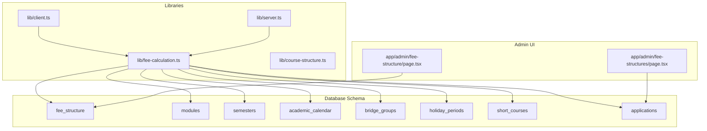
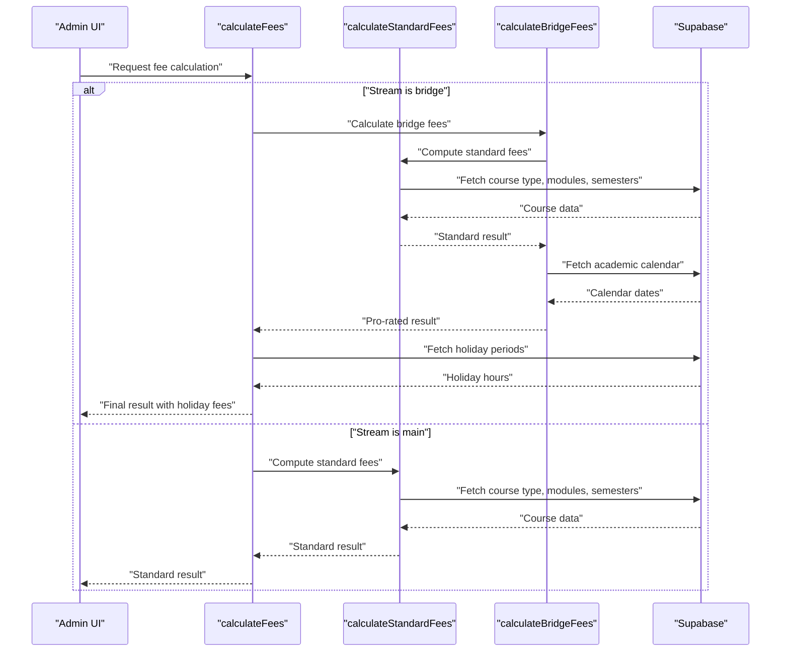
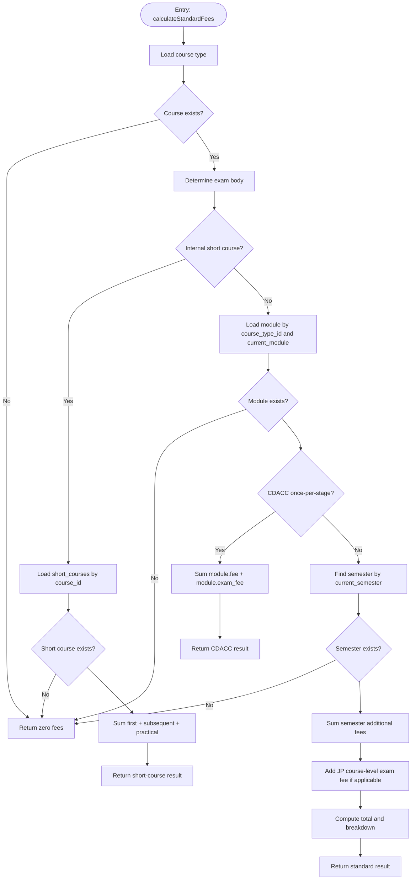
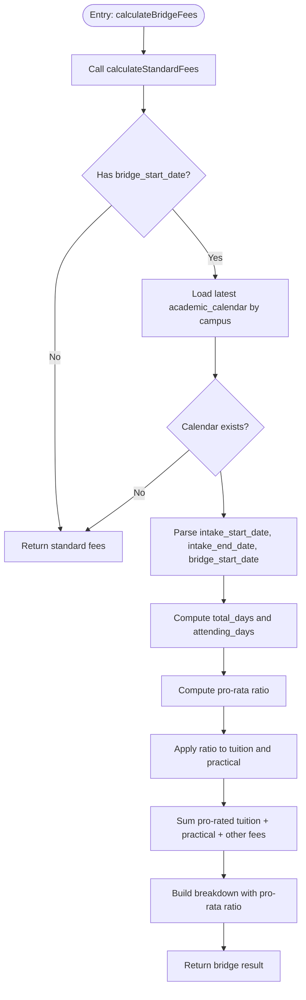
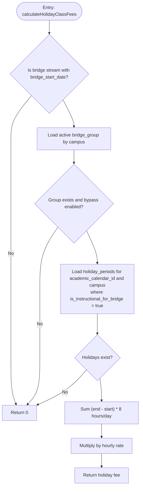
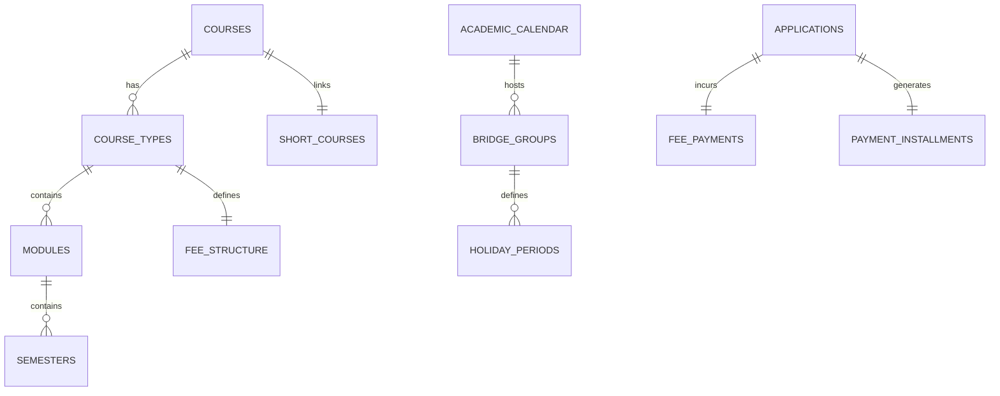

# Fee Calculation Engine

<cite>
**Referenced Files in This Document**
- [fee-calculation.ts](file://lib/fee-calculation.ts)
- [course-structure.ts](file://lib/course-structure.ts)
- [client.ts](file://lib/client.ts)
- [server.ts](file://lib/server.ts)
- [create-tables.sql](file://create-tables.sql)
- [add_fee_to_modules.sql](file://migrations/add_fee_to_modules.sql)
- [add_practical_fee_to_semesters.sql](file://migrations/add_practical_fee_to_semesters.sql)
- [add_exam_fee_to_course_types.sql](file://migrations/add_exam_fee_to_course_types.sql)
- [add_short_courses_foreign_key.sql](file://migrations/add_short_courses_foreign_key.sql)
- [kne-courses.sql](file://kne-courses.sql)
- [jp-courses.sql](file://jp-courses.sql)
- [cdacc-courses.sql](file://cdacc-courses.sql)
- [short-courses.sql](file://short-courses.sql)
- [fee-structure page.tsx](file://app/admin/fee-structure/page.tsx)
- [fee-structures page.tsx](file://app/admin/fee-structures/page.tsx)
</cite>

## Table of Contents
1. [Introduction](#introduction)
2. [Project Structure](#project-structure)
3. [Core Components](#core-components)
4. [Architecture Overview](#architecture-overview)
5. [Detailed Component Analysis](#detailed-component-analysis)
6. [Dependency Analysis](#dependency-analysis)
7. [Performance Considerations](#performance-considerations)
8. [Troubleshooting Guide](#troubleshooting-guide)
9. [Conclusion](#conclusion)
10. [Appendices](#appendices)

## Introduction
This document describes the EAVI Fee Calculation Engine responsible for computing student fees across multiple exam bodies (KNEC, JP International, CDACC, and internal short courses). It explains the core algorithms for standard, bridge, and holiday class fee computation, the pro-rata methodology for bridge students, and the integration with course modules, semesters, and the academic calendar. Practical examples and troubleshooting guidance are included to help administrators and developers deploy and maintain the system effectively.

## Project Structure
The fee calculation engine is implemented primarily in TypeScript and integrates with Supabase for data persistence. The core logic resides in a dedicated library module, while administrative interfaces allow configuration of fee structures and course metadata.

**Diagram sources**
- [fee-calculation.ts:1-584](file://lib/fee-calculation.ts#L1-L584)
- [create-tables.sql:290-342](file://create-tables.sql#L290-L342)
- [fee-structure page.tsx:1-510](file://app/admin/fee-structure/page.tsx#L1-L510)
- [fee-structures page.tsx:1-517](file://app/admin/fee-structures/page.tsx#L1-L517)

**Section sources**
- [fee-calculation.ts:1-584](file://lib/fee-calculation.ts#L1-L584)
- [create-tables.sql:290-342](file://create-tables.sql#L290-L342)
- [fee-structure page.tsx:1-510](file://app/admin/fee-structure/page.tsx#L1-L510)
- [fee-structures page.tsx:1-517](file://app/admin/fee-structures/page.tsx#L1-L517)

## Core Components
- FeeCalculationResult: Aggregates total and component fees (tuition, practical, exam, registration, library, lab), plus late_fee, holiday_class_fee, discount, and a breakdown map.
- StudentInfo: Captures course type, exam body, current semester/module, campus, stream type, optional bridge start date, and application date.
- calculateStandardFees: Computes standard fees for modular and short courses, handling exam-body-specific rules.
- calculateBridgeFees: Applies pro-rata reduction for bridge students based on academic calendar dates.
- calculateHolidayClassFees: Computes additional fees for holiday instruction for eligible bridge groups.
- calculateFees: Orchestrator that selects standard or bridge calculation and adds holiday fees.
- Additional utilities: Installment plan creation, overdue checks, student balance calculation, and financial hold updates.

**Section sources**
- [fee-calculation.ts:3-26](file://lib/fee-calculation.ts#L3-L26)
- [fee-calculation.ts:42-211](file://lib/fee-calculation.ts#L42-L211)
- [fee-calculation.ts:216-285](file://lib/fee-calculation.ts#L216-L285)
- [fee-calculation.ts:290-336](file://lib/fee-calculation.ts#L290-L336)
- [fee-calculation.ts:379-397](file://lib/fee-calculation.ts#L379-L397)

## Architecture Overview
The engine retrieves course metadata and academic calendar data, applies exam-body-specific rules, and computes totals. It supports:
- Modular courses with per-semester fees and optional practical/exam components.
- CDACC once-per-stage modules with module-level fees.
- JP courses with course-level exam fees.
- Internal short courses with fixed installment structures.
- Pro-rata adjustments for bridge students based on actual attendance duration.
- Optional holiday instruction fees for bridge groups during designated periods.

**Diagram sources**
- [fee-calculation.ts:379-397](file://lib/fee-calculation.ts#L379-L397)
- [fee-calculation.ts:42-211](file://lib/fee-calculation.ts#L42-L211)
- [fee-calculation.ts:216-285](file://lib/fee-calculation.ts#L216-L285)
- [fee-calculation.ts:290-336](file://lib/fee-calculation.ts#L290-L336)

## Detailed Component Analysis

### Standard Fee Calculation (calculateStandardFees)
- Determines exam body from course type and handles special cases:
  - Internal short courses: Uses short_courses table for first and subsequent installments plus practical fee.
  - CDACC once-per-stage modules: Uses module-level fee and exam fee without per-semester fees.
  - Modular courses: Selects module and semester by current_module and current_semester.
- Adds additional fees for KNEC semesters and JP course-level exam fees.
- Returns a structured breakdown of components.

**Diagram sources**
- [fee-calculation.ts:42-211](file://lib/fee-calculation.ts#L42-L211)

**Section sources**
- [fee-calculation.ts:42-211](file://lib/fee-calculation.ts#L42-L211)

### Bridge Fee Calculation (calculateBridgeFees)
- Starts by computing standard fees.
- Retrieves the latest academic calendar for the campus to determine intake start/end dates.
- Calculates total semester days and attending days from bridge_start_date to intake_end_date.
- Applies pro-rata ratio to tuition and practical fees; other fees remain unchanged.
- Returns an updated breakdown with pro-rata ratio.

**Diagram sources**
- [fee-calculation.ts:216-285](file://lib/fee-calculation.ts#L216-L285)

**Section sources**
- [fee-calculation.ts:216-285](file://lib/fee-calculation.ts#L216-L285)

### Holiday Class Fee Calculation (calculateHolidayClassFees)
- Enabled only for bridge students with a valid bridge_start_date.
- Requires an active bridge group with holiday_bypass_enabled.
- Identifies instructional holiday periods for bridge students in the academic calendar.
- Sums total instructional days and multiplies by an hourly rate to compute fees.

**Diagram sources**
- [fee-calculation.ts:290-336](file://lib/fee-calculation.ts#L290-L336)

**Section sources**
- [fee-calculation.ts:290-336](file://lib/fee-calculation.ts#L290-L336)

### Orchestration (calculateFees)
- Chooses bridge calculation when stream_type is 'bridge'.
- Otherwise computes standard fees.
- Adds holiday class fees if applicable and updates total.

**Section sources**
- [fee-calculation.ts:379-397](file://lib/fee-calculation.ts#L379-L397)

### Supporting Utilities
- createInstallmentPlan: Generates evenly split installments with a final adjustment to avoid rounding drift.
- checkOverdueInstallments: Marks overdue installments and applies late fees computed as a capped percentage of the installment amount.
- calculateStudentBalance: Computes invoiced fees vs. payments and updates financial hold and transcript unlock status.
- updateFinancialHoldAfterPayment: Updates holds and unlocks transcripts upon payment.
- checkFinancialHold: Returns current hold status and balance.

**Section sources**
- [fee-calculation.ts:402-436](file://lib/fee-calculation.ts#L402-L436)
- [fee-calculation.ts:441-477](file://lib/fee-calculation.ts#L441-L477)
- [fee-calculation.ts:482-534](file://lib/fee-calculation.ts#L482-L534)
- [fee-calculation.ts:539-555](file://lib/fee-calculation.ts#L539-L555)
- [fee-calculation.ts:560-583](file://lib/fee-calculation.ts#L560-L583)

## Dependency Analysis
- Data model dependencies:
  - course_types → courses (exam_body, study_mode, duration_months)
  - modules → course_types (module_index, exam_body)
  - semesters → modules (semester_index, fee, practical_fee)
  - fee_structure (per-course, per-exam-body, per-module, per-semester, per-campus, per-academic-year)
  - academic_calendar (intake_start_date, intake_end_date)
  - bridge_groups (holiday_bypass_enabled, academic_calendar_id)
  - holiday_periods (academic_calendar_id, is_instructional_for_bridge)
  - short_courses (course_id, first_installment, subsequent_installment, practical_fee)
  - applications (stream_type, bridge_start_date, current_module, current_semester, campus)
- Migration dependencies:
  - modules.fee for CDACC once-per-stage
  - semesters.practical_fee for practical-only semesters
  - course_types.exam_fee for JP course-level exam fee
  - short_courses.course_id foreign key

**Diagram sources**
- [create-tables.sql:54-205](file://create-tables.sql#L54-L205)
- [create-tables.sql:290-342](file://create-tables.sql#L290-L342)
- [add_fee_to_modules.sql:1-15](file://migrations/add_fee_to_modules.sql#L1-L15)
- [add_practical_fee_to_semesters.sql:1-15](file://migrations/add_practical_fee_to_semesters.sql#L1-L15)
- [add_exam_fee_to_course_types.sql:1-15](file://migrations/add_exam_fee_to_course_types.sql#L1-L15)
- [add_short_courses_foreign_key.sql:1-28](file://migrations/add_short_courses_foreign_key.sql#L1-L28)

**Section sources**
- [create-tables.sql:54-205](file://create-tables.sql#L54-L205)
- [create-tables.sql:290-342](file://create-tables.sql#L290-L342)
- [add_fee_to_modules.sql:1-15](file://migrations/add_fee_to_modules.sql#L1-L15)
- [add_practical_fee_to_semesters.sql:1-15](file://migrations/add_practical_fee_to_semesters.sql#L1-L15)
- [add_exam_fee_to_course_types.sql:1-15](file://migrations/add_exam_fee_to_course_types.sql#L1-L15)
- [add_short_courses_foreign_key.sql:1-28](file://migrations/add_short_courses_foreign_key.sql#L1-L28)

## Performance Considerations
- Minimize database round-trips by batching queries where possible (already implemented with targeted selects).
- Indexes on frequently queried columns (e.g., course_type_id, module_index, semester_index, campus, academic_calendar_id) improve lookup performance.
- Pro-rata calculations are O(1); ensure date parsing and arithmetic remain efficient.
- Consider caching static fee structures per campus and academic year to reduce repeated reads.

## Troubleshooting Guide
Common issues and resolutions:
- Zero or missing fees:
  - Verify course_type exists and is enabled.
  - Confirm module and semester indices match current_module and current_semester.
  - Check academic calendar presence for bridge pro-rata computations.
- Short course fees not applied:
  - Ensure short_courses has a record linked by course_id.
- CDACC once-per-stage not recognized:
  - Confirm module has no semesters and includes a module-level fee.
- JP course-level exam fee missing:
  - Ensure course_types.exam_fee is set for JP courses.
- Bridge pro-rata incorrect:
  - Validate bridge_start_date falls between intake_start_date and intake_end_date.
  - Confirm campus matches academic_calendar records.
- Holiday class fees not calculated:
  - Ensure bridge_groups is active and holiday_bypass_enabled.
  - Verify holiday_periods exist for the academic calendar and campus with is_instructional_for_bridge set.
- Overdue installments not updated:
  - Confirm due dates are in the past and payment_installments.status is pending.
  - Check that calculateLateFees finds the correct installment amount.

**Section sources**
- [fee-calculation.ts:42-211](file://lib/fee-calculation.ts#L42-L211)
- [fee-calculation.ts:216-285](file://lib/fee-calculation.ts#L216-L285)
- [fee-calculation.ts:290-336](file://lib/fee-calculation.ts#L290-L336)
- [fee-calculation.ts:441-477](file://lib/fee-calculation.ts#L441-L477)

## Conclusion
The EAVI Fee Calculation Engine provides a robust, exam-body-aware framework for computing student fees. Its modular design supports diverse course structures, pro-rata adjustments for bridge students, and optional holiday instruction charges. Administrators can configure fee structures and course metadata via the admin interfaces, ensuring accurate billing aligned with institutional policies and academic calendars.

## Appendices

### Practical Examples
- Regular student (KNEC modular):
  - Inputs: course_type_id, current_module, current_semester, campus, stream_type='main'
  - Computation: semester.fee + semester.practical_fee + module.exam_fee + additional fees
- Bridge student (CDACC once-per-stage):
  - Inputs: bridge_start_date, campus, stream_type='bridge'
  - Computation: pro-rata(module.fee + module.exam_fee) + other fees
- Short course (internal):
  - Inputs: course_type_id (short-course), campus
  - Computation: first_installment + subsequent_installment + practical_fee
- JP course:
  - Inputs: course_type_id (JP), current_module, current_semester
  - Computation: semester.fee + semester.practical_fee + module.exam_fee + course.exam_fee

### Integration Notes
- Admin UI for fee structure configuration:
  - [fee-structure page.tsx:92-126](file://app/admin/fee-structure/page.tsx#L92-L126)
  - [fee-structures page.tsx:103-137](file://app/admin/fee-structures/page.tsx#L103-L137)
- Course data sources:
  - [kne-courses.sql:1-137](file://kne-courses.sql#L1-L137)
  - [jp-courses.sql:1-92](file://jp-courses.sql#L1-L92)
  - [cdacc-courses.sql:1-106](file://cdacc-courses.sql#L1-L106)
  - [short-courses.sql:1-212](file://short-courses.sql#L1-L212)