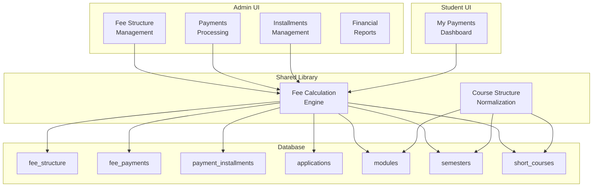
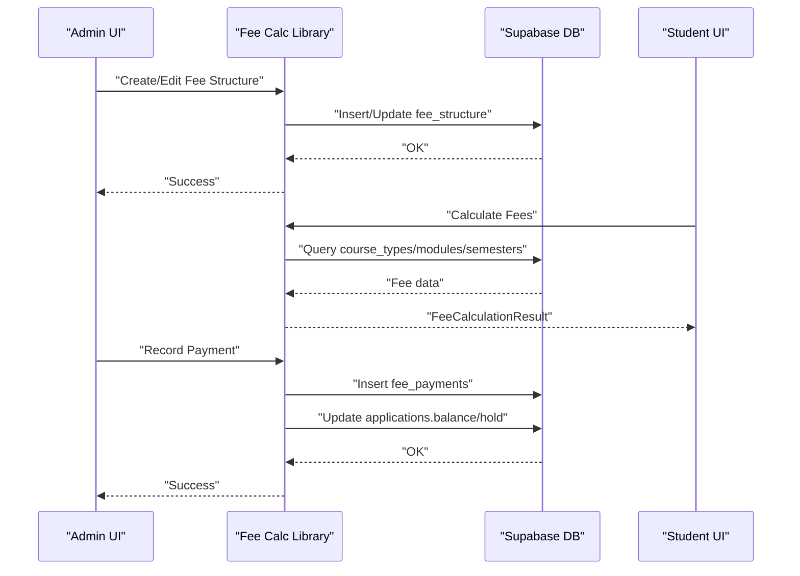
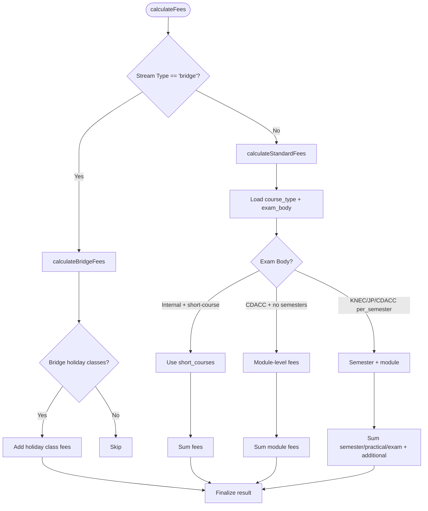
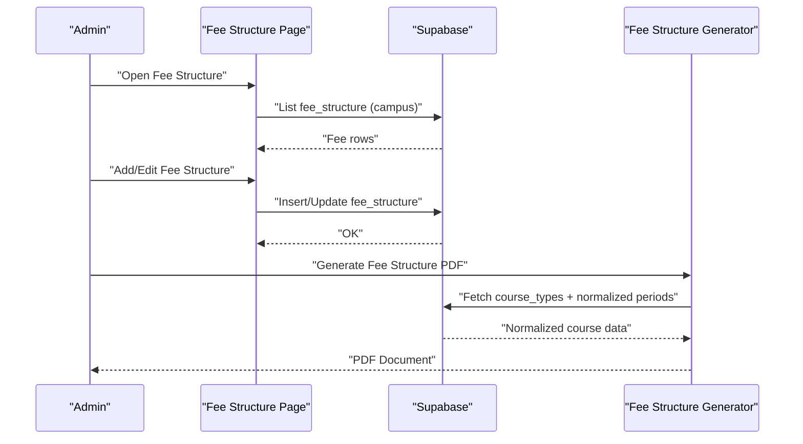
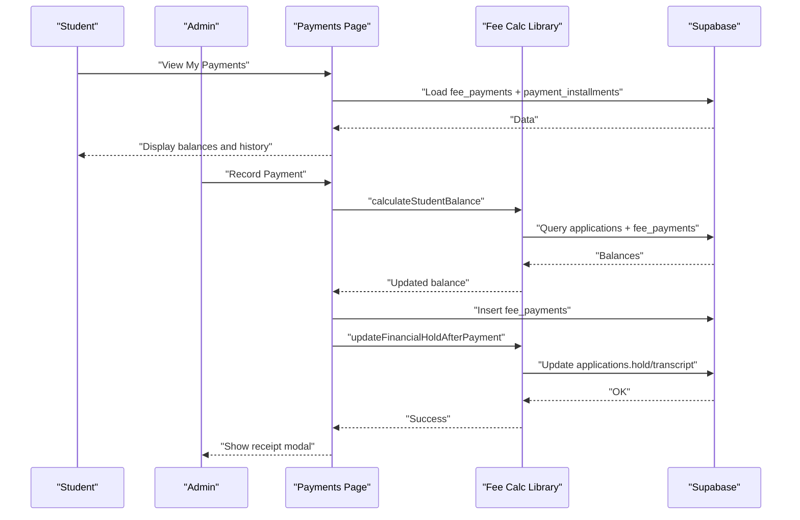
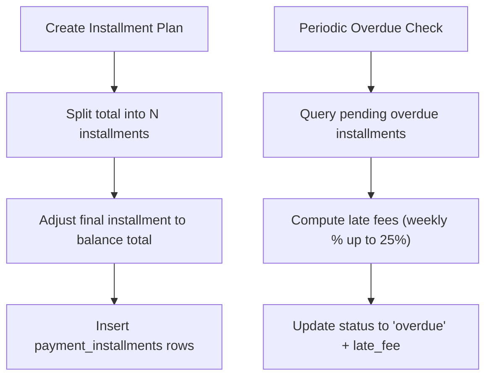
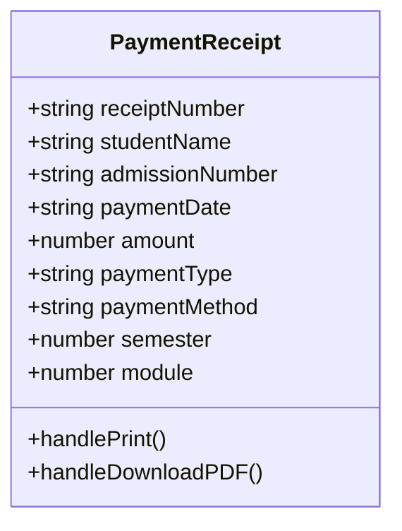
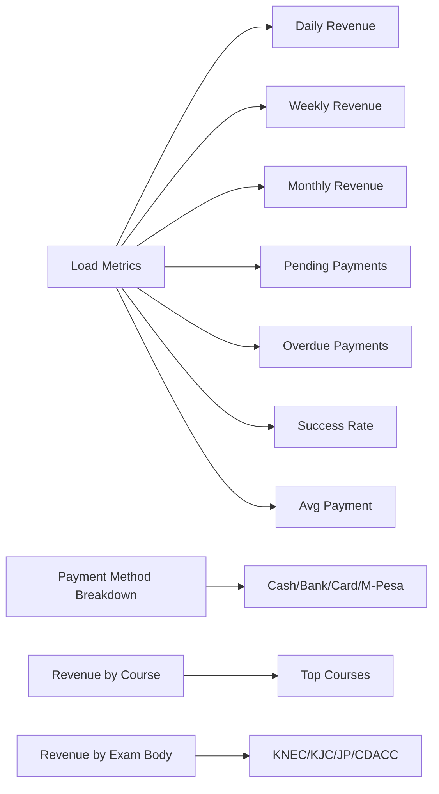
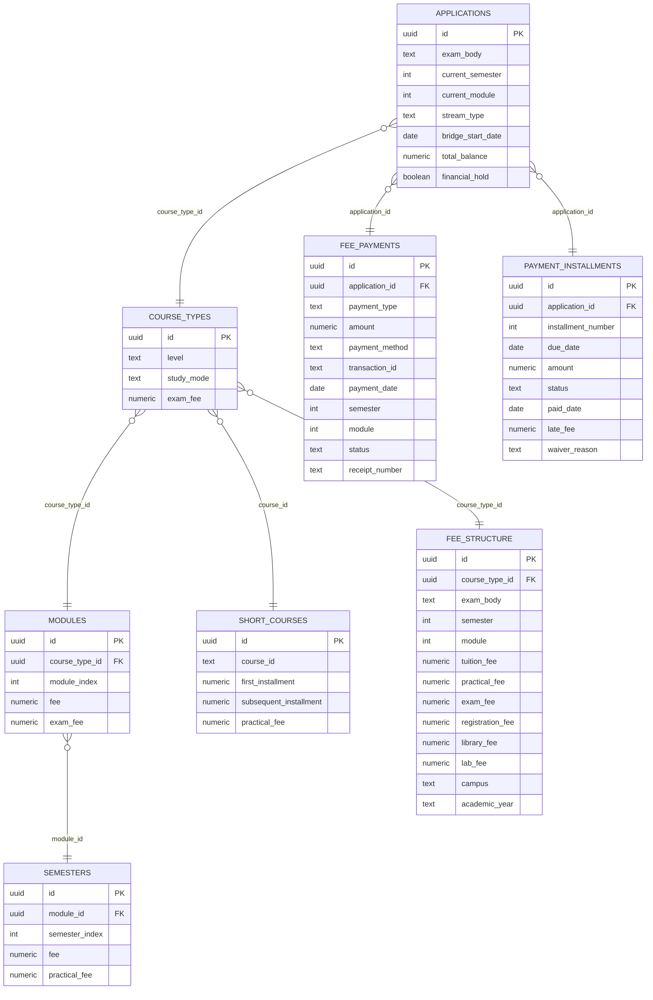

# Fee Management System

<cite>
**Referenced Files in This Document**
- [lib/fee-calculation.ts](file://lib/fee-calculation.ts)
- [app/admin/fee-structure/page.tsx](file://app/admin/fee-structure/page.tsx)
- [app/admin/fee-structures/page.tsx](file://app/admin/fee-structures/page.tsx)
- [app/admin/payments/page.tsx](file://app/admin/payments/page.tsx)
- [app/student/payments/page.tsx](file://app/student/payments/page.tsx)
- [app/admin/installments/page.tsx](file://app/admin/installments/page.tsx)
- [app/admin/financial-reports/page.tsx](file://app/admin/financial-reports/page.tsx)
- [components/PaymentReceipt.tsx](file://components/PaymentReceipt.tsx)
- [lib/course-structure.ts](file://lib/course-structure.ts)
- [database.sql](file://database.sql)
- [migrations/add_fee_to_modules.sql](file://migrations/add_fee_to_modules.sql)
- [migrations/add_exam_fee_to_course_types.sql](file://migrations/add_exam_fee_to_course_types.sql)
- [migrations/add_practical_fee_to_semesters.sql](file://migrations/add_practical_fee_to_semesters.sql)
</cite>

## Table of Contents
1. [Introduction](#introduction)
2. [Project Structure](#project-structure)
3. [Core Components](#core-components)
4. [Architecture Overview](#architecture-overview)
5. [Detailed Component Analysis](#detailed-component-analysis)
6. [Dependency Analysis](#dependency-analysis)
7. [Performance Considerations](#performance-considerations)
8. [Troubleshooting Guide](#troubleshooting-guide)
9. [Conclusion](#conclusion)
10. [Appendices](#appendices)

## Introduction
This document describes the EAVI Fee Management System, a comprehensive solution for managing student fees across multiple exam bodies (KNEC, KJC/JC, JP) with dynamic fee structures. It covers the fee calculation engine, unit-based pricing models, payment processing workflows, financial holds, and reporting capabilities. Practical examples illustrate fee calculations for different student profiles and course combinations, along with guidance for handling refunds, waivers, and payment plan modifications.

## Project Structure
The system is built as a Next.js application with Supabase for backend data management. Key areas include:
- Fee calculation logic in a shared library
- Administrative interfaces for fee structure management and payment processing
- Student-facing payment and receipt views
- Reporting dashboards for financial insights
- Database schema supporting modular and short-course fee structures

**Diagram sources**
- [lib/fee-calculation.ts:1-584](file://lib/fee-calculation.ts#L1-L584)
- [app/admin/fee-structure/page.tsx:1-510](file://app/admin/fee-structure/page.tsx#L1-L510)
- [app/admin/payments/page.tsx:1-604](file://app/admin/payments/page.tsx#L1-L604)
- [app/admin/installments/page.tsx:1-415](file://app/admin/installments/page.tsx#L1-L415)
- [app/admin/financial-reports/page.tsx:1-459](file://app/admin/financial-reports/page.tsx#L1-L459)
- [app/student/payments/page.tsx:1-378](file://app/student/payments/page.tsx#L1-L378)
- [lib/course-structure.ts:1-322](file://lib/course-structure.ts#L1-L322)
- [database.sql:1-341](file://database.sql#L1-L341)

**Section sources**
- [lib/fee-calculation.ts:1-584](file://lib/fee-calculation.ts#L1-L584)
- [database.sql:1-341](file://database.sql#L1-L341)

## Core Components
- Fee Calculation Engine: Computes fees based on course type, exam body, semester/module, and special streams (bridge).
- Fee Structure Management: Admin interface to define and manage fee schedules per course, exam body, and academic year.
- Payment Processing: Records payments, generates receipts, updates balances, and manages financial holds.
- Installment Plans: Creates and tracks payment plans with automatic overdue detection and late fee calculation.
- Reporting: Provides financial metrics, payment method breakdowns, and revenue analytics.
- Receipt Generation: Produces printable receipts with standardized formatting.

**Section sources**
- [lib/fee-calculation.ts:379-584](file://lib/fee-calculation.ts#L379-L584)
- [app/admin/fee-structure/page.tsx:1-510](file://app/admin/fee-structure/page.tsx#L1-L510)
- [app/admin/payments/page.tsx:1-604](file://app/admin/payments/page.tsx#L1-L604)
- [app/admin/installments/page.tsx:1-415](file://app/admin/installments/page.tsx#L1-L415)
- [app/admin/financial-reports/page.tsx:1-459](file://app/admin/financial-reports/page.tsx#L1-L459)
- [components/PaymentReceipt.tsx:1-224](file://components/PaymentReceipt.tsx#L1-L224)

## Architecture Overview
The system follows a layered architecture:
- Presentation Layer: Next.js pages for admin and student interfaces
- Business Logic Layer: Shared TypeScript modules for fee calculation and course structure normalization
- Data Access Layer: Supabase client for database operations
- Data Model: PostgreSQL schema with tables for applications, fee structures, payments, and installments

**Diagram sources**
- [lib/fee-calculation.ts:42-211](file://lib/fee-calculation.ts#L42-L211)
- [app/admin/fee-structure/page.tsx:128-170](file://app/admin/fee-structure/page.tsx#L128-L170)
- [app/admin/payments/page.tsx:247-267](file://app/admin/payments/page.tsx#L247-L267)
- [app/student/payments/page.tsx:137-156](file://app/student/payments/page.tsx#L137-L156)

## Detailed Component Analysis

### Fee Calculation Engine
The engine computes fees dynamically based on:
- Course type and exam body
- Current semester/module
- Academic calendar for bridge students
- Additional fees and exam fees
- Special provisions for short courses and CDACC

**Diagram sources**
- [lib/fee-calculation.ts:379-397](file://lib/fee-calculation.ts#L379-L397)
- [lib/fee-calculation.ts:42-211](file://lib/fee-calculation.ts#L42-L211)
- [lib/fee-calculation.ts:216-285](file://lib/fee-calculation.ts#L216-L285)
- [lib/fee-calculation.ts:289-336](file://lib/fee-calculation.ts#L289-L336)

Key algorithms and considerations:
- Pro-rata bridge calculation: Uses academic calendar dates to compute attendance ratio and prorate tuition/practical fees.
- Additional fees: Supports extra charges per semester beyond base tuition.
- JP exam fee: Adds course-level exam fee for JP courses.
- Short courses: Consolidates first and subsequent installments plus practical fee.
- CDACC once-per-stage: Uses module-level fees when no semesters are defined.

**Section sources**
- [lib/fee-calculation.ts:42-211](file://lib/fee-calculation.ts#L42-L211)
- [lib/fee-calculation.ts:216-285](file://lib/fee-calculation.ts#L216-L285)
- [lib/fee-calculation.ts:289-336](file://lib/fee-calculation.ts#L289-L336)
- [lib/fee-calculation.ts:379-397](file://lib/fee-calculation.ts#L379-L397)

### Fee Structure Management
Administrators configure fee schedules per course, exam body, semester, module, and campus. The interface supports:
- Creating/editing fee structures
- Filtering by campus and exam body
- Bulk generation of fee structure documents

**Diagram sources**
- [app/admin/fee-structure/page.tsx:92-106](file://app/admin/fee-structure/page.tsx#L92-L106)
- [app/admin/fee-structure/page.tsx:128-170](file://app/admin/fee-structure/page.tsx#L128-L170)
- [app/admin/fee-structures/page.tsx:296-372](file://app/admin/fee-structures/page.tsx#L296-L372)
- [lib/course-structure.ts:58-210](file://lib/course-structure.ts#L58-L210)

**Section sources**
- [app/admin/fee-structure/page.tsx:1-510](file://app/admin/fee-structure/page.tsx#L1-L510)
- [app/admin/fee-structures/page.tsx:1-517](file://app/admin/fee-structures/page.tsx#L1-L517)
- [lib/course-structure.ts:1-322](file://lib/course-structure.ts#L1-L322)

### Payment Processing Workflow
The system supports multiple payment methods and tracks payment history, installments, and financial holds.

**Diagram sources**
- [app/student/payments/page.tsx:82-105](file://app/student/payments/page.tsx#L82-L105)
- [app/admin/payments/page.tsx:247-267](file://app/admin/payments/page.tsx#L247-L267)
- [lib/fee-calculation.ts:482-555](file://lib/fee-calculation.ts#L482-L555)

**Section sources**
- [app/admin/payments/page.tsx:1-604](file://app/admin/payments/page.tsx#L1-L604)
- [app/student/payments/page.tsx:1-378](file://app/student/payments/page.tsx#L1-L378)
- [lib/fee-calculation.ts:482-555](file://lib/fee-calculation.ts#L482-L555)

### Installment Plan Creation and Management
Installment plans are created with equal monthly installments and a final balancing adjustment. Overdue checks automatically apply late fees and update statuses.

**Diagram sources**
- [lib/fee-calculation.ts:402-436](file://lib/fee-calculation.ts#L402-L436)
- [lib/fee-calculation.ts:441-477](file://lib/fee-calculation.ts#L441-L477)
- [app/admin/installments/page.tsx:115-138](file://app/admin/installments/page.tsx#L115-L138)

**Section sources**
- [lib/fee-calculation.ts:402-477](file://lib/fee-calculation.ts#L402-L477)
- [app/admin/installments/page.tsx:1-415](file://app/admin/installments/page.tsx#L1-L415)

### Receipt Generation System
The system generates official receipts with standardized formatting and supports printing and PDF download.

**Diagram sources**
- [components/PaymentReceipt.tsx:1-224](file://components/PaymentReceipt.tsx#L1-L224)

**Section sources**
- [components/PaymentReceipt.tsx:1-224](file://components/PaymentReceipt.tsx#L1-L224)

### Financial Reporting Capabilities
The financial reports page aggregates:
- Daily/weekly/monthly revenue
- Pending and overdue payments
- Payment success rates
- Payment method distribution
- Revenue by course and exam body

**Diagram sources**
- [app/admin/financial-reports/page.tsx:86-162](file://app/admin/financial-reports/page.tsx#L86-L162)
- [app/admin/financial-reports/page.tsx:164-199](file://app/admin/financial-reports/page.tsx#L164-L199)
- [app/admin/financial-reports/page.tsx:201-284](file://app/admin/financial-reports/page.tsx#L201-L284)

**Section sources**
- [app/admin/financial-reports/page.tsx:1-459](file://app/admin/financial-reports/page.tsx#L1-L459)

## Dependency Analysis
The system relies on a normalized course structure model and flexible fee tables.

**Diagram sources**
- [database.sql:25-58](file://database.sql#L25-L58)
- [database.sql:94-105](file://database.sql#L94-L105)
- [database.sql:236-252](file://database.sql#L236-L252)
- [database.sql:291-302](file://database.sql#L291-L302)
- [database.sql:310-329](file://database.sql#L310-L329)
- [database.sql:169-187](file://database.sql#L169-L187)
- [database.sql:151-168](file://database.sql#L151-L168)
- [database.sql:253-267](file://database.sql#L253-L267)

**Section sources**
- [database.sql:1-341](file://database.sql#L1-L341)
- [migrations/add_fee_to_modules.sql:1-15](file://migrations/add_fee_to_modules.sql#L1-L15)
- [migrations/add_exam_fee_to_course_types.sql:1-15](file://migrations/add_exam_fee_to_course_types.sql#L1-L15)
- [migrations/add_practical_fee_to_semesters.sql:1-15](file://migrations/add_practical_fee_to_semesters.sql#L1-L15)

## Performance Considerations
- Fee calculation queries: Minimize joins by pre-loading course type and module data; cache frequently accessed fee structures.
- Payment processing: Batch operations for overdue checks; limit concurrent requests to reduce DB load.
- Reporting: Use indexed columns (payment_date, status, campus) for efficient filtering and aggregation.
- Receipt generation: Defer heavy PDF generation to client-side or background jobs to avoid blocking UI.

[No sources needed since this section provides general guidance]

## Troubleshooting Guide
Common issues and resolutions:
- Fee calculation returns zero:
  - Verify course type exists and is enabled.
  - Confirm module and semester indices match current academic period.
  - Check for missing short-course or CDACC module-level fees.
- Bridge student pro-rata mismatch:
  - Ensure academic calendar dates are set and bridge_start_date falls within intake period.
  - Validate that total days and attending days are computed correctly.
- Overdue installments not detected:
  - Run periodic overdue check job to update statuses and late fees.
  - Confirm due dates and current date comparison logic.
- Financial hold not unlocking:
  - Recalculate student balance after payment to update hold status.
  - Verify payment status transitions to completed.
- Payment method discrepancies:
  - Validate transaction IDs for non-cash methods.
  - Confirm payment dates align with academic calendar terms.

**Section sources**
- [lib/fee-calculation.ts:441-477](file://lib/fee-calculation.ts#L441-L477)
- [lib/fee-calculation.ts:539-555](file://lib/fee-calculation.ts#L539-L555)

## Conclusion
The EAVI Fee Management System provides a robust, extensible framework for managing diverse fee structures across multiple exam bodies. Its modular design supports dynamic configurations, automated installment tracking, and comprehensive reporting. By leveraging normalized course structures and standardized payment workflows, the system ensures accurate billing, transparent financial management, and streamlined administrative operations.

[No sources needed since this section summarizes without analyzing specific files]

## Appendices

### Practical Fee Calculation Examples
- Example 1: KNEC standard course (Diploma)
  - Semester 1, Module 1: Base tuition + practical + module exam fee + additional fees
- Example 2: JP course
  - Per-semester fees plus course-level exam fee at completion
- Example 3: Short course
  - First and subsequent installments plus practical fee
- Example 4: CDACC once-per-stage
  - Module-level fees without semesters
- Example 5: Bridge student
  - Pro-rated tuition/practical based on attendance ratio plus potential holiday class fees

**Section sources**
- [lib/fee-calculation.ts:42-211](file://lib/fee-calculation.ts#L42-L211)
- [lib/fee-calculation.ts:216-285](file://lib/fee-calculation.ts#L216-L285)
- [lib/fee-calculation.ts:289-336](file://lib/fee-calculation.ts#L289-L336)

### Refunds, Waivers, and Modifications
- Refunds: Implemented via payment status updates and audit trails; ensure transaction IDs are preserved.
- Waivers: Apply to specific installments with reason logging; mark status as waived.
- Payment plan modifications: Adjust due dates and amounts; recalculate totals and update late fees accordingly.

**Section sources**
- [app/admin/installments/page.tsx:164-183](file://app/admin/installments/page.tsx#L164-L183)
- [lib/fee-calculation.ts:441-477](file://lib/fee-calculation.ts#L441-L477)