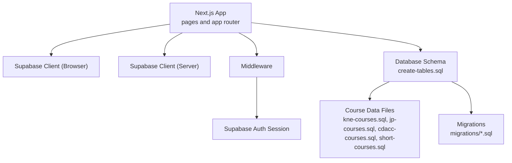
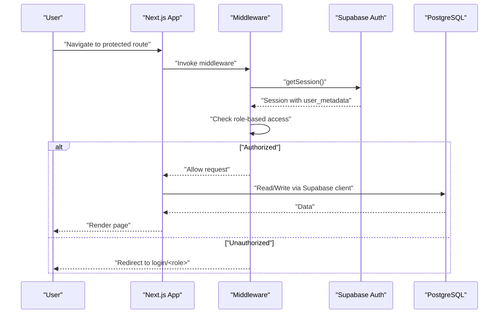
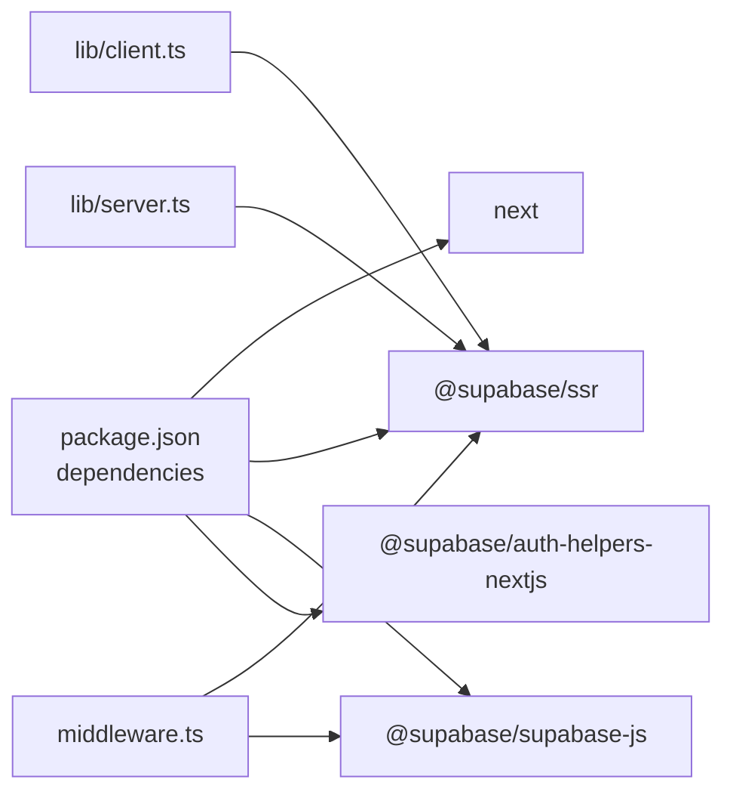

# Getting Started

<cite>
**Referenced Files in This Document**
- [package.json](file://package.json)
- [README.md](file://README.md)
- [next.config.ts](file://next.config.ts)
- [tsconfig.json](file://tsconfig.json)
- [components.json](file://components.json)
- [lib/client.ts](file://lib/client.ts)
- [lib/server.ts](file://lib/server.ts)
- [middleware.ts](file://middleware.ts)
- [lib/middleware.ts](file://lib/middleware.ts)
- [create-tables.sql](file://create-tables.sql)
- [database.sql](file://database.sql)
- [update-admin-metadata.sql](file://update-admin-metadata.sql)
- [update-all-roles.sql](file://update-all-roles.sql)
- [migrations/add_campus_to_lecturers.sql](file://migrations/add_campus_to_lecturers.sql)
</cite>

## Table of Contents
1. [Introduction](#introduction)
2. [Project Structure](#project-structure)
3. [Core Components](#core-components)
4. [Architecture Overview](#architecture-overview)
5. [Detailed Component Analysis](#detailed-component-analysis)
6. [Dependency Analysis](#dependency-analysis)
7. [Performance Considerations](#performance-considerations)
8. [Troubleshooting Guide](#troubleshooting-guide)
9. [Conclusion](#conclusion)
10. [Appendices](#appendices)

## Introduction
This guide helps you install, configure, and run the EAVI College Management System locally and prepare for production. It covers prerequisites, environment setup, database initialization, Supabase configuration, development server startup, and basic usage for admin, student, and lecturer portals. It also includes verification steps and troubleshooting tips.

## Project Structure
The project is a Next.js application using TypeScript. Authentication and SSR/SSG helpers are provided by Supabase. Middleware enforces role-based access control across admin, student, and lecturer routes. Database schema and migrations are included to initialize and evolve the data model.

**Diagram sources**
- [lib/client.ts:1-42](file://lib/client.ts#L1-L42)
- [lib/server.ts:1-34](file://lib/server.ts#L1-L34)
- [middleware.ts:1-100](file://middleware.ts#L1-L100)
- [create-tables.sql:1-397](file://create-tables.sql#L1-L397)

**Section sources**
- [package.json:1-41](file://package.json#L1-L41)
- [next.config.ts:1-8](file://next.config.ts#L1-L8)
- [tsconfig.json:1-35](file://tsconfig.json#L1-L35)
- [components.json:1-28](file://components.json#L1-L28)

## Core Components
- Next.js runtime and build pipeline configured via package scripts.
- Supabase integration for authentication and database access, with dedicated browser and server clients.
- Middleware enforcing authentication and role-based routing.
- Database schema and seed data split across schema creation, course data, and migrations.

Key implementation references:
- Scripts and dependencies: [package.json:5-10](file://package.json#L5-L10), [package.json:11-28](file://package.json#L11-L28)
- Browser client initialization: [lib/client.ts:1-42](file://lib/client.ts#L1-L42)
- Server client initialization: [lib/server.ts:1-34](file://lib/server.ts#L1-L34)
- Middleware enforcement: [middleware.ts:1-100](file://middleware.ts#L1-L100)
- Database schema: [create-tables.sql:1-397](file://create-tables.sql#L1-L397)
- Course data files: [database.sql:1-341](file://database.sql#L1-L341)

**Section sources**
- [package.json:1-41](file://package.json#L1-L41)
- [lib/client.ts:1-42](file://lib/client.ts#L1-L42)
- [lib/server.ts:1-34](file://lib/server.ts#L1-L34)
- [middleware.ts:1-100](file://middleware.ts#L1-L100)
- [create-tables.sql:1-397](file://create-tables.sql#L1-L397)
- [database.sql:1-341](file://database.sql#L1-L341)

## Architecture Overview
The system uses Next.js App Router with Supabase for authentication and data persistence. Middleware validates sessions and redirects unauthorized users to appropriate login pages. Role metadata stored in Supabase auth users controls access to admin, student, and lecturer areas.

**Diagram sources**
- [middleware.ts:34-85](file://middleware.ts#L34-L85)
- [lib/server.ts:8-33](file://lib/server.ts#L8-L33)
- [lib/client.ts:5-41](file://lib/client.ts#L5-L41)

## Detailed Component Analysis

### Prerequisites
- Node.js: The project specifies a Next.js version in dependencies; ensure a compatible Node.js version for that release. See [package.json:20-20](file://package.json#L20-L20).
- Database: PostgreSQL is used for the application database. The schema and seeds are provided in SQL files. See [create-tables.sql:1-397](file://create-tables.sql#L1-L397).
- Supabase: Authentication and database hosting are handled via Supabase. The app expects Supabase environment variables for client initialization. See [lib/client.ts:14-16](file://lib/client.ts#L14-L16) and [lib/server.ts:11-13](file://lib/server.ts#L11-L13).

Verification:
- Confirm Postgres availability and connectivity.
- Confirm Supabase project exists and has authentication enabled.

**Section sources**
- [package.json:20-20](file://package.json#L20-L20)
- [create-tables.sql:1-397](file://create-tables.sql#L1-L397)
- [lib/client.ts:14-16](file://lib/client.ts#L14-L16)
- [lib/server.ts:11-13](file://lib/server.ts#L11-L13)

### Environment Variables
Required environment variables for Supabase:
- NEXT_PUBLIC_SUPABASE_URL: Supabase project URL.
- NEXT_PUBLIC_SUPABASE_PUBLISHABLE_KEY: Supabase publishable key.

These are consumed by:
- Browser client: [lib/client.ts:14-16](file://lib/client.ts#L14-L16)
- Server client: [lib/server.ts:11-13](file://lib/server.ts#L11-L13)
- Middleware: [middleware.ts:9-11](file://middleware.ts#L9-L11)

Notes:
- The middleware also reads/writes cookies for session synchronization. See [middleware.ts:13-27](file://middleware.ts#L13-L27).

**Section sources**
- [lib/client.ts:14-16](file://lib/client.ts#L14-L16)
- [lib/server.ts:11-13](file://lib/server.ts#L11-L13)
- [middleware.ts:9-11](file://middleware.ts#L9-L11)

### Installation Steps
1. Clone the repository.
2. Install dependencies:
   - Using npm: [package.json:5-10](file://package.json#L5-L10)
   - Using yarn: equivalent commands as defined in scripts.
3. Set environment variables:
   - Add NEXT_PUBLIC_SUPABASE_URL and NEXT_PUBLIC_SUPABASE_PUBLISHABLE_KEY to your environment.
4. Configure database:
   - Initialize schema: [create-tables.sql:1-397](file://create-tables.sql#L1-L397)
   - Seed course data using the exam-body-specific SQL files: [database.sql:389-396](file://database.sql#L389-L396)
   - Apply migrations: [migrations/add_campus_to_lecturers.sql](file://migrations/add_campus_to_lecturers.sql)
5. Start the development server:
   - Run the dev script: [package.json:6-6](file://package.json#L6-L6)

Verification:
- Access the home page and confirm no immediate authentication redirect.
- Navigate to /admin, /student, /lecturer and observe role-based redirection if unauthenticated.

**Section sources**
- [package.json:5-10](file://package.json#L5-L10)
- [create-tables.sql:1-397](file://create-tables.sql#L1-L397)
- [database.sql:389-396](file://database.sql#L389-L396)
- [migrations/add_campus_to_lecturers.sql](file://migrations/add_campus_to_lecturers.sql)

### Database Setup and Seeding
- Schema creation: [create-tables.sql:1-397](file://create-tables.sql#L1-L397)
- Course data per exam body: [database.sql:389-396](file://database.sql#L389-L396)
- Migrations: [migrations/add_campus_to_lecturers.sql](file://migrations/add_campus_to_lecturers.sql)

Initial user roles:
- Admin metadata update: [update-admin-metadata.sql:1-32](file://update-admin-metadata.sql#L1-L32)
- Bulk role update: [update-all-roles.sql:1-49](file://update-all-roles.sql#L1-L49)

**Section sources**
- [create-tables.sql:1-397](file://create-tables.sql#L1-L397)
- [database.sql:389-396](file://database.sql#L389-L396)
- [update-admin-metadata.sql:1-32](file://update-admin-metadata.sql#L1-L32)
- [update-all-roles.sql:1-49](file://update-all-roles.sql#L1-L49)

### Development Server Startup
- Start the Next.js dev server using the configured script: [package.json:6-6](file://package.json#L6-L6)
- The app uses the default Next.js configuration: [next.config.ts:1-8](file://next.config.ts#L1-L8)

Verification:
- Open the app in a browser and navigate to protected routes to confirm middleware redirection and role checks.

**Section sources**
- [package.json:6-6](file://package.json#L6-L6)
- [next.config.ts:1-8](file://next.config.ts#L1-L8)

### Basic Usage Examples
- Admin portal: Navigate to /admin; requires role=admin.
- Student portal: Navigate to /student; requires role=student.
- Lecturer portal: Navigate to /lecturer; requires role=lecturer.

Access control logic:
- Middleware enforces role-based access and redirects accordingly: [middleware.ts:52-82](file://middleware.ts#L52-L82)

**Section sources**
- [middleware.ts:52-82](file://middleware.ts#L52-L82)

### Production Deployment Preparation
- Build the app using the build script: [package.json:7-7](file://package.json#L7-L7)
- Serve using the start script: [package.json:8-8](file://package.json#L8-L8)
- Ensure environment variables are set in the production environment:
  - NEXT_PUBLIC_SUPABASE_URL and NEXT_PUBLIC_SUPABASE_PUBLISHABLE_KEY: [lib/client.ts:14-16](file://lib/client.ts#L14-L16), [lib/server.ts:11-13](file://lib/server.ts#L11-L13)
- Confirm database connectivity and schema presence: [create-tables.sql:1-397](file://create-tables.sql#L1-L397)

**Section sources**
- [package.json:7-8](file://package.json#L7-L8)
- [lib/client.ts:14-16](file://lib/client.ts#L14-L16)
- [lib/server.ts:11-13](file://lib/server.ts#L11-L13)
- [create-tables.sql:1-397](file://create-tables.sql#L1-L397)

## Dependency Analysis
The project depends on Next.js and Supabase packages for SSR/SSG and authentication. Middleware and clients rely on environment variables for Supabase configuration.

**Diagram sources**
- [package.json:11-28](file://package.json#L11-L28)
- [lib/client.ts:1-42](file://lib/client.ts#L1-L42)
- [lib/server.ts:1-34](file://lib/server.ts#L1-L34)
- [middleware.ts:1-100](file://middleware.ts#L1-L100)

**Section sources**
- [package.json:11-28](file://package.json#L11-L28)
- [lib/client.ts:1-42](file://lib/client.ts#L1-L42)
- [lib/server.ts:1-34](file://lib/server.ts#L1-L34)
- [middleware.ts:1-100](file://middleware.ts#L1-L100)

## Performance Considerations
- Keep Supabase client instances scoped to requests in serverless environments to avoid stale sessions.
- Minimize unnecessary middleware computations by leveraging Next.js static generation where possible.
- Use database indexes present in the schema for frequent queries.

[No sources needed since this section provides general guidance]

## Troubleshooting Guide
Common issues and resolutions:
- Missing environment variables:
  - Symptom: Authentication errors or blank pages.
  - Fix: Set NEXT_PUBLIC_SUPABASE_URL and NEXT_PUBLIC_SUPABASE_PUBLISHABLE_KEY. See [lib/client.ts:14-16](file://lib/client.ts#L14-L16), [lib/server.ts:11-13](file://lib/server.ts#L11-L13).
- Unauthorized access to protected routes:
  - Symptom: Redirect loops to login pages.
  - Fix: Ensure user metadata includes role and campus; run role update scripts. See [update-all-roles.sql:1-49](file://update-all-roles.sql#L1-L49).
- Middleware session mismatch:
  - Symptom: Random logouts or inconsistent sessions.
  - Fix: Follow middleware guidance to avoid code between client creation and session retrieval. See [middleware.ts:30-36](file://middleware.ts#L30-L36).
- Database schema errors:
  - Symptom: Migration failures or constraint violations.
  - Fix: Apply schema creation and migrations in order. See [create-tables.sql:1-397](file://create-tables.sql#L1-L397), [migrations/add_campus_to_lecturers.sql](file://migrations/add_campus_to_lecturers.sql).

**Section sources**
- [lib/client.ts:14-16](file://lib/client.ts#L14-L16)
- [lib/server.ts:11-13](file://lib/server.ts#L11-L13)
- [update-all-roles.sql:1-49](file://update-all-roles.sql#L1-L49)
- [middleware.ts:30-36](file://middleware.ts#L30-L36)
- [create-tables.sql:1-397](file://create-tables.sql#L1-L397)
- [migrations/add_campus_to_lecturers.sql](file://migrations/add_campus_to_lecturers.sql)

## Conclusion
You now have the essentials to install, configure, and run the EAVI College Management System locally, understand the Supabase integration, and prepare for production. Use the provided scripts, environment variables, and database setup steps to get up and running, and refer to the troubleshooting section for common issues.

[No sources needed since this section summarizes without analyzing specific files]

## Appendices

### Appendix A: Verification Checklist
- Environment variables are set and accessible to the app.
- Database schema is initialized and course data is seeded.
- Supabase users have correct role metadata.
- Middleware redirects unauthenticated users appropriately.
- Admin, student, and lecturer routes render after login.

**Section sources**
- [lib/client.ts:14-16](file://lib/client.ts#L14-L16)
- [lib/server.ts:11-13](file://lib/server.ts#L11-L13)
- [create-tables.sql:1-397](file://create-tables.sql#L1-L397)
- [update-all-roles.sql:1-49](file://update-all-roles.sql#L1-L49)
- [middleware.ts:52-82](file://middleware.ts#L52-L82)