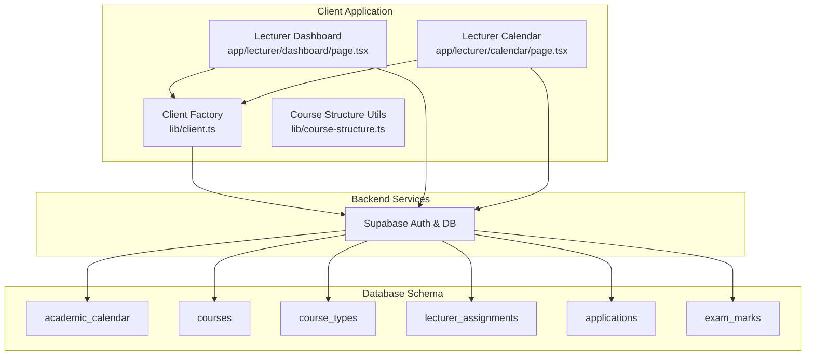
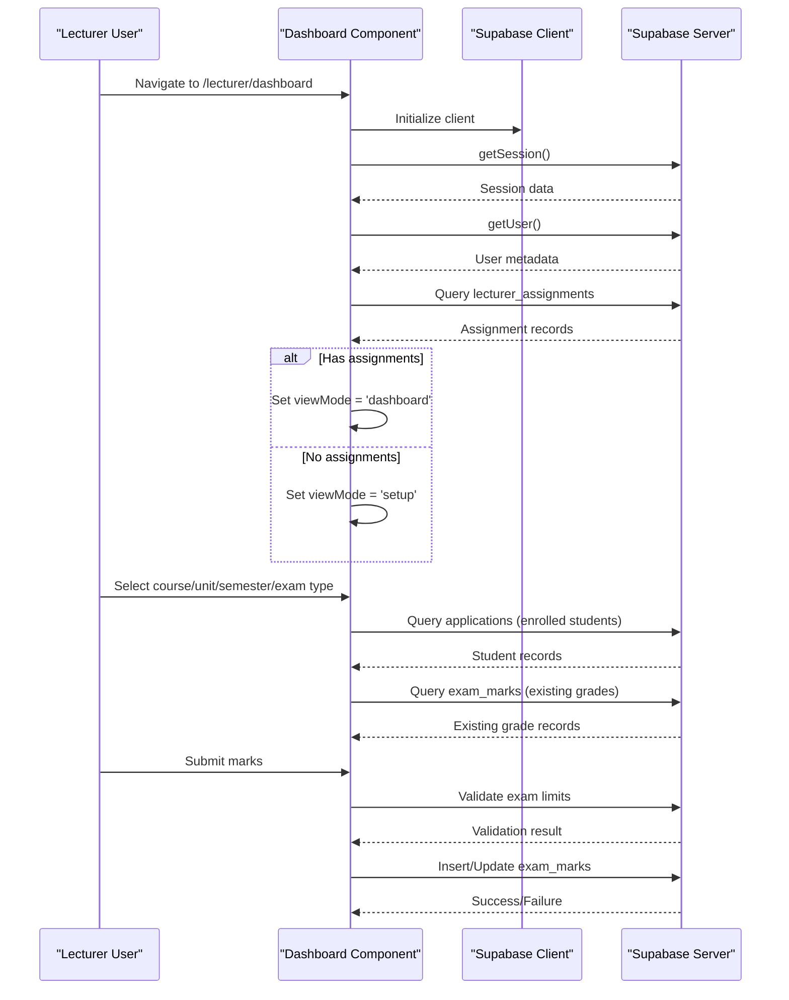
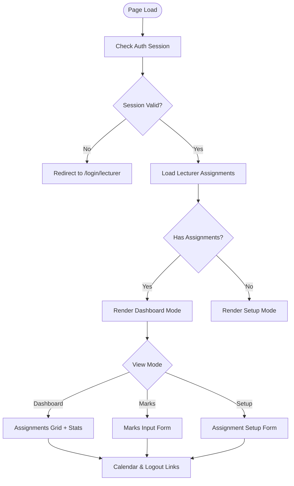
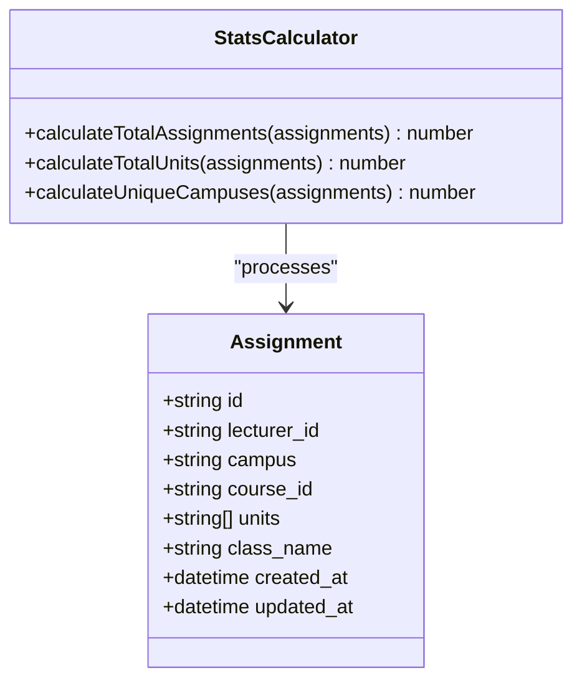
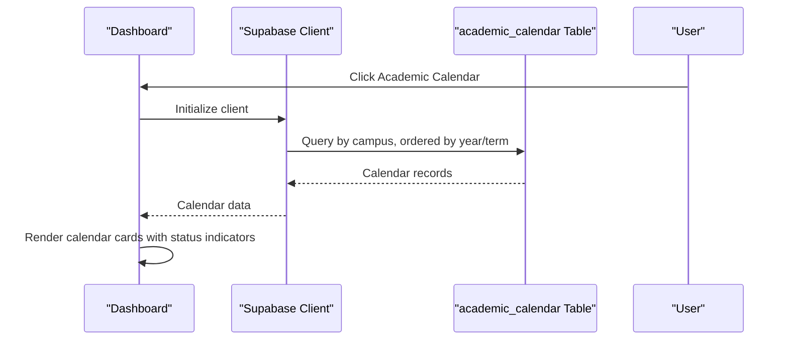
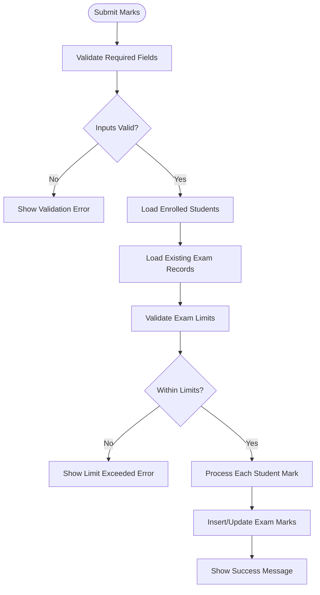
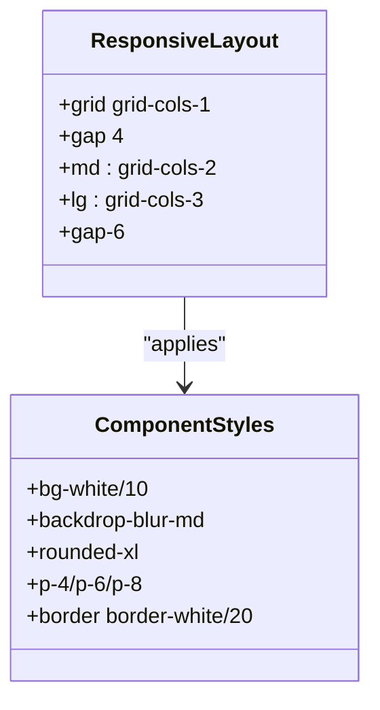
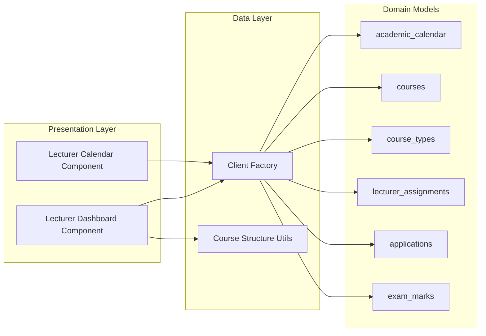

# Lecturer Dashboard

<cite>
**Referenced Files in This Document**
- [page.tsx](file://app/lecturer/dashboard/page.tsx)
- [page.tsx](file://app/lecturer/calendar/page.tsx)
- [client.ts](file://lib/client.ts)
- [course-structure.ts](file://lib/course-structure.ts)
- [layout.tsx](file://app/layout.tsx)
- [globals.css](file://app/globals.css)
- [database.sql](file://database.sql)
- [create-tables.sql](file://create-tables.sql)
</cite>

## Table of Contents
1. [Introduction](#introduction)
2. [Project Structure](#project-structure)
3. [Core Components](#core-components)
4. [Architecture Overview](#architecture-overview)
5. [Detailed Component Analysis](#detailed-component-analysis)
6. [Dependency Analysis](#dependency-analysis)
7. [Performance Considerations](#performance-considerations)
8. [Troubleshooting Guide](#troubleshooting-guide)
9. [Conclusion](#conclusion)

## Introduction
The Lecturer Dashboard provides a centralized interface for lecturers to manage their teaching assignments, view course statistics, access academic calendar events, and submit student exam marks. It integrates with Supabase for authentication and data persistence, and leverages course structure utilities to normalize academic configurations. The dashboard supports responsive design and includes accessibility considerations through semantic markup and keyboard navigation.

## Project Structure
The Lecturer Dashboard is implemented as a Next.js client-side page component with supporting libraries for database connectivity and course configuration normalization. The component interacts with multiple backend tables to present a unified view of assignments, enrollments, and grading workflows.

**Diagram sources**
- [page.tsx:1-1235](file://app/lecturer/dashboard/page.tsx#L1-L1235)
- [page.tsx:1-208](file://app/lecturer/calendar/page.tsx#L1-L208)
- [client.ts:1-42](file://lib/client.ts#L1-L42)
- [course-structure.ts:1-322](file://lib/course-structure.ts#L1-L322)
- [database.sql:1-341](file://database.sql#L1-L341)
- [create-tables.sql:207-234](file://create-tables.sql#L207-L234)

**Section sources**
- [page.tsx:1-1235](file://app/lecturer/dashboard/page.tsx#L1-L1235)
- [page.tsx:1-208](file://app/lecturer/calendar/page.tsx#L1-L208)
- [client.ts:1-42](file://lib/client.ts#L1-L42)
- [course-structure.ts:1-322](file://lib/course-structure.ts#L1-L322)
- [layout.tsx:1-38](file://app/layout.tsx#L1-L38)
- [globals.css:1-134](file://app/globals.css#L1-L134)
- [database.sql:1-341](file://database.sql#L1-L341)
- [create-tables.sql:207-234](file://create-tables.sql#L207-L234)

## Core Components
The dashboard comprises three primary modes controlled by a view state machine:
- Setup Mode: Allows lecturers to define teaching assignments across campuses, departments, courses, and units
- Dashboard Mode: Presents teaching assignments, course statistics, and quick actions
- Marks Input Mode: Provides a structured interface for entering student exam marks with validation

Key data flows include:
- Authentication verification against Supabase session
- Assignment retrieval from lecturer_assignments table
- Course metadata loading with normalized course structures
- Student enrollment queries filtered by campus, class, and enrollment status
- Exam mark validation against course configuration and existing records

**Section sources**
- [page.tsx:10-201](file://app/lecturer/dashboard/page.tsx#L10-L201)
- [page.tsx:203-251](file://app/lecturer/dashboard/page.tsx#L203-L251)
- [page.tsx:258-459](file://app/lecturer/dashboard/page.tsx#L258-L459)
- [page.tsx:712-900](file://app/lecturer/dashboard/page.tsx#L712-L900)
- [page.tsx:902-1235](file://app/lecturer/dashboard/page.tsx#L902-L1235)

## Architecture Overview
The dashboard follows a reactive architecture pattern with client-side state management and server-side data persistence through Supabase. The component initializes a Supabase client, verifies lecturer authentication, loads assignment data, and dynamically renders UI based on user selections.

**Diagram sources**
- [page.tsx:170-201](file://app/lecturer/dashboard/page.tsx#L170-L201)
- [page.tsx:56-114](file://app/lecturer/dashboard/page.tsx#L56-L114)
- [page.tsx:280-386](file://app/lecturer/dashboard/page.tsx#L280-L386)
- [page.tsx:394-438](file://app/lecturer/dashboard/page.tsx#L394-L438)

**Section sources**
- [page.tsx:170-201](file://app/lecturer/dashboard/page.tsx#L170-L201)
- [page.tsx:56-114](file://app/lecturer/dashboard/page.tsx#L56-L114)
- [page.tsx:280-386](file://app/lecturer/dashboard/page.tsx#L280-L386)
- [page.tsx:394-438](file://app/lecturer/dashboard/page.tsx#L394-L438)

## Detailed Component Analysis

### Dashboard Layout and Navigation
The dashboard implements a responsive layout with a fixed header containing logo, user identification, academic calendar navigation, and logout functionality. The main content area adapts to different screen sizes using Tailwind CSS grid and flex utilities.

**Diagram sources**
- [page.tsx:170-201](file://app/lecturer/dashboard/page.tsx#L170-L201)
- [page.tsx:712-900](file://app/lecturer/dashboard/page.tsx#L712-L900)
- [page.tsx:902-1235](file://app/lecturer/dashboard/page.tsx#L902-L1235)

**Section sources**
- [page.tsx:469-511](file://app/lecturer/dashboard/page.tsx#L469-L511)
- [page.tsx:712-900](file://app/lecturer/dashboard/page.tsx#L712-L900)
- [page.tsx:902-1235](file://app/lecturer/dashboard/page.tsx#L902-L1235)

### Course Statistics and Metrics Display
The dashboard presents three key metrics cards showing total assignments, total units across all assignments, and distinct campuses. These metrics are calculated from the lecturer's assignment records and provide immediate visibility into teaching responsibilities.

**Diagram sources**
- [page.tsx:718-735](file://app/lecturer/dashboard/page.tsx#L718-L735)
- [create-tables.sql:225-234](file://create-tables.sql#L225-L234)

**Section sources**
- [page.tsx:718-735](file://app/lecturer/dashboard/page.tsx#L718-L735)

### Academic Calendar Integration
The dashboard integrates with the academic calendar system to display term dates, CAT periods, end-term exams, and mock exam availability. The calendar component loads data filtered by the lecturer's campus and presents upcoming events with visual indicators for date status.

**Diagram sources**
- [page.tsx:68-81](file://app/lecturer/calendar/page.tsx#L68-L81)
- [database.sql:4-24](file://database.sql#L4-L24)

**Section sources**
- [page.tsx:68-81](file://app/lecturer/calendar/page.tsx#L68-L81)
- [page.tsx:161-201](file://app/lecturer/calendar/page.tsx#L161-L201)

### Marks Input Workflow and Validation
The marks input system implements comprehensive validation to ensure compliance with course configurations and exam sitting limits. The workflow validates course type configurations, checks existing exam records, enforces internal exam limits, and handles combined CAT/end-term calculations.

**Diagram sources**
- [page.tsx:258-459](file://app/lecturer/dashboard/page.tsx#L258-L459)
- [page.tsx:280-386](file://app/lecturer/dashboard/page.tsx#L280-L386)
- [page.tsx:394-438](file://app/lecturer/dashboard/page.tsx#L394-L438)

**Section sources**
- [page.tsx:258-459](file://app/lecturer/dashboard/page.tsx#L258-L459)
- [page.tsx:280-386](file://app/lecturer/dashboard/page.tsx#L280-L386)
- [page.tsx:394-438](file://app/lecturer/dashboard/page.tsx#L394-L438)

### Responsive Design Implementation
The dashboard employs a mobile-first responsive design strategy using Tailwind CSS utility classes. The layout adapts from single-column on mobile devices to multi-column grids on larger screens, ensuring optimal usability across different device sizes.

**Diagram sources**
- [page.tsx:718-735](file://app/lecturer/dashboard/page.tsx#L718-L735)
- [globals.css:1-134](file://app/globals.css#L1-L134)

**Section sources**
- [page.tsx:718-735](file://app/lecturer/dashboard/page.tsx#L718-L735)
- [layout.tsx:1-38](file://app/layout.tsx#L1-L38)
- [globals.css:1-134](file://app/globals.css#L1-L134)

## Dependency Analysis
The dashboard component has clear separation of concerns with well-defined dependencies:

**Diagram sources**
- [page.tsx:1-1235](file://app/lecturer/dashboard/page.tsx#L1-L1235)
- [page.tsx:1-208](file://app/lecturer/calendar/page.tsx#L1-L208)
- [client.ts:1-42](file://lib/client.ts#L1-L42)
- [course-structure.ts:1-322](file://lib/course-structure.ts#L1-L322)
- [database.sql:1-341](file://database.sql#L1-L341)

**Section sources**
- [page.tsx:1-1235](file://app/lecturer/dashboard/page.tsx#L1-L1235)
- [page.tsx:1-208](file://app/lecturer/calendar/page.tsx#L1-L208)
- [client.ts:1-42](file://lib/client.ts#L1-L42)
- [course-structure.ts:1-322](file://lib/course-structure.ts#L1-L322)
- [database.sql:1-341](file://database.sql#L1-L341)

## Performance Considerations
The dashboard implements several performance optimizations:
- Lazy loading of course structures through normalized configuration utilities
- Conditional rendering based on view state to minimize DOM manipulation
- Efficient database queries with selective field retrieval and filtering
- Client-side caching of Supabase client instances
- Debounced form submissions to prevent duplicate requests

## Troubleshooting Guide

### Authentication Issues
**Problem**: Dashboard redirects to login page
**Causes**: Invalid session, missing role metadata, or expired credentials
**Solutions**: 
- Verify browser cookies and local storage contain valid session data
- Check Supabase auth configuration and environment variables
- Ensure user metadata includes correct role assignment

**Section sources**
- [page.tsx:170-201](file://app/lecturer/dashboard/page.tsx#L170-L201)

### Missing Assignment Data
**Problem**: Setup form appears instead of dashboard
**Causes**: No lecturer assignments found in lecturer_assignments table
**Solutions**:
- Verify lecturer has been assigned to courses in admin system
- Check campus and department filters match lecturer metadata
- Confirm course IDs reference existing courses in courses table

**Section sources**
- [page.tsx:186-199](file://app/lecturer/dashboard/page.tsx#L186-L199)
- [create-tables.sql:225-234](file://create-tables.sql#L225-L234)

### Student Loading Failures
**Problem**: Empty student lists in marks input
**Causes**: Incorrect course/unit/semester selection or enrollment filtering
**Solutions**:
- Verify selected course exists in course_types configuration
- Check unit codes match normalized course structure
- Ensure enrollment status filter matches application records

**Section sources**
- [page.tsx:56-114](file://app/lecturer/dashboard/page.tsx#L56-L114)
- [page.tsx:75-110](file://app/lecturer/dashboard/page.tsx#L75-L110)

### Exam Validation Errors
**Problem**: Marks submission blocked by validation
**Causes**: Exceeding allowed exam sitting limits or invalid configurations
**Solutions**:
- Review course type configuration for internal exam limits
- Check existing exam records for the same student and unit
- Verify combined CAT/end-term calculations meet grade boundaries

**Section sources**
- [page.tsx:280-386](file://app/lecturer/dashboard/page.tsx#L280-L386)
- [page.tsx:394-438](file://app/lecturer/dashboard/page.tsx#L394-L438)

### Calendar Display Issues
**Problem**: Academic calendar shows empty or incorrect data
**Causes**: Campus mismatch or missing calendar entries
**Solutions**:
- Verify lecturer campus matches calendar entries
- Check academic_calendar table for term scheduling data
- Ensure proper date formatting and timezone handling

**Section sources**
- [page.tsx:68-81](file://app/lecturer/calendar/page.tsx#L68-L81)
- [page.tsx:161-201](file://app/lecturer/calendar/page.tsx#L161-L201)

## Conclusion
The Lecturer Dashboard provides a comprehensive solution for managing teaching assignments, viewing course statistics, accessing academic calendar events, and submitting student exam marks. Its architecture emphasizes separation of concerns, responsive design, and robust validation. The component successfully integrates with Supabase for authentication and data persistence while maintaining clean abstractions through utility modules for course structure normalization.