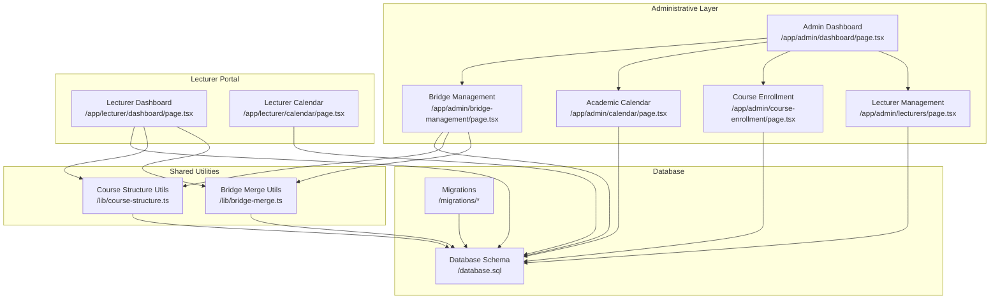
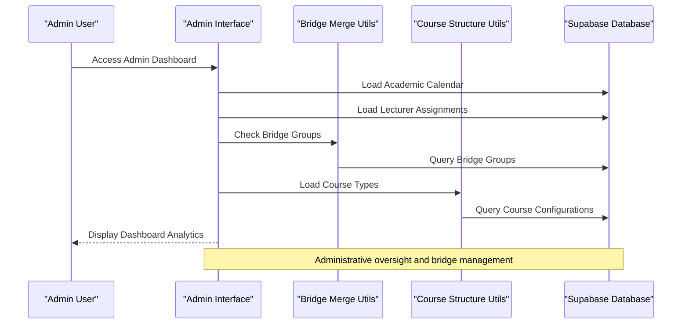
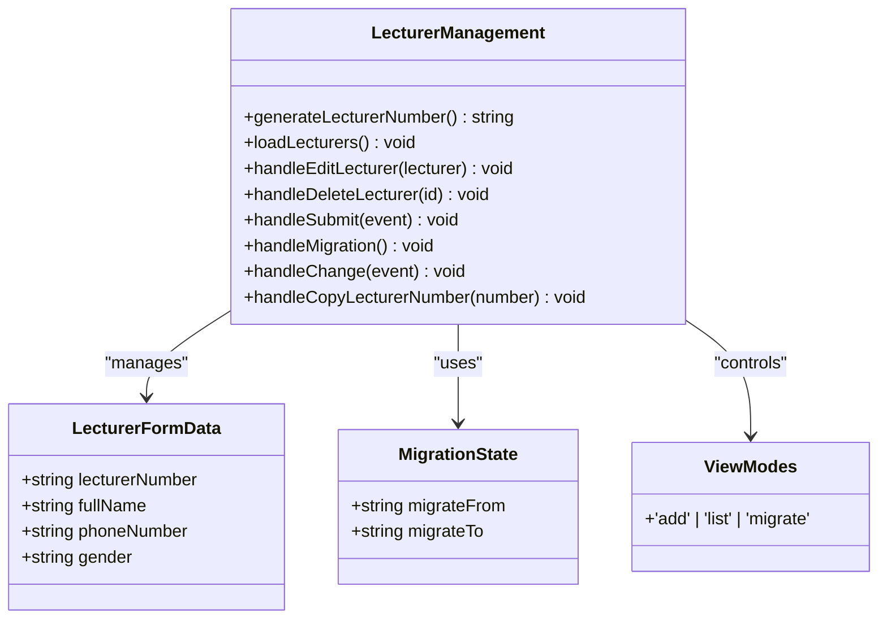
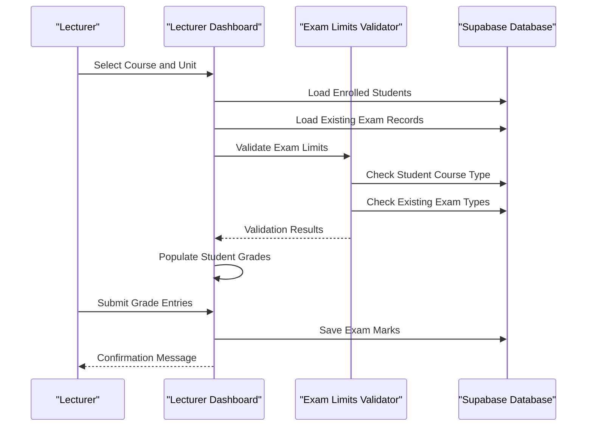
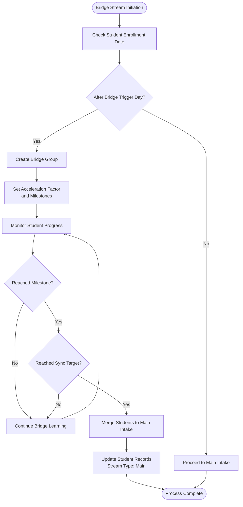
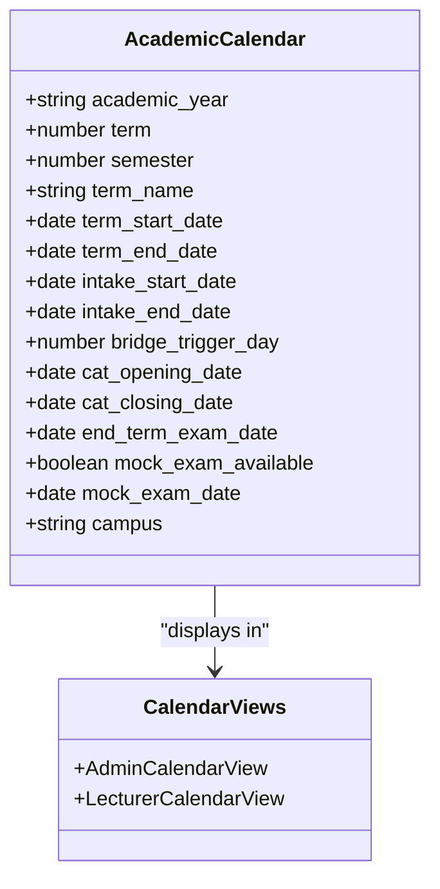
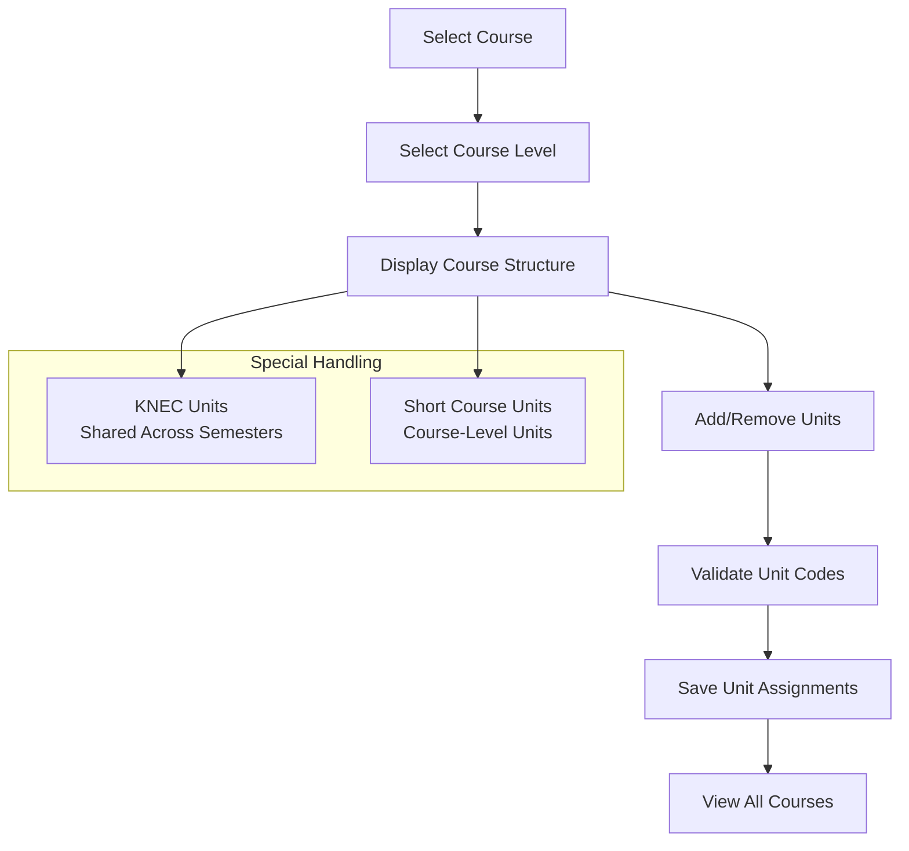
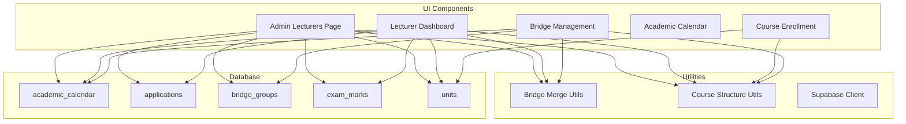

# Lecturer Management

<cite>
**Referenced Files in This Document**
- [app/admin/lecturers/page.tsx](file://app/admin/lecturers/page.tsx)
- [lib/bridge-merge.ts](file://lib/bridge-merge.ts)
- [app/lecturer/dashboard/page.tsx](file://app/lecturer/dashboard/page.tsx)
- [app/admin/dashboard/page.tsx](file://app/admin/dashboard/page.tsx)
- [app/admin/course-enrollment/page.tsx](file://app/admin/course-enrollment/page.tsx)
- [app/admin/calendar/page.tsx](file://app/admin/calendar/page.tsx)
- [app/lecturer/calendar/page.tsx](file://app/lecturer/calendar/page.tsx)
- [app/admin/bridge-management/page.tsx](file://app/admin/bridge-management/page.tsx)
- [lib/course-structure.ts](file://lib/course-structure.ts)
- [database.sql](file://database.sql)
- [migrations/add_campus_to_lecturers.sql](file://migrations/add_campus_to_lecturers.sql)
- [migrations/knec_units_shared_per_module.sql](file://migrations/knec_units_shared_per_module.sql)
</cite>

## Table of Contents
1. [Introduction](#introduction)
2. [Project Structure](#project-structure)
3. [Core Components](#core-components)
4. [Architecture Overview](#architecture-overview)
5. [Detailed Component Analysis](#detailed-component-analysis)
6. [Dependency Analysis](#dependency-analysis)
7. [Performance Considerations](#performance-considerations)
8. [Troubleshooting Guide](#troubleshooting-guide)
9. [Conclusion](#conclusion)

## Introduction
This document provides comprehensive documentation for the Lecturer Management system within the East Africa Vision Institute (EAVI) application. The system manages faculty assignments, grade submission workflows, and academic oversight across multiple campuses. It includes dedicated portals for lecturers to manage their teaching assignments, enter grades, and access academic calendars, alongside administrative dashboards for oversight and bridge stream management.

The system integrates with Supabase for authentication and data persistence, supporting both lecturer and administrative roles with role-based access control. It encompasses core features such as:
- Lecturer assignment management and migration
- Course enrollment and unit assignment
- Grade entry workflows with exam sitting limits
- Academic calendar management
- Bridge stream management for accelerated learning pathways

## Project Structure
The project follows a Next.js pages router structure with distinct areas for administration, lecturers, and students. Key directories and files relevant to the lecturer management system include:

- **Administrative Interfaces**:
  - `/app/admin/lecturers/page.tsx`: Admin interface for managing lecturers, including adding, editing, deleting, and migrating lecturer assignments
  - `/app/admin/course-enrollment/page.tsx`: Admin interface for assigning units to courses
  - `/app/admin/calendar/page.tsx`: Admin interface for managing academic calendar terms and exam schedules
  - `/app/admin/bridge-management/page.tsx`: Admin interface for bridge stream management
  - `/app/admin/dashboard/page.tsx`: Administrative dashboard with statistics and notifications

- **Lecturer Portal**:
  - `/app/lecturer/dashboard/page.tsx`: Lecturer dashboard for managing assignments, entering grades, and accessing academic calendar
  - `/app/lecturer/calendar/page.tsx`: Lecturer access to academic calendar

- **Shared Utilities**:
  - `/lib/bridge-merge.ts`: Bridge merge system for managing lecturer-course relationships and academic responsibilities
  - `/lib/course-structure.ts`: Course structure normalization and curriculum calculations

- **Database Schema and Migrations**:
  - `/database.sql`: Core database schema definitions
  - `/migrations/add_campus_to_lecturers.sql`: Migration to support multiple campuses for lecturers
  - `/migrations/knec_units_shared_per_module.sql`: Migration for KNEC unit sharing across semesters

**Diagram sources**
- [app/admin/dashboard/page.tsx:1-655](file://app/admin/dashboard/page.tsx#L1-L655)
- [app/admin/lecturers/page.tsx:1-568](file://app/admin/lecturers/page.tsx#L1-L568)
- [app/admin/course-enrollment/page.tsx:1-959](file://app/admin/course-enrollment/page.tsx#L1-L959)
- [app/admin/calendar/page.tsx:1-534](file://app/admin/calendar/page.tsx#L1-L534)
- [app/admin/bridge-management/page.tsx:1-295](file://app/admin/bridge-management/page.tsx#L1-L295)
- [app/lecturer/dashboard/page.tsx:1-1241](file://app/lecturer/dashboard/page.tsx#L1-L1241)
- [app/lecturer/calendar/page.tsx:1-208](file://app/lecturer/calendar/page.tsx#L1-L208)
- [lib/bridge-merge.ts:1-403](file://lib/bridge-merge.ts#L1-L403)
- [lib/course-structure.ts:1-322](file://lib/course-structure.ts#L1-L322)
- [database.sql:1-341](file://database.sql#L1-L341)

**Section sources**
- [app/admin/lecturers/page.tsx:1-568](file://app/admin/lecturers/page.tsx#L1-L568)
- [lib/bridge-merge.ts:1-403](file://lib/bridge-merge.ts#L1-L403)
- [app/lecturer/dashboard/page.tsx:1-1241](file://app/lecturer/dashboard/page.tsx#L1-L1241)
- [app/admin/dashboard/page.tsx:1-655](file://app/admin/dashboard/page.tsx#L1-L655)
- [app/admin/course-enrollment/page.tsx:1-959](file://app/admin/course-enrollment/page.tsx#L1-L959)
- [app/admin/calendar/page.tsx:1-534](file://app/admin/calendar/page.tsx#L1-L534)
- [app/lecturer/calendar/page.tsx:1-208](file://app/lecturer/calendar/page.tsx#L1-L208)
- [app/admin/bridge-management/page.tsx:1-295](file://app/admin/bridge-management/page.tsx#L1-L295)
- [lib/course-structure.ts:1-322](file://lib/course-structure.ts#L1-L322)
- [database.sql:1-341](file://database.sql#L1-L341)

## Core Components
This section outlines the primary components that enable the lecturer management system:

- **Lecturer Management Interface**:
  - Role-based authentication ensures only authorized users access the system
  - Supports multiple campuses with array-based campus storage for lecturers
  - Provides CRUD operations for lecturer records and assignment management
  - Includes migration functionality to transfer assignments between lecturers

- **Grade Submission Workflow**:
  - Integrated with course enrollment data to ensure accurate student enrollment
  - Implements exam-sitting limits based on course type configurations
  - Supports combined CAT and end-term assessments with separate CAT and end-term marks
  - Validates existing exam records to prevent duplicate submissions

- **Academic Calendar Integration**:
  - Admin-managed academic calendar with term dates and exam schedules
  - Lecturer access to academic calendar for planning and coordination
  - Bridge stream calendar integration for accelerated learning pathways

- **Bridge Stream Management**:
  - Automated bridge group creation based on enrollment timing
  - Accelerated curriculum delivery with catch-up mechanisms
  - Holiday bypass functionality for bridge students
  - Milestone-based merging of bridge students into main intake

- **Course Enrollment and Unit Assignment**:
  - Admin interface for assigning units to courses
  - Support for modular and short-course structures
  - KNEC unit sharing across semesters with specialized handling
  - Bulk unit addition for efficient course setup

**Section sources**
- [app/admin/lecturers/page.tsx:1-568](file://app/admin/lecturers/page.tsx#L1-L568)
- [lib/bridge-merge.ts:1-403](file://lib/bridge-merge.ts#L1-L403)
- [app/lecturer/dashboard/page.tsx:1-1241](file://app/lecturer/dashboard/page.tsx#L1-L1241)
- [app/admin/course-enrollment/page.tsx:1-959](file://app/admin/course-enrollment/page.tsx#L1-L959)
- [app/admin/calendar/page.tsx:1-534](file://app/admin/calendar/page.tsx#L1-L534)
- [app/admin/bridge-management/page.tsx:1-295](file://app/admin/bridge-management/page.tsx#L1-L295)
- [lib/course-structure.ts:1-322](file://lib/course-structure.ts#L1-L322)

## Architecture Overview
The system employs a layered architecture with clear separation between administrative and lecturer interfaces, shared utilities, and database persistence:

**Diagram sources**
- [app/admin/dashboard/page.tsx:1-655](file://app/admin/dashboard/page.tsx#L1-L655)
- [lib/bridge-merge.ts:1-403](file://lib/bridge-merge.ts#L1-L403)
- [lib/course-structure.ts:1-322](file://lib/course-structure.ts#L1-L322)

The architecture supports role-based access control with distinct interfaces for administrators, lecturers, and students. The bridge merge system operates independently while integrating with the main database through shared utilities.

**Section sources**
- [app/admin/dashboard/page.tsx:1-655](file://app/admin/dashboard/page.tsx#L1-L655)
- [lib/bridge-merge.ts:1-403](file://lib/bridge-merge.ts#L1-L403)
- [lib/course-structure.ts:1-322](file://lib/course-structure.ts#L1-L322)

## Detailed Component Analysis

### Lecturer Management Interface
The administrative lecturer management interface provides comprehensive functionality for managing faculty assignments and migration:

**Diagram sources**
- [app/admin/lecturers/page.tsx:1-568](file://app/admin/lecturers/page.tsx#L1-L568)

Key features include:
- Automatic lecturer number generation with unique identifiers
- Multi-campus support with array-based campus storage
- Assignment migration system for transferring responsibilities between lecturers
- Real-time validation and error handling
- Responsive UI with loading states and user feedback

**Section sources**
- [app/admin/lecturers/page.tsx:1-568](file://app/admin/lecturers/page.tsx#L1-L568)

### Grade Submission Workflow
The lecturer dashboard implements a comprehensive grade submission workflow with strict validation:

**Diagram sources**
- [app/lecturer/dashboard/page.tsx:264-465](file://app/lecturer/dashboard/page.tsx#L264-L465)

The workflow enforces:
- Exam-sitting limits based on course type configurations
- Combined CAT and end-term assessment handling
- Duplicate prevention through existing exam record checks
- Campus-aware grade submission for multi-campus institutions

**Section sources**
- [app/lecturer/dashboard/page.tsx:1-1241](file://app/lecturer/dashboard/page.tsx#L1-L1241)

### Bridge Merge System
The bridge merge system manages accelerated learning pathways for students who enroll after the intake trigger day:

**Diagram sources**
- [lib/bridge-merge.ts:207-326](file://lib/bridge-merge.ts#L207-L326)

Key capabilities include:
- Automated bridge group creation based on enrollment timing
- Accelerated curriculum delivery with catch-up mechanisms
- Holiday bypass functionality for bridge students
- Milestone-based progression tracking
- Batch merging of eligible students

**Section sources**
- [lib/bridge-merge.ts:1-403](file://lib/bridge-merge.ts#L1-L403)
- [app/admin/bridge-management/page.tsx:1-295](file://app/admin/bridge-management/page.tsx#L1-L295)

### Academic Calendar Integration
Both administrative and lecturer interfaces integrate with the academic calendar system:

**Diagram sources**
- [app/admin/calendar/page.tsx:11-28](file://app/admin/calendar/page.tsx#L11-L28)
- [app/lecturer/calendar/page.tsx:9-22](file://app/lecturer/calendar/page.tsx#L9-L22)

The calendar system supports:
- Term-based academic scheduling
- Exam period management (CAT and end-term)
- Mock exam scheduling
- Bridge stream integration with trigger day settings
- Multi-campus calendar management

**Section sources**
- [app/admin/calendar/page.tsx:1-534](file://app/admin/calendar/page.tsx#L1-L534)
- [app/lecturer/calendar/page.tsx:1-208](file://app/lecturer/calendar/page.tsx#L1-L208)

### Course Enrollment and Unit Assignment
The course enrollment system provides comprehensive unit assignment capabilities:

**Diagram sources**
- [app/admin/course-enrollment/page.tsx:143-208](file://app/admin/course-enrollment/page.tsx#L143-L208)

Features include:
- Modular course structure with semester-based units
- Short-course unit management
- KNEC unit sharing across semesters with specialized handling
- Bulk unit addition for efficient course setup
- Real-time validation and error handling

**Section sources**
- [app/admin/course-enrollment/page.tsx:1-959](file://app/admin/course-enrollment/page.tsx#L1-L959)
- [lib/course-structure.ts:1-322](file://lib/course-structure.ts#L1-L322)

## Dependency Analysis
The system exhibits clear dependency relationships between components:

**Diagram sources**
- [app/admin/lecturers/page.tsx:1-568](file://app/admin/lecturers/page.tsx#L1-L568)
- [app/lecturer/dashboard/page.tsx:1-1241](file://app/lecturer/dashboard/page.tsx#L1-L1241)
- [app/admin/course-enrollment/page.tsx:1-959](file://app/admin/course-enrollment/page.tsx#L1-L959)
- [app/admin/calendar/page.tsx:1-534](file://app/admin/calendar/page.tsx#L1-L534)
- [app/admin/bridge-management/page.tsx:1-295](file://app/admin/bridge-management/page.tsx#L1-L295)
- [lib/bridge-merge.ts:1-403](file://lib/bridge-merge.ts#L1-L403)
- [lib/course-structure.ts:1-322](file://lib/course-structure.ts#L1-L322)
- [database.sql:1-341](file://database.sql#L1-L341)

**Section sources**
- [app/admin/lecturers/page.tsx:1-568](file://app/admin/lecturers/page.tsx#L1-L568)
- [app/lecturer/dashboard/page.tsx:1-1241](file://app/lecturer/dashboard/page.tsx#L1-L1241)
- [app/admin/course-enrollment/page.tsx:1-959](file://app/admin/course-enrollment/page.tsx#L1-L959)
- [app/admin/calendar/page.tsx:1-534](file://app/admin/calendar/page.tsx#L1-L534)
- [app/admin/bridge-management/page.tsx:1-295](file://app/admin/bridge-management/page.tsx#L1-L295)
- [lib/bridge-merge.ts:1-403](file://lib/bridge-merge.ts#L1-L403)
- [lib/course-structure.ts:1-322](file://lib/course-structure.ts#L1-L322)
- [database.sql:1-341](file://database.sql#L1-L341)

## Performance Considerations
The system incorporates several performance optimization strategies:

- **Database Query Optimization**:
  - Efficient filtering by campus and status fields
  - Proper indexing on frequently queried columns (course_id, campus, status)
  - Batch operations for unit additions and updates

- **Client-Side Caching**:
  - Local state management for form data and selections
  - Reduced re-rendering through selective state updates
  - Memoization of computed values (course structure normalization)

- **Asynchronous Operations**:
  - Non-blocking operations for data loading and validation
  - Loading states to prevent concurrent submissions
  - Error boundaries for graceful failure handling

- **Bridge Stream Optimization**:
  - Efficient milestone checking using array operations
  - Optimized date calculations for timeline tracking
  - Batch processing for student merging operations

## Troubleshooting Guide

### Common Grade Submission Issues
**Issue**: "Failed to validate exam limits"
**Cause**: Student has exceeded allowed exam sitting limits for the period
**Solution**: 
1. Verify course type configuration in course enrollment
2. Check existing exam records for the student
3. Ensure exam type selection aligns with course type limits
4. Confirm semester selection matches course structure

**Issue**: "No student marks to save"
**Cause**: Course enrollment data mismatch or empty student list
**Solution**:
1. Verify course selection matches lecturer assignments
2. Check campus filtering for student enrollment
3. Confirm class name selection if applicable
4. Validate student enrollment status is "enrolled"

**Issue**: "Failed to save marks: duplicate key"
**Cause**: Attempting to submit duplicate exam records
**Solution**:
1. Check existing exam records for the same student and unit
2. Verify exam type selection uniqueness
3. Clear browser cache and retry submission
4. Contact administrator if issue persists

### Course Assignment Problems
**Issue**: "No units defined for this course"
**Cause**: Course lacks unit assignments in database
**Solution**:
1. Navigate to Course Enrollment interface
2. Add required units for the course
3. Verify unit codes and names are properly formatted
4. Check course type configuration for correct structure

**Issue**: "Lecturer not assigned to course"
**Cause**: Missing lecturer assignment record
**Solution**:
1. Access Lecturer Management interface
2. Verify lecturer has assignments for the selected campus
3. Add new assignment if missing
4. Confirm unit selection matches course structure

### Bridge Stream Management Issues
**Issue**: "Bridge group not found"
**Cause**: Missing or corrupted bridge group data
**Solution**:
1. Check academic calendar configuration for bridge trigger day
2. Verify student enrollment date meets bridge criteria
3. Review bridge group creation logs
4. Recreate bridge group if necessary

**Issue**: "Merge operation failed"
**Cause**: Students not meeting milestone requirements
**Solution**:
1. Verify milestone configuration (module and semester thresholds)
2. Check student progress records
3. Ensure all students have completed required coursework
4. Review catch-up hours calculation

### Academic Calendar Issues
**Issue**: "Calendar entries not displaying"
**Cause**: Campus filtering or data loading errors
**Solution**:
1. Verify campus selection matches user metadata
2. Check calendar entries for the selected campus
3. Refresh page to reload calendar data
4. Contact administrator for database access issues

**Section sources**
- [app/lecturer/dashboard/page.tsx:264-465](file://app/lecturer/dashboard/page.tsx#L264-L465)
- [app/admin/lecturers/page.tsx:145-223](file://app/admin/lecturers/page.tsx#L145-L223)
- [lib/bridge-merge.ts:207-326](file://lib/bridge-merge.ts#L207-L326)

## Conclusion
The Lecturer Management system provides a comprehensive solution for academic institution administration, combining robust lecturer management, streamlined grade submission workflows, and advanced bridge stream capabilities. The system's architecture supports scalability across multiple campuses while maintaining strict academic oversight through integrated validation and monitoring systems.

Key strengths of the system include:
- Seamless integration between administrative and lecturer interfaces
- Comprehensive validation systems preventing academic irregularities
- Flexible course structure support accommodating various educational models
- Automated bridge stream management reducing administrative burden
- Real-time academic calendar synchronization across all stakeholders

The system's modular design allows for future enhancements while maintaining stability and reliability. The bridge merge system particularly demonstrates innovative approaches to accelerated learning delivery, ensuring equitable educational opportunities for all students regardless of enrollment timing.