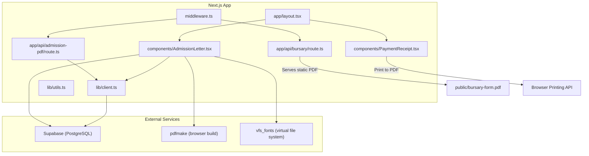
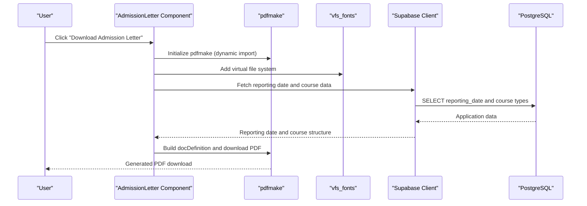
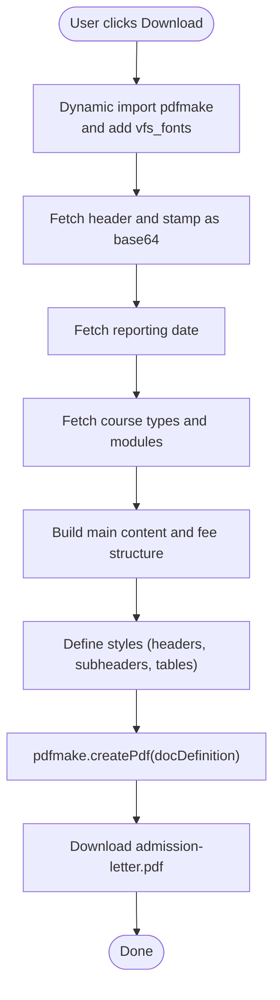
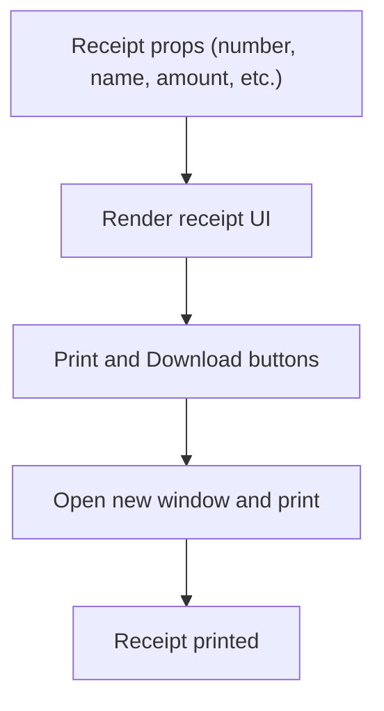
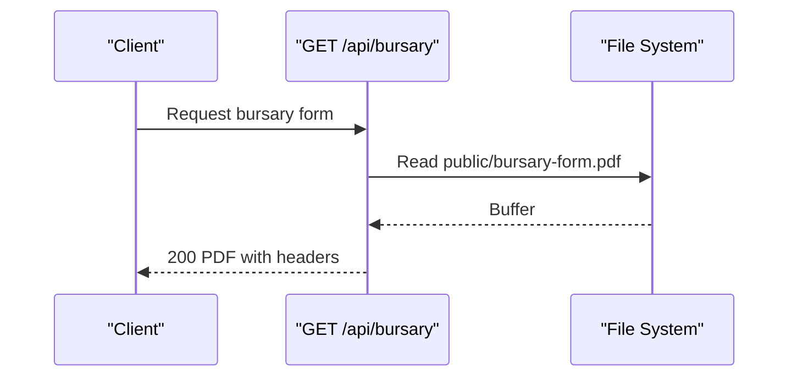
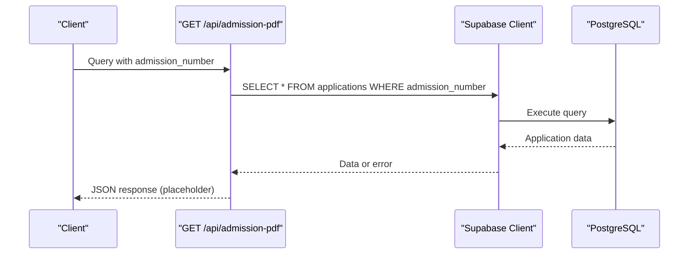
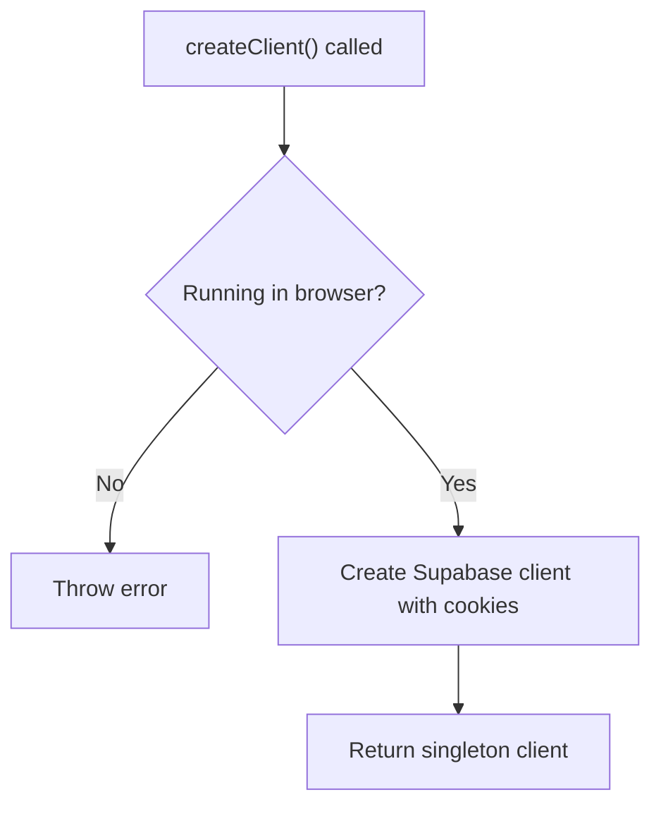
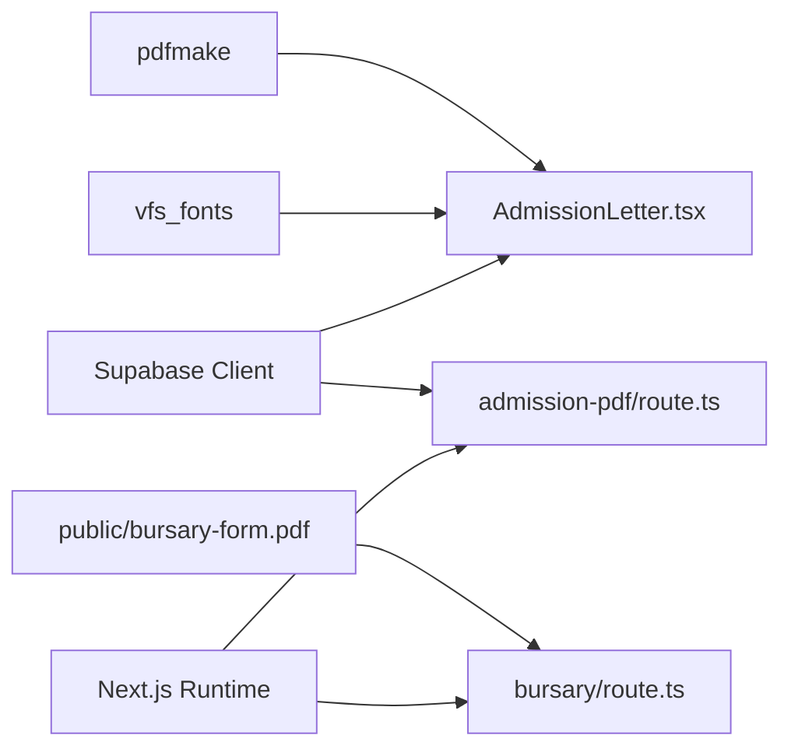

# PDF Generation System

<cite>
**Referenced Files in This Document**
- [route.ts](file://app/api/admission-pdf/route.ts)
- [route.ts](file://app/api/bursary/route.ts)
- [AdmissionLetter.tsx](file://components/AdmissionLetter.tsx)
- [PaymentReceipt.tsx](file://components/PaymentReceipt.tsx)
- [client.ts](file://lib/client.ts)
- [utils.ts](file://lib/utils.ts)
- [database.sql](file://database.sql)
- [package.json](file://package.json)
- [layout.tsx](file://app/layout.tsx)
- [middleware.ts](file://middleware.ts)
</cite>

## Table of Contents
1. [Introduction](#introduction)
2. [Project Structure](#project-structure)
3. [Core Components](#core-components)
4. [Architecture Overview](#architecture-overview)
5. [Detailed Component Analysis](#detailed-component-analysis)
6. [Dependency Analysis](#dependency-analysis)
7. [Performance Considerations](#performance-considerations)
8. [Troubleshooting Guide](#troubleshooting-guide)
9. [Conclusion](#conclusion)
10. [Appendices](#appendices)

## Introduction
This document describes the PDF Generation System used for academic documents and financial receipts at East Africa Vision Institute (EAVI). It focuses on the integration of the pdfmake library for dynamic document creation, including admission letters, payment receipts, and official transcripts. The system combines Next.js API routes for backend PDF generation, client-side components leveraging pdfmake for interactive PDF downloads, and Supabase for data retrieval. It also covers template structure, styling implementation, data binding, API endpoints, performance optimization, error handling, and customization guidelines.

## Project Structure
The PDF generation system spans several areas:
- API routes under app/api for server-side PDF generation endpoints
- Client-side React components under components for interactive PDF generation
- Supabase client wrapper under lib for database access
- Shared utilities and fonts integration via pdfmake
- Public assets for static PDF serving (e.g., bursary forms)

**Diagram sources**
- [route.ts:1-38](file://app/api/admission-pdf/route.ts#L1-L38)
- [route.ts:1-27](file://app/api/bursary/route.ts#L1-L27)
- [AdmissionLetter.tsx:1-500](file://components/AdmissionLetter.tsx#L1-L500)
- [PaymentReceipt.tsx:1-224](file://components/PaymentReceipt.tsx#L1-L224)
- [client.ts:1-42](file://lib/client.ts#L1-L42)
- [layout.tsx:1-38](file://app/layout.tsx#L1-L38)
- [middleware.ts:1-100](file://middleware.ts#L1-L100)

**Section sources**
- [route.ts:1-38](file://app/api/admission-pdf/route.ts#L1-L38)
- [route.ts:1-27](file://app/api/bursary/route.ts#L1-L27)
- [AdmissionLetter.tsx:1-500](file://components/AdmissionLetter.tsx#L1-L500)
- [PaymentReceipt.tsx:1-224](file://components/PaymentReceipt.tsx#L1-L224)
- [client.ts:1-42](file://lib/client.ts#L1-L42)
- [layout.tsx:1-38](file://app/layout.tsx#L1-L38)
- [middleware.ts:1-100](file://middleware.ts#L1-L100)

## Core Components
- Admission Letter Generator (client-side): Dynamically generates admission letters using pdfmake, loads images, fetches reporting dates and course fee structures from Supabase, and produces a downloadable PDF.
- Payment Receipt Component: Provides printable receipts with optional PDF download via browser printing APIs.
- Bursary Form Endpoint: Serves a pre-generated PDF from the public directory.
- Admission PDF API Route: Placeholder endpoint for future server-side admission letter generation.
- Supabase Client Wrapper: Centralized client initialization with cookie handling for browser environments.
- Shared Utilities: Utility functions for Tailwind merging and class composition.

**Section sources**
- [AdmissionLetter.tsx:1-500](file://components/AdmissionLetter.tsx#L1-L500)
- [PaymentReceipt.tsx:1-224](file://components/PaymentReceipt.tsx#L1-L224)
- [route.ts:1-27](file://app/api/bursary/route.ts#L1-L27)
- [route.ts:1-38](file://app/api/admission-pdf/route.ts#L1-L38)
- [client.ts:1-42](file://lib/client.ts#L1-L42)
- [utils.ts:1-7](file://lib/utils.ts#L1-L7)

## Architecture Overview
The system integrates three primary flows:
- Client-side PDF generation via pdfmake in the AdmissionLetter component
- Static PDF serving via the bursary API route
- Future server-side PDF generation via the admission-pdf API route

**Diagram sources**
- [AdmissionLetter.tsx:33-80](file://components/AdmissionLetter.tsx#L33-L80)
- [AdmissionLetter.tsx:82-149](file://components/AdmissionLetter.tsx#L82-L149)
- [AdmissionLetter.tsx:347-489](file://components/AdmissionLetter.tsx#L347-L489)
- [client.ts:1-42](file://lib/client.ts#L1-L42)

**Section sources**
- [AdmissionLetter.tsx:1-500](file://components/AdmissionLetter.tsx#L1-L500)
- [client.ts:1-42](file://lib/client.ts#L1-L42)

## Detailed Component Analysis

### Admission Letter Generator (Client-Side)
The AdmissionLetter component performs:
- Dynamic import of pdfmake and vfs_fonts to avoid SSR issues
- Loading header and stamp images as base64 for embedded assets
- Fetching reporting dates and course fee structures from Supabase
- Generating a multi-page document with fee structure tables and institutional branding
- Creating and downloading the PDF using pdfmake

Key implementation patterns:
- State management for images, reporting date, and course types
- Conditional fee structure generation based on study mode (module, short-course, or legacy)
- Table layout customization with borders and alternating fills
- Multi-column layout for payment notes and stamps
- Automatic PDF download via pdfmake.createPdf().download()

**Diagram sources**
- [AdmissionLetter.tsx:33-80](file://components/AdmissionLetter.tsx#L33-L80)
- [AdmissionLetter.tsx:82-149](file://components/AdmissionLetter.tsx#L82-L149)
- [AdmissionLetter.tsx:347-489](file://components/AdmissionLetter.tsx#L347-L489)

**Section sources**
- [AdmissionLetter.tsx:1-500](file://components/AdmissionLetter.tsx#L1-L500)

### Payment Receipt Component
The PaymentReceipt component:
- Accepts receipt data as props
- Renders a printable receipt with student and payment details
- Provides Print and Download PDF actions (currently uses browser print to PDF)

**Diagram sources**
- [PaymentReceipt.tsx:20-94](file://components/PaymentReceipt.tsx#L20-L94)

**Section sources**
- [PaymentReceipt.tsx:1-224](file://components/PaymentReceipt.tsx#L1-L224)

### Bursary Form API Endpoint
The bursary route:
- Reads a pre-generated PDF from the public directory
- Returns a properly formatted PDF response with appropriate headers
- Includes caching and error handling

**Diagram sources**
- [route.ts:5-21](file://app/api/bursary/route.ts#L5-L21)

**Section sources**
- [route.ts:1-27](file://app/api/bursary/route.ts#L1-L27)

### Admission PDF API Endpoint (Placeholder)
The admission-pdf route:
- Validates presence of admission_number query parameter
- Fetches application data from the applications table
- Returns a placeholder response indicating pending implementation

**Diagram sources**
- [route.ts:4-31](file://app/api/admission-pdf/route.ts#L4-L31)
- [client.ts:1-42](file://lib/client.ts#L1-L42)

**Section sources**
- [route.ts:1-38](file://app/api/admission-pdf/route.ts#L1-L38)
- [client.ts:1-42](file://lib/client.ts#L1-L42)

### Supabase Client Integration
The client wrapper:
- Creates a browser-only Supabase client
- Manages cookies for authentication
- Ensures client is only initialized in the browser environment

**Diagram sources**
- [client.ts:5-41](file://lib/client.ts#L5-L41)

**Section sources**
- [client.ts:1-42](file://lib/client.ts#L1-L42)

## Dependency Analysis
External dependencies and integrations:
- pdfmake and vfs_fonts for client-side PDF generation
- Supabase for data retrieval (applications, reporting_dates, courses)
- Next.js API routes for server-side endpoints
- Public directory for static PDF serving

**Diagram sources**
- [package.json:11-28](file://package.json#L11-L28)
- [AdmissionLetter.tsx:33-46](file://components/AdmissionLetter.tsx#L33-L46)
- [route.ts:1-38](file://app/api/admission-pdf/route.ts#L1-L38)
- [route.ts:1-27](file://app/api/bursary/route.ts#L1-L27)

**Section sources**
- [package.json:11-28](file://package.json#L11-L28)
- [AdmissionLetter.tsx:1-500](file://components/AdmissionLetter.tsx#L1-L500)
- [route.ts:1-38](file://app/api/admission-pdf/route.ts#L1-L38)
- [route.ts:1-27](file://app/api/bursary/route.ts#L1-L27)

## Performance Considerations
- Client-side PDF generation:
  - Dynamic import of pdfmake reduces initial bundle size
  - Images are fetched once and cached in component state
  - Avoid unnecessary re-renders by memoizing computed content
- API routes:
  - Keep queries minimal and selective (only required fields)
  - Consider pagination for large datasets
  - Cache frequently accessed data (e.g., reporting dates) at the application level
- Static PDF serving:
  - Serve compressed PDFs and enable HTTP caching headers
- Rendering:
  - Limit heavy computations during PDF generation
  - Use efficient table layouts and avoid excessive nested elements

[No sources needed since this section provides general guidance]

## Troubleshooting Guide
Common issues and resolutions:
- pdfmake not loaded:
  - Ensure dynamic import executes in the browser environment
  - Verify vfs_fonts are added to the pdfmake virtual file system
- Missing images:
  - Confirm image URLs are accessible and return valid blobs
  - Validate base64 conversion and fallbacks
- Supabase errors:
  - Check credentials and network connectivity
  - Validate query filters and table permissions
- API route errors:
  - Admission PDF route returns placeholder; implement pdfmake generation and error handling
  - Bursary route returns 404 if file is missing; verify path and permissions
- Styling inconsistencies:
  - Adjust styles and table layouts in docDefinition
  - Test across browsers for font rendering

**Section sources**
- [AdmissionLetter.tsx:33-80](file://components/AdmissionLetter.tsx#L33-L80)
- [AdmissionLetter.tsx:347-489](file://components/AdmissionLetter.tsx#L347-L489)
- [route.ts:33-36](file://app/api/admission-pdf/route.ts#L33-L36)
- [route.ts:22-25](file://app/api/bursary/route.ts#L22-L25)

## Conclusion
The PDF Generation System leverages client-side pdfmake for dynamic document creation, Supabase for robust data access, and Next.js API routes for scalable backend integration. While the admission-letter generation is fully functional in the component, the admission-pdf API route remains a placeholder for server-side generation. The bursary form is served statically. With careful attention to performance, error handling, and styling, the system can be extended to support additional document types such as transcripts and payment receipts.

[No sources needed since this section summarizes without analyzing specific files]

## Appendices

### API Endpoints Summary
- GET /api/admission-pdf
  - Purpose: Admission letter generation (placeholder)
  - Query: admission_number (required)
  - Response: JSON placeholder; future: PDF binary
- GET /api/bursary
  - Purpose: Serve bursary form PDF
  - Response: 200 with PDF headers; 404 if not found

**Section sources**
- [route.ts:4-31](file://app/api/admission-pdf/route.ts#L4-L31)
- [route.ts:5-21](file://app/api/bursary/route.ts#L5-L21)

### Data Model References
- Applications table: admission_number, full_name, course_id, course_type_id, campus, status
- Reporting dates table: month, year, reporting_date
- Courses and course_types tables: course metadata, fee structure, study modes

**Section sources**
- [database.sql:25-57](file://database.sql#L25-L57)
- [database.sql:273-281](file://database.sql#L273-L281)
- [database.sql:106-120](file://database.sql#L106-L120)
- [database.sql:94-105](file://database.sql#L94-L105)

### Template Structure and Styling
- Document definition includes:
  - Content arrays combining main letter content and dynamically generated fee structure
  - Styles for headers, subheaders, and table cells
  - Table layout customization with borders and fill colors
- Layout customization:
  - Multi-column sections for payment notes and stamps
  - Page breaks for multi-page documents
  - Alignment and spacing adjustments for readability

**Section sources**
- [AdmissionLetter.tsx:477-489](file://components/AdmissionLetter.tsx#L477-L489)
- [AdmissionLetter.tsx:306-344](file://components/AdmissionLetter.tsx#L306-L344)

### Practical Examples
- Admission Letter:
  - Data binding: studentData, reportingDate, courseName, courseTypes
  - Dynamic content: fee structure tables, payment details, institutional branding
- Payment Receipt:
  - Props-driven rendering with printable UI and optional PDF download
- Bursary Form:
  - Static PDF served via API route with caching headers

**Section sources**
- [AdmissionLetter.tsx:24-149](file://components/AdmissionLetter.tsx#L24-L149)
- [PaymentReceipt.tsx:20-94](file://components/PaymentReceipt.tsx#L20-L94)
- [route.ts:5-21](file://app/api/bursary/route.ts#L5-L21)

### Guidelines for Customization and New Document Types
- Extend the AdmissionLetter component pattern:
  - Define docDefinition content and styles
  - Fetch required data from Supabase
  - Handle study-mode-specific structures
- Add new API routes:
  - Follow existing route.ts patterns
  - Validate inputs and handle errors gracefully
  - Return appropriate headers for PDF responses
- Integrate new templates:
  - Use pdfmake’s layout options for tables, columns, and page breaks
  - Ensure responsive and accessible styling
- Performance:
  - Minimize dynamic imports and optimize image loading
  - Cache frequently accessed data and use efficient queries

**Section sources**
- [AdmissionLetter.tsx:347-489](file://components/AdmissionLetter.tsx#L347-L489)
- [route.ts:1-38](file://app/api/admission-pdf/route.ts#L1-L38)
- [route.ts:1-27](file://app/api/bursary/route.ts#L1-L27)