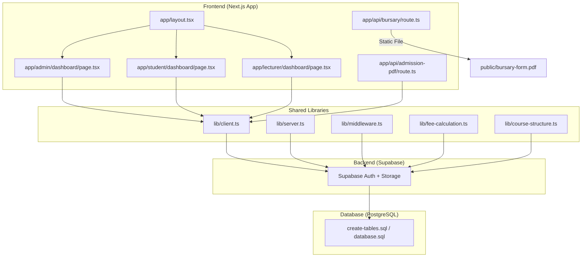
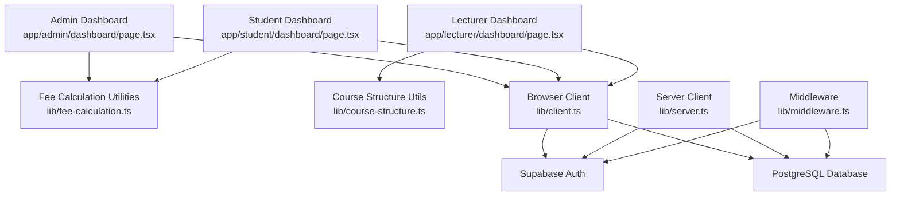
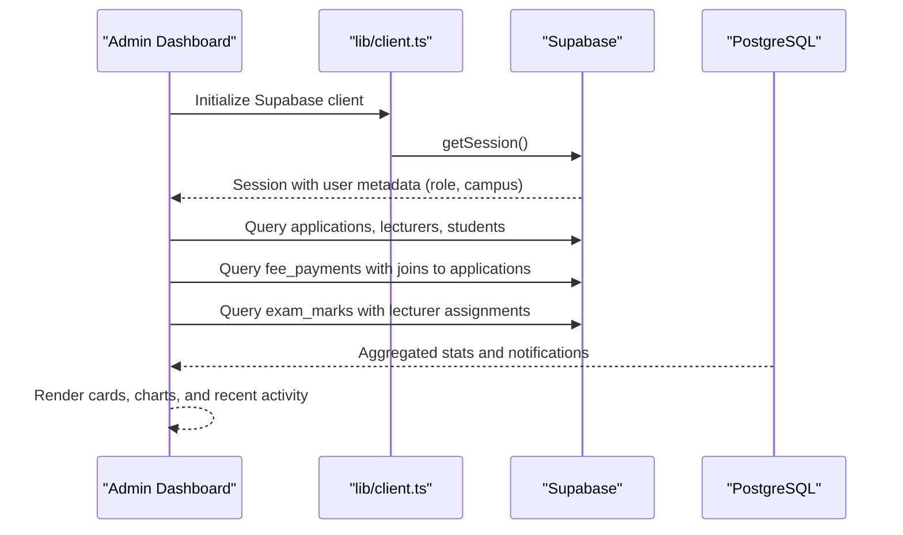
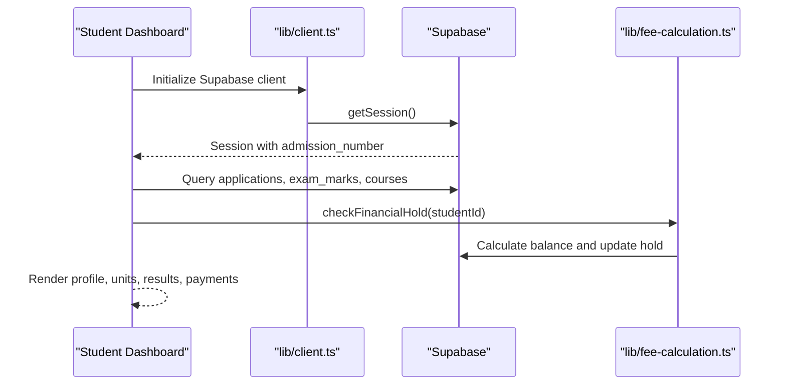
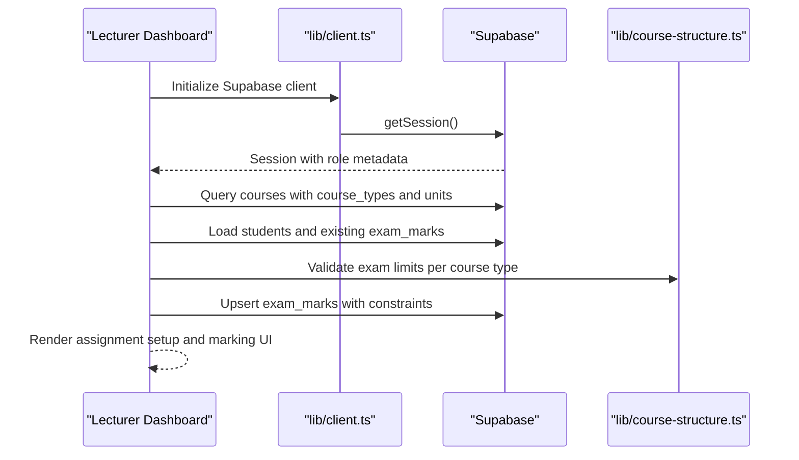
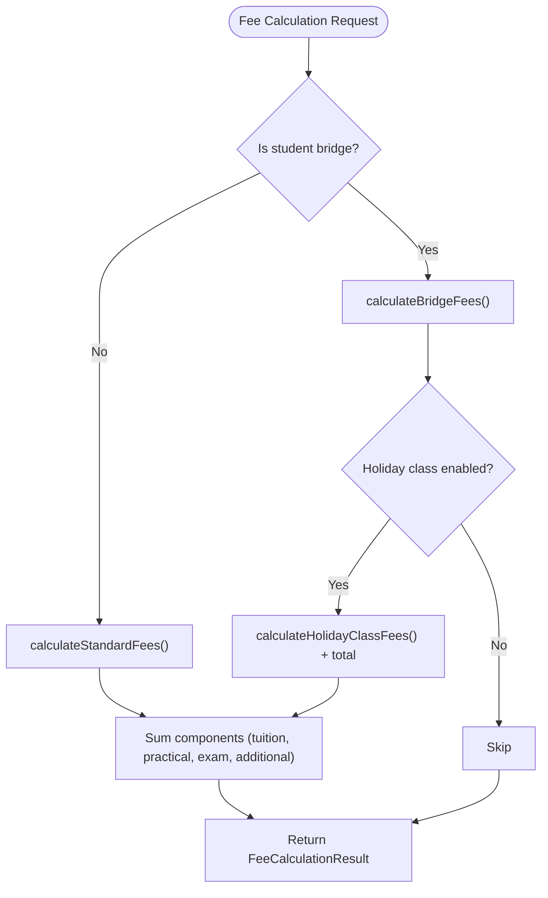
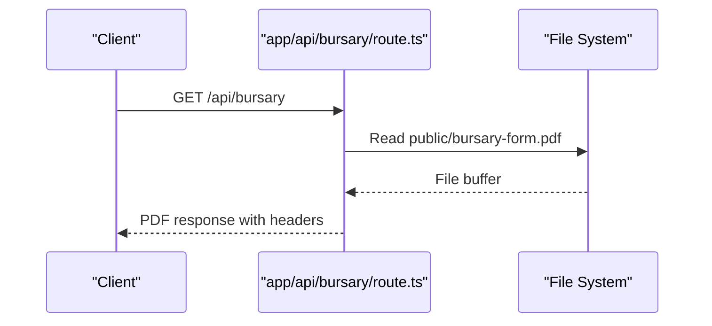
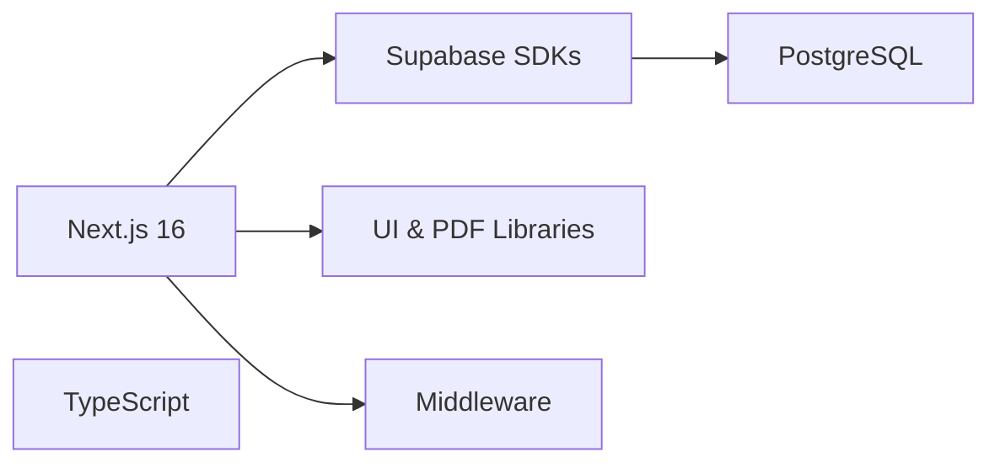

# Project Overview

<cite>
**Referenced Files in This Document**
- [README.md](file://README.md)
- [package.json](file://package.json)
- [next.config.ts](file://next.config.ts)
- [lib/client.ts](file://lib/client.ts)
- [lib/server.ts](file://lib/server.ts)
- [lib/middleware.ts](file://lib/middleware.ts)
- [lib/fee-calculation.ts](file://lib/fee-calculation.ts)
- [lib/course-structure.ts](file://lib/course-structure.ts)
- [app/layout.tsx](file://app/layout.tsx)
- [app/admin/dashboard/page.tsx](file://app/admin/dashboard/page.tsx)
- [app/student/dashboard/page.tsx](file://app/student/dashboard/page.tsx)
- [app/lecturer/dashboard/page.tsx](file://app/lecturer/dashboard/page.tsx)
- [app/api/admission-pdf/route.ts](file://app/api/admission-pdf/route.ts)
- [app/api/bursary/route.ts](file://app/api/bursary/route.ts)
- [database.sql](file://database.sql)
- [create-tables.sql](file://create-tables.sql)
</cite>

## Table of Contents
1. [Introduction](#introduction)
2. [Project Structure](#project-structure)
3. [Core Components](#core-components)
4. [Architecture Overview](#architecture-overview)
5. [Detailed Component Analysis](#detailed-component-analysis)
6. [Dependency Analysis](#dependency-analysis)
7. [Performance Considerations](#performance-considerations)
8. [Troubleshooting Guide](#troubleshooting-guide)
9. [Conclusion](#conclusion)
10. [Appendices](#appendices)

## Introduction
The EAVI College Management System is an educational institution management platform designed to serve East Africa Vision Institute (EAVI). Its core value proposition lies in digitizing and automating academic administration workflows across admissions, academic records, financial processing, and multi-campus coordination. Built with modern web technologies, the system enables administrators, lecturers, and students to collaborate efficiently while maintaining compliance with diverse examination bodies and institutional policies.

The system positions itself within the broader educational technology ecosystem by integrating secure authentication, real-time data synchronization, and standardized academic calendars. It supports multiple modes of study (semester, module, and short-course), accommodates bridge programs for accelerated learning, and provides robust financial workflows including installment plans and late-fee calculations.

Practical impact on institutional workflows:
- Streamlined admissions decisions with centralized application tracking and automated status updates.
- Automated academic record keeping with exam marking workflows aligned to KNEC, JP, and CDACC frameworks.
- Transparent financial operations with real-time balance checks, payment tracking, and PDF-based receipts.
- Multi-campus operations with campus-aware dashboards and synchronized academic calendars.

## Project Structure
The project follows a Next.js 16 app directory structure with a clear separation of concerns:
- app/: Application pages and routes organized by role (admin, lecturer, student) and shared resources (login, api).
- lib/: Shared utilities for Supabase client initialization, middleware, course structure normalization, and fee calculations.
- migrations/: Database migration scripts for schema evolution and integrity.
- public/: Static assets and downloadable forms (e.g., bursary form).
- Database schema: Centralized in SQL files defining tables, constraints, and relationships.

**Diagram sources**
- [app/layout.tsx:1-38](file://app/layout.tsx#L1-L38)
- [app/admin/dashboard/page.tsx:1-655](file://app/admin/dashboard/page.tsx#L1-L655)
- [app/student/dashboard/page.tsx:1-800](file://app/student/dashboard/page.tsx#L1-L800)
- [app/lecturer/dashboard/page.tsx:1-800](file://app/lecturer/dashboard/page.tsx#L1-L800)
- [app/api/admission-pdf/route.ts:1-38](file://app/api/admission-pdf/route.ts#L1-L38)
- [app/api/bursary/route.ts:1-27](file://app/api/bursary/route.ts#L1-L27)
- [lib/client.ts:1-42](file://lib/client.ts#L1-L42)
- [lib/server.ts:1-34](file://lib/server.ts#L1-L34)
- [lib/middleware.ts:1-75](file://lib/middleware.ts#L1-L75)
- [lib/fee-calculation.ts:1-584](file://lib/fee-calculation.ts#L1-L584)
- [lib/course-structure.ts:1-322](file://lib/course-structure.ts#L1-L322)
- [create-tables.sql:1-200](file://create-tables.sql#L1-L200)
- [database.sql:1-200](file://database.sql#L1-L200)

**Section sources**
- [README.md:1-2](file://README.md#L1-L2)
- [package.json:1-41](file://package.json#L1-L41)
- [next.config.ts:1-8](file://next.config.ts#L1-L8)
- [app/layout.tsx:1-38](file://app/layout.tsx#L1-L38)

## Core Components
- Authentication and Session Management: Supabase Auth integrated via server and browser clients with middleware enforcing role-based routing.
- Role-Based Dashboards: Admin, Lecturer, and Student dashboards tailored to their workflows and permissions.
- Academic Data Model: Courses, course types, modules, semesters, units, and academic calendar supporting multiple exam bodies.
- Financial Engine: Fee calculation, installment planning, late fees, and payment tracking with financial holds.
- Reporting and Documents: PDF generation for results and fee structures, plus static bursary form delivery.

Key implementation artifacts:
- Supabase client initialization for browser and server environments.
- Middleware for session validation and redirection.
- Course structure normalization for flexible study modes.
- Fee calculation utilities for standard and bridge students.

**Section sources**
- [lib/client.ts:1-42](file://lib/client.ts#L1-L42)
- [lib/server.ts:1-34](file://lib/server.ts#L1-L34)
- [lib/middleware.ts:1-75](file://lib/middleware.ts#L1-L75)
- [lib/course-structure.ts:1-322](file://lib/course-structure.ts#L1-L322)
- [lib/fee-calculation.ts:1-584](file://lib/fee-calculation.ts#L1-L584)

## Architecture Overview
The system employs a modern full-stack architecture:
- Frontend: Next.js 16 App Router with TypeScript, Tailwind CSS, and React 19.
- Backend: Supabase providing authentication, database, and serverless functions.
- Data Layer: PostgreSQL schema with normalized tables for applications, courses, exams, and finances.
- Security: Middleware validates sessions and enforces role-based access.

**Diagram sources**
- [app/admin/dashboard/page.tsx:1-655](file://app/admin/dashboard/page.tsx#L1-L655)
- [app/student/dashboard/page.tsx:1-800](file://app/student/dashboard/page.tsx#L1-L800)
- [app/lecturer/dashboard/page.tsx:1-800](file://app/lecturer/dashboard/page.tsx#L1-L800)
- [lib/client.ts:1-42](file://lib/client.ts#L1-L42)
- [lib/server.ts:1-34](file://lib/server.ts#L1-L34)
- [lib/middleware.ts:1-75](file://lib/middleware.ts#L1-L75)
- [lib/fee-calculation.ts:1-584](file://lib/fee-calculation.ts#L1-L584)
- [lib/course-structure.ts:1-322](file://lib/course-structure.ts#L1-L322)

## Detailed Component Analysis

### Admin Dashboard
The Admin Dashboard orchestrates institutional oversight with:
- Real-time statistics: applications, enrollment counts, lecturers, and monthly revenue.
- Payment analytics: payment method distribution and recent transactions.
- Notifications: exam marks submissions aggregated per lecturer and unit.
- Multi-campus filtering: campus-aware queries for accurate reporting.

**Diagram sources**
- [app/admin/dashboard/page.tsx:35-114](file://app/admin/dashboard/page.tsx#L35-L114)
- [app/admin/dashboard/page.tsx:116-159](file://app/admin/dashboard/page.tsx#L116-L159)
- [lib/client.ts:1-42](file://lib/client.ts#L1-L42)

**Section sources**
- [app/admin/dashboard/page.tsx:1-655](file://app/admin/dashboard/page.tsx#L1-L655)

### Student Dashboard
The Student Dashboard provides:
- Personal profile and enrollment details.
- Course structure visualization with units mapped to semesters/modules.
- Exam results viewing and PDF generation (results and fee structures).
- Payment history and financial hold status with auto-refresh.
- Unit-specific lecturer contacts derived from assignments.

**Diagram sources**
- [app/student/dashboard/page.tsx:70-114](file://app/student/dashboard/page.tsx#L70-L114)
- [app/student/dashboard/page.tsx:102-114](file://app/student/dashboard/page.tsx#L102-L114)
- [lib/fee-calculation.ts:559-583](file://lib/fee-calculation.ts#L559-L583)
- [lib/client.ts:1-42](file://lib/client.ts#L1-L42)

**Section sources**
- [app/student/dashboard/page.tsx:1-800](file://app/student/dashboard/page.tsx#L1-L800)
- [lib/fee-calculation.ts:1-584](file://lib/fee-calculation.ts#L1-L584)

### Lecturer Dashboard
The Lecturer Dashboard enables:
- Assignment setup across campuses, departments, courses, and units.
- Exam marking workflow with validation against course type limits.
- Student list population and existing marks preloading.
- Campus-aware filtering and class grouping.

**Diagram sources**
- [app/lecturer/dashboard/page.tsx:162-207](file://app/lecturer/dashboard/page.tsx#L162-L207)
- [app/lecturer/dashboard/page.tsx:284-392](file://app/lecturer/dashboard/page.tsx#L284-L392)
- [lib/course-structure.ts:212-237](file://lib/course-structure.ts#L212-L237)
- [lib/client.ts:1-42](file://lib/client.ts#L1-L42)

**Section sources**
- [app/lecturer/dashboard/page.tsx:1-800](file://app/lecturer/dashboard/page.tsx#L1-L800)
- [lib/course-structure.ts:1-322](file://lib/course-structure.ts#L1-L322)

### Financial Processing Engine
The financial engine encapsulates:
- Fee calculation for standard and bridge students with pro-rata adjustments.
- Installment plan creation and overdue tracking with late fees.
- Balance computation and automatic financial hold updates.
- Holiday class fee calculation for bridge streams.

**Diagram sources**
- [lib/fee-calculation.ts:379-397](file://lib/fee-calculation.ts#L379-L397)
- [lib/fee-calculation.ts:215-285](file://lib/fee-calculation.ts#L215-L285)
- [lib/fee-calculation.ts:287-336](file://lib/fee-calculation.ts#L287-L336)
- [lib/fee-calculation.ts:338-374](file://lib/fee-calculation.ts#L338-L374)

**Section sources**
- [lib/fee-calculation.ts:1-584](file://lib/fee-calculation.ts#L1-L584)

### API Endpoints
- Admission PDF Endpoint: Placeholder for future PDF generation of admission letters.
- Bursary Form Endpoint: Serves a static PDF from the public directory.

**Diagram sources**
- [app/api/bursary/route.ts:1-27](file://app/api/bursary/route.ts#L1-L27)

**Section sources**
- [app/api/admission-pdf/route.ts:1-38](file://app/api/admission-pdf/route.ts#L1-L38)
- [app/api/bursary/route.ts:1-27](file://app/api/bursary/route.ts#L1-L27)

## Dependency Analysis
The system’s dependencies span frontend, backend, and database layers:
- Next.js 16 App Router with TypeScript for type-safe routing and SSR/SSG.
- Supabase SDKs for client-server communication and authentication.
- Utility libraries for UI (Tailwind, Radix UI), PDF generation (jspdf, pdfmake), and styling (clsx, lucide-react).
- Middleware ensures consistent session validation across routes.

**Diagram sources**
- [package.json:11-28](file://package.json#L11-L28)
- [lib/middleware.ts:1-75](file://lib/middleware.ts#L1-L75)
- [lib/client.ts:1-42](file://lib/client.ts#L1-L42)
- [lib/server.ts:1-34](file://lib/server.ts#L1-L34)

**Section sources**
- [package.json:1-41](file://package.json#L1-L41)
- [next.config.ts:1-8](file://next.config.ts#L1-L8)

## Performance Considerations
- Client Initialization: Use singleton pattern for Supabase client in browser to avoid redundant instances.
- Middleware Efficiency: Minimize database reads in middleware; cache claims and enforce early redirects.
- Query Optimization: Leverage indexed columns (e.g., applications(admission_number), exam_marks(application_id)) and selective joins.
- Real-Time Updates: Debounce frequent UI refreshes (e.g., financial hold checks) to reduce network overhead.
- PDF Generation: Defer heavy PDF builds to background or server actions to keep UI responsive.

## Troubleshooting Guide
Common issues and resolutions:
- Authentication Failures: Verify environment variables for Supabase URL and publishable key; ensure cookies are readable in browser context.
- Role-Based Routing: Confirm user metadata includes role and campus; middleware redirects unauthenticated users to login.
- Financial Hold Lockups: Trigger balance recalculation after payments; ensure update hooks fire to unlock transcripts.
- Middleware Cookie Sync: Preserve cookie integrity when creating custom responses; mirror cookie changes to response headers.

**Section sources**
- [lib/middleware.ts:10-75](file://lib/middleware.ts#L10-L75)
- [lib/client.ts:5-41](file://lib/client.ts#L5-L41)
- [lib/server.ts:8-33](file://lib/server.ts#L8-L33)
- [lib/fee-calculation.ts:539-555](file://lib/fee-calculation.ts#L539-L555)

## Conclusion
The EAVI College Management System consolidates academic administration into a cohesive, scalable platform. By leveraging Next.js 16, Supabase, and TypeScript, it achieves secure, maintainable, and extensible functionality across admissions, academics, and finance. The modular course structure and financial engine accommodate diverse study modes and institutional needs, while role-based dashboards streamline daily operations. As the system evolves, continued investment in PDF generation, reporting, and integrations will further enhance its value to East Africa Vision Institute and similar institutions.

## Appendices
- Database Schema Highlights:
  - Academic calendar with term and intake scheduling.
  - Applications with campus, stream type, and financial hold tracking.
  - Course types supporting semester/module/short-course modes.
  - Exam marks with CAT/end-term and combined assessments.
  - Fee payments and structure tables enabling detailed financial reporting.

**Section sources**
- [create-tables.sql:132-200](file://create-tables.sql#L132-L200)
- [database.sql:4-200](file://database.sql#L4-L200)