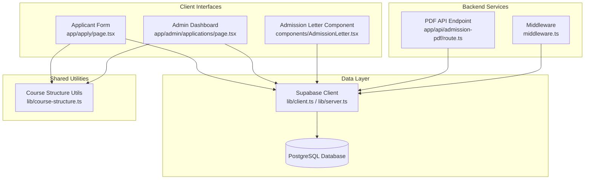
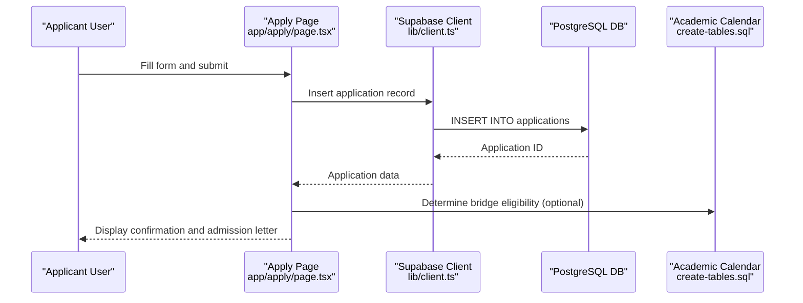
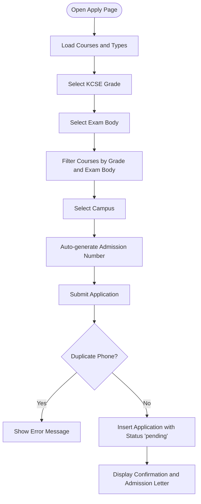
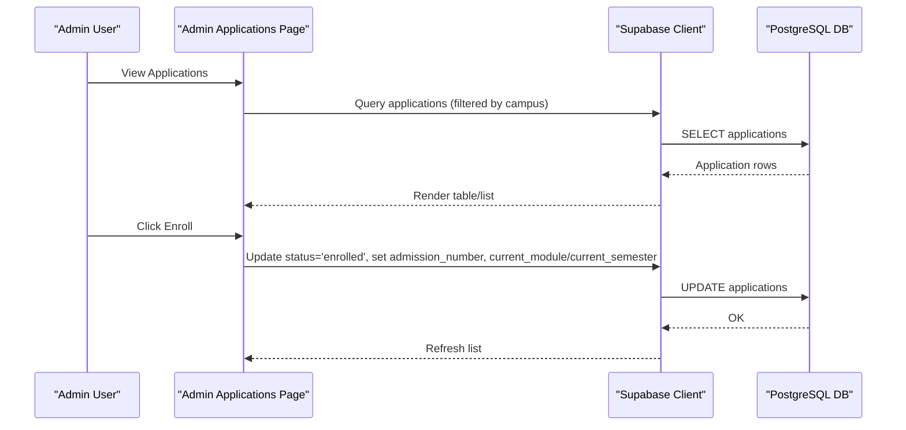
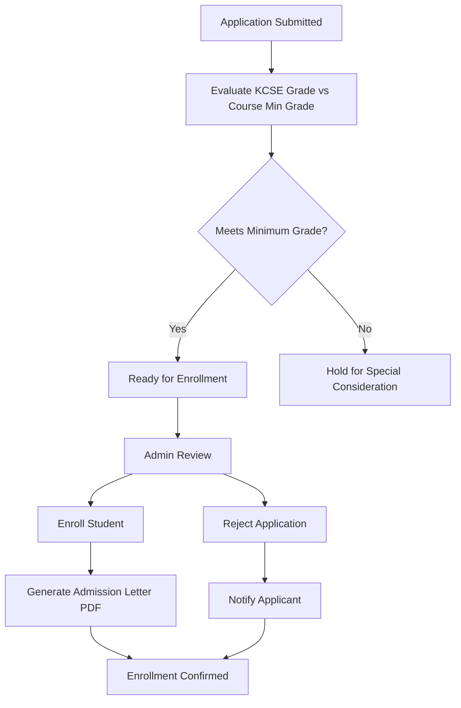
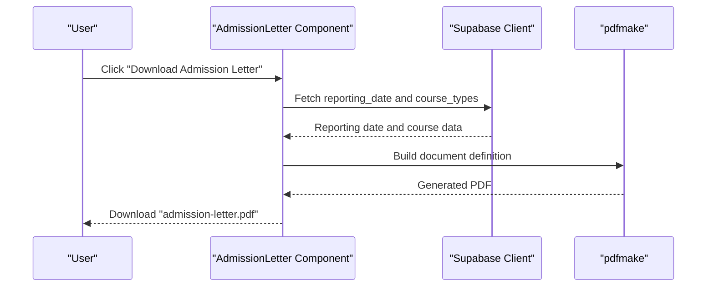
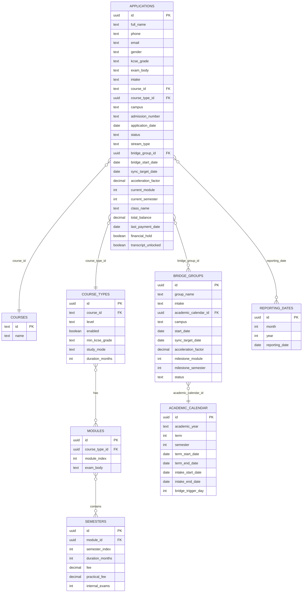
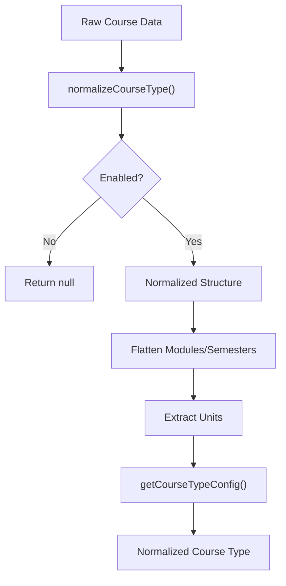
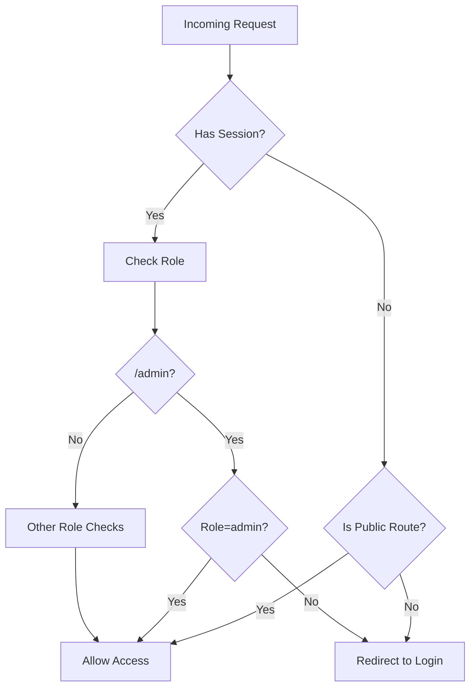
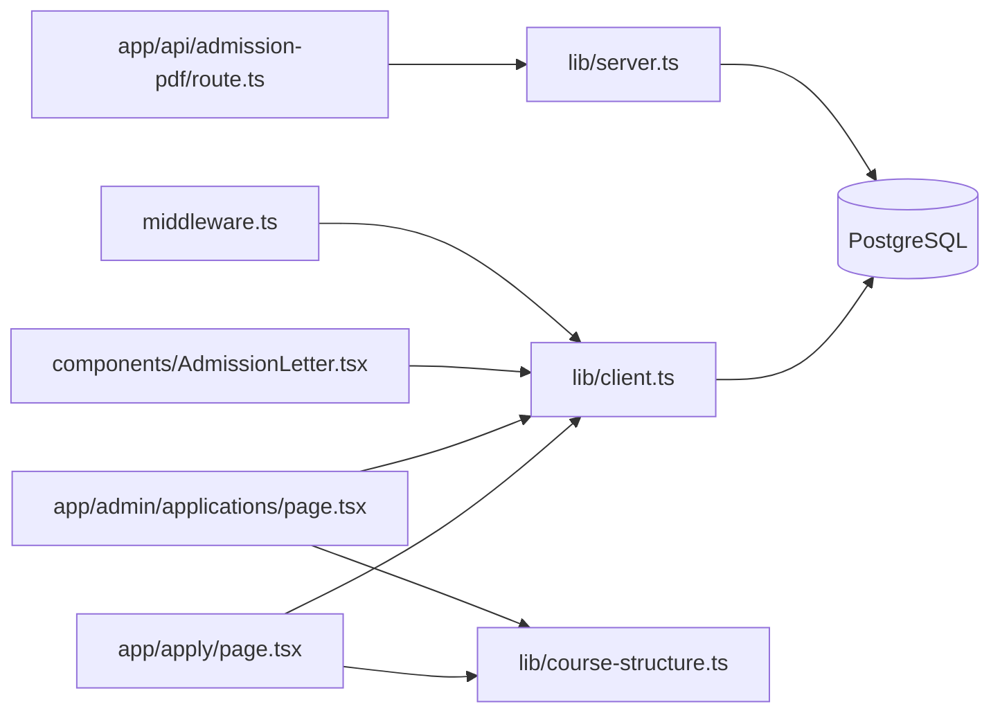

# Admissions Processing

<cite>
**Referenced Files in This Document**
- [app/admin/applications/page.tsx](file://app/admin/applications/page.tsx)
- [app/apply/page.tsx](file://app/apply/page.tsx)
- [components/AdmissionLetter.tsx](file://components/AdmissionLetter.tsx)
- [app/api/admission-pdf/route.ts](file://app/api/admission-pdf/route.ts)
- [lib/course-structure.ts](file://lib/course-structure.ts)
- [lib/client.ts](file://lib/client.ts)
- [lib/server.ts](file://lib/server.ts)
- [create-tables.sql](file://create-tables.sql)
- [database.sql](file://database.sql)
- [middleware.ts](file://middleware.ts)
- [migrations/add_min_kcse_grade_to_course_types.sql](file://migrations/add_min_kcse_grade_to_course_types.sql)
- [migrations/fix_applications_campus_constraint.sql](file://migrations/fix_applications_campus_constraint.sql)
</cite>

## Table of Contents
1. [Introduction](#introduction)
2. [Project Structure](#project-structure)
3. [Core Components](#core-components)
4. [Architecture Overview](#architecture-overview)
5. [Detailed Component Analysis](#detailed-component-analysis)
6. [Dependency Analysis](#dependency-analysis)
7. [Performance Considerations](#performance-considerations)
8. [Troubleshooting Guide](#troubleshooting-guide)
9. [Conclusion](#conclusion)

## Introduction
This document describes the complete admissions processing system for EAVI College, covering the end-to-end workflow from application submission to enrollment confirmation. It explains the application form interface, required documentation collection, application review processes, admission decision workflow, and the admission letter generation system using PDF templates and dynamic content processing. It also documents the relationships among applications, admission decisions, and enrollment records, and outlines stakeholder roles and common scenarios including fresh applications, transfer students, and special consideration cases.

## Project Structure
The admissions system is implemented as a Next.js application with:
- Client-side application form for prospective students
- Admin dashboard for managing applications and enrolling students
- PDF generation for admission letters
- Supabase-backed data model for applications, courses, and academic calendars
- Middleware for role-based access control

**Diagram sources**
- [app/apply/page.tsx:1-815](file://app/apply/page.tsx#L1-L815)
- [app/admin/applications/page.tsx:1-1086](file://app/admin/applications/page.tsx#L1-L1086)
- [components/AdmissionLetter.tsx:1-500](file://components/AdmissionLetter.tsx#L1-L500)
- [app/api/admission-pdf/route.ts:1-38](file://app/api/admission-pdf/route.ts#L1-L38)
- [lib/client.ts:1-42](file://lib/client.ts#L1-L42)
- [lib/server.ts:1-34](file://lib/server.ts#L1-L34)
- [lib/course-structure.ts:1-322](file://lib/course-structure.ts#L1-L322)
- [middleware.ts:1-100](file://middleware.ts#L1-L100)

**Section sources**
- [app/apply/page.tsx:1-815](file://app/apply/page.tsx#L1-L815)
- [app/admin/applications/page.tsx:1-1086](file://app/admin/applications/page.tsx#L1-L1086)
- [components/AdmissionLetter.tsx:1-500](file://components/AdmissionLetter.tsx#L1-L500)
- [app/api/admission-pdf/route.ts:1-38](file://app/api/admission-pdf/route.ts#L1-L38)
- [lib/client.ts:1-42](file://lib/client.ts#L1-L42)
- [lib/server.ts:1-34](file://lib/server.ts#L1-L34)
- [lib/course-structure.ts:1-322](file://lib/course-structure.ts#L1-L322)
- [middleware.ts:1-100](file://middleware.ts#L1-L100)

## Core Components
- Application Form (Prospective Students): Collects personal details, academic credentials, preferred campus, intake, course, and course type. Automatically suggests eligible courses based on KCSE grade and exam body. Generates admission number and submits application with status "pending".
- Admin Applications Dashboard: Lists applications filtered by campus, supports enrollment actions, rejection, and semester upgrades. Calculates initial balances for enrollment and generates class names from application dates.
- Admission Letter Generator: Dynamically builds an admission letter PDF using pdfmake, incorporating reporting dates, course fee structures, and institutional branding.
- Data Model: Relational schema supporting applications, courses, course types, modules, semesters, academic calendars, and bridge programs.
- Middleware and Authentication: Role-based routing and access control for admin, student, and lecturer dashboards.

**Section sources**
- [app/apply/page.tsx:15-815](file://app/apply/page.tsx#L15-L815)
- [app/admin/applications/page.tsx:30-1086](file://app/admin/applications/page.tsx#L30-L1086)
- [components/AdmissionLetter.tsx:24-500](file://components/AdmissionLetter.tsx#L24-L500)
- [create-tables.sql:175-205](file://create-tables.sql#L175-L205)
- [middleware.ts:4-86](file://middleware.ts#L4-L86)

## Architecture Overview
The system follows a client-server architecture with Supabase as the backend-as-a-service:
- Client-side React components handle user interactions and data presentation.
- Supabase manages authentication, real-time subscriptions, and database operations.
- Shared utilities normalize course structures and calculate academic progress.
- Middleware enforces role-based access control across protected routes.

**Diagram sources**
- [app/apply/page.tsx:276-447](file://app/apply/page.tsx#L276-L447)
- [lib/client.ts:5-42](file://lib/client.ts#L5-L42)
- [create-tables.sql:132-152](file://create-tables.sql#L132-L152)

**Section sources**
- [app/apply/page.tsx:276-447](file://app/apply/page.tsx#L276-L447)
- [lib/client.ts:5-42](file://lib/client.ts#L5-L42)
- [create-tables.sql:132-152](file://create-tables.sql#L132-L152)

## Detailed Component Analysis

### Application Form Interface
The application form captures:
- Personal information: full name, phone, optional email, gender
- Academic credentials: KCSE grade (with predefined scale), exam body selection
- Intake preferences: month and year
- Course selection: dynamically filtered by exam body and grade
- Campus selection: Main or West Campus
- Automatic admission number generation based on campus and random sequence
- Submission validation and duplicate phone check

**Diagram sources**
- [app/apply/page.tsx:70-447](file://app/apply/page.tsx#L70-L447)

**Section sources**
- [app/apply/page.tsx:15-815](file://app/apply/page.tsx#L15-L815)

### Admin Applications Dashboard
The admin dashboard enables:
- Filtering applications by campus
- Enrolling students with admission number assignment and initial balance calculation
- Rejecting applications
- Upgrading student semesters based on academic progress
- Generating class names from application dates

**Diagram sources**
- [app/admin/applications/page.tsx:144-376](file://app/admin/applications/page.tsx#L144-L376)

**Section sources**
- [app/admin/applications/page.tsx:30-1086](file://app/admin/applications/page.tsx#L30-L1086)

### Admission Decision Workflow
The system supports:
- Automated eligibility checks based on KCSE grade thresholds and course type configurations
- Manual review and action (enroll/reject) by administrators
- Decision notifications via UI feedback and PDF letter generation

**Diagram sources**
- [app/apply/page.tsx:172-229](file://app/apply/page.tsx#L172-L229)
- [app/admin/applications/page.tsx:281-396](file://app/admin/applications/page.tsx#L281-L396)

**Section sources**
- [app/apply/page.tsx:172-229](file://app/apply/page.tsx#L172-L229)
- [app/admin/applications/page.tsx:281-396](file://app/admin/applications/page.tsx#L281-L396)

### Admission Letter Generation System
The admission letter generator:
- Dynamically loads pdfmake and fonts
- Fetches reporting dates and course fee structures
- Builds a multi-page PDF with institutional branding and fee details
- Provides a download button for the generated letter

**Diagram sources**
- [components/AdmissionLetter.tsx:33-489](file://components/AdmissionLetter.tsx#L33-L489)

**Section sources**
- [components/AdmissionLetter.tsx:24-500](file://components/AdmissionLetter.tsx#L24-L500)

### Data Model and Relationships
The database schema defines core entities and their relationships:
- Applications link to Courses and Course Types
- Course Types define study modes, durations, and minimum KCSE grades
- Modules and Semesters define academic progression
- Academic Calendar governs intake windows and bridge program triggers
- Reporting Dates determine student reporting deadlines

**Diagram sources**
- [create-tables.sql:54-205](file://create-tables.sql#L54-L205)
- [database.sql:25-120](file://database.sql#L25-L120)

**Section sources**
- [create-tables.sql:54-205](file://create-tables.sql#L54-L205)
- [database.sql:25-120](file://database.sql#L25-L120)

### Course Structure Normalization
Course structure utilities normalize heterogeneous course data from the database into a consistent format for downstream logic, including:
- Normalizing course types (enabled, min KCSE grade, study mode, duration)
- Flattening modules and semesters into periods
- Supporting short-course configurations
- Accelerating curriculum for bridge students

**Diagram sources**
- [lib/course-structure.ts:58-237](file://lib/course-structure.ts#L58-L237)

**Section sources**
- [lib/course-structure.ts:1-322](file://lib/course-structure.ts#L1-L322)

### Role-Based Access Control
Middleware enforces role-based access control:
- Public routes: home, application form, login pages
- Protected routes: admin, student, lecturer dashboards
- Redirects unauthorized users to appropriate login pages
- Preserves session synchronization across server and client

**Diagram sources**
- [middleware.ts:4-86](file://middleware.ts#L4-L86)

**Section sources**
- [middleware.ts:4-86](file://middleware.ts#L4-L86)

## Dependency Analysis
The system exhibits clear separation of concerns:
- UI components depend on Supabase clients for data access
- Course structure utilities encapsulate normalization logic
- Middleware coordinates authentication and routing
- Database schema enforces referential integrity and business rules

**Diagram sources**
- [app/apply/page.tsx:6](file://app/apply/page.tsx#L6)
- [app/admin/applications/page.tsx:6](file://app/admin/applications/page.tsx#L6)
- [components/AdmissionLetter.tsx:5](file://components/AdmissionLetter.tsx#L5)
- [app/api/admission-pdf/route.ts:2](file://app/api/admission-pdf/route.ts#L2)
- [lib/client.ts:14-41](file://lib/client.ts#L14-L41)
- [lib/server.ts:11-32](file://lib/server.ts#L11-L32)
- [lib/course-structure.ts:1-322](file://lib/course-structure.ts#L1-L322)
- [middleware.ts:9-28](file://middleware.ts#L9-L28)

**Section sources**
- [app/apply/page.tsx:6](file://app/apply/page.tsx#L6)
- [app/admin/applications/page.tsx:6](file://app/admin/applications/page.tsx#L6)
- [components/AdmissionLetter.tsx:5](file://components/AdmissionLetter.tsx#L5)
- [app/api/admission-pdf/route.ts:2](file://app/api/admission-pdf/route.ts#L2)
- [lib/client.ts:14-41](file://lib/client.ts#L14-L41)
- [lib/server.ts:11-32](file://lib/server.ts#L11-L32)
- [lib/course-structure.ts:1-322](file://lib/course-structure.ts#L1-L322)
- [middleware.ts:9-28](file://middleware.ts#L9-L28)

## Performance Considerations
- Client-side Supabase client creation is scoped to browser environments to avoid SSR issues.
- Course data is fetched once and cached in component state to minimize repeated queries.
- PDF generation is deferred to client-side to prevent blocking server requests.
- Middleware creates a new Supabase client per request to ensure session consistency.

## Troubleshooting Guide
Common issues and resolutions:
- Missing Documentation
  - Symptom: Admission letter PDF lacks fee details
  - Resolution: Ensure course types and reporting dates are configured in the database
  - Section sources
    - [components/AdmissionLetter.tsx:83-149](file://components/AdmissionLetter.tsx#L83-L149)
    - [create-tables.sql:132-152](file://create-tables.sql#L132-L152)

- System Errors During Enrollment
  - Symptom: Admin action fails with database error
  - Resolution: Verify campus constraint normalization and course type linkage
  - Section sources
    - [migrations/fix_applications_campus_constraint.sql:1-28](file://migrations/fix_applications_campus_constraint.sql#L1-L28)
    - [app/admin/applications/page.tsx:218-246](file://app/admin/applications/page.tsx#L218-L246)

- Enrollment Conflicts
  - Symptom: Duplicate admission number or conflicting semester upgrade
  - Resolution: Validate admission number uniqueness and current module/semester fields
  - Section sources
    - [app/admin/applications/page.tsx:398-519](file://app/admin/applications/page.tsx#L398-L519)
    - [create-tables.sql:175-205](file://create-tables.sql#L175-L205)

- Access Denied
  - Symptom: Redirect to login despite authenticated session
  - Resolution: Confirm middleware matcher and role metadata are correctly set
  - Section sources
    - [middleware.ts:4-86](file://middleware.ts#L4-L86)

## Conclusion
The admissions processing system integrates a responsive application form, robust administrative controls, and dynamic PDF generation to streamline the complete lifecycle from application to enrollment. The relational data model and shared utilities ensure consistent evaluation of eligibility and academic progression, while middleware and Supabase provide secure, role-aware access. The documented workflows and troubleshooting steps enable efficient operation and maintenance of the admissions process.