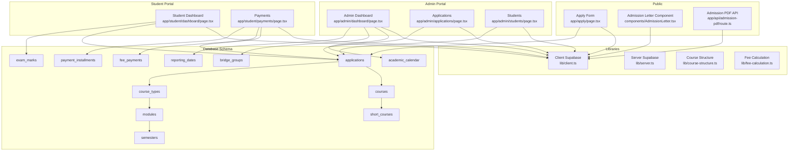
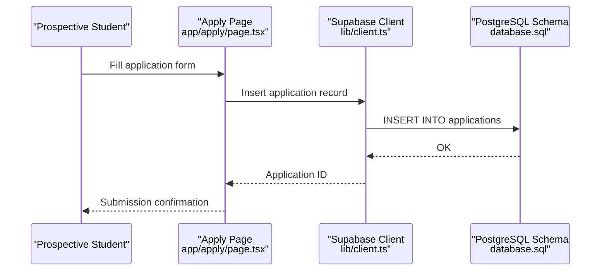
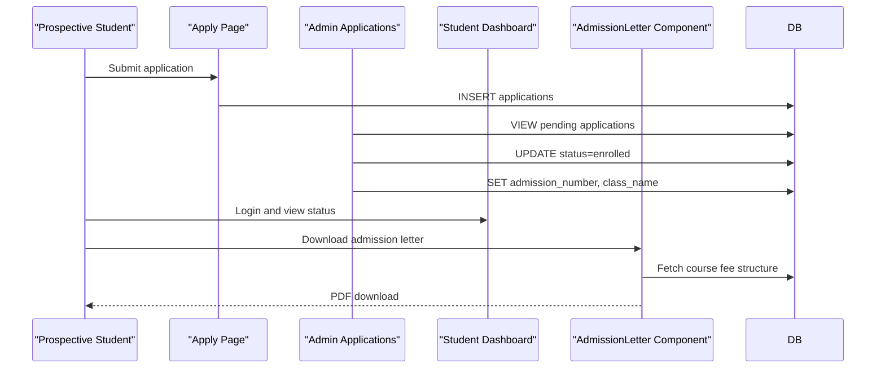
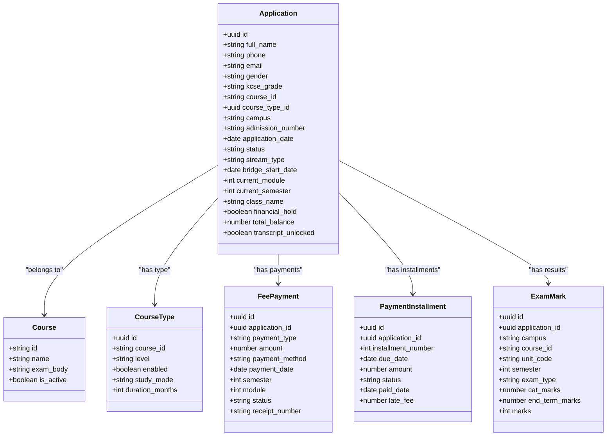
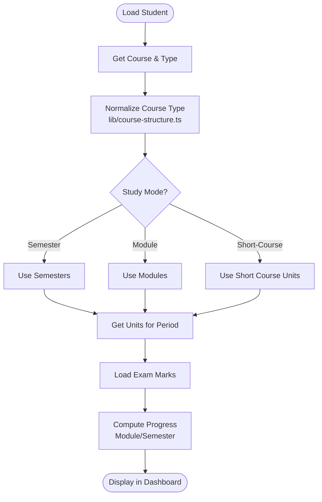
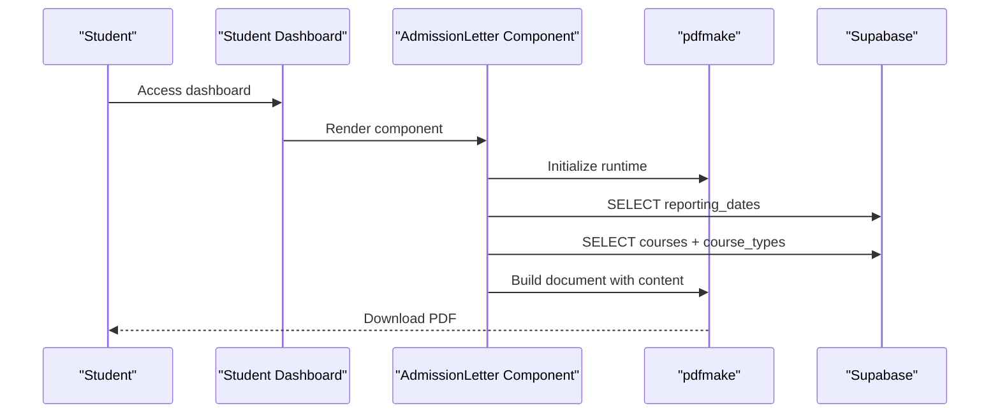
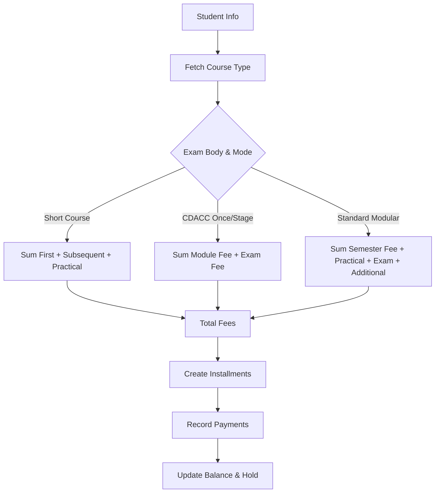
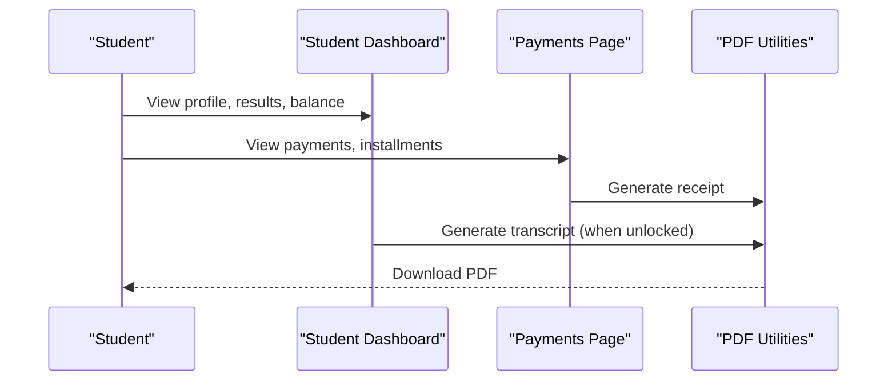
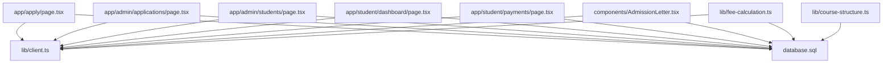

# Student Management

<cite>
**Referenced Files in This Document**
- [README.md](file://README.md)
- [app/admin/applications/page.tsx](file://app/admin/applications/page.tsx)
- [app/admin/students/page.tsx](file://app/admin/students/page.tsx)
- [app/admin/dashboard/page.tsx](file://app/admin/dashboard/page.tsx)
- [app/apply/page.tsx](file://app/apply/page.tsx)
- [app/student/dashboard/page.tsx](file://app/student/dashboard/page.tsx)
- [app/student/payments/page.tsx](file://app/student/payments/page.tsx)
- [app/api/admission-pdf/route.ts](file://app/api/admission-pdf/route.ts)
- [components/AdmissionLetter.tsx](file://components/AdmissionLetter.tsx)
- [lib/client.ts](file://lib/client.ts)
- [lib/server.ts](file://lib/server.ts)
- [lib/course-structure.ts](file://lib/course-structure.ts)
- [lib/fee-calculation.ts](file://lib/fee-calculation.ts)
- [database.sql](file://database.sql)
</cite>

## Table of Contents
1. [Introduction](#introduction)
2. [Project Structure](#project-structure)
3. [Core Components](#core-components)
4. [Architecture Overview](#architecture-overview)
5. [Detailed Component Analysis](#detailed-component-analysis)
6. [Dependency Analysis](#dependency-analysis)
7. [Performance Considerations](#performance-considerations)
8. [Troubleshooting Guide](#troubleshooting-guide)
9. [Conclusion](#conclusion)
10. [Appendices](#appendices)

## Introduction
This document describes the Student Management system, focusing on admissions processing, student records, and academic progress tracking. It covers the complete admissions workflow from application submission through enrollment confirmation, the student record management system including personal information, academic history, and financial status tracking, and the student dashboard functionality providing access to academic records, payment status, and course enrollment. It also documents the admission letter generation system and PDF document creation processes, explains the relationships between applications, enrollments, and academic records, and provides practical examples of common student management scenarios including new student onboarding, transfer processing, and graduation tracking. Finally, it addresses student portal features and self-service capabilities and offers troubleshooting guidance for student data management issues and enrollment problems.

## Project Structure
The system is a Next.js application with TypeScript, using Supabase for authentication and database access. Key areas:
- Admin portal for admissions, student records, course enrollment, results, and financial reporting
- Public application form for prospective students
- Student portal for viewing academic records, payments, and downloading transcripts
- Shared libraries for client-side Supabase access, course structure normalization, and fee calculations
- Database schema defining core entities and relationships

**Diagram sources**
- [app/admin/dashboard/page.tsx:11-655](file://app/admin/dashboard/page.tsx#L11-L655)
- [app/admin/applications/page.tsx:30-1086](file://app/admin/applications/page.tsx#L30-L1086)
- [app/admin/students/page.tsx:27-290](file://app/admin/students/page.tsx#L27-L290)
- [app/apply/page.tsx:15-815](file://app/apply/page.tsx#L15-L815)
- [components/AdmissionLetter.tsx:24-500](file://components/AdmissionLetter.tsx#L24-L500)
- [app/api/admission-pdf/route.ts:4-38](file://app/api/admission-pdf/route.ts#L4-L38)
- [app/student/dashboard/page.tsx:12-1419](file://app/student/dashboard/page.tsx#L12-L1419)
- [app/student/payments/page.tsx:41-378](file://app/student/payments/page.tsx#L41-L378)
- [lib/client.ts:5-42](file://lib/client.ts#L5-L42)
- [lib/server.ts:8-34](file://lib/server.ts#L8-L34)
- [lib/course-structure.ts:58-237](file://lib/course-structure.ts#L58-L237)
- [lib/fee-calculation.ts:42-584](file://lib/fee-calculation.ts#L42-L584)
- [database.sql:25-341](file://database.sql#L25-L341)

**Section sources**
- [README.md:1-2](file://README.md#L1-L2)
- [app/admin/dashboard/page.tsx:11-655](file://app/admin/dashboard/page.tsx#L11-L655)
- [app/admin/applications/page.tsx:30-1086](file://app/admin/applications/page.tsx#L30-L1086)
- [app/admin/students/page.tsx:27-290](file://app/admin/students/page.tsx#L27-L290)
- [app/apply/page.tsx:15-815](file://app/apply/page.tsx#L15-L815)
- [components/AdmissionLetter.tsx:24-500](file://components/AdmissionLetter.tsx#L24-L500)
- [app/api/admission-pdf/route.ts:4-38](file://app/api/admission-pdf/route.ts#L4-L38)
- [app/student/dashboard/page.tsx:12-1419](file://app/student/dashboard/page.tsx#L12-L1419)
- [app/student/payments/page.tsx:41-378](file://app/student/payments/page.tsx#L41-L378)
- [lib/client.ts:5-42](file://lib/client.ts#L5-L42)
- [lib/server.ts:8-34](file://lib/server.ts#L8-L34)
- [lib/course-structure.ts:58-237](file://lib/course-structure.ts#L58-L237)
- [lib/fee-calculation.ts:42-584](file://lib/fee-calculation.ts#L42-L584)
- [database.sql:25-341](file://database.sql#L25-L341)

## Core Components
- Admissions processing: Application submission, review, enrollment, and class assignment
- Student records: Personal information, academic history, and financial status
- Academic progress: Units, semesters, modules, and exam results
- Financial management: Fee calculation, installments, payments, and holds
- Reporting and PDFs: Admission letters, transcripts, and fee structures

Key implementation highlights:
- Admin pages for managing applications and students with filtering by campus
- Student dashboard with results, transcripts, and payment status
- Admission letter generation with dynamic fee structure and branding assets
- Fee calculation supporting multiple exam bodies and study modes
- Course structure normalization for flexible curriculum modeling

**Section sources**
- [app/admin/applications/page.tsx:30-1086](file://app/admin/applications/page.tsx#L30-L1086)
- [app/admin/students/page.tsx:27-290](file://app/admin/students/page.tsx#L27-L290)
- [app/apply/page.tsx:15-815](file://app/apply/page.tsx#L15-L815)
- [app/student/dashboard/page.tsx:12-1419](file://app/student/dashboard/page.tsx#L12-L1419)
- [components/AdmissionLetter.tsx:24-500](file://components/AdmissionLetter.tsx#L24-L500)
- [lib/fee-calculation.ts:42-584](file://lib/fee-calculation.ts#L42-L584)
- [lib/course-structure.ts:58-237](file://lib/course-structure.ts#L58-L237)

## Architecture Overview
The system follows a layered architecture:
- Presentation layer: Next.js pages and components
- Business logic: Shared libraries for course structure and fee calculation
- Data access: Supabase client/server utilities
- Data model: Relational schema with normalized entities

**Diagram sources**
- [app/apply/page.tsx:276-447](file://app/apply/page.tsx#L276-L447)
- [lib/client.ts:5-42](file://lib/client.ts#L5-L42)
- [database.sql:25-58](file://database.sql#L25-L58)

**Section sources**
- [app/apply/page.tsx:276-447](file://app/apply/page.tsx#L276-L447)
- [lib/client.ts:5-42](file://lib/client.ts#L5-L42)
- [database.sql:25-58](file://database.sql#L25-L58)

## Detailed Component Analysis

### Admissions Workflow
End-to-end admissions processing:
- Application submission with course selection, exam body, and campus
- Automatic admission number generation
- Admin review and enrollment actions
- Class assignment and initial balance calculation
- Admission letter generation

**Diagram sources**
- [app/apply/page.tsx:276-447](file://app/apply/page.tsx#L276-L447)
- [app/admin/applications/page.tsx:281-376](file://app/admin/applications/page.tsx#L281-L376)
- [app/student/dashboard/page.tsx:116-146](file://app/student/dashboard/page.tsx#L116-L146)
- [components/AdmissionLetter.tsx:347-489](file://components/AdmissionLetter.tsx#L347-L489)
- [database.sql:25-58](file://database.sql#L25-L58)

**Section sources**
- [app/apply/page.tsx:15-815](file://app/apply/page.tsx#L15-L815)
- [app/admin/applications/page.tsx:30-1086](file://app/admin/applications/page.tsx#L30-L1086)
- [components/AdmissionLetter.tsx:24-500](file://components/AdmissionLetter.tsx#L24-L500)
- [database.sql:25-58](file://database.sql#L25-L58)

### Student Records Management
Student records include personal information, academic history, and financial status:
- Personal details: name, contact, gender, KCSE grade
- Academic profile: course, type, campus, class, module/semester progression
- Financial profile: total balance, financial hold, payment history, installments

**Diagram sources**
- [database.sql:25-341](file://database.sql#L25-L341)

**Section sources**
- [app/admin/students/page.tsx:27-290](file://app/admin/students/page.tsx#L27-L290)
- [app/student/dashboard/page.tsx:116-146](file://app/student/dashboard/page.tsx#L116-L146)
- [app/student/payments/page.tsx:82-156](file://app/student/payments/page.tsx#L82-L156)
- [database.sql:25-341](file://database.sql#L25-L341)

### Academic Progress Tracking
Tracking academic progress involves units, semesters, modules, and exam results:
- Course structure normalization supports semester, module, and short-course modes
- Units mapped per module/semester
- Exam results stored with CAT and end-term components
- Progression controlled by module/semester increments

**Diagram sources**
- [app/student/dashboard/page.tsx:269-367](file://app/student/dashboard/page.tsx#L269-L367)
- [lib/course-structure.ts:212-261](file://lib/course-structure.ts#L212-L261)
- [database.sql:131-150](file://database.sql#L131-L150)

**Section sources**
- [app/student/dashboard/page.tsx:269-367](file://app/student/dashboard/page.tsx#L269-L367)
- [lib/course-structure.ts:212-261](file://lib/course-structure.ts#L212-L261)
- [database.sql:131-150](file://database.sql#L131-L150)

### Admission Letter Generation
Admission letter generation includes dynamic fee structure and branded assets:
- Dynamic pdfmake initialization
- Fetch reporting date and course fee structure
- Generate combined admission letter and fee structure PDF
- Downloadable PDF with header and stamp images

**Diagram sources**
- [app/student/dashboard/page.tsx:402-546](file://app/student/dashboard/page.tsx#L402-L546)
- [components/AdmissionLetter.tsx:347-489](file://components/AdmissionLetter.tsx#L347-L489)
- [database.sql:273-281](file://database.sql#L273-L281)

**Section sources**
- [components/AdmissionLetter.tsx:24-500](file://components/AdmissionLetter.tsx#L24-L500)
- [app/student/dashboard/page.tsx:402-546](file://app/student/dashboard/page.tsx#L402-L546)
- [database.sql:273-281](file://database.sql#L273-L281)

### Financial Management
Financial management encompasses fee calculation, installments, payments, and holds:
- Fee calculation varies by exam body and study mode
- Installment plans with due dates and statuses
- Payment recording with receipts and methods
- Financial holds based on outstanding balances

**Diagram sources**
- [lib/fee-calculation.ts:42-211](file://lib/fee-calculation.ts#L42-L211)
- [lib/fee-calculation.ts:379-397](file://lib/fee-calculation.ts#L379-L397)
- [lib/fee-calculation.ts:482-534](file://lib/fee-calculation.ts#L482-L534)
- [database.sql:151-167](file://database.sql#L151-L167)
- [database.sql:253-267](file://database.sql#L253-L267)

**Section sources**
- [lib/fee-calculation.ts:42-211](file://lib/fee-calculation.ts#L42-L211)
- [lib/fee-calculation.ts:216-285](file://lib/fee-calculation.ts#L216-L285)
- [lib/fee-calculation.ts:379-397](file://lib/fee-calculation.ts#L379-L397)
- [lib/fee-calculation.ts:482-534](file://lib/fee-calculation.ts#L482-L534)
- [app/student/payments/page.tsx:107-156](file://app/student/payments/page.tsx#L107-L156)
- [database.sql:151-167](file://database.sql#L151-L167)
- [database.sql:253-267](file://database.sql#L253-L267)

### Student Portal Features
Student portal provides self-service capabilities:
- Academic records and transcripts
- Payment status and history
- Installment tracking
- Financial hold notifications
- Downloadable receipts and fee structures

**Diagram sources**
- [app/student/dashboard/page.tsx:116-146](file://app/student/dashboard/page.tsx#L116-L146)
- [app/student/dashboard/page.tsx:402-546](file://app/student/dashboard/page.tsx#L402-L546)
- [app/student/payments/page.tsx:158-161](file://app/student/payments/page.tsx#L158-L161)
- [app/student/payments/page.tsx:344-374](file://app/student/payments/page.tsx#L344-L374)

**Section sources**
- [app/student/dashboard/page.tsx:116-146](file://app/student/dashboard/page.tsx#L116-L146)
- [app/student/dashboard/page.tsx:402-546](file://app/student/dashboard/page.tsx#L402-L546)
- [app/student/payments/page.tsx:158-161](file://app/student/payments/page.tsx#L158-L161)
- [app/student/payments/page.tsx:344-374](file://app/student/payments/page.tsx#L344-L374)

## Dependency Analysis
Component and data dependencies:
- Pages depend on Supabase client for data access
- Libraries encapsulate shared logic (course structure, fee calculation)
- Database schema defines foreign keys and referential integrity
- PDF generation depends on runtime initialization and database queries

**Diagram sources**
- [app/apply/page.tsx:15-815](file://app/apply/page.tsx#L15-L815)
- [app/admin/applications/page.tsx:30-1086](file://app/admin/applications/page.tsx#L30-L1086)
- [app/admin/students/page.tsx:27-290](file://app/admin/students/page.tsx#L27-L290)
- [app/student/dashboard/page.tsx:12-1419](file://app/student/dashboard/page.tsx#L12-L1419)
- [app/student/payments/page.tsx:41-378](file://app/student/payments/page.tsx#L41-L378)
- [components/AdmissionLetter.tsx:24-500](file://components/AdmissionLetter.tsx#L24-L500)
- [lib/client.ts:5-42](file://lib/client.ts#L5-L42)
- [lib/fee-calculation.ts:42-584](file://lib/fee-calculation.ts#L42-L584)
- [lib/course-structure.ts:58-237](file://lib/course-structure.ts#L58-L237)
- [database.sql:25-341](file://database.sql#L25-L341)

**Section sources**
- [app/apply/page.tsx:15-815](file://app/apply/page.tsx#L15-L815)
- [app/admin/applications/page.tsx:30-1086](file://app/admin/applications/page.tsx#L30-L1086)
- [app/admin/students/page.tsx:27-290](file://app/admin/students/page.tsx#L27-L290)
- [app/student/dashboard/page.tsx:12-1419](file://app/student/dashboard/page.tsx#L12-L1419)
- [app/student/payments/page.tsx:41-378](file://app/student/payments/page.tsx#L41-L378)
- [components/AdmissionLetter.tsx:24-500](file://components/AdmissionLetter.tsx#L24-L500)
- [lib/client.ts:5-42](file://lib/client.ts#L5-L42)
- [lib/fee-calculation.ts:42-584](file://lib/fee-calculation.ts#L42-L584)
- [lib/course-structure.ts:58-237](file://lib/course-structure.ts#L58-L237)
- [database.sql:25-341](file://database.sql#L25-L341)

## Performance Considerations
- Database queries use targeted selects with filters (campus, status, dates) to minimize payload
- Client-side caching of normalized course structures reduces repeated computations
- PDF generation is deferred to runtime to avoid SSR issues
- Auto-refresh intervals for financial status reduce manual polling overhead
- Pagination and limits applied to recent activity feeds

[No sources needed since this section provides general guidance]

## Troubleshooting Guide
Common issues and resolutions:
- Authentication failures: Ensure user roles are set correctly (admin, lecturer, student) and session persistence is intact
- Missing campus context: Admin dashboards filter by campus; verify user metadata and local storage
- Financial holds preventing transcript access: Resolve outstanding balances or unpaid installments
- Course type resolution errors: Verify course_types linkage and normalization logic
- PDF generation failures: Confirm runtime initialization of pdfmake and availability of branding assets
- Enrollment errors: Validate course type selection and prerequisite conditions

**Section sources**
- [app/admin/dashboard/page.tsx:164-201](file://app/admin/dashboard/page.tsx#L164-L201)
- [app/student/dashboard/page.tsx:102-114](file://app/student/dashboard/page.tsx#L102-L114)
- [lib/fee-calculation.ts:539-555](file://lib/fee-calculation.ts#L539-L555)
- [lib/course-structure.ts:212-237](file://lib/course-structure.ts#L212-L237)
- [components/AdmissionLetter.tsx:34-80](file://components/AdmissionLetter.tsx#L34-L80)

## Conclusion
The Student Management system provides a comprehensive solution for admissions processing, student records, academic progress tracking, and financial management. Its modular architecture, shared libraries, and robust database schema enable scalable administration and self-service capabilities for students. The system supports multiple exam bodies and study modes, integrates PDF generation for official documents, and maintains clear relationships between applications, enrollments, and academic records.

[No sources needed since this section summarizes without analyzing specific files]

## Appendices

### Practical Scenarios

#### New Student Onboarding
- Submit application with course and campus selection
- Admin approves and enrolls student
- Assign admission number, class, and initial module/semester
- Generate admission letter and fee structure PDF
- Student accesses dashboard and pays fees

**Section sources**
- [app/apply/page.tsx:276-447](file://app/apply/page.tsx#L276-L447)
- [app/admin/applications/page.tsx:281-376](file://app/admin/applications/page.tsx#L281-L376)
- [components/AdmissionLetter.tsx:347-489](file://components/AdmissionLetter.tsx#L347-L489)
- [app/student/dashboard/page.tsx:116-146](file://app/student/dashboard/page.tsx#L116-L146)

#### Transfer Processing
- Review transfer student's previous academic records
- Validate course equivalency and prerequisites
- Adjust module/semester placement based on prior learning
- Update academic history and progress tracking

[No sources needed since this section provides general guidance]

#### Graduation Tracking
- Monitor completion of all modules/semesters
- Verify payment clearance and academic requirements
- Generate final transcripts and certificates
- Update student status to alumni

[No sources needed since this section provides general guidance]

### API Definitions

#### Admission PDF API
- Endpoint: GET /api/admission-pdf
- Query parameters: admission_number (required)
- Response: JSON placeholder indicating implementation status

**Section sources**
- [app/api/admission-pdf/route.ts:4-38](file://app/api/admission-pdf/route.ts#L4-L38)